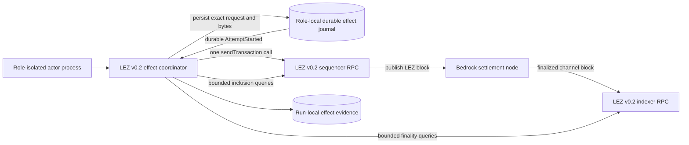
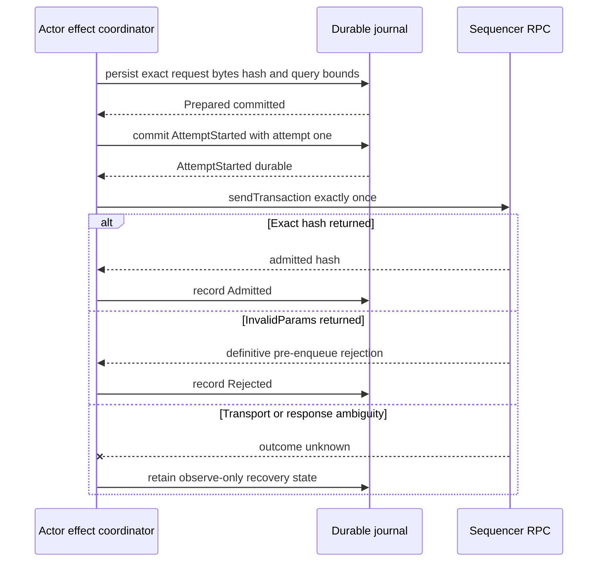
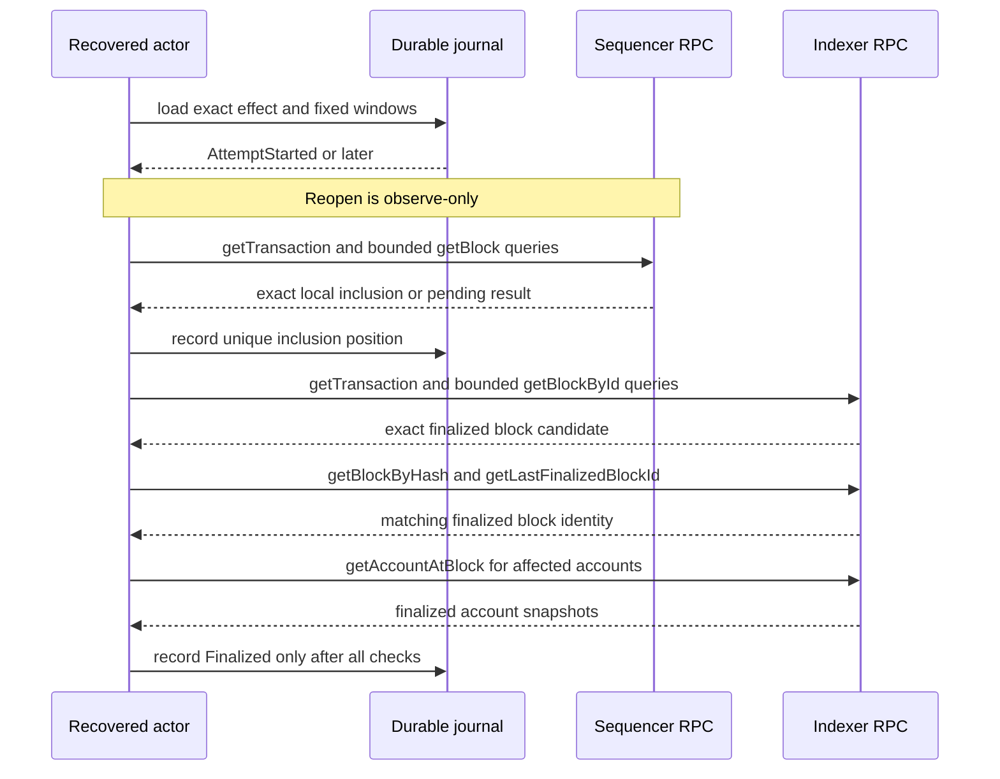
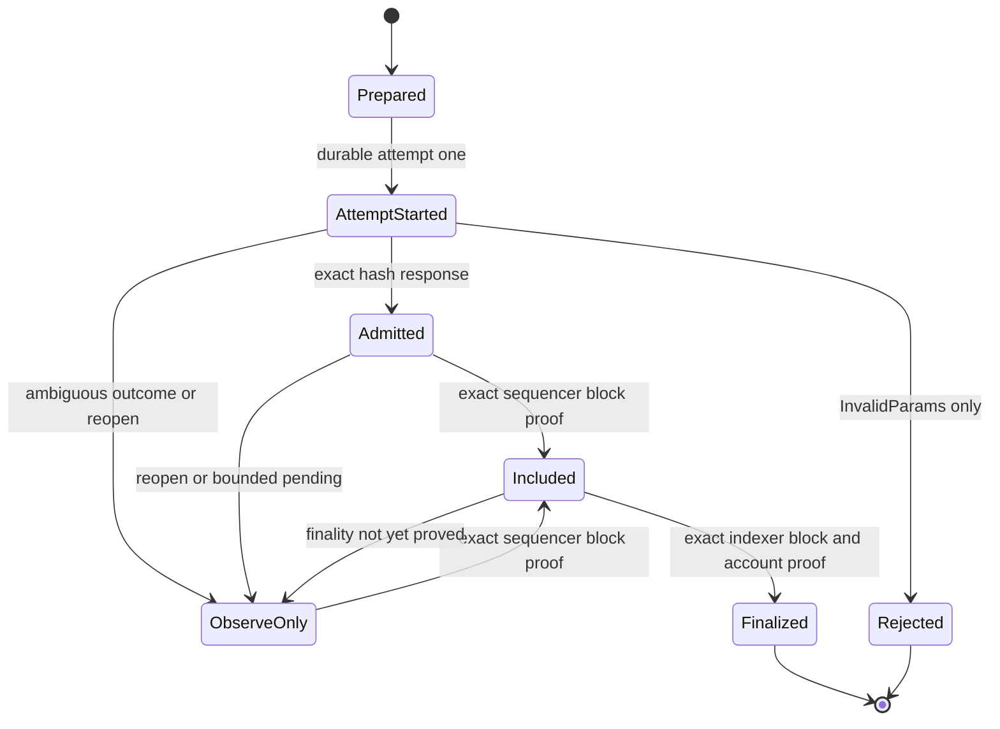

# ADR 0026: Use at-most-once LEZ v0.2 submission and query-bound finality

Status: Accepted architecture; implementation and actual-node evidence pending

## Context

ADR 0025 defines independent maker and taker Vault Claim onboarding, but it
deliberately leaves durable submission and finality observation pending. This
decision fixes that boundary before any prepared v0.2 transaction becomes
eligible for a node effect. It applies to Vault Claims, escrow deployment,
native escrow initialization and funding, claims, refunds, and every later
official v0.2 transaction sent by a role process.

The decision comes from direct source review of official LEZ tag `v0.2.0`, exact
commit `a58fbce2ff48c58b7bb5001b1a27e64b9596ee3a`. All upstream paths below are
relative to that commit. The relevant executable behavior is:

- the generated sequencer RPC trait at
  `lez/sequencer/service/rpc/src/lib.rs:35-92`;
- sequencer admission at `lez/sequencer/service/src/service.rs:46-82`;
- later stateful validation and rejection at
  `lez/sequencer/core/src/lib.rs:392-435`;
- the volatile Tokio-channel mempool at `lez/mempool/src/lib.rs:3-67`;
- sequencer transaction lookup at
  `lez/sequencer/core/src/block_store.rs:97-114`;
- Bedrock finalization handling at `lez/sequencer/core/src/lib.rs:188-198` and
  `lez/sequencer/core/src/block_publisher.rs:158-171`;
- the generated indexer RPC trait at
  `lez/indexer/service/rpc/src/lib.rs:9-74`;
- finalized Bedrock ingestion at `lez/indexer/core/src/lib.rs:73-159`;
- indexer transaction lookup at `lez/indexer/core/src/block_store.rs:56-68`;
- finalized block storage at `lez/indexer/core/src/block_store.rs:196-202`;
  and
- absent-account defaulting at `lee/state_machine/src/state.rs:260-265`.

The official APIs expose enough information to prove an exact transaction by
queries, but they do not expose one atomic submit-and-receipt operation.
Specifically, v0.2 has no caller idempotency key, `AlreadyKnown` result, mempool
lookup, execution-rejection query, or transaction receipt containing block
position and finality.

## RPC facts

The implementation must use the official generated clients and protocol types.
It must not copy the JSON, base64, Borsh, transaction, account, block, hash, or
signature wire models.

| Boundary | Exact generated method | What it can prove |
|---|---|---|
| Sequencer | `sendTransaction(LeeTransaction) -> HashType` | Size and stateless signature checks passed and the value was queued before the response |
| Sequencer | `getTransaction(HashType) -> Option<LeeTransaction>` | The exact hash exists in the sequencer's persisted local block store |
| Sequencer | `getLastBlockId() -> BlockId` | Current local block scan bound |
| Sequencer | `getBlock(BlockId) -> Option<Block>` | Block identity, transactions, position, and local Bedrock status |
| Sequencer | `getAccountsNonces(Vec<AccountId>) -> Vec<Nonce>` | Current sequencer-state nonces in request order |
| Sequencer | `getAccount(AccountId) -> Account` | Current sequencer account value, subject to absent/default ambiguity |
| Indexer | `getLastFinalizedBlockId() -> Option<BlockId>` | Last block stored by the finalized-only indexer ingestion path |
| Indexer | `getTransaction(HashType) -> Option<Transaction>` | Exact hash is present in the indexer's finalized store, but not its position |
| Indexer | `getBlockById(BlockId) -> Option<Block>` | Finalized block, transactions, and transaction position |
| Indexer | `getBlockByHash(HashType) -> Option<Block>` | Independent lookup of the same finalized block identity |
| Indexer | `getAccountAtBlock(AccountId, BlockId) -> Account` | Account state at the proved finalized block |

The indexer has no `getAccountBalance` method. Its `Account.balance` is the
balance result. Neither sequencer nor indexer `getTransaction` returns a block
ID, block hash, transaction index, execution status, or rejection reason.

`LeeTransaction` on the sequencer JSON-RPC is a standard-base64 representation
of Borsh bytes. The repository's `PreparedTransaction.exact_bytes` is instead
the canonical inner `PublicTransaction::to_bytes()` value. Submission decodes
and revalidates those exact inner bytes with official types and wraps the result
once as `LeeTransaction::Public`. It must not persist, reconstruct, or submit a
different encoding.

## Decision

### Durable at-most-once submission

Each node effect has one durable isolation key containing at least run, swap,
role, logical operation, request, runtime, and exact transaction identity. The
same role-local transaction that makes an effect eligible persists:

1. the complete request and runtime binding;
2. the canonical exact inner transaction bytes and official transaction hash;
3. the bounded sequencer and indexer discovery windows;
4. the relevant before-state and query tips; and
5. the effect state.

Before the first network call, the journal atomically advances the effect to
`AttemptStarted` with attempt count exactly one and synchronously commits it.
Only a newly committed `AttemptStarted` transition may authorize the single
`sendTransaction` call. No code path may call the sequencer first and record the
attempt afterward.

An exact reopen from `AttemptStarted` or any later state is observe-only. It may
query the exact transaction, blocks, finality, and accounts, but it must never
call `sendTransaction` again. A transport timeout, connection reset, process
crash, missing response, or returned-hash mismatch remains an unknown outcome
and follows the same observe-only path.

A JSON-RPC `InvalidParams` response is a definitive pre-enqueue rejection in
the pinned handler and may be recorded as rejected. Other RPC and transport
errors are not reclassified as rejection. A successful `sendTransaction`
response is recorded as admission only when the returned hash equals the
durable official transaction hash.

This is an at-most-once call guarantee, not exactly-once delivery. A crash after
`AttemptStarted` commits but before the HTTP call can leave a transaction that
was never submitted and can never be retried automatically. Moving the commit
after the call would close that liveness gap but create a crash window in which
the same effect can be submitted again. Without an upstream idempotency or
receipt contract, both guarantees cannot be obtained simultaneously. This ADR
chooses safety and explicit operator-visible uncertainty over blind resubmission.

The official public nonce rules provide a second state-effect boundary: a
transaction whose signer nonce executed once cannot execute again with the same
nonce. That does not make repeat submission acceptable. Duplicate copies may
still enter the volatile mempool, consume resources, and produce ambiguous
evidence before one is rejected during stateful block construction.

### Exact sequencer inclusion

Admission is never inclusion. The coordinator durably captures a finite
`DiscoveryWindow` before submission and uses only official sequencer queries.
Within that exact inclusive height range it:

1. obtains the current `getLastBlockId` without expanding the durable maximum;
2. queries each covered `getBlock` by ID;
3. validates the requested block ID and linked block identity when adjacent
   blocks are available;
4. locates exactly one transaction whose official hash and canonical inner
   bytes equal the durable prepared transaction;
5. records the block ID, block hash, transaction index, and returned Bedrock
   status; and
6. cross-checks `getTransaction(hash)` against the same official transaction.

A missing, duplicated, malformed, substituted, outside-window, or moving
result is not rejection and not absence. It remains unknown or pending. A
sequencer block with `Pending` or `Safe` status proves local inclusion only.
The dependent effect, including native escrow funding after initialization,
does not become eligible merely because the predecessor was admitted or locally
included.

### Query-bound indexer finality

Finality is proved through the independent indexer view of Bedrock-finalized
LEZ blocks. Indexer `getTransaction` is necessary evidence but does not expose
the containing block. The coordinator therefore performs the exact durable
bounded block scan and requires all of the following:

1. `getTransaction` returns the exact official transaction hash and content;
2. exactly one `getBlockById` result in the durable range contains it;
3. the transaction index, block ID, and block hash are recorded;
4. the block reports `BedrockStatus::Finalized`;
5. `getBlockByHash` returns the same block ID, hash, and transaction content;
6. `getLastFinalizedBlockId` is at least the containing block ID; and
7. every effect-specific account invariant passes against
   `getAccountAtBlock(account_id, block_id)`.

The proof uses account-at-block rather than only current account state because
later valid transactions may have changed the current value. For a Vault Claim,
the finalized owner balance increases by the exact allocation, the owner Vault
balance decreases by that amount, the owner nonce increments once, and expected
program ownership and data remain valid.

An account response alone cannot prove existence. The state machine returns
`Account::default()` for an absent account, so an effect-specific validator must
check the complete expected program owner, balance, data, and nonce tuple. It
must not interpret a successful `getAccount` or `getAccountAtBlock` RPC response
as proof that the requested account existed before the query.

The `subscribeToFinalizedBlocks` subscription is a wake-up hint only. The pinned
indexer can log a failed block-store write and still yield the block ID to
subscribers. A notification therefore cannot advance an effect to `Finalized`
without the complete query proof above.

## Durable state contract

The planned minimum state progression is:

`ObserveOnly` is nonterminal. Reaching the end of a configured window produces
an explicit unresolved result requiring policy or operator action; it does not
turn the effect into `Rejected`, `Absent`, or automatically retryable. A fresh
transaction with a new nonce and new durable effect identity requires a higher
level recovery decision after the old effect is reconciled conservatively.

Every transition uses a compare-and-swap revision in one immediate SQLite
transaction. Exact replay is idempotent. Changed bytes, hash, request, runtime,
window, role, operation, or state revision is a conflict. A forced database
failure rolls back the complete transition and cannot leave a completed request
without its exact payload or a finality marker without its block and account
proof.

## TDD delivery plan

The architecture is accepted, but none of the following is GREEN merely because
this ADR exists.

### RED

1. A fake sequencer records whether durable `AttemptStarted` exists before its
   first call and fails until the ordering is enforced.
2. Restart tests kill or reopen after `Prepared`, after `AttemptStarted`, after
   the remote response but before its local commit, after `Included`, and before
   `Finalized`; the total sequencer send-call count must never exceed one.
3. Transport failures, wrong returned hashes, and process loss fail until they
   enter observe-only recovery without another send.
4. Inclusion tests reject wrong bytes, wrong hashes, duplicate positions,
   noncontiguous block facts, height overflow, moving bounds, and matches outside
   the durable window.
5. Finality tests reject an indexer transaction without its exact containing
   block, a non-final status, block-ID/hash disagreement, incomplete account
   evidence, and default-account ambiguity.
6. A finalized-block subscription notification without durable query results
   must not advance state.
7. Role, run, swap, request, operation, and transaction substitutions must not
   share state or authorize a call.
8. A forced SQLite failure must preserve the previous complete durable state.

### GREEN gate

1. Implement narrow adapters over the official generated sequencer and indexer
   clients; do not add copied wire types or manual transaction encoding.
2. Persist exact preparation and `AttemptStarted` atomically before the one node
   call, and prove observe-only reopen through the restart matrix.
3. Prove exact bounded sequencer inclusion and indexer block/hash/account-at-block
   finality with deterministic adapters.
4. Repeat the same path against the isolated full LEZ v0.2 stack for maker and
   taker as separate processes and role-local journals.
5. Retain one actual-node happy path plus ambiguous-response and restart evidence
   before any actor-readiness, corridor, or milestone claim.

## Consequences

- RPC admission, local inclusion, Bedrock finality, and effect-specific state
  transition are separate evidence states.
- Restart recovery is deterministic and does not create a second automatic
  submission attempt.
- The chosen safety property can strand an effect after a crash-before-call
  ambiguity. Operators see an unresolved state instead of a false success,
  false rejection, or unsafe retry.
- Bounded scans avoid unbounded node work and prevent a later unrelated
  transaction from satisfying an old effect.
- Account-at-block proof binds the state transition to the same finalized block
  as the exact transaction.
- Subscriptions can reduce polling latency but never become finality authority.
- Dependent LEZ and cross-chain effects remain gated on the required finalized
  predecessor, preserving the protocol's atomicity arguments as far as the
  available upstream interface permits.

## Upstream production requirements

The missing idempotency, receipt, mempool, and execution-rejection surfaces are
Logos-owned production gaps recorded in
[`../upstream-production-blockers.md`](../upstream-production-blockers.md).
They do not waive this repository's durable ordering, exact-query validation,
bounded recovery, role isolation, or actual-node M2 evidence. A supported
idempotent submit contract and authenticated transaction receipt could later
improve liveness, but replacing this decision requires a new ADR and regression
evidence against an immutable upstream release.
