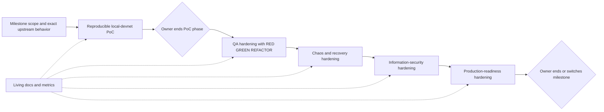

# ADR 0027: Deliver each milestone as a progressive vertical slice

Status: Accepted by the repository owner on 2026-07-14

## Context

The earlier implementation plan required every feature slice to begin with a
failing test. That produced useful invariant, persistence, and adapter evidence,
but M2 accumulated horizontal hardening before its actual maker-to-taker
LEZ/Zcash corridor existed. The repository owner has changed the delivery
strategy to a "progressive JPEG": make the whole milestone visible as a small,
real, reproducible vertical path first, then improve its fidelity and resilience
in explicit layers.

This changes implementation sequence, not the RFP, accepted proposal, atomicity
requirements, repository hygiene, or final acceptance bar. Actual pinned source
and executable behavior remain authoritative over prose.

## Decision

Every active milestone uses these owner-controlled phases:

1. **Reproducible PoC.** Implement the smallest complete milestone happy path
   through the exact isolated local devnets and real user roles required by that
   milestone. Exercise real signed chain effects and final state, not contract
   doubles. Supply a run-scoped command, deterministic local funding, expected
   evidence, exact cleanup, and a manual repetition path. Public RPCs, faucets,
   and public deployments are not required when an equivalent pinned local
   network exists. Existing regression tests continue to pass, and build,
   provenance, isolation, secret-safety, and minimal reality checks remain
   mandatory, but new PoC feature work is not required to begin with a RED test.
2. **QA hardening.** After the owner ends the PoC phase, use
   RED-GREEN-REFACTOR for requirement gaps, boundary cases, invariants,
   persistence, restart, role separation, concurrency, and regression defects.
   A failing test or executable acceptance check identifies each behavior before
   implementation; refactoring follows a green gate.
3. **Chaos hardening.** Inject process, RPC, node, network, reorg, storage, and
   timing faults around the working path. Measure recovery time, duplicate or
   lost effects, fund-safety violations, state corruption, and leaked run-owned
   resources.
4. **Information-security hardening.** Revalidate the threat model, actor and
   signer boundaries, secret handling, RPC authentication, filesystem defenses,
   dependency advisories, licenses, supply-chain pins, static analysis, and
   image vulnerability results. Baseline security and CI checks remain active
   in every earlier phase; this phase is the systematic adversarial pass.
5. **Production readiness.** Close observability, operator runbooks, performance
   and resource envelopes, configuration-only local-to-public portability,
   release packaging, deployment, and remaining production-risk work. Logos-
   owned release limitations stay in the upstream production-blocker register
   and do not erase locally proven milestone behavior.

Documentation is continuous rather than a final phase. The implementation plan,
manual flow, architecture/component diagrams, requirements traceability,
external-resource/flakiness inventory, and scorecard change with the code and
evidence that they describe.

Phase and milestone transitions are explicit owner decisions. The agent does
not silently enter a hardening phase or begin another milestone. The owner may
end a phase, narrow or revise a gate, pause it, or direct work to another
milestone. A milestone completion tag still means the documented milestone exit
gate is proven on that exact commit; switching work without that evidence does
not create or move a completion tag.

Evidence produced before this decision is retained as **carried evidence**. It
can reduce later work, but it does not by itself claim that a newly defined QA,
chaos, information-security, or production-readiness phase has been completed.
It is revalidated and classified when that phase is active.

## Phase gates

| Phase | Entry | Exit evidence before owner transition |
|---|---|---|
| PoC | Milestone scope, exact versions, actors, and happy-path outcome identified | One repeatable command and manual path drive real separated actors through the required pinned local networks to observable final state; evidence identifies exact components, transactions/finality, duration, external resources, and cleanup |
| QA | Owner ends PoC phase | Requirement and invariant matrix is GREEN under RED-GREEN-REFACTOR; restart, negative, boundary, concurrency, and regression suites report pass and flake counts |
| Chaos | Owner ends QA phase | Named fault catalogue has measured injection outcomes; no unexplained fund loss, duplicate effect, state corruption, or resource leak remains |
| Information security | Owner ends chaos phase | Threat findings are dispositioned; CI lint, advisory, license, secret, source-pin, and image gates pass with exact documented exceptions only |
| Production readiness | Owner ends information-security phase | Operator, observability, performance, packaging, deployment, configuration-portability, and release-risk gates are evidence-backed |
| Milestone exit | Owner reviews active phase and milestone evidence | Required milestone outputs and accepted scope are proven on the exact pushed commit; docs and metrics agree; annotated tag is created only when authorized and justified |

## Metrics

The live scorecard in [`../milestone-metrics.md`](../milestone-metrics.md)
records evidence-backed measurements, not subjective percentages. Each phase
tracks at least:

- PoC: successful/attempted reproductions, clean-host reproductions, setup and
  execution duration, exact real components, distinct actor processes, completed
  directions, on-chain effects/finality proofs, public dependencies, and cleanup
  leaks;
- QA: mapped requirements/invariants, passing/failing/ignored scenarios, defect
  count, regression count, and observed flake rate;
- chaos: injected fault classes and cases, successful recoveries, recovery-time
  observations, duplicates, losses, corruptions, and leaked resources;
- information security: critical/high findings, unresolved threat findings,
  dependency advisories and exceptions, license/source violations, exposed
  secrets, linter/static-analysis status, and image scan status; and
- production readiness: latency and resource observations, availability and
  recovery objectives, runbook/alert coverage, configuration portability,
  release artifacts, public deployment evidence, and upstream production
  blockers.

Unknown values remain `not measured`; absent evidence is never converted into a
percentage-complete estimate.

## M2 application: entry baseline

This subsection preserves the evidence state when this decision was accepted.
The dated evidence update below supersedes its progress claims without
rewriting the decision or pretending that the owner changed phases.

M2 is in the PoC phase. The first visible pass is one complete LEZ/ZEC happy
direction; the M2 PoC gate then covers both accepted directions unless the owner
explicitly revises that gate. It uses one isolated pinned LEZ v0.2 environment
(Bedrock, non-standalone sequencer, and indexer), one isolated pinned Zebra
Regtest environment, and independent maker and taker processes with different
keys, funds, configs, stores, journals, and sidecars. The actors must perform
the actual Vault onboarding, checked escrow deployment/funding, Zcash HTLC
funding, LEZ revealing claim, exact Zcash spend, and finalized balance/state
checks.

As of 2026-07-14, one retained partial vertical proves both Vault Claims,
checked deployment, and role-separated native LEZ initialize/fund/claim with
independent manual finality evidence. A separate provisioner also reloads an
isolated `TakerSellsLez` actor pair bound to a stable mature real-Zebra Regtest
UTXO. Its retained LEZ discovery window is already stale, so the final runner
must prebuild then provision just in time from a fresh tip and fail fast on
deadline/window headroom. No reference actor has executed `activate`/`drive`,
no Zcash HTLC effect or cross-chain corridor has run, and zero new TDD cases are
attributed to this PoC assembly. M2 remains in PoC until the repository owner
explicitly changes the phase; neither this evidence nor later commits implicitly
enter hardening or the next milestone.

Restart, abandonment/refund, reorg, concurrency, corruption, broad fault
matrices, and public-route readiness are later hardening layers. Existing tests
for those behaviors remain valuable carried evidence, but they no longer delay
construction of the missing happy-path corridor. Public execution remains
deferred under ADR 0023; local-to-public configuration portability is measured
in production readiness.

## Evidence update: M2 PoC happy-path gate met — 2026-07-14

The required private local happy path is now GREEN in both accepted directions:

- `m2poc-corridor-fresh-20260714o` completed `TakerSellsLez` through
  independent maker/taker processes and stores in 25.370 seconds. LEZ
  initialize/fund/claim finalized in blocks 264/265/266; the Zcash funding at
  height 106 had two confirmations before the reveal and its exact `:0` output
  was spent at height 108.
- `m2poc-corridor-reverse-fresh-20260714c` completed
  `TakerSellsForeign` through new independent actor state in 26.960 seconds.
  LEZ initialize/fund/claim finalized in blocks 641/642/643; the Zcash funding
  at height 113 had two confirmations before the reveal and its exact `:0`
  output was spent at height 115.

Both pairs of role stores reached revision 4 `Completed`. Both runs used the
pinned local LEZ v0.2 Bedrock, non-standalone sequencer, and indexer plus Zebra
Regtest, deterministic local funds, and no public RPC or faucet. The
direction-aware runner provisions fresh role material just in time, refuses a
reused output root, serializes use of an exact node-endpoint tuple with an
advisory lock, and stops only role bridges whose PID, start tick, and executable
identity match its records. Run 14o exercised one bounded payload-free
`moving_tip` retry; reverse 14c completed without a same-run retry.

The reverse path first exposed a canonical LEZ validator that was hard-coded to
the forward depositor. Two effect-bearing failed swaps are retained and never
reused. The correction instead derives the depositor and signer from the signed
direction, has focused regression coverage, and preceded the successful reverse
run. Exact secret-safe facts and limitations are retained in the
[`TakerSellsLez` evidence](../evidence/m2-taker-sells-lez-corridor-20260714.json)
and
[`TakerSellsForeign` evidence](../evidence/m2-taker-sells-foreign-corridor-20260714.json).

This evidence changes the PoC metric to **2 of 2, gate met**. It does not end
the owner-selected PoC phase, enter QA, or authorize an M2 tag. A cold
clean-host reproduction remains not measured. Documentation, repository
completion, and the ADR-0023 configuration-only public-portability contract
remain before milestone certification. The actor configuration is still
loopback-only, public agreement activation remains fail-closed, and the public
Zebra HTTPS/signing route is incomplete. Live public execution stays deferred;
restart, abandonment/refund, reorg, concurrency, corruption, ambiguity, chaos,
information-security, and production-readiness campaigns remain owner-gated
later phases unless a happy-path correctness defect requires immediate work.

## Consequences

- The next implementation choice optimizes for a thin real user journey rather
  than the largest isolated test matrix.
- TDD remains mandatory in the QA phase and for defects found after the PoC;
  it is no longer the prerequisite for first assembling the vertical PoC.
- Baseline safety checks are not postponed: unsafe global Docker cleanup,
  shared actor secrets/state, unpinned execution, or unvalidated chain effects
  cannot be called a PoC.
- Historical RED/GREEN evidence remains discoverable and useful without
  overstating the active phase.
