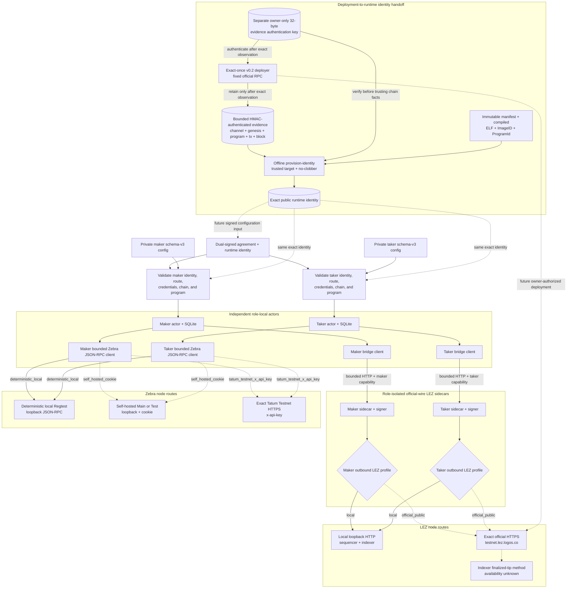

# ADR 0028: Admit dormant public routes without weakening local isolation

Status: Accepted; configuration and bounded-client construction are GREEN,
while live public execution is deferred -- 2026-07-14

## Context

ADR 0023 permits M2 PoC certification through private actual-node evidence and
defers public deployments and transaction publication. That exception cannot
leave a devnet-only implementation that later needs a protocol fork or a new
actor binary. The local corridor and future public route must use the same
schema-v3 actors, dual-signed agreement, SDK state machine, official-wire LEZ
sidecars, Zebra adapter, transaction builders, and observation validators.

Public endpoints also create a different trust and failure boundary. A generic
URL field could bypass transport assumptions, mix local and public LEZ
services, leak credentials, or change the authoritative node during an
ambiguous effect. The route is therefore a typed, validated runtime identity,
not an untrusted string and not protocol authority.

## Components and RPC boundaries

The actor-to-sidecar connection is always a run-owned, nonzero literal-loopback
listener protected by a role/run capability. Public LEZ configuration changes
only the sidecar's outbound client; it never exposes the bridge or moves
official LEZ signing into the actor process.

The sidecar's `local` profile accepts explicit uncredentialed loopback HTTP
sequencer and indexer URLs. Its `official_public` profile accepts only
`https://testnet.lez.logos.co/` for both clients. It rejects mixed profiles,
remote HTTP, credentials, alternate ports or paths, queries, fragments, and
generic domains before client construction.

The actor's Zebra route is exactly one of:

- `deterministic_local`: explicit literal-loopback JSON-RPC for Regtest;
- `self_hosted_cookie`: operator-owned loopback Zebra for Main or Test with
  an owner-only cookie file; or
- `tatum_testnet_x_api_key`: only
  `https://zcash-testnet-zebrad.gateway.tatum.io/`, Test network, and an
  owner-only `x-api-key` file.

Generic HTTPS providers and incompatible network/route combinations fail
closed. The Zebra client remains in the actor process; it does not pass through
the LEZ sidecar.

## Admission and main effect flow

```mermaid
flowchart LR
    Config["Untrusted schema-v3 config"]
    Terms["Accepted dual-signed agreement"]
    Evidence["HMAC-authenticated deployment evidence"]
    AuthKey["Separate owner-only authentication key"]
    TrustedTarget["Immutable manifest + compiled target"]
    Provision["Offline trusted-target verification<br/>and no-clobber identity publish"]
    RuntimeIdentity["Exact public runtime identity"]
    Files["Role-local credentials and runtime files"]
    Validate["Rehash and validate agreement, runtime,<br/>route, role, signer, chain, and paths"]
    Reject["Reject with no activation row<br/>and no chain effect"]
    Activate["Persist accepted role-local activation"]
    Route{"Configured chain route"}
    Local["Local actual-node route"]
    Public["Dormant exact public route"]
    Observe["Observe exact canonical identity"]
    Prepare["Prepare and durably record exact effect"]
    Submit["One bounded submission attempt"]
    Unknown["Ambiguous outcome"]
    Reconcile["Observe exact identity before any retry"]
    Complete["Advance durable protocol state"]

    Evidence -.->|"public provisioning only"| Provision
    AuthKey --> Provision
    TrustedTarget --> Provision
    Provision -.-> RuntimeIdentity
    RuntimeIdentity -.->|"signed into terms and config"| Config
    Config --> Validate
    Terms --> Validate
    Files --> Validate
    Validate -->|"invalid"| Reject
    Validate -->|"valid"| Activate
    Activate --> Route
    Route -->|"local evidence path"| Local
    Route -.->|"public live deferred"| Public
    Local --> Observe
    Public -.-> Observe
    Observe --> Prepare
    Prepare --> Submit
    Submit -->|"confirmed canonical effect"| Complete
    Submit -->|"timeout or transport ambiguity"| Unknown
    Unknown --> Reconcile
    Reconcile -->|"exact effect found"| Complete
    Reconcile -->|"not definitive"| Unknown
```

Transport selection does not authorize a swap. Before activation can persist
state or submit an effect, the actor rehashes the accepted agreement and binds
the exact run, swap, role, runtime, network, consensus branch, genesis, channel,
program, signer, typed route, credentials, and role-local paths. The sidecar
independently checks its run, role, signer, runtime, channel, genesis, program,
and capability. Invalid identity fails before persistence or chain I/O.

Atomicity is preserved across routes by keeping the signed ordering and durable
effect protocol unchanged. The route does not alter which leg locks first,
when the LEZ reveal may occur, or when the exact Zcash spend becomes eligible.
Prepared bytes and intent are durable before submission; an ambiguous send is
unknown, never success or safe-to-repeat. A running effect does not
automatically switch providers, and reconciliation must observe the exact
transaction identity before any byte-identical retry.

## Evidence and deferred live gate

Both private local actual-node happy directions have completed through
independent maker and taker actors, role-isolated sidecars, local LEZ v0.2
Bedrock/sequencer/indexer services, and Zebra Regtest. Local contract tests also
prove acceptance of the exact dormant public route configurations and rejection
of alternate, mixed, credential-leaking, or network-incompatible routes. Those
tests stop before public network I/O.

The deployment handoff is also executable without public I/O. Evidence emitted
after an authorized exact-once deployment now carries schema, channel, genesis,
checked artifact/program, transaction, and containing-block identities. Before
those dynamic facts leave the deployer, it HMAC-SHA256 authenticates them with
a separate owner-only 32-byte key. The offline `provision-identity` command
requires the same key, verifies the tag before trusting those facts, revalidates
the immutable manifest plus compiled ELF/ImageID/ProgramId, records the exact
retained JSON envelope-byte SHA-256, and atomically creates a no-clobber runtime
identity in a non-shared-writable directory. Native-safe tests cover happy,
no-clobber, eight authenticated mutations, unauthenticated chain-fact
tampering, bounded/non-regular input, and owner-only exact key files. The key
never enters actor configuration; role signers, credentials, and funds remain
separate owner provisioning inputs.

The HMAC is explicitly an owner-local provenance boundary, not independent
consensus proof or non-repudiation. Its payload has a fixed protocol/version
domain, but every holder of the symmetric key can forge evidence and mode 0600
does not isolate mutually hostile same-UID processes. Public production
readiness therefore requires separate-UID or system-credential isolation, a
rotation/retention policy, and a pinned public-key signature or anchored chain
proof before any third-party-verifiability claim.

No successful public connection, authentication, funding, program deployment,
transaction propagation, or finality claim is made by this ADR. Live public
execution remains a production-readiness gate. In particular, availability of
the sidecar's required indexer `getLastFinalizedBlockId` method at
`https://testnet.lez.logos.co/` is not established. That Logos-owned
finalized-tip risk is recorded under ADR 0018 and does not block owner-approved
local M2 certification, but it must fail closed and remain visible before a
production release.

## Consequences

- Local M2 remains reproducible without a public RPC, faucet, provider account,
  public funds, or externally disclosed transaction.
- Moving to public networks is configuration plus funding and on-chain
  deployment where required. Verified deployment evidence produces the exact
  machine-readable chain/channel/genesis/program handoff; the move is not an
  environment-selected protocol fork or a rebuild with alternate adapters.
- Exact endpoint allowlists intentionally reject provider substitution. Adding
  or changing a provider requires a reviewed schema and architecture decision.
- Public service availability, method coverage, quotas, lag, reset behavior,
  organic reorgs, and fee/propagation behavior remain unproven until live smoke
  and end-to-end evidence are explicitly authorized.
