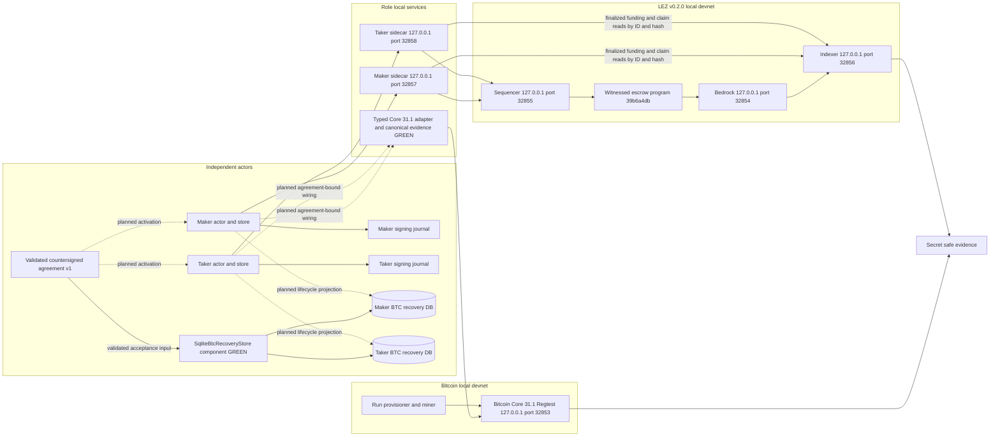
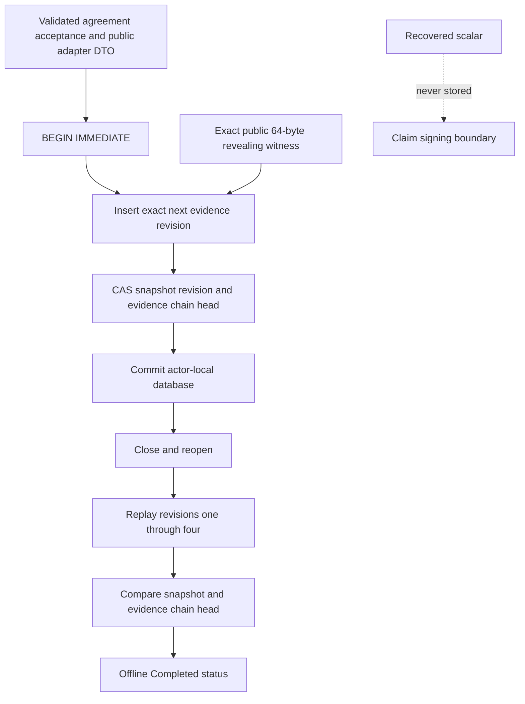
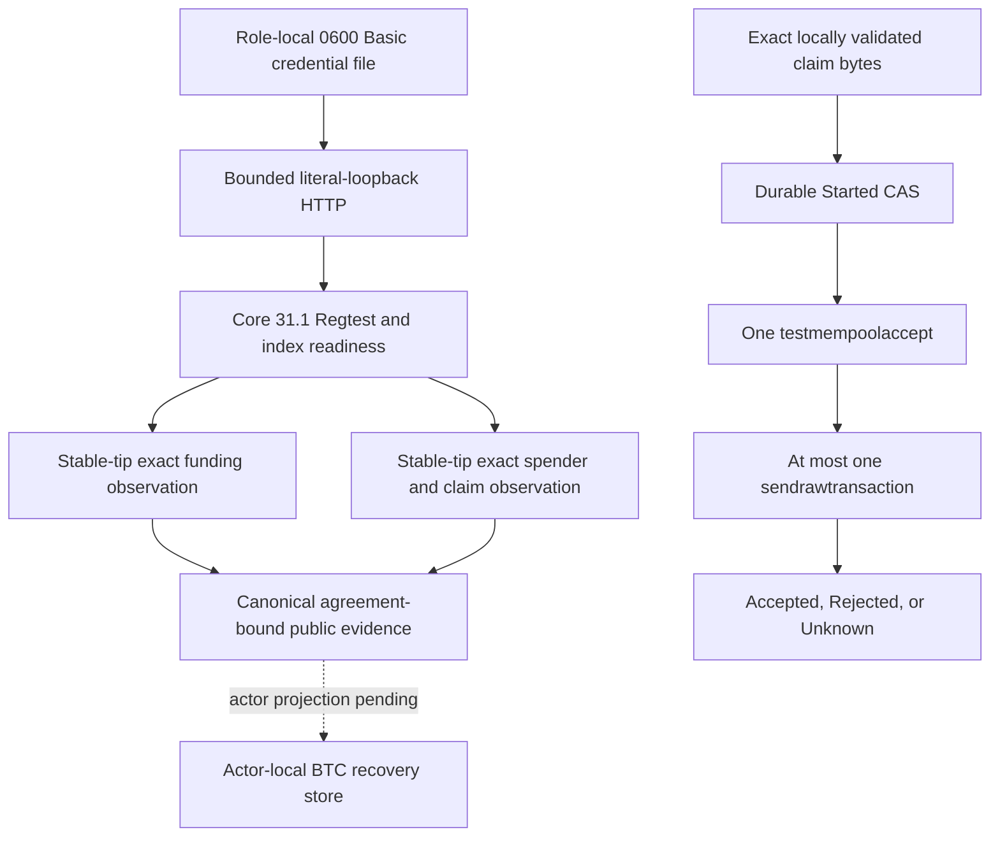
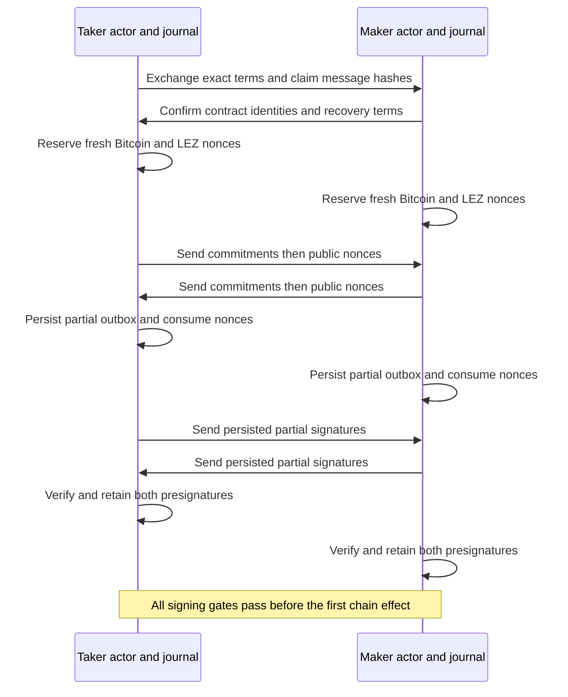
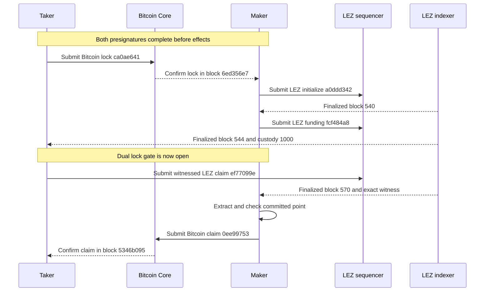
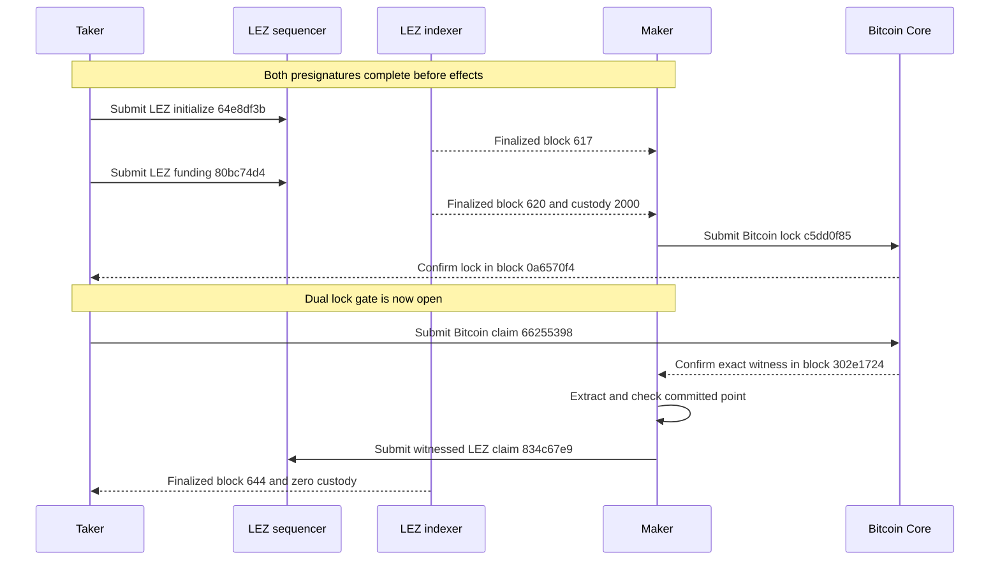

# ADR 0029: M3 uses isolated Bitcoin and LEZ local devnets

Status: Accepted. The operator-composed local functional PoC completed both
happy directions on 2026-07-15, and the canonical countersigned agreement is
GREEN. The typed finalized LEZ funding and claim observers and Bitcoin Core
adapter are also GREEN. Cohesive lifecycle SDK composition, live refunds, concurrency,
hardening, production readiness, and an M3 completion tag remain open.

## Context

The live RFP and accepted Gateway proposal require a complete LEZ and BTC
lifecycle, BIP-340 Schnorr adaptor signatures, a BIP-341 cooperative key-path
claim, a Bitcoin Core setup guide, both role directions, and reproducible
evidence. M3 entered with isolated component proofs: exact Bitcoin Core
provenance, a typed P2TR and CSV builder, MuSig2 adaptor signing, crash-safe
role journals, and a checked LEZ aggregate-witness guest.

Run `m3poc-live2-20260715a` joined those components across actual private
local nodes. Independent maker and taker processes used separate stores,
signing journals, sidecars, and role-restricted Bitcoin RPC credentials. The
operator completed both `TakerSellsForeign` and `TakerSellsLez` with real
local chain effects. This is a progressive local happy-path PoC. It is not a
claim that the project already has one cohesive end-user lifecycle command or
production signing authority.

The accepted Gateway proposal names DLC-specs `AdaptorSignature.md` as a
conformance source. No such file exists in the current DLC repository or its
history. The published DLC adaptor corpus is ECDSA, while M3 requires BIP-340
Schnorr. [GW-M3-001](../proposal-acceptance-errata.md) tracks that upstream
reference defect. It does not invalidate this local functional PoC and must not
be silently represented as passing literal DLC conformance.

## Decision

The M3 local PoC uses Bitcoin Core 31.1 Regtest and the pinned LEZ v0.2.0 local
stack. All runtime chain and actor endpoints are literal loopback services.
The run uses no public RPC, faucet, public peer, public funds, or public chain.
Changing to a public route is a configuration and deployment concern, not a
different protocol implementation.

The exact retained topology is:

| Component | Version or identity | Retained endpoint | Trust boundary |
| --- | --- | --- | --- |
| Bitcoin Core | 31.1 on Regtest | `http://127.0.0.1:32853` | Provisioner owns mining and full RPC. Maker and taker have distinct restricted RPC identities |
| LEZ Bedrock | v0.2.0 | `http://127.0.0.1:32854` | Run-owned private local service |
| LEZ sequencer | v0.2.0 | `http://127.0.0.1:32855` | Signed transaction submission and local inclusion |
| LEZ indexer | v0.2.0 | `http://127.0.0.1:32856` | Independent finalized block and transaction audit |
| Maker sidecar | Role fixed | `http://127.0.0.1:32857` | Maker capability, signer, state, and journal only |
| Taker sidecar | Role fixed | `http://127.0.0.1:32858` | Taker capability, signer, state, and journal only |

These are evidence endpoints from an ephemeral retained run, not stable
well-known ports. The LEZ channel is
`b6adb2d238911395adde0b2f40b880ec03ffd1a3a8d97e7df8cacadf08873748`
and its genesis block is
`e24c5a4a2d08a747b96cebefa1304cbe80e42dac9ced3a52c2330b22797e10d9`.

The implemented version-one agreement is canonical bounded Borsh committed by
domain-separated SHA-256 and countersigned with each role's BIP-340 key. It
binds the Bitcoin genesis and confirmation policy, ordered role keys and adaptor
point, exact LEZ runtime/program/accounts/amount/deadline/claim message, complete
P2TR and CSV fields, funding outpoint/value, cooperative output/fee/unsigned
transaction/sighash, and conservative recovery anchors and margin. Validation
reconstructs the aggregate key, Taproot output and claim transaction with the
pinned libraries and rejects derived-field drift even when both signatures cover
the drifted body. Actor activation of this record is still pending.

The read-only finalized-claim adapter accepts either agreement participant's
role-fixed sidecar, scans only a bounded window fully covered by the finalized
indexer tip, and requires every block to be `Finalized`, byte-equal by numeric
ID and hash, and parent-linked from window start through the stable tip. It
accepts the claim exactly once and reconstructs its
canonical public transaction and aggregate witness, and reads `Claimed`
metadata plus zero custody at the exact containing `BlockId`. The client then
rechecks the inclusive window and verifies BIP-340 against the agreement key
and exact claim hash. The official indexer does not expose an account proof or
atomic multi-account snapshot token; stable finalized-tip bracketing and
same-block reads are the current upstream-trust compensation and remain a
production caveat.

The distinct read-only finalized-funding adapter preserves the earlier
stable-tip progress observer. It accepts an exact funding transaction ID or a
bounded unique terms-derived discovery, requires canonical `FundNative`, and
reads historical `Funded` metadata plus exact custody at the containing
finalized block. The cohesive actor must use this explicit gate to keep claims
in a later block because LEZ v0.2 exposes end-of-block rather than
transaction-position account state; the read-only sidecar method does not
retain a prerequisite across the independent claim methods. The
pinned sidecar performs official decoding and PDA validation; cohesive actor
wiring must compare its facts to the signed agreement before persistence.

The durable Bitcoin lifecycle component is already executable independently of
the planned actor wiring. The caller supplies an already-validated canonical
agreement acceptance and typed public chain evidence. Each actor uses a
different SQLite database. One immediate transaction inserts the next exact
evidence record and CAS-advances the aggregate snapshot and versioned evidence
chain. Reopen replays revisions one through four and compares both the
reconstructed snapshot and chain head before exposing offline status. The exact
64-byte public revealing witness is retained for peerless recovery; the
recovered scalar crosses only the claim-signing boundary and is never stored.

The database transaction cannot atomically commit either chain effect. Exact
replay, predecessor CAS, and the evidence chain make retries and local history
corruption fail closed, but the hash chain is consistency evidence rather than
authentication against a filesystem owner capable of rewriting the complete
database.

The typed Bitcoin adapter is the matching public-evidence boundary for Core.
It first checks the exact Core 31.1 version/subversion, agreement Regtest
genesis, unpruned synchronized tip, selected disconnected or network-enabled
Regtest policy, and synchronized `txindex` plus `txospenderindex`. Funding and
claim reads are stable-tip bracketed. Consensus transaction bytes are decoded
canonically and compared with Core's typed identities, vin/vout, size, weight,
confirmation, block, and spender facts before a bounded agreement-bound record
can enter the recovery store. The claim record retains the exact public
64-byte witness and no scalar. Submission requires a durable `Started` CAS
binding txid, wtxid, and the exact raw-byte digest before policy preflight and
one broadcast. Already-known or ambiguous outcomes become terminal `Unknown`;
conflicting witness payloads never authorize a second broadcast.

The 18-test component suite uses deterministic typed RPC responses and
ephemeral authenticated loopback servers. Connecting this exact adapter to the
run-owned Core service through each reference actor remains a composed PoC
gate. The current network-enabled mode still requires Regtest; Testnet4
admission is production-portability work.

## Deployed LEZ guest and account onboarding

The exact guest ELF SHA-256 is
`a199c5be062adcb27cf63c62d9f5688b37058b4699ce7e1767fd26eeceb5e293`.
Its ImageID and ProgramId are both
`39b6a4db85374de9359ea82164ef415019919475f656d597c5ab2231bc104dec`.
Deployment transaction
`94a49583a5fd5d6a749fd227f38fe99b002866921a9b77e956623ee6f36e76d3`
was finalized in LEZ block 405 with hash
`dfe017c8167c09bf098935afd8585c928e99c6405c1f662e4ce087b465ad73fc`.
Independent lookup by block ID and hash agreed at finalized tip 407.

LEZ genesis allocations begin in Vault accounts. The owner accounts must be
onboarded before preparing a swap transcript. Maker Vault claim transaction
`e41cf042b058aa258fcd19d8ce2384f2635f5c4dfc0c2b64b59a2d588804d1f9`
finalized in block 456. Taker Vault claim transaction
`aa19763d19ce3849b1b0e955e2c049fa31cd357c1f0151a3b1f52ec03428c15b`
finalized in block 457. At independently checked finalized tip 459, both Vault
balances were zero and the maker and taker owner balances were 100000 and
200000 respectively.

Onboarding is a precondition, not a repair that may be inserted after the first
lock. The retained diagnostic run proved why: Bitcoin lock
`7393db97def6fa567db9ea8a125361371ee31d96062562ddc94b20d67f54ae3f`
confirmed, but the unonboarded LEZ initialize transaction was dropped with
program error 6003. Funding was not submitted and the adaptor secret was not
revealed. The operator refused to repair that swap because onboarding and
preparing a new LEZ transcript after the first effect would violate the
pre-lock signing invariant. Both accounts were onboarded and a completely
fresh swap was used for certification.

## Signing and atomicity invariants

Both exact claim messages and both aggregate adaptor presignatures exist before
the first chain effect. Bitcoin and LEZ use distinct domain-separated signing
sessions and fresh nonces. Each actor reserves a nonce before exposing its
commitment and persists an exact partial-signature outbox while consuming that
nonce. Only persisted public transcript material is exchanged.

No adaptor secret is released until both chain locks meet the local PoC gate.
After the first adapted claim becomes canonical, the opposite claimant observes
the exact final witness, extracts the value, checks it against the committed
point, and completes the second claim from its persisted role state. No further
counterparty signing interaction is required.

Bitcoin funding commits a two-party aggregate internal key and the ADR 0009
CSV refund tapleaf. The cooperative claim signs the exact BIP-341 key-path
sighash under the tweaked output key. The completed transaction must have one
64-byte key-path witness, verify under the output key, and pass Bitcoin Core
policy and consensus. Verification only under the untweaked aggregate key is
not spend evidence.

The LEZ guest derives the aggregate authority account from the aggregate
x-only key. That authority is distinct from the immutable claimant account.
The guest accepts one aggregate BIP-340 witness over the exact public claim
transaction and transfers custody only to the claimant.

## Completed direction TakerSellsForeign

The taker sold BTC and locked the Bitcoin leg first. After one local Regtest
confirmation, the maker initialized and funded the LEZ witnessed escrow. Only
after the Bitcoin lock was confirmed and LEZ funding was finalized did the
taker reveal through the LEZ claim. The maker extracted from the exact
finalized LEZ signature and completed the Bitcoin claim.

| Effect | Actor | Exact transaction | Final block |
| --- | --- | --- | --- |
| Bitcoin lock | Taker submits and maker observes | `ca0ae6418c3cfe28c114e1acd8d50c25b39f8ab63b62e480d31d5005e94a4c75` | `6ed356e7cc00c6fd796cc5fcfbbb72b598d912cc9729e37c0426464e606355d8` with one confirmation |
| LEZ initialize | Maker | `a0ddd3427fc278d0ae4d42cce0dd6f07d6e52d102a17bbe31342b6ff1bb85a5c` | LEZ 540 `065b8f0e80de2e29cd26aad78f5b133455f9e205811b86da40ede98ccc4b0382` Finalized |
| LEZ fund | Maker | `fcf484a8a21e8fd83d456a4bc6e98e84230d171351d68362c71e68aa0eb988a9` | LEZ 544 `801d38735e33d156c6c3d5b33bf1779c2838f965717cd16491ac0c620cc4a1b7` Finalized |
| LEZ claim | Taker receives LEZ | `ef77099ea877b562dd5192fd6feb929bcfd31b18ea1bd5e58e65a9af3232cde3` | LEZ 570 `582f94f320beb69d0e5fa4417a4daa2ade671d5b1c2ccd0c8b361a431466bdf1` Finalized |
| Bitcoin claim | Maker receives BTC and taker observes | `0ee99753bf35ae3d122e5887fb42ec19e95ea26bf43f3d4897efa9dbd116a5aa` | `5346b095231564e9a6fe2017b5e4ce2681523cd37d4bef14919bbeefddbc0a7c` with one confirmation |

The finalized LEZ witness matched the completed signature exactly. Extraction
matched the committed point. The Bitcoin claim had one exact final-signature
witness, spent the contract output, and left LEZ custody at zero.

## Completed direction TakerSellsLez

The taker sold LEZ and initialized and funded that leg first. After LEZ
finality, the maker locked BTC. Only after both locks passed did the taker
reveal through the Bitcoin claim. The maker extracted from the exact confirmed
Bitcoin witness and completed the LEZ claim.

| Effect | Actor | Exact transaction | Final block |
| --- | --- | --- | --- |
| LEZ initialize | Taker | `64e8df3bb9aa83d1eb96ae81d5485f9a980cb3398c9e733af5523303240351a4` | LEZ 617 `cf136b7a26c98a6a1b086bb55c1a82f38d4186f88c7da6a2d1d2de00f24cebf4` Finalized |
| LEZ fund | Taker | `80bc74d43c3be658f296ff3f604c47632ac02301bbc35f5b4501c958e8a1daa6` | LEZ 620 `8b7b01138e054089be86d6edba5e0692c3745da4b3e696862f003dff9ead14f6` Finalized |
| Bitcoin lock | Maker submits and taker observes | `c5dd0f85e0569a553716c0f908707f7039e0436f451d938df15cf1fb303752a3` | `0a6570f428ad4a69f2e237673f6bdd9b59dc1f34f2ddfec25e8f35fa2e9e9740` with one confirmation |
| Bitcoin claim | Taker receives BTC and maker observes | `66255398761bccc89b3e44e79ea1ca4822939f99f8054c08560ea594840054f4` | `302e17248a0110472377b10227d97af4be0e3a362b19a279e901b6cf3fe54524` with one confirmation |
| LEZ claim | Maker receives LEZ | `834c67e9130f8a92a8875053f5c08ba7f768f59ad5bb761c10be341d6e9d3033` | LEZ 644 `88e22483ee2f145f3b7945446e8dd65e183de1b91c040f45f6123d7e60127a44` Finalized |

The confirmed Bitcoin witness matched the final signature exactly. Extraction
matched the committed point and completed the opposite LEZ signature. The
finalized LEZ claim matched that signature and left LEZ custody at zero.

## Reproducibility and isolation

- Docker resources, local processes, temporary state, credentials, and evidence
  are owned by a unique run identity. Cleanup is exact and must never use global
  prune, broad process kills, shared volume removal, or foreign-container
  ownership.
- Core binds only the loopback RPC publication. P2P publication is disabled and
  the retained run had zero public peers. The provisioner alone owns mining,
  wallet, and full node authority.
- Maker and taker use distinct restricted Core RPC identities. Each role has a
  separate sidecar, signer, journal, and state tree.
- Bitcoin funds come from deterministic local Regtest coinbase outputs. LEZ
  funds come from deterministic local genesis Vault allocations. No public RPC,
  faucet, public funds, or public peers participate in runtime.
- Bitcoin blocks are mined deterministically by the local provisioner. The PoC
  opens its Bitcoin gates after one confirmation. This is a declared Regtest
  happy-path policy, not a production confirmation policy.
- LEZ effects require an independent indexer-finalized block, lookup agreement
  by block ID and hash, and exactly one occurrence of each transaction in the
  audited scan.
- Fresh observation request identities are required for moving-tip reads because
  a role sidecar journals request identities for exact replay. Reusing a request
  identity can correctly replay an earlier pending result.
- Remaining local flakiness sources are process scheduling, a moving LEZ tip
  during multi-read observation, sequencer or indexer readiness, and manual
  operator orchestration. There is no public-service runtime flakiness in this
  evidence.
- Cold setup still depends on checksum and signature verified Bitcoin Core
  release assets, the pinned LEZ source and images, and locked Rust registries.
  Their availability and scan results remain explicit build concerns.

## Dependency and cryptographic boundary

The Bitcoin Core 31.1 source revision is
`9be056a8a72b624dae9623b2f7bded92c2a21c91`. The official x86_64 Linux archive
SHA-256 is
`b80d9c3e04da78fb6f0569685673418cf686fadba9042d926d13fb87ff503f9e`.
Bitcoin Core publishes no endorsed container image, so the repository builds a
minimal image from verified official release material and scans its immutable
result.

No project-owned elliptic-curve arithmetic is permitted. The PoC exact-pins
`bitcoin` 0.32.101 and `musig2` 0.4.1. Canonical public key, scalar,
presignature, and final-signature encodings cross the library boundary and are
reparsed before use. `musig2` remains a beta PoC dependency with no published
audit, incomplete zeroization properties, and concentrated maintenance. It is
not accepted as production signing authority.

The local component and composed-flow gates prove BIP-327 aggregation, Taproot
tweak handling, adaptor verification and adaptation, final verification under
the exact output key, Bitcoin Core policy and consensus, extraction with
committed-point checking, and exact LEZ aggregate-witness completion. Formal
cryptographic audit and production key custody are not claimed.

## PoC result and remaining work

The secret-safe evidence packet is
[M3 local two-direction PoC](../evidence/m3-local-two-direction-poc-20260715.json).
It binds the exact source commit used for the run, node topology, guest
deployment, account onboarding, transactions, final blocks, role ownership,
presignature gates, witness equality, terminal recipients, zero LEZ custody,
resource boundary, and limitations. Secret keys, capabilities, credentials,
raw transactions, exact transaction bytes, full signatures, and scalar
material are intentionally excluded.

The local functional happy-path boundary is complete at two of two directions.
The following are deliberately not accepted by this ADR:

- one cohesive lifecycle SDK or reference application that reproduces the
  operator-composed run with a single supported workflow;
- finalized LEZ funding/claim and Bitcoin Core evidence integrated with the
  actor-local recovery component in those actors;
- live abandonment and both one-lock and two-lock refund execution at the CSV
  boundaries;
- concurrent swaps, crash recovery, reorgs, chaos, denial-of-service, and
  adversarial security campaigns;
- production key custody, fee management, confirmation policy, public routing,
  public LEZ deployment, monitoring, and operational readiness;
- a formal cryptographic audit or final production acceptance of `musig2`;
- literal conformance to the nonexistent DLC Schnorr adaptor vector file;
- an `m3-complete` tag.

Refund ordering remains the ADR 0009 design. If the maker never submits the
second lock, the taker eventually recovers the first leg. If both legs are
locked and claims do not complete, the maker-funded shorter recovery occurs
before the taker-funded longer recovery after the conservative cross-chain
margin. That design has not yet been exercised against both live local nodes.

This ADR certifies the operator-composed private local M3 happy path only.
Post-PoC QA, chaos, information-security, and production-readiness work starts
only under the progressive delivery transition selected by the owner. The
absence of public deployment evidence is intentional and does not reduce the
local functional result.
