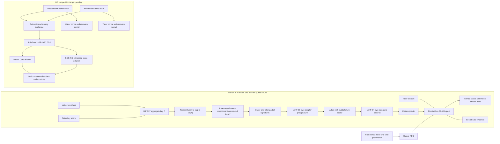
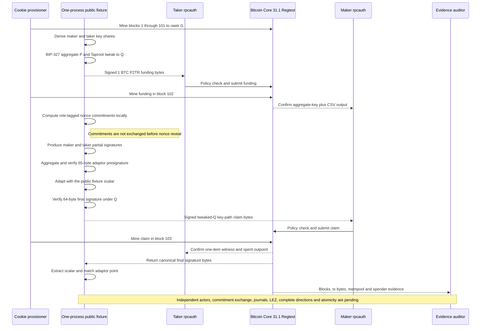
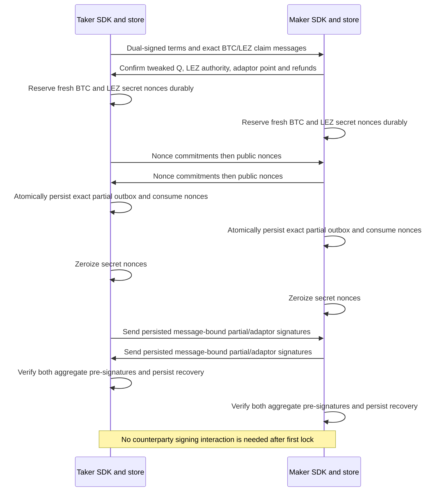
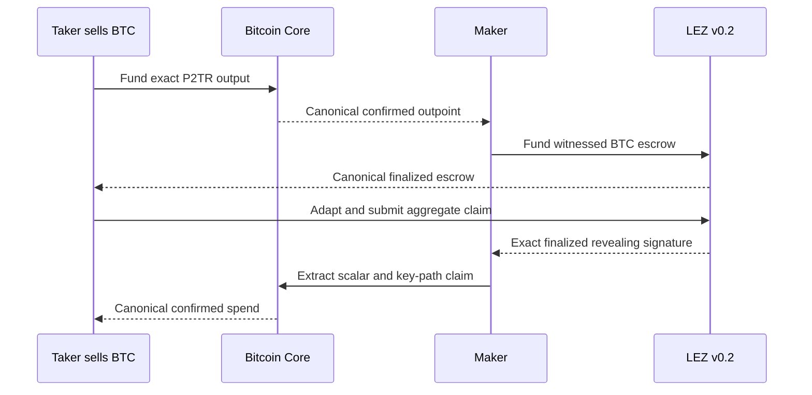
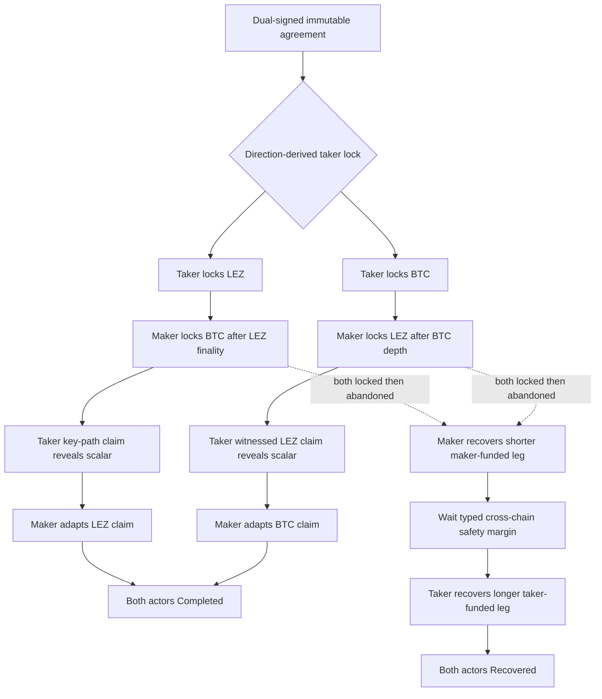

# ADR 0029: M3 starts with an isolated Bitcoin actual-node PoC

Status: Accepted entry boundary; M3 active; one-process public deterministic two-party MuSig2/adaptor/Core fixture GREEN — 2026-07-15

## Context

The live RFP and accepted proposal #112 require a complete LEZ/BTC lifecycle,
BIP-340 Schnorr adaptor signatures, a BIP-341 cooperative key-path claim, a
Bitcoin Core setup guide, both role directions, and reproducible evidence. The
entry tree had generic Bitcoin state-machine vocabulary only. The current tree
now has the exact Core runner/evidence, a typed P2TR/CSV transaction builder,
and a one-process public deterministic fixture. That fixture aggregates distinct
maker and taker key shares with BIP-327, applies the Taproot tweak to `Q`, creates
and verifies a 65-byte Schnorr adaptor presignature, adapts it with the public
fixture scalar, verifies the resulting 64-byte signature under `Q`, spends it
through Core policy and consensus, and extracts the same scalar. It still has no
production Core swap adapter, independent Bitcoin actor processes/stores,
network exchange of nonce commitments, crash-safe nonce journal, LEZ BTC guest
path, or composed swap evidence packet.

The accepted proposal names DLC-specs `AdaptorSignature.md` as a conformance
source. No such file exists in the current DLC repository or its history. The
published DLC adaptor corpus is ECDSA, while M3 requires BIP-340 Schnorr. This
is a Gateway proposal/reference defect, not evidence that may be silently
substituted or marked passing.

## Decision

The owner entered M3 on 2026-07-14. The PoC target is a reproducible local happy
path through a Bitcoin Core 31.1 Regtest node built from the signed,
checksum-pinned official binary archive and bound to its exact source revision,
plus the pinned local LEZ v0.2 stack. It uses independent maker and taker
actors, separate keys and stores, actual signed transactions, and the same
public SDK boundary intended for later routes. Public Testnet4 changes node
configuration, credentials, funding, confirmation policy, and deployed LEZ
identity; it does not select a different protocol implementation.

The target graph above remains the M3 composition boundary. The currently
executable Core slice reaches the same role-restricted RPC surface with a
one-process helper and proves the following exact ordering. The maker/taker
shares and adaptor scalar are public deterministic Regtest fixture values. The
helper is test infrastructure, not a production signing authority or a
substitute for independent actors and a transport protocol.

Bitcoin funding commits a two-party aggregate internal key `P` and the ADR
0009 CSV refund tapleaf. Both the Bitcoin claim authority and the LEZ
witnessed-claim authority are distinct two-party aggregate keys. Neither actor
receives a standalone claim key. Otherwise that actor could bypass the adaptor
transcript, claim one leg without revealing the agreed scalar, and destroy
atomicity.

The Bitcoin signing session is Taproot-tweak aware. It derives the even-Y x-only
internal key `P`, exact tapleaf and leaf version, Merkle root, tweak
`h = TapTweak(P || merkle_root)`, and output key `Q = P + hG`; it binds the
output-key parity carried by the control block. MuSig2/adaptor signing applies
the identical tweak and parity convention and signs the exact BIP-341 key-path
sighash under `Q`, with the annex presence/absence and sighash type fixed in
the agreement. The agreement commits `P`, its x-only/parity convention, the
tapleaf/script/version, Merkle root, `Q`, control block, input/outpoint/value,
destinations, transaction message, and sighash policy. Library verification
under the raw untweaked `P` is never spend evidence; the completed signature
must verify under `Q` and pass Bitcoin Core consensus.

No project-owned elliptic-curve arithmetic is permitted. Candidate libraries
must be exact-pinned, source-reviewed, license/advisory/source gated, and proved
interoperable with Bitcoin Core consensus before acceptance. The entry audit
selects Bitcoin Core 31.1 as the node candidate and `rust-bitcoin`, `miniscript`,
`corepc`, and `musig2` as candidates. Core 31.1, exact-pinned `bitcoin`
0.32.101, and exact-pinned `musig2` 0.4.1 have now passed their applicable
fixture-level provenance, resolved-graph, source, license, advisory, and
Core-interoperability gates. The public deterministic two-party fixture passes
BIP-327 aggregation, Taproot tweaking, adaptor verification/adaptation, final
verification under `Q`, Core policy and consensus at heights 102/103, and
scalar extraction. `miniscript` and `corepc` remain candidates; `musig2`
remains a PoC candidate rather than accepted production authority.

## Candidate provenance

The 2026-07-14 entry audit selected Bitcoin Core 31.1 source commit
`9be056a8a72b624dae9623b2f7bded92c2a21c91`. The official x86_64 Linux
archive candidate has SHA-256
`b80d9c3e04da78fb6f0569685673418cf686fadba9042d926d13fb87ff503f9e`.
Bitcoin Core publishes no endorsed container image. The PoC therefore builds a
repository-owned minimal image from the official archive only after its checksum
and release signatures/attestations verify, then records and vulnerability-scans
the resulting immutable image digest. The existing unofficial Docker Hub image
is not a supply-chain authority.

The verifier and actual-node runner reproduce this provenance and locally prove
the Core infrastructure plus the one-process two-party MuSig2/adaptor P2TR
funding/claim fixture. The typed transaction slice uses `bitcoin` 0.32.101 with
default features disabled and only `std`; canonical bytes cross into
`musig2` 0.4.1 and are reparsed and verified before Core submission. The
resolved fixture graph passes advisories, bans, exact-version license
exceptions, and source policy. The final M3 dependency graph remains unaccepted
until independent signing sessions and composed Core/LEZ evidence pass their
stated gates.

The 2026-07-15 read-only dependency audit recommends exact-pinned `musig2`
0.4.1 for the PoC gate. Its final BIP-327 key aggregation, x-only Taproot tweak,
adaptor-presignature, adaptation, verification, and extraction APIs cover the
required happy-path primitive without project-owned curve arithmetic. It uses
`secp256k1` 0.31 while rust-bitcoin uses 0.29, so only canonical key, scalar,
65-byte presignature, and 64-byte final-signature encodings may cross the
boundary. The crate is beta, has no published audit, is dominated by one
maintainer, lacks nonce commitments, and its cloneable secret nonce does not
zeroize. Exact lock/source/license/advisory and public-fixture extraction/Core
gates now pass. It remains an unaccepted production candidate pending exchanged
commitments, durable nonce reservation/consumption, zeroization, negative
vectors, independent actor verification, and review.

## Target pre-lock signing ceremony (pending)

The following is the required independent-actor ceremony, not a claim about the
current one-process fixture. At `f5a9caa` role-tagged commitments are computed
in process but are not exchanged before nonce reveal, and no crash-safe nonce
journal is exercised.

Both claim transactions and all recovery material are complete before the first
lock. Each chain/message uses a distinct domain-separated MuSig2 session and
fresh nonce. A crash-safe journal reserves the secret nonce before its public
commitment is exposed and forbids reuse across messages/swaps/chains. Before any
partial-signature network send, one atomic local transaction stores the exact
outbox bytes and marks that nonce consumed. The secret nonce is then zeroized;
delivery may only send or retransmit the already-persisted bytes. Only the
verified aggregate adaptor pre-signatures, public transcripts, exact messages,
refund material, and recovery state remain after the ceremony.

Funding is forbidden unless both roles independently verify and durably retain
the exact presignatures they need for either direction. Discovery/Chat may vanish
after the taker submits the first lock without affecting claim or recovery.

## Target actor flows (pending)

Neither complete direction below is implemented by the current Bitcoin fixture;
the diagrams define the LEZ/BTC atomicity target.

In `TakerSellsForeign`, the taker locks BTC first. The maker locks LEZ only
after the negotiated Bitcoin confirmation depth. The taker adapts and submits
the aggregate LEZ witnessed claim, revealing the agreed scalar in its finalized
signature. The maker extracts that scalar from those exact finalized LEZ bytes
and adapts the Bitcoin key-path claim.

In `TakerSellsLez`, the taker locks LEZ first. The maker locks BTC only after
LEZ finality. The taker adapts the Bitcoin key-path claim; the maker extracts
the scalar from the exact Bitcoin witness and adapts the LEZ witnessed claim.

If the maker never submits the second lock, the taker eventually recovers the
first leg directly. If both legs are locked and claims do not complete, the
maker-funded shorter recovery happens first and the taker-funded longer recovery
happens only after the conservative cross-chain margin. For
`TakerSellsForeign` this maps earlier recovery to maker-funded LEZ and later
recovery to taker-funded BTC; for `TakerSellsLez` it maps earlier recovery to
maker-funded BTC and later recovery to taker-funded LEZ. Typed chain clocks are
not compared as raw numbers.

## Reproducibility and isolation

- Every run owns a unique `RUN_ID`, Docker resource scope, network, volumes, temporary
  root, cookie file, wallets, actors, and evidence output.
- Host listeners bind allocated loopback ports; no conventional host port is
  assumed. The provisioner alone holds the full node cookie and mining/wallet
  methods. Maker and taker adapters are separate instances with distinct
  `rpcauth` credentials and method allowlists for required read/broadcast calls;
  keys remain client-side and neither actor can access the other's wallet or
  provisioner methods.
- The Compose file is a statically linted deployment contract for image,
  filesystem, capabilities, resource limits, labels, volumes, and loopback RPC.
  The executable runner owns the same controls through exact-ID native Docker
  commands. Docker Compose 5.3 does not preserve the required dynamic loopback
  publication when that service consumes the precreated bridge, and Docker
  suppresses host publication entirely on an `internal` bridge. The runtime
  therefore uses a dedicated labeled bridge with IP masquerading disabled rather
  than setting Docker's `Internal` flag. Core itself additionally disables P2P
  listening, outbound connections, discovery, DNS seeds, fixed seeds, and network
  activity; runtime evidence inspects the Docker publication, bridge, config,
  `networkactive=false`, and zero peers. This preserves actor access through a
  host-loopback RPC while preventing the fixture from behaving like a public
  chain node.
- Cleanup removes only resources carrying the exact run label. Global Docker
  prune, shared volume removal, broad process kills, and foreign-container
  ownership are prohibited.
- Regtest funds come from a run-local deterministic mining/provisioning actor.
  Reproducibility binds the fixed descriptor/key derivation, Regtest genesis,
  block-time policy, maturity, transaction policy, exact values, and observed
  outpoints/confirmations. It is a semantic contract; independently named runs
  need not produce byte-identical block hashes or transaction IDs. No public
  RPC, faucet, public funds, or public chain is used by the PoC.
- Cold setup still depends on verified Bitcoin Core release assets and Rust
  registries; their checksums, availability, cache policy, and scan results are
  evidence, not hidden assumptions.

## PoC gate

The PoC is not complete until both directions run through actual local Core and
LEZ nodes, with taker-first confirmation ordering, distinct actors and stores,
the complete pre-lock signing ceremony durably proven, no off-chain dependency
after the first lock, tweak-aware aggregate-signature/adaptor verification, a
one-item BIP-341 key-path witness under `Q`, correct recipients, the BTC
outpoint spent once, zero terminal LEZ custody, both actors `Completed`, and a
secret-safe immutable evidence packet. The agreement must also commit the exact
refund tapleaf/control block and direction-correct two-stage recovery schedule,
even though before/at/after CSV execution belongs to the owner-selected QA
phase.

Literal DLC Schnorr-vector conformance remains unclaimable because the named
file does not exist. The honest proposed replacement gate is official BIP-340
and BIP-327 vectors, project-owned adaptor positive/negative fixtures, an
independent implementation cross-check, and completed-signature verification
through the Bitcoin library plus Bitcoin Core consensus. Gateway erratum
[GW-M3-001](../proposal-acceptance-errata.md) records the mismatch; an accepted
clarification has not yet been posted. It does not permit ECDSA evidence to be
mislabeled as Schnorr evidence.

This ADR activates M3 and accepts only its entry boundary plus the one-process
public deterministic two-party MuSig2/adaptor/extraction Core interoperability
fixture. It does not accept production signing authority or the final dependency
graph, claim either complete direction works, or authorize an `m3-complete` tag.
