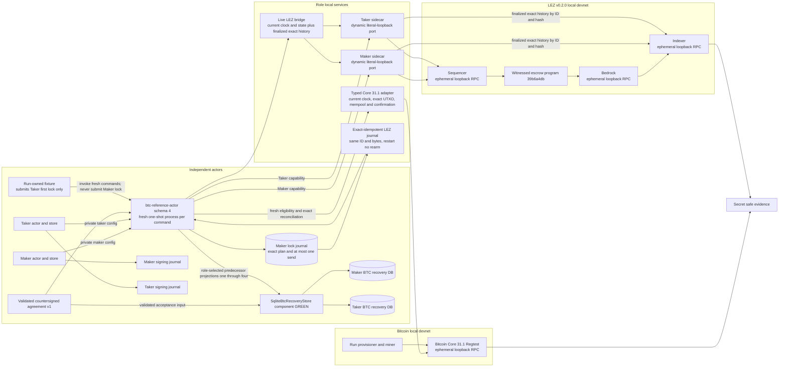
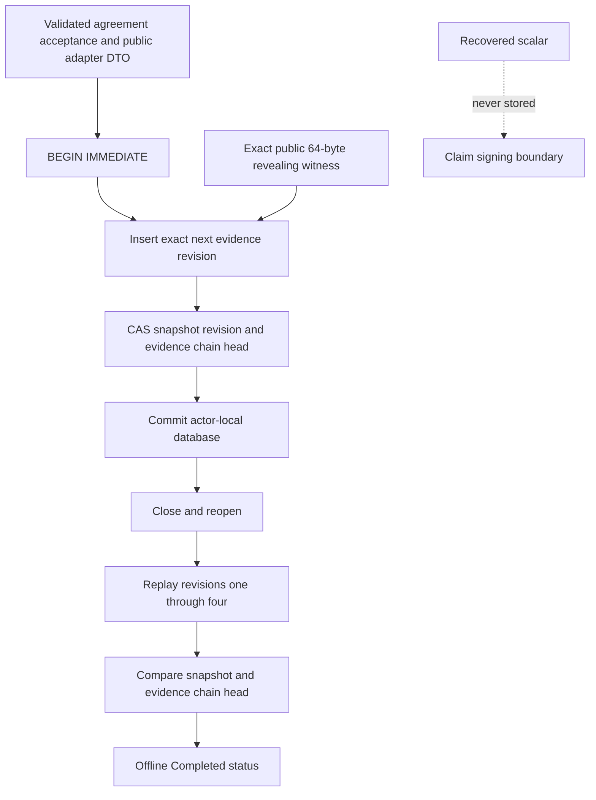
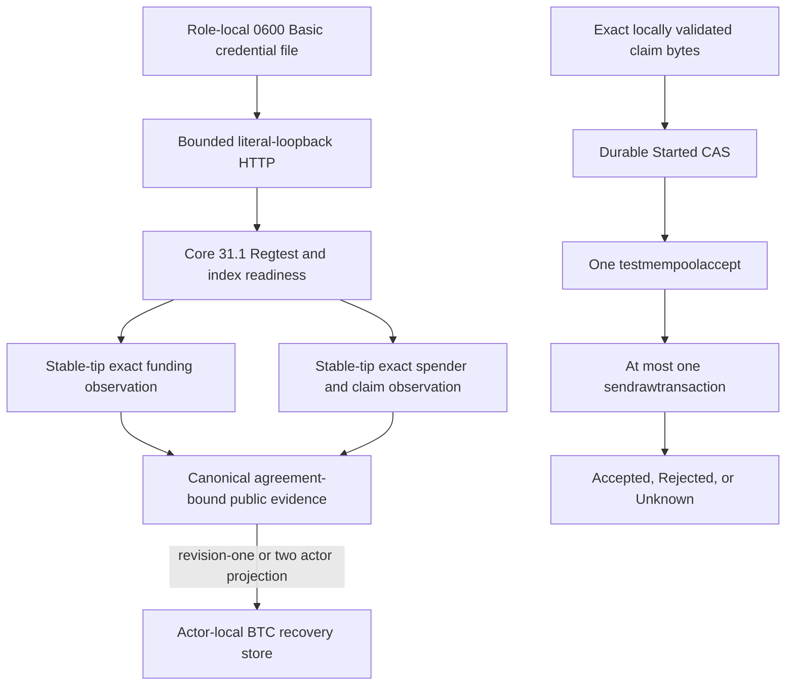
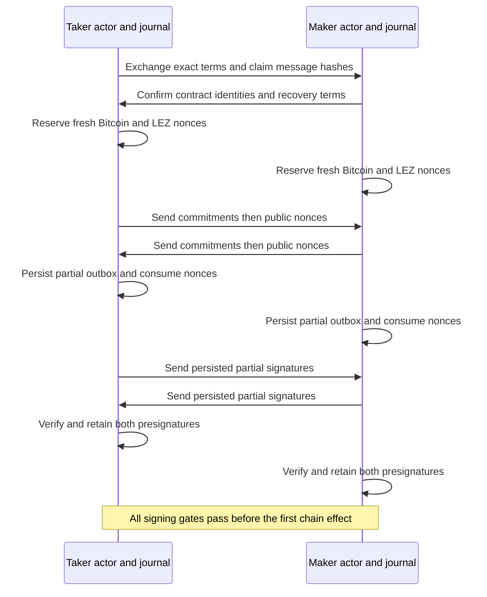
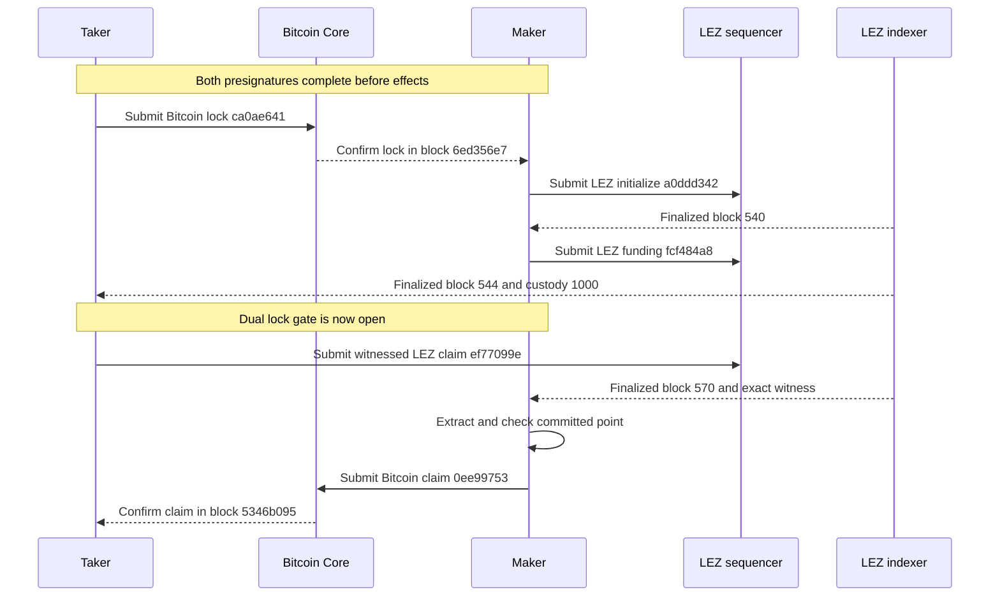
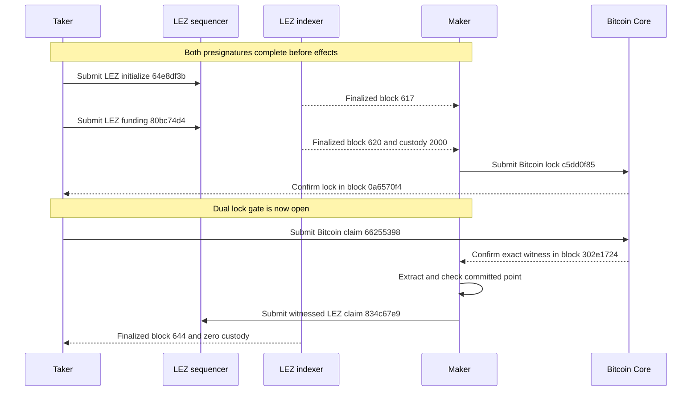

# ADR 0029: M3 uses isolated Bitcoin and LEZ local devnets

Status: Accepted. Repository-owned run `m3schema4-20260717d` completed both
schema-4 happy directions against fresh actual local Core/LEZ nodes on
2026-07-17 at clean, already-pushed commit
`0e7635fc7e50cc6e0612745dcdaf6df8bbcf6f9a`. In each direction the
runner submitted only the Taker's first lock; the role-fixed Maker actor
submitted the exact second lock under its one-attempt journal and reconciled
canonical evidence before local revision two. Both roles then reached revision
4 `Completed`, and restart plus terminal replay added zero effects.

The retained
[schema-4 packet](../evidence/m3-schema4-actor-owned-lock-poc-20260717.json)
records exact Maker effect ownership, current/finalized eligibility, exact
Bitcoin mempool or LEZ effect-count reconciliation, and atomic local
Maker-intent/revision-two closure. It does not claim a distributed transaction.
Two genuinely overlapping swaps, accepted full-lifecycle SDK and custom-token
scope, recording deliverables, final milestone gates, public/production
hardening, and the `m3-complete` tag remain open.

## Context

The live RFP and accepted Gateway proposal require a complete LEZ and BTC
lifecycle, BIP-340 Schnorr adaptor signatures, a BIP-341 cooperative key-path
claim, a Bitcoin Core setup guide, both role directions, and reproducible
evidence. M3 entered with isolated component proofs: exact Bitcoin Core
provenance, a typed P2TR and CSV builder, MuSig2 adaptor signing, crash-safe
role journals, and a checked LEZ aggregate-witness guest.

Historical run `m3poc-live2-20260715a` first joined those components through
operator composition. Run `m3actor-20260716n` then proved role-fixed claim
actors against fresh actual local nodes. Run `m3schema4-20260717d` closes the
next ownership gap: its external fixture creates only the Taker first lock and
the Maker's fresh one-shot process owns the second-lock send. Independent roles
use separate stores, signing journals, sidecars, and restricted Core RPC
credentials. This is a progressive private-local happy-path PoC, not
production signing authority or a hardening claim.

The accepted Gateway proposal names DLC-specs `AdaptorSignature.md` as a
conformance source. No such file exists in the current DLC repository or its
history. The published DLC adaptor corpus is ECDSA, while M3 requires BIP-340
Schnorr. [GW-M3-001](../proposal-acceptance-errata.md) tracks that upstream
reference defect. It does not invalidate this local functional PoC and must not
be silently represented as passing literal DLC conformance.

## Decision

The M3 local PoC uses Bitcoin Core 31.1 Regtest and the pinned LEZ v0.2.0 local
stack. All runtime chain and actor endpoints are literal loopback services.
The run uses no public RPC, faucet, public peer, public funds, or public chain.
Changing to a public route is a configuration and deployment concern, not a
different protocol implementation.

The following exact endpoints are retained historical evidence from
`m3actor-20260716n`. Run `m3schema4-20260717d` allocated a fresh ephemeral
loopback topology with the same component and trust boundaries; its packet
intentionally identifies endpoint scope rather than promoting ephemeral ports
to configuration defaults.

| Component | Version or identity | Retained endpoint | Trust boundary |
| --- | --- | --- | --- |
| Bitcoin Core | 31.1 on Regtest | `http://127.0.0.1:32913` | Provisioner owns mining and full RPC. Maker and taker have distinct restricted RPC identities |
| LEZ Bedrock | v0.2.0 | `http://127.0.0.1:32914` | Run-owned private local service |
| LEZ sequencer | v0.2.0 | `http://127.0.0.1:32915` | Signed transaction submission and local inclusion |
| LEZ indexer | v0.2.0 | `http://127.0.0.1:32916` | Independent finalized block and transaction audit |
| Maker sidecars | Role fixed | Final ports `52895` / `60737` for foreign/LEZ directions | Maker capability, signer, state, and journal only |
| Taker sidecars | Role fixed | Final ports `48941` / `48599` for foreign/LEZ directions | Taker capability, signer, state, and journal only |

These are evidence endpoints from an ephemeral retained run, not stable
well-known ports. The LEZ channel is
`b6adb2d238911395adde0b2f40b880ec03ffd1a3a8d97e7df8cacadf08873748`
and its genesis block is
`e138da3e4a42aae1c32da286457d853d52fafc760811181b05a59e1e44583c14`.

The implemented version-one agreement is canonical bounded Borsh committed by
domain-separated SHA-256 and countersigned with each role's BIP-340 key. It
binds the Bitcoin genesis and confirmation policy, ordered role keys and adaptor
point, exact LEZ runtime/program/accounts/amount/deadline/claim message, complete
P2TR and CSV fields, funding outpoint/value, cooperative output/fee/unsigned
transaction/sighash, and conservative recovery anchors and margin. Validation
reconstructs the aggregate key, Taproot output and claim transaction with the
pinned libraries and rejects derived-field drift even when both signatures cover
the drifted body. Revision-zero actor activation now accepts only this record.

The read-only finalized-claim adapter accepts either agreement participant's
role-fixed sidecar, scans only a bounded window fully covered by the finalized
indexer tip, and requires every block to be `Finalized`, byte-equal by numeric
ID and hash, and parent-linked from window start through the stable tip. It
accepts the claim exactly once and reconstructs its
canonical public transaction and aggregate witness, and reads `Claimed`
metadata plus zero custody at the exact containing `BlockId`. The client then
rechecks the inclusive window and verifies BIP-340 against the agreement key
and exact claim hash. The official indexer does not expose an account proof or
atomic multi-account snapshot token; stable finalized-tip bracketing and
same-block reads are the current upstream-trust compensation and remain a
production caveat.

The distinct read-only finalized-funding adapter preserves the earlier
stable-tip progress observer. It accepts an exact funding transaction ID or a
bounded unique terms-derived discovery, requires canonical `FundNative`, and
reads historical `Funded` metadata plus exact custody at the containing
finalized block. The actor uses this explicit gate to keep claims
in a later block because LEZ v0.2 exposes end-of-block rather than
transaction-position account state; the read-only sidecar method does not
retain a prerequisite across the independent claim methods. The
pinned sidecar performs official decoding and PDA validation, and the actor
compares its facts to the signed agreement before persistence.

The durable Bitcoin lifecycle component remains independently executable and is
also integrated by the public actor. The actor supplies an already-validated
canonical agreement acceptance and typed public chain evidence. Each role uses
a different SQLite database. One immediate transaction inserts the next exact
evidence record and CAS-advances the aggregate snapshot and versioned evidence
chain. Reopen replays revisions one through four and compares both the
reconstructed snapshot and chain head before exposing offline status. The exact
64-byte public revealing witness is retained for peerless recovery; the
recovered scalar crosses only the claim-signing boundary and is never stored.

The database transaction cannot atomically commit either chain effect. Exact
replay, predecessor CAS, and the evidence chain make retries and local history
corruption fail closed, but the hash chain is consistency evidence rather than
authentication against a filesystem owner capable of rewriting the complete
database.

The typed Bitcoin adapter is the matching public-evidence boundary for Core.
It first checks the exact Core 31.1 version/subversion, agreement Regtest
genesis, unpruned synchronized tip, selected disconnected or network-enabled
Regtest policy, and synchronized `txindex` plus `txospenderindex`. Funding and
claim reads are stable-tip bracketed. Consensus transaction bytes are decoded
canonically and compared with Core's typed identities, vin/vout, size, weight,
confirmation, block, and spender facts before a bounded agreement-bound record
can enter the recovery store. The claim record retains the exact public
64-byte witness and no scalar. Submission requires a durable `Started` CAS
binding txid, wtxid, and the exact raw-byte digest before policy preflight and
one broadcast. Already-known or ambiguous outcomes become terminal `Unknown`;
conflicting witness payloads never authorize a second broadcast.

Core 31.1 changed the exact spender-call shape used by this adapter. The second
`gettxspendingprevout` parameter is one options object with
`mempool_only=false` and `return_spending_tx=true`; the older positional
booleans are rejected. The transport contract and live role RPC matrix both
assert this Core 31.1 form.

The 18-test Core-adapter component suite uses deterministic typed RPC responses
and ephemeral authenticated loopback servers. Run `m3actor-20260716n` also
proves the actor's agreement-derived funding and claim reads through actual Core
31.1 in both directions. The current network-enabled mode still requires
Regtest; Testnet4 admission is production-portability work.

## Two-lock reference actor

`btc-reference-actor --config PRIVATE_JSON activate|drive|recover|status` is a public
one-shot, role-fixed surface. Its strict owner-private configuration binds the
agreement, role-local database, Core route and credential, and LEZ sidecar
route, capability, run, runtime, timeout, and finalized discovery window.
Schema 4 additionally binds the direction-shaped exact Maker lock plan. The
successful run fixes the LEZ bridge timeout at a finite 30 seconds. `status`
opens no RPC client. Only activation inserts acceptance; absent or empty state
is not activated, while corruption or conflicting acceptance fails closed.

At revision zero, each role observes the fixture-submitted exact Taker first
lock and projects revision one only after the read returns. At the Maker's
revision one, `drive` revalidates that exact first lock and the signed cutoff
against a fresh current chain clock before every possible send. It first
observes the exact Maker plan, consumes one role-local journal attempt only
when eligible, and then reconciles canonical presence. The LEZ direction orders
initialization before funding, binds each step to the same exact ID and bytes,
and joins current state with finalized exact history. The Bitcoin direction
uses stable-tip exact UTXO eligibility, exact mempool reconciliation, and
confirmed canonical readback. A moving LEZ tip returns a typed fail-closed
result; the controller may start a fresh process, but the durable journal
cannot grant a second send.

Only the final exact Maker observation can close the Maker journal intent and
revision two in one local SQLite transaction. The Taker independently observes
the same canonical Maker effect before its own revision-two projection.
Accepted RPC submission alone never advances either role. Exact retries retain
the deterministic request ID; a deliberate bounded-window change receives a
distinct ID and remains evidence-bound. A concurrent CAS loser may reconstruct
a valid matching winner and return `converged_on_existing_projection`
without overwriting it; other failures fail closed.

At revision two, the direction-derived revealing claimant revalidates the
agreement, complete prepared claim, both domain contexts, and its existing
role-local signer journals. The actor completes or reproduces the exact public
Bitcoin or LEZ claim, persists the bytes and one-attempt authority before
presence, and projects revision three only from confirmed or finalized exact
evidence. At revision three, the opposite claimant extracts and point-checks
the revealed scalar, completes the other chain claim, and applies the same
persist, submit-once, observe, then project boundary for revision four
`Completed`. Accepted submission alone never advances the lifecycle. These
claim paths are GREEN in source and deterministic adapter tests.

This ordering is deliberately not a cross-system atomic commit. A crash after
a read and before SQLite leaves the predecessor revision and a new process
re-observes. A crash after the one-attempt CAS never grants a second send; the
actor reconciles exact chain presence. Both schema-4 actual-node happy
directions are GREEN in `m3schema4-20260717d`; process-kill, reorg, and
genuinely concurrent paths remain pending. ADR 0031 records the process
boundary and ADR 0033 records the effect-journal boundary.

The refund path derives the exact BIP-342 transaction from the countersigned
agreement and extends the native-refund bridge wire to strict
hashlock-or-witnessed terms and metadata without changing legacy JSON shape.
Mixed authority facts fail closed, and the compatibility sidecar explicitly
refuses the witnessed variant. The v0.2 guest enforces its permissionless fixed
depositor destination and timestamp validity window. Later evidence under ADRs
0038 and 0039 makes durable preparation, finalized observation, actor
one-attempt submission, and lifecycle projection GREEN on actual local nodes;
process-kill, reorg, and adversarial timing remain hardening scope.

## Deployed LEZ guest and account onboarding

The exact guest ELF SHA-256 is
`a199c5be062adcb27cf63c62d9f5688b37058b4699ce7e1767fd26eeceb5e293`.
Its ImageID and ProgramId are both
`39b6a4db85374de9359ea82164ef415019919475f656d597c5ab2231bc104dec`.
Deployment transaction
`94a49583a5fd5d6a749fd227f38fe99b002866921a9b77e956623ee6f36e76d3`
was finalized in LEZ block 405 with hash
`dfe017c8167c09bf098935afd8585c928e99c6405c1f662e4ce087b465ad73fc`.
Independent lookup by block ID and hash agreed at finalized tip 407.

LEZ genesis allocations begin in Vault accounts. The owner accounts must be
onboarded before preparing a swap transcript. Maker Vault claim transaction
`e41cf042b058aa258fcd19d8ce2384f2635f5c4dfc0c2b64b59a2d588804d1f9`
finalized in block 456. Taker Vault claim transaction
`aa19763d19ce3849b1b0e955e2c049fa31cd357c1f0151a3b1f52ec03428c15b`
finalized in block 457. At independently checked finalized tip 459, both Vault
balances were zero and the maker and taker owner balances were 100000 and
200000 respectively.

Those IDs and blocks belong to the retained operator run. The current runner
generates fresh maker and taker owner identities and derives each corresponding
Vault account with the official Vault program function. Genesis continues to
supply the owner ID because upstream derives and funds the Vault from that
owner. Readiness, onboarding, and evidence receive the paired derived Vault ID;
partial owner/Vault overrides, invalid encodings, or any owner/Vault collision
fail before startup. The runner independently hashes the supplied guest,
requires the exact ELF and ProgramId above, submits deployment and each fresh
Vault Claim once, and proves their finality through bounded sequential indexer
reads. Run `m3actor-20260716n` proves that fresh path: deployment transaction
`94a49583...76d3` finalized once in block 6, maker Vault Claim
`0e494b92...a0be` finalized once in block 9, and taker Vault Claim
`e65ab11f...b308` finalized once in block 12. These fresh facts are distinct
from the historical operator IDs above.

Onboarding is a precondition, not a repair that may be inserted after the first
lock. The retained diagnostic run proved why: Bitcoin lock
`7393db97def6fa567db9ea8a125361371ee31d96062562ddc94b20d67f54ae3f`
confirmed, but the unonboarded LEZ initialize transaction was dropped with
program error 6003. Funding was not submitted and the adaptor secret was not
revealed. The operator refused to repair that swap because onboarding and
preparing a new LEZ transcript after the first effect would violate the
pre-lock signing invariant. Both accounts were onboarded and a completely
fresh swap was used for certification.

## Signing and atomicity invariants

The provisioner constructs and signs the exact Bitcoin funding transaction
offline before agreement finalization. Core `testmempoolaccept` checks those
exact bytes without broadcasting them. The final countersigned agreement binds
the planned funding anchor height; both role journals then complete before the
first effect. When the direction reaches Bitcoin funding, the controller mines
exactly the planned next block and verifies the transaction at that committed
anchor. A rejected admission or anchor mismatch fails closed rather than
rewriting already signed terms.

Both exact claim messages and both aggregate adaptor presignatures exist before
the first chain effect. Bitcoin and LEZ use distinct domain-separated signing
sessions and fresh nonces. Each actor reserves a nonce before exposing its
commitment and persists an exact partial-signature outbox while consuming that
nonce. Only persisted public transcript material is exchanged.

No adaptor secret is released until both chain locks meet the local PoC gate.
After the first adapted claim becomes canonical, the opposite claimant observes
the exact final witness, extracts the value, checks it against the committed
point, and completes the second claim from its persisted role state. No further
counterparty signing interaction is required.

Bitcoin funding commits a two-party aggregate internal key and the ADR 0009
CSV refund tapleaf. The cooperative claim signs the exact BIP-341 key-path
sighash under the tweaked output key. The completed transaction must have one
64-byte key-path witness, verify under the output key, and pass Bitcoin Core
policy and consensus. Verification only under the untweaked aggregate key is
not spend evidence.

The LEZ guest derives the aggregate authority account from the aggregate
x-only key. That authority is distinct from the immutable claimant account.
The guest accepts one aggregate BIP-340 witness over the exact public claim
transaction and transfers custody only to the claimant.

## Schema-4 actor-owned Maker-lock checkpoint

Run `m3schema4-20260717d` is the current ownership checkpoint. It began from
clean pushed commit `0e7635fc7e50cc6e0612745dcdaf6df8bbcf6f9a` and
used fresh one-shot actor processes, role-local schema-4 configs, independent
stores and signer journals, distinct restricted Core credentials, and fresh
ephemeral loopback Core/LEZ services.

| Direction | External Taker first lock | Actor-owned Maker second lock | Exact reconciliation |
| --- | --- | --- | --- |
| `TakerSellsForeign` | Bitcoin `6a1d7328...5ec8` confirmed once | LEZ initialize `6e13383d...2110`, then fund `9eb4ce06...3262` | Durable LEZ effect counts advanced 0 to 1 to 2, stayed unchanged across restart, and the full exact pair finalized inside the actor window |
| `TakerSellsLez` | LEZ initialize `273f4d19...bcbc` and fund `709adebb...b2e` finalized once | Bitcoin `6c2505b3...1dd6` entered the mempool exactly once and then confirmed once | Nine moving-tip attempts granted no unsafe effect; attempt ten succeeded, restart sent zero, and the two existing LEZ effects stayed unchanged |

In both directions the final Maker observation closed the exact Maker intent
and Maker revision two in one local SQLite transaction. The Taker projected
revision two only from its own canonical observation. Both roles subsequently
reached revision four `Completed`; exact Bitcoin and LEZ effect counts were
unchanged by terminal replay. This proves the private-local schema-4 happy
path. It does not turn chain submission, chain finality, and either SQLite
store into one distributed transaction.

## Completed direction TakerSellsForeign

The repository-owned certification direction in `m3actor-20260716n` retained
the following exact actual-node effects:

| Effect | Actor | Exact transaction | Canonical evidence |
| --- | --- | --- | --- |
| Bitcoin lock | Taker | `9b858bffa20a4aaf94d38c979a8dfe4c36e8cfcf5854005e00f9e962568c3b5c` | Planned height 102, block `6809aff2...bd04`, one confirmation |
| LEZ initialize | Maker | `612a5f141ab02bdb93eb6786db8d30700c4800383a1ff30caadb410c665bd2c3` | Finalized block 16 `90d5652f...5668` |
| LEZ fund | Maker | `3b8d389e51784ba19ca33b893ac40ec1311d3d2ef1fe948f45576feed5f5d371` | Finalized block 19 `7569b496...eda3` |
| LEZ revealing claim | Taker | `d0cecb3fa6b9fe18a62ec9a217d432574fb4e2c24677611c5278b5f6455bf12b` | Finalized block 25 `6c33752f...bf4e` |
| Bitcoin follow-up claim | Maker | `a1cbf96996448d7f9567cf49350fb37c99e7fe6fecb7d716de02805559341341` | Block `0816c353...4a9f`, one confirmation |

Both role stores ended revision 4 `Completed`. The exact effect count was two
Bitcoin and three LEZ transactions before and after replay.

The following detailed sequence and table retain the older operator-composed
run as historical corroborating evidence.

The taker sold BTC and locked the Bitcoin leg first. After one local Regtest
confirmation, the maker initialized and funded the LEZ witnessed escrow. Only
after the Bitcoin lock was confirmed and LEZ funding was finalized did the
taker reveal through the LEZ claim. The maker extracted from the exact
finalized LEZ signature and completed the Bitcoin claim.

| Effect | Actor | Exact transaction | Final block |
| --- | --- | --- | --- |
| Bitcoin lock | Taker submits and maker observes | `ca0ae6418c3cfe28c114e1acd8d50c25b39f8ab63b62e480d31d5005e94a4c75` | `6ed356e7cc00c6fd796cc5fcfbbb72b598d912cc9729e37c0426464e606355d8` with one confirmation |
| LEZ initialize | Maker | `a0ddd3427fc278d0ae4d42cce0dd6f07d6e52d102a17bbe31342b6ff1bb85a5c` | LEZ 540 `065b8f0e80de2e29cd26aad78f5b133455f9e205811b86da40ede98ccc4b0382` Finalized |
| LEZ fund | Maker | `fcf484a8a21e8fd83d456a4bc6e98e84230d171351d68362c71e68aa0eb988a9` | LEZ 544 `801d38735e33d156c6c3d5b33bf1779c2838f965717cd16491ac0c620cc4a1b7` Finalized |
| LEZ claim | Taker receives LEZ | `ef77099ea877b562dd5192fd6feb929bcfd31b18ea1bd5e58e65a9af3232cde3` | LEZ 570 `582f94f320beb69d0e5fa4417a4daa2ade671d5b1c2ccd0c8b361a431466bdf1` Finalized |
| Bitcoin claim | Maker receives BTC and taker observes | `0ee99753bf35ae3d122e5887fb42ec19e95ea26bf43f3d4897efa9dbd116a5aa` | `5346b095231564e9a6fe2017b5e4ce2681523cd37d4bef14919bbeefddbc0a7c` with one confirmation |

The finalized LEZ witness matched the completed signature exactly. Extraction
matched the committed point. The Bitcoin claim had one exact final-signature
witness, spent the contract output, and left LEZ custody at zero.

## Completed direction TakerSellsLez

The repository-owned certification direction in `m3actor-20260716n` retained
the following exact actual-node effects:

| Effect | Actor | Exact transaction | Canonical evidence |
| --- | --- | --- | --- |
| LEZ initialize | Taker | `2f29f88d8890a743c9d05ed5a8dfa0898ea4103dfa4e6a65382e8591691c1212` | Finalized block 31 `0a0f8b17...7cbf` |
| LEZ fund | Taker | `6789ded61f743c482af5440e83303f9701419d4e60326429d733c859240af364` | Finalized block 34 `31bba33a...6a3f` |
| Bitcoin lock | Maker | `fbcb0f5e12f8ef6275d039b5f9cf76743eff5d4e0f829a454225d5721d6b9dd7` | Planned height 104, block `6312ad3f...ff96`, one confirmation |
| Bitcoin revealing claim | Taker | `e8712506ab497a8264155bf5450c4730a5eca8769c6de839620da61be075a312` | Block `71590209...c9b2`, one confirmation |
| LEZ follow-up claim | Maker | `1d8cff630ec5222469ff2d587363b838fe90ba7b164b90aab49fa4bf57041e8e` | Finalized block 42 `095b7102...8eed` |

Both role stores ended revision 4 `Completed`. The exact effect count was two
Bitcoin and three LEZ transactions before and after replay. Exact cleanup then
proved all captured containers, networks, volumes, images, and secure state
absent without targeting foreign resources.

The following detailed sequence and table retain the older operator-composed
run as historical corroborating evidence.

The taker sold LEZ and initialized and funded that leg first. After LEZ
finality, the maker locked BTC. Only after both locks passed did the taker
reveal through the Bitcoin claim. The maker extracted from the exact confirmed
Bitcoin witness and completed the LEZ claim.

| Effect | Actor | Exact transaction | Final block |
| --- | --- | --- | --- |
| LEZ initialize | Taker | `64e8df3bb9aa83d1eb96ae81d5485f9a980cb3398c9e733af5523303240351a4` | LEZ 617 `cf136b7a26c98a6a1b086bb55c1a82f38d4186f88c7da6a2d1d2de00f24cebf4` Finalized |
| LEZ fund | Taker | `80bc74d43c3be658f296ff3f604c47632ac02301bbc35f5b4501c958e8a1daa6` | LEZ 620 `8b7b01138e054089be86d6edba5e0692c3745da4b3e696862f003dff9ead14f6` Finalized |
| Bitcoin lock | Maker submits and taker observes | `c5dd0f85e0569a553716c0f908707f7039e0436f451d938df15cf1fb303752a3` | `0a6570f428ad4a69f2e237673f6bdd9b59dc1f34f2ddfec25e8f35fa2e9e9740` with one confirmation |
| Bitcoin claim | Taker receives BTC and maker observes | `66255398761bccc89b3e44e79ea1ca4822939f99f8054c08560ea594840054f4` | `302e17248a0110472377b10227d97af4be0e3a362b19a279e901b6cf3fe54524` with one confirmation |
| LEZ claim | Maker receives LEZ | `834c67e9130f8a92a8875053f5c08ba7f768f59ad5bb761c10be341d6e9d3033` | LEZ 644 `88e22483ee2f145f3b7945446e8dd65e183de1b91c040f45f6123d7e60127a44` Finalized |

The confirmed Bitcoin witness matched the final signature exactly. Extraction
matched the committed point and completed the opposite LEZ signature. The
finalized LEZ claim matched that signature and left LEZ custody at zero.

## Reproducibility and isolation

- Docker resources, local processes, temporary state, credentials, and evidence
  are owned by a unique run identity. Cleanup is exact and must never use global
  prune, broad process kills, shared volume removal, or foreign-container
  ownership.
- Core binds only the loopback RPC publication. P2P publication is disabled and
  the retained run had zero public peers. The provisioner alone owns mining,
  wallet, and full node authority.
- Maker and taker use distinct restricted Core RPC identities. Each role has a
  separate sidecar, signer, journal, and state tree.
- Bitcoin funds come from deterministic local Regtest coinbase outputs. LEZ
  funds come from deterministic local genesis Vault allocations. No public RPC,
  faucet, public funds, or public peers participate in runtime.
- Bitcoin blocks are mined deterministically by the local provisioner. The PoC
  opens its Bitcoin gates after one confirmation. This is a declared Regtest
  happy-path policy, not a production confirmation policy.
- LEZ effects require an independent indexer-finalized block, lookup agreement
  by block ID and hash, and exactly one occurrence of each transaction in the
  audited scan.
- Fresh observation request identities are required for moving-tip reads because
  a role sidecar journals request identities for exact replay. Reusing a request
  identity can correctly replay an earlier pending result.
- Remaining local flakiness sources are process scheduling, a moving LEZ tip
  during multi-read observation, sequencer or indexer readiness, and manual
  operator orchestration. There is no public-service runtime flakiness in this
  evidence.
- Cold setup still depends on checksum and signature verified Bitcoin Core
  release assets, the pinned LEZ source and images, and locked Rust registries.
  Their availability and scan results remain explicit build concerns.

## Dependency and cryptographic boundary

The Bitcoin Core 31.1 source revision is
`9be056a8a72b624dae9623b2f7bded92c2a21c91`. The official x86_64 Linux archive
SHA-256 is
`b80d9c3e04da78fb6f0569685673418cf686fadba9042d926d13fb87ff503f9e`.
Bitcoin Core publishes no endorsed container image, so the repository builds a
minimal image from verified official release material and scans its immutable
result.

No project-owned elliptic-curve arithmetic is permitted. The PoC exact-pins
`bitcoin` 0.32.101 and `musig2` 0.4.1. Canonical public key, scalar,
presignature, and final-signature encodings cross the library boundary and are
reparsed before use. `musig2` remains a beta PoC dependency with no published
audit, incomplete zeroization properties, and concentrated maintenance. It is
not accepted as production signing authority.

The local component and composed-flow gates prove BIP-327 aggregation, Taproot
tweak handling, adaptor verification and adaptation, final verification under
the exact output key, Bitcoin Core policy and consensus, extraction with
committed-point checking, and exact LEZ aggregate-witness completion. Formal
cryptographic audit and production key custody are not claimed. ADR 0050 maps
those concrete operations to the primary Aumayr et al. and Fournier security
properties, states the exact assumptions and atomicity link, and explicitly
does not claim that their single-signer analyses prove this two-party
composition.

## PoC result and remaining work

The older operator-composed facts remain in
[M3 local two-direction PoC](../evidence/m3-local-two-direction-poc-20260715.json).
The historical repository-owned claim-actor proof is rooted at
`.e2e/m3actor-20260716n/m3-actor-poc/evidence/`. Its summary binds commit
`6ded2f9b8ba9ec8e0cfbf06287da92d34256f91a`, the three executable
hashes, fresh local service identities, guest deployment/onboarding, both
directions, four terminal role states, zero replay resubmissions, no public
resources, and exact cleanup. Secret material is excluded.

The current
[schema-4 actor-owned lock packet](../evidence/m3-schema4-actor-owned-lock-poc-20260717.json)
binds clean pushed commit
`0e7635fc7e50cc6e0612745dcdaf6df8bbcf6f9a`, the exact runtime
packet and direction-driver digests, fresh local topology, two of two
directions, exact actor ownership and replay counts, four terminal role states,
no public runtime dependency, and exact run-owned cleanup. Secret material is
excluded.

The repository-owned private-local schema-4 happy-path boundary is complete at
two of two directions. The following are deliberately not accepted by this
ADR:

- two genuinely overlapping swaps, process-kill recovery, reorgs, chaos,
  denial-of-service, and adversarial security campaigns;
- completion review for the accepted full-lifecycle public BTC SDK, F7
  custom-token corridor, and D1 recording deliverables;
- production key custody, fee management, confirmation policy, public routing,
  public LEZ deployment, monitoring, and operational readiness;
- a formal cryptographic audit or final production acceptance of `musig2`;
- literal conformance to the nonexistent DLC Schnorr adaptor vector file;
- an `m3-complete` tag.

Refund ordering remains the ADR 0009 design. Actual-node two-lock and
first-lock-only refunds are now recorded by later M3 evidence. If the maker never submits the
second lock, the taker eventually recovers the first leg. If both legs are
locked and claims do not complete, the maker-funded shorter recovery occurs
before the taker-funded longer recovery after the conservative cross-chain
margin. Those refund journeys complement, but do not replace, the now-proven
timely schema-4 Maker lock admission against both live local nodes.

This ADR accepts the repository-owned private local schema-4 happy-path
checkpoint proven by `m3schema4-20260717d`. It does not certify the remaining
accepted M3 scope or production-hardening nonclaims and does not create an M3
completion tag; the tag belongs only on the exact pushed commit after every
milestone closure gate passes.

Post-PoC QA, chaos, information-security, and production-readiness work starts
only under the progressive delivery transition selected by the owner. The
absence of public deployment evidence is intentional and does not reduce the
local functional result.
