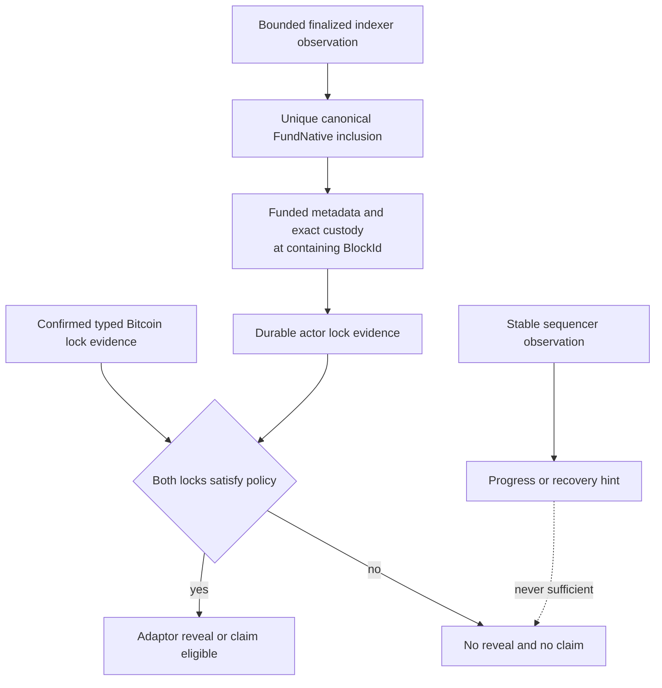

# ADR 0030: Prove finalized LEZ funding before either claim

Status: Accepted; protocol, client, and sidecar implementation GREEN --
2026-07-15

## Context

The existing `observe-witnessed-escrow` method deliberately reports progress
from a stable sequencer tip and current account reads. It is useful for
pre-finality recovery, but it cannot prove Bedrock finality and must not become
a stronger method under the same wire contract.

M3 releases adaptor material only after both chain locks satisfy the selected
local policy. Bitcoin already has a typed stable-tip Core observation. LEZ
therefore needs a distinct read-only result proving that the witnessed native
funding transaction is in a finalized block and that the historical state at
that containing block is exactly `Funded` with the full agreed amount in
custody.

## Decision

Add a separate finalized witnessed-funding observation through the existing
bounded authenticated bridge. The request binds actor context, immutable
runtime, exact witnessed terms, one inclusive bounded discovery window, and
either an exact funding transaction ID or peerless discovery by terms. It
never submits a transaction and does not change the live escrow observer.

```mermaid
sequenceDiagram
    actor Actor as Maker or taker actor
    participant Bridge as Role-bound LEZ sidecar
    participant Indexer as LEZ finalized indexer
    participant Store as Actor recovery store
    participant Claim as Claim coordinator

    Actor->>Bridge: Observe finalized witnessed funding
    Bridge->>Indexer: Read finalized tip height
    Bridge->>Indexer: Read tip block by ID and hash
    loop Every height in bounded window
        Bridge->>Indexer: Read block by ID and hash
    end
    Bridge->>Indexer: Read metadata at containing BlockId
    Bridge->>Indexer: Read custody at containing BlockId
    Bridge->>Indexer: Reread tip height and full block identity
    Bridge-->>Actor: Canonical finalized funding facts
    Actor->>Store: Persist validated LEZ lock evidence
    Store-->>Claim: Both locks final
    Claim->>Claim: Permit adaptor reveal or claim
```

The observer must:

- require the complete requested window to be covered by the numeric finalized
  tip;
- read each candidate block independently by ID and hash, require byte equality
  and `Finalized` status, and bracket the scan with an unchanged numeric and
  full block-identity tip;
- accept only the pinned escrow program, canonical public `FundNative`
  instruction, exact derived metadata/custody accounts, depositor account,
  sole depositor signer, canonical bytes, transaction hash, and official
  stateless signature validation;
- return exactly one candidate, with absence, ambiguity, conflicting
  terms-slot content, and malformed chain facts remaining distinct fail-closed
  outcomes;
- read metadata and custody at the candidate's numeric containing `BlockId`,
  require witnessed terms including aggregate authority, status `Funded`,
  and custody owner/balance exactly equal to the agreed native amount; and
- let the client independently validate context/runtime echo, target/window,
  transaction/block/tip coherence, account order, signer, instruction, terms,
  metadata, and custody facts.



## Atomicity and recovery

The indexer reads and actor database cannot commit atomically. The coordinator
first obtains and validates an immutable public evidence DTO, then commits the
next actor-local recovery revision with predecessor CAS. A crash before the
database commit repeats only the read-only observation. A crash after commit
replays the same canonical evidence and must not authorize another chain
effect. Ambiguous or moving-tip observation produces no durable lock
transition.

This preserves the PoC atomicity envelope: no secret is revealed until both
locks have affirmative chain evidence; after reveal, each role already holds
the complete opposite-chain presignature and can finish without Delivery or
Chat. It does not claim atomic cross-chain or chain-plus-database commit.

## Upstream limitation

LEZ v0.2 `getAccountAtBlock` returns end-of-block state and supplies no
authenticated account proof or transaction-index snapshot token. If funding
and claim occur in the same block, the intermediate `Funded` state cannot be
proved because end-of-block state is already `Claimed`. Until Logos exposes
proof-bearing transaction-position state, the actor must complete finalized
funding observation before claim submission, which guarantees the claim is in
a later block.

A consistent faulty indexer can still fabricate mutually consistent block and
account DTOs. That Logos-owned production trust gap is disclosed under ADR
0018 and does not block the isolated local M3 PoC.

## Consequences

- Local and future public deployments use the same protocol; endpoints and
  deployed program identities remain configuration.
- Peer transaction IDs are optional for recovery, but discovery is always
  bounded and uniqueness-checked.
- Finalized funding becomes an explicit actor input and manual-flow checkpoint.
- The pinned official-wire sidecar is the canonical LEZ transaction decoder and
  PDA validator. The graph-isolated main client revalidates the bounded DTO
  relationships and role/runtime binding; the cohesive actor must additionally
  compare returned metadata, custody, and transaction evidence with the signed
  agreement before committing the lock revision.
- Indexer availability or moving finality delays progress safely and never
  authorizes reveal.
- Initialization finality is not separately claimed by this minimal M3 gate;
  the canonical funding and historical escrow facts are the lock evidence.
