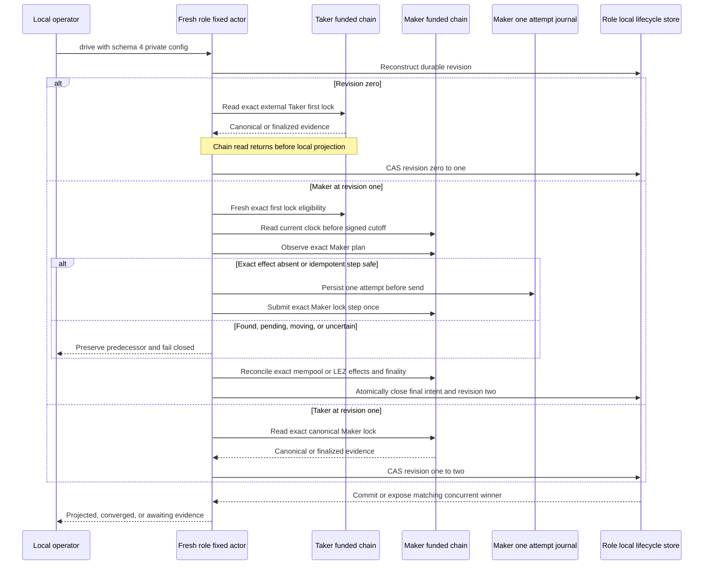
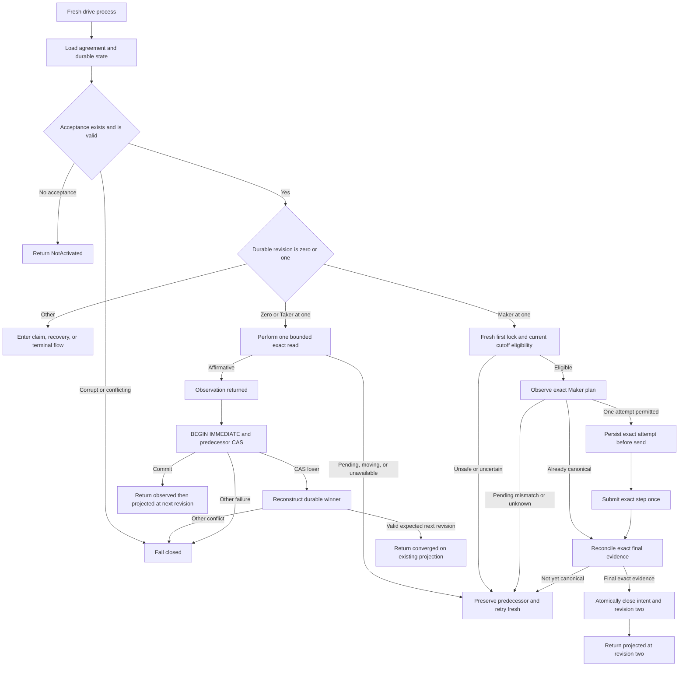

# ADR 0031: Bitcoin funding revisions observe before local projection

Status: Accepted and actual-node GREEN through revisions zero to four in both
schema-4 happy directions. Run `m3schema4-20260717d` at clean pushed commit
`0e7635fc7e50cc6e0612745dcdaf6df8bbcf6f9a` proves the live Maker
CLI and adapter composition: the fixture submitted only the Taker first lock,
the Maker actor submitted the exact direction-shaped second lock once, restart
never rearmed it, and exact observation preceded local revision two. The
explicit recovery command and deterministic one-attempt refund paths are also
GREEN. Process-kill, reorg, and genuinely concurrent paths remain active.

Historical 2026-07-16 reconciliation: ADRs 0034 and 0038 migrated the private
config to strict schema 3 and required the full prepared LEZ claim plus both
completed agreement-derived signer journals before activation could create
revision zero. Schema 4 retains those gates. Output schema stays version 1 and
the observe-before-project decision below is unchanged.

Schema 3 is legacy observation-only compatibility.
It can project an already observed exact maker lock through a no-send journal
intent with `attempt_count` zero, but it cannot call `SubmitOnce`. Schema 4
requires complete direction-shaped Maker material and reconstructs the exact
lock plan through `BtcPairSdk`; Taker configs forbid that material. The typed
seam observes before every possible send and atomically closes final exact
evidence with revision two. LEZ v0.2 cannot prove pending-level initialization
absence, so `ExactIdempotentSubmissionSafe` is a separate, narrower
classification: it grants one CAS/send only when the live node operation and
journal bind the same exact ID and bytes. It is not absence, cannot rearm
`Started` or `Unknown`, and canonical evidence remains mandatory.

Run `m3schema4-20260717d` exercises that live contract. For
`TakerSellsForeign`, durable LEZ effect counts progress from zero through the
one exact initialization and one exact funding effect and stay unchanged after
restart; the final view joins current `Funded` state and custody with
finalized exact initialization/funding history. For `TakerSellsLez`, the
exact Bitcoin plan appears once in the mempool, restart submits zero, and the
confirmed exact transaction closes the intent. Nine typed moving-tip reads
withheld the Bitcoin send; a fresh tenth actor process obtained one stable
eligibility view and succeeded.

## Context

M3 already had a canonical countersigned LEZ/BTC agreement, a typed Bitcoin
Core observer, a distinct finalized witnessed-LEZ funding observer, and an
actor-local SQLite recovery store. Leaving their composition to an operator
would permit direction, role, account, confirmation, or persistence ordering to
drift between callers.

An RPC observation and a SQLite transaction cannot be one atomic transaction.
Both funding operations are read-only at the actor chain boundary, so the actor
must state the actual failure boundary rather than imply cross-system
atomicity.

## Decision

Expose one public Unix process, `btc-reference-actor`, with exactly four
one-shot commands:

~~~text
btc-reference-actor --config PRIVATE_JSON activate
btc-reference-actor --config PRIVATE_JSON drive
btc-reference-actor --config PRIVATE_JSON recover
btc-reference-actor --config PRIVATE_JSON status
~~~

The historical strict schema-v3 configuration is owner-private and permanently binds one
maker or taker role, canonical agreement file, role-local state database,
acceptance time, Bitcoin Core loopback route and credential file, one LEZ
sidecar loopback route, capability, run identity, runtime, timeout and bounded
discovery window, two distinct agreement-derived signing sessions with
role-local journal paths, and the full prepared witnessed-claim result. Taker
configs also bind one owner-private adaptor-secret file while maker configs are
forbidden from carrying that authority. The agreement-derived Bitcoin funder
must additionally bind one mode-0600 lowercase-hex encoding of its refund
scalar whose derived x-only key
matches the countersigned participant; every other role is forbidden from
carrying it. The runtime role, LEZ v0.2
compatibility, channel, genesis, escrow program, signer account, and the
agreement's signed terms must agree. ADR 0034 defines the additional activation
gate and explicit schema-1 rejection.

Schema 4 retains those private role/runtime bindings and adds exact Maker lock
activation material. `TakerSellsLez` carries the exact signed Bitcoin funding
file; `TakerSellsForeign` carries the exact LEZ prepare request and prepare
result, including initialization/funding IDs and bytes. These are complete
inputs to the typed live composition; they do not by themselves grant send
authority. Fresh first-lock eligibility, the signed cutoff, the chain
observation, and the role-local journal decide whether one exact attempt is
available.
For a LEZ funding read, the deterministic observation ID hashes the complete
request identity, including run, role, runtime, signed terms, target, and
window. An exact retry retains the same ID and request; a deliberate bounded-
window change produces a distinct ID, and the full request remains encoded and
revalidated in the retained evidence.

`activate` is the only command allowed to insert agreement acceptance. It
validates the canonical countersigned agreement and role/runtime binding,
derives the fresh coordinator from that agreement, and durably accepts revision
zero. Exact activation replay is idempotent.

An absent database or an existing empty or migrated database without acceptance
is `not_activated` for `status` and `NotActivated` for `drive` or `recover`.
`status` may migrate the schema of an existing database, but it never creates
acceptance. It reads the agreement and role-local SQLite store only, constructs
no Bitcoin or LEZ client, and performs no RPC. Corrupt state or acceptance that
conflicts with the agreement, role, timestamp, or coordinator fails closed.

At durable revision zero, either role's `drive` reconstructs the exact
acceptance, selects the Taker-funded chain, obtains canonical Bitcoin or
finalized LEZ evidence, returns completely from the asynchronous read, and
only then projects `TakerLock` through the recovery store's
`BEGIN IMMEDIATE` predecessor CAS.

At durable revision one, the Taker remains an observer: it reads the exact
Maker-funded chain effect and then projects `MakerLock`. The schema-4 Maker
owns the active path:

1. reconstruct and validate the direction-shaped exact lock plan;
2. prove the current Maker-chain clock is strictly before the signed cutoff
   before any possible send;
3. freshly revalidate the exact Taker first lock as canonical, unspent or
   currently funded, and eligible;
4. observe the exact Maker effect, durably consume at most one attempt when the
   typed result permits it, and never rearm an ambiguous attempt;
5. reconcile the exact Bitcoin mempool/confirmation or the ordered exact LEZ
   initialization/funding effects, including finalized evidence for the
   value-bearing funding step; and
6. in one local SQLite transaction, close the final Maker intent and CAS
   revision one to revision two from that exact evidence.

A typed Bitcoin pending result, moving LEZ tip, incomplete finalized window,
or other uncertain view leaves the lifecycle at its predecessor. Node
acceptance is observation-only. The chain read or submission is never part of
the SQLite transaction. At revision two, `drive` composes the canonical claim
branch while explicit `recover` composes the alternative ordered timeout
branch described by ADRs 0035 and 0038; the command choice prevents a worker
from guessing between success and timeout authority.

## Failure and restart semantics

The actor makes no cross-system atomicity claim. Revision-zero and Taker
revision-one chain observations are read-only and precede their local
transaction. A crash after either observation leaves the predecessor revision
and a fresh process repeats the bounded read.

The schema-4 Maker path may mutate its chain. It first persists exact
one-attempt authority. A crash or ambiguous response after that CAS can
sacrifice automatic liveness, but it cannot grant another send; a fresh process
may only reconcile exact chain presence. A crash after canonical observation
but before the combined Maker-intent/revision-two close also leaves revision
one and reconciles again. A crash after the SQLite close recovers revision two
without sending. Chain consensus and this local close are necessarily separate
commit domains.

If a concurrent driver commits a valid matching next
`TakerLockConfirmed` or `BothLegsLocked` winner, the CAS loser
reconstructs it and returns `converged_on_existing_projection` without
overwriting it. Any other evidence conflict, predecessor state, corruption, or
store failure fails closed.

The revision-zero and Taker revision-one branches above remain read-only. The
schema-4 Maker branch owns only the exact prepared second-lock plan and only
under its journal and eligibility gates. It does not prepare a new agreement,
execute a claim, or execute a refund. Later accepted ADRs compose claim and
timeout revisions three and four through the same one-shot process and
predecessor-CAS boundary; their separate evidence gates must not be inferred
from this lock diagram alone.

## Resource boundary

The current runtime contract is private and local: literal-loopback Bitcoin
Core Regtest and role sidecars over the run-owned LEZ v0.2 stack. Bitcoin funds
are deterministic local Regtest outputs and LEZ funds are deterministic local
genesis or Vault allocations. No public RPC, faucet, public peer, public funds,
or public deployment is needed. Cold dependency and image acquisition may use
external registries or release servers; that setup availability is not runtime
chain evidence.

## Consequences

Direction and role mapping, current cutoff and first-lock eligibility,
Bitcoin mempool/confirmation reconciliation, finalized LEZ exact-history
reconciliation, signed account binding, and both durable lock transitions now
have one supported executable schema-4 actor. Run
`m3schema4-20260717d` proves both directions, one conceptual Maker lock
per direction realized as one Bitcoin transaction or the ordered LEZ
initialize/fund pair, no restart rearm, revision-four completion, and unchanged
terminal effect counts. Status remains useful during node outage.

The deliberate chain-to-SQLite gap is visible and restartable, not hidden.
Claims and refunds use the same no-distributed-transaction model: exact bytes
precede one-attempt authority and canonical or finalized evidence precedes
local projection. Offline status distinguishes revision-three claim evidence
from `MakerLegRefunded`; the latter reports `recover_taker_leg`, so an
operator is not incorrectly directed back into the claim branch. Actual-node
refund flows are retained by later M3 evidence. Process-kill, reorg, fee,
genuine concurrency, public routing, and production operation remain later M3
or post-PoC gates.
