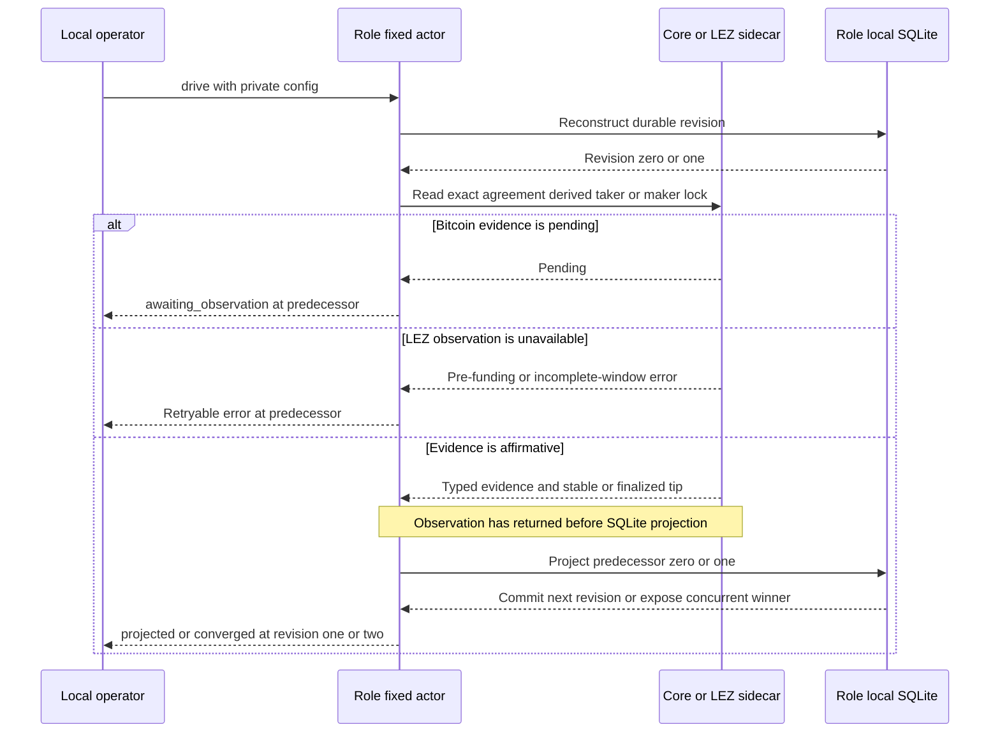
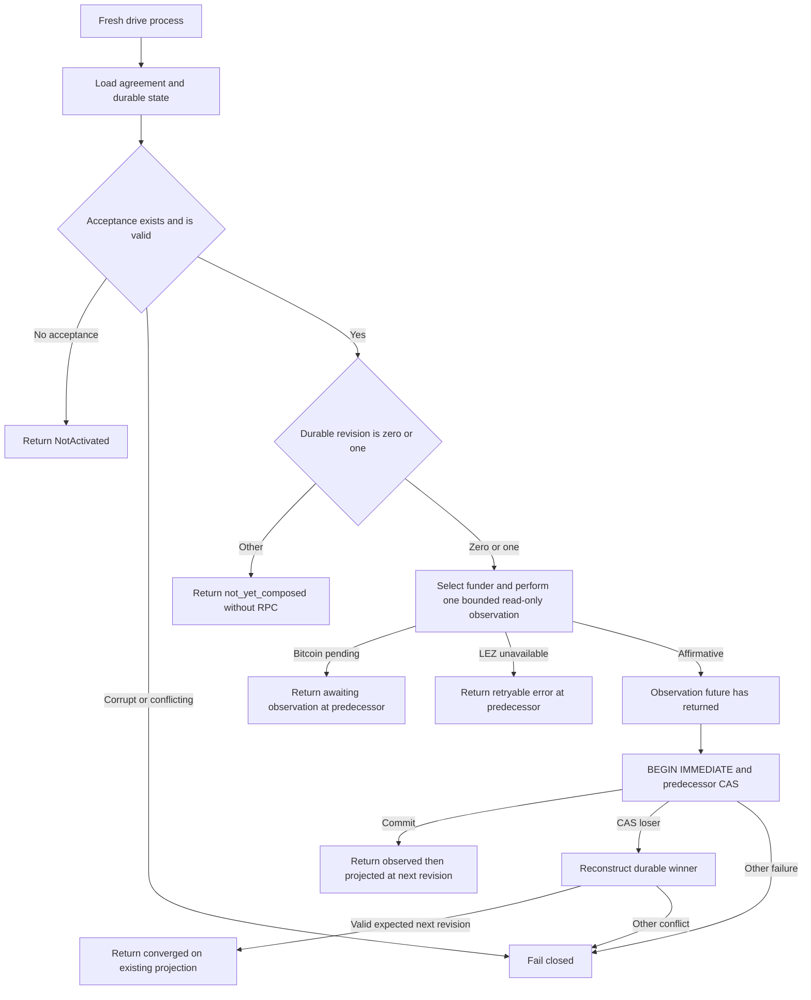

# ADR 0031: Bitcoin funding revisions observe before local projection

Status: Accepted and GREEN through revisions zero to four in both repository-owned
actual-node happy directions. The explicit recovery command and deterministic
one-attempt refund paths are GREEN. Pushed `8870910` additionally makes the
strict schema-4 typed Maker lock/journal seam GREEN; its live CLI remains fail
closed. Pushed `11111dd` additionally maps exact-idempotent admission through
the typed actor and proves restart no-rearm, but has no live or actual-node
evidence. Crash, reorg, and concurrency paths
remain active.

Reconciled 2026-07-16: ADRs 0034 and 0038 migrate the private config to strict schema 3
and require the full prepared LEZ claim plus both completed agreement-derived
signer journals before activation may create revision zero. Output schema stays
version 1 and the funding observe-before-project decision below is unchanged.

Reconciled at `8870910`: schema 3 is now legacy observation-only compatibility.
It can project an already observed exact maker lock through a no-send journal
intent with `attempt_count` zero, but it cannot call `SubmitOnce`. Schema 4
requires complete direction-shaped Maker material and reconstructs the exact
lock plan through `BtcPairSdk`; Taker configs forbid that material. The typed
seam observes before every possible send and atomically closes final exact
evidence with revision two. The live schema-4 Maker CLI deliberately returns
`ActivationMaterialUnavailable` until the missing LEZ live views are composed.
LEZ v0.2 cannot prove pending-level initialization absence. Pushed `3336b6e`
adds journal observation `ExactIdempotentSubmissionSafe`, which grants one
CAS/send only for the same exact ID and bytes; it is not absence, cannot rearm
`Started` or `Unknown`, and still requires canonical evidence for acceptance.
Its focused tests/gates are GREEN, but the live adapter must still prove that
exact idempotence. Pushed `11111dd` maps this observation through
`MakerLockStepChainObservationV1`: the first drive submits once and a restarted
actor submits zero times. This is typed actor restart evidence, not a live port.
Pushed `923586b` also proves the agreement-selected LEZ
escrow is currently `Funded` with complete custody under one stable current
clock for either role/direction. That state-only proof is not finalized
transaction evidence, so the live joined view remains open.

## Context

M3 already had a canonical countersigned LEZ/BTC agreement, a typed Bitcoin
Core observer, a distinct finalized witnessed-LEZ funding observer, and an
actor-local SQLite recovery store. Leaving their composition to an operator
would permit direction, role, account, confirmation, or persistence ordering to
drift between callers.

An RPC observation and a SQLite transaction cannot be one atomic transaction.
Both funding operations are read-only at the actor chain boundary, so the actor
must state the actual failure boundary rather than imply cross-system
atomicity.

## Decision

Expose one public Unix process, `btc-reference-actor`, with exactly four
one-shot commands:

~~~text
btc-reference-actor --config PRIVATE_JSON activate
btc-reference-actor --config PRIVATE_JSON drive
btc-reference-actor --config PRIVATE_JSON recover
btc-reference-actor --config PRIVATE_JSON status
~~~

The historical strict schema-v3 configuration is owner-private and permanently binds one
maker or taker role, canonical agreement file, role-local state database,
acceptance time, Bitcoin Core loopback route and credential file, one LEZ
sidecar loopback route, capability, run identity, runtime, timeout and bounded
discovery window, two distinct agreement-derived signing sessions with
role-local journal paths, and the full prepared witnessed-claim result. Taker
configs also bind one owner-private adaptor-secret file while maker configs are
forbidden from carrying that authority. The agreement-derived Bitcoin funder
must additionally bind one mode-0600 lowercase-hex encoding of its refund
scalar whose derived x-only key
matches the countersigned participant; every other role is forbidden from
carrying it. The runtime role, LEZ v0.2
compatibility, channel, genesis, escrow program, signer account, and the
agreement's signed terms must agree. ADR 0034 defines the additional activation
gate and explicit schema-1 rejection.

Schema 4 retains those private role/runtime bindings and adds exact Maker lock
activation material. `TakerSellsLez` carries the exact signed Bitcoin funding
file; `TakerSellsForeign` carries the exact LEZ prepare request and prepare
result, including initialization/funding IDs and bytes. These are complete
inputs to the typed seam, not authorization for the currently unavailable live
composition.
For a LEZ funding read, the deterministic observation ID hashes the complete
request identity, including run, role, runtime, signed terms, target, and
window. An exact retry retains the same ID and request; a deliberate bounded-
window change produces a distinct ID, and the full request remains encoded and
revalidated in the retained evidence.

`activate` is the only command allowed to insert agreement acceptance. It
validates the canonical countersigned agreement and role/runtime binding,
derives the fresh coordinator from that agreement, and durably accepts revision
zero. Exact activation replay is idempotent.

An absent database or an existing empty or migrated database without acceptance
is `not_activated` for `status` and `NotActivated` for `drive` or `recover`.
`status` may migrate the schema of an existing database, but it never creates
acceptance. It reads the agreement and role-local SQLite store only, constructs
no Bitcoin or LEZ client, and performs no RPC. Corrupt state or acceptance that
conflicts with the agreement, role, timestamp, or coordinator fails closed.

At durable revision zero or one, one `drive` invocation:

1. reconstructs the exact accepted agreement and store;
2. selects the taker-funded chain at predecessor zero or maker-funded chain at
   predecessor one from the agreement-derived coordinator;
3. observes either the exact Bitcoin funding through the typed Core adapter at
   the signed confirmation policy or witnessed LEZ funding through the distinct
   finalized observer;
4. for LEZ, binds the returned runtime, terms, metadata, custody, depositor,
   claimant, aggregate authority, and program identities to the signed
   agreement and retains the complete finalized tip with the funding facts;
5. returns completely from the asynchronous observation; and only then
6. projects `TakerLock` from predecessor zero or `MakerLock` from predecessor
   one through the recovery store's `BEGIN IMMEDIATE` and predecessor CAS.

A typed Bitcoin pending result returns `awaiting_observation` without changing
revision. The LEZ v0.2 finalized observer currently reports ordinary pre-funding
absence or incomplete-window conditions as retryable `ObservationUnavailable`,
not as affirmative absence. Affirmative evidence returns
`observed_then_projected` at revision one or two. At revision one, offline
status reports `observe_maker_second_lock`. At revision two, `drive` composes the
canonical claim branch while explicit `recover` composes the alternative ordered
timeout branch described by ADRs 0035 and 0038; the command choice prevents a
worker from guessing between success and timeout authority.

## Failure and restart semantics

The actor makes no cross-system atomicity claim. The chain observation is
read-only and precedes the local transaction. A crash after observation but
before projection leaves the predecessor revision; a later fresh process
repeats the bounded observation and attempts the same predecessor projection.
A crash after the SQLite commit is recovered from revision one or two, and a
later `drive` does not re-observe that funding transition. Exact evidence replay
is governed by the store. If a concurrent driver commits non-identical evidence
for a valid next `TakerLockConfirmed` or `BothLegsLocked` winner, the CAS loser
reconstructs that winner and returns
`converged_on_existing_projection` without overwriting it. Any other evidence
conflict, predecessor state, corruption, or store failure fails closed.

The funding-observation diagrams above remain read-only and do not themselves
submit funding, prepare a claim, or execute a refund. Later accepted ADRs compose
claim and timeout revisions three and four through the same one-shot process and
predecessor-CAS boundary; their separate evidence gates must not be inferred from
this funding diagram alone.

## Resource boundary

The current runtime contract is private and local: literal-loopback Bitcoin
Core Regtest and role sidecars over the run-owned LEZ v0.2 stack. Bitcoin funds
are deterministic local Regtest outputs and LEZ funds are deterministic local
genesis or Vault allocations. No public RPC, faucet, public peer, public funds,
or public deployment is needed. Cold dependency and image acquisition may use
external registries or release servers; that setup availability is not runtime
chain evidence.

## Consequences

Direction and role mapping, the Bitcoin confirmation policy, finalized LEZ
funding semantics, signed account binding, and both durable lock transitions now
have one supported executable observer/projector. Status remains useful during node outage.
The deliberate observation-to-SQLite gap is visible and restartable, not
hidden. Claims now use durable exact public effects and canonical final evidence in both
actual-node directions. Refunds use the same no-distributed-transaction model:
exact bytes precede one-attempt authority and finalized evidence precedes local
projection. Offline status distinguishes revision-three claim evidence from
`MakerLegRefunded`; the latter reports `recover_taker_leg`, so an operator is
not incorrectly directed back into the claim branch. Fresh actual-node
refunds, process-kill, reorg, fee, and concurrency evidence remain later M3
gates.
