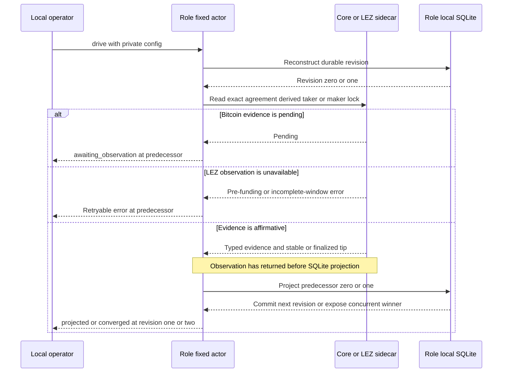
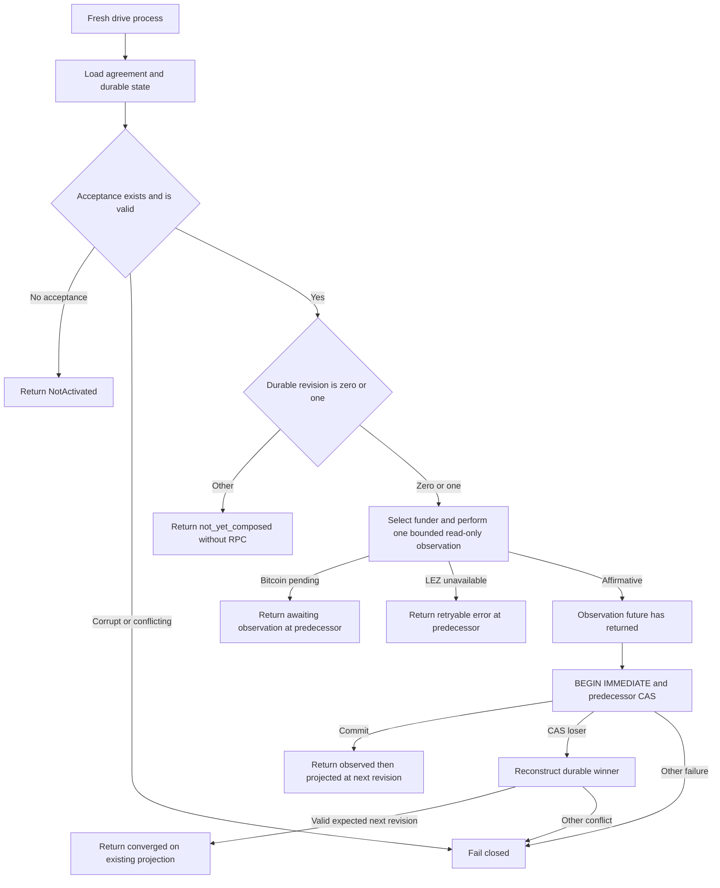

# ADR 0031: Bitcoin funding revisions observe before local projection

Status: Accepted for the M3 taker- and maker-funding reference-actor slices.
Claim revisions three and four and a two-direction actual-node actor run remain
pending.

## Context

M3 already had a canonical countersigned LEZ/BTC agreement, a typed Bitcoin
Core observer, a distinct finalized witnessed-LEZ funding observer, and an
actor-local SQLite recovery store. Leaving their composition to an operator
would permit direction, role, account, confirmation, or persistence ordering to
drift between callers.

An RPC observation and a SQLite transaction cannot be one atomic transaction.
Both funding operations are read-only at the actor chain boundary, so the actor
must state the actual failure boundary rather than imply cross-system
atomicity.

## Decision

Expose one public Unix process, `btc-reference-actor`, with exactly three
one-shot commands:

~~~text
btc-reference-actor --config PRIVATE_JSON activate
btc-reference-actor --config PRIVATE_JSON drive
btc-reference-actor --config PRIVATE_JSON status
~~~

The strict schema-v1 configuration is owner-private and permanently binds one
maker or taker role, canonical agreement file, role-local state database,
acceptance time, Bitcoin Core loopback route and credential file, and one LEZ
sidecar loopback route, capability, run identity, runtime, timeout, and bounded
discovery window. The runtime role, LEZ v0.2 compatibility, channel, genesis,
escrow program, signer account, and the agreement's signed terms must agree.
For a LEZ funding read, the deterministic observation ID hashes the complete
request identity, including run, role, runtime, signed terms, target, and
window. An exact retry retains the same ID and request; a deliberate bounded-
window change produces a distinct ID, and the full request remains encoded and
revalidated in the retained evidence.

`activate` is the only command allowed to insert agreement acceptance. It
validates the canonical countersigned agreement and role/runtime binding,
derives the fresh coordinator from that agreement, and durably accepts revision
zero. Exact activation replay is idempotent.

An absent database or an existing empty or migrated database without acceptance
is `not_activated` for `status` and `NotActivated` for `drive`.
`status` may migrate the schema of an existing database, but it never creates
acceptance. It reads the agreement and role-local SQLite store only, constructs
no Bitcoin or LEZ client, and performs no RPC. Corrupt state or acceptance that
conflicts with the agreement, role, timestamp, or coordinator fails closed.

At durable revision zero or one, one `drive` invocation:

1. reconstructs the exact accepted agreement and store;
2. selects the taker-funded chain at predecessor zero or maker-funded chain at
   predecessor one from the agreement-derived coordinator;
3. observes either the exact Bitcoin funding through the typed Core adapter at
   the signed confirmation policy or witnessed LEZ funding through the distinct
   finalized observer;
4. for LEZ, binds the returned runtime, terms, metadata, custody, depositor,
   claimant, aggregate authority, and program identities to the signed
   agreement and retains the complete finalized tip with the funding facts;
5. returns completely from the asynchronous observation; and only then
6. projects `TakerLock` from predecessor zero or `MakerLock` from predecessor
   one through the recovery store's `BEGIN IMMEDIATE` and predecessor CAS.

A typed Bitcoin pending result returns `awaiting_observation` without changing
revision. The LEZ v0.2 finalized observer currently reports ordinary pre-funding
absence or incomplete-window conditions as retryable `ObservationUnavailable`,
not as affirmative absence. Affirmative evidence returns
`observed_then_projected` at revision one or two. At revision one, offline
status reports `observe_maker_second_lock`; at revision two, a later `drive`
returns `not_yet_composed` without constructing a chain client because claim
revisions three and four are not part of this slice.

## Failure and restart semantics

The actor makes no cross-system atomicity claim. The chain observation is
read-only and precedes the local transaction. A crash after observation but
before projection leaves the predecessor revision; a later fresh process
repeats the bounded observation and attempts the same predecessor projection.
A crash after the SQLite commit is recovered from revision one or two, and a
later `drive` does not re-observe that funding transition. Exact evidence replay
is governed by the store. If a concurrent driver commits non-identical evidence
for a valid next `TakerLockConfirmed` or `BothLegsLocked` winner, the CAS loser
reconstructs that winner and returns
`converged_on_existing_projection` without overwriting it. Any other evidence
conflict, predecessor state, corruption, or store failure fails closed.

The funding-observation slices do not submit funding, prepare or adapt a claim,
extract a scalar, execute a refund, or advance claim revisions three and four. They
does not prove a complete actor lifecycle or replace the already retained
operator-composed two-direction chain evidence.

## Resource boundary

The current runtime contract is private and local: literal-loopback Bitcoin
Core Regtest and role sidecars over the run-owned LEZ v0.2 stack. Bitcoin funds
are deterministic local Regtest outputs and LEZ funds are deterministic local
genesis or Vault allocations. No public RPC, faucet, public peer, public funds,
or public deployment is needed. Cold dependency and image acquisition may use
external registries or release servers; that setup availability is not runtime
chain evidence.

## Consequences

Direction and role mapping, the Bitcoin confirmation policy, finalized LEZ
funding semantics, signed account binding, and both durable lock transitions now
have one supported executable observer/projector. Status remains useful during node outage.
The deliberate observation-to-SQLite gap is visible and restartable, not
hidden. Full claim atomicity still depends on composing revisions three and
four, durable effect intent, both signing sessions, final claim observation,
and both-direction actual-node actor evidence in later slices.
