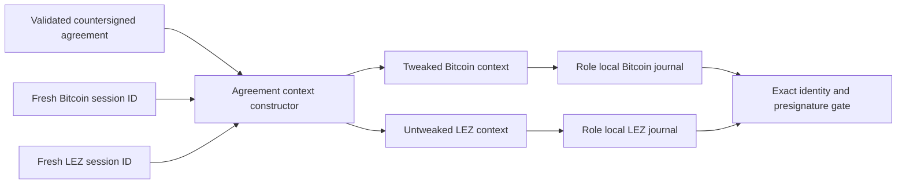

# ADR 0032: Derive adaptor contexts from the countersigned agreement

Status: Accepted for the M3 agreement-to-session SDK boundary. Public actor
claim integration and actual-node evidence remain pending.

## Context

The M3 signing ceremony already stores each role's completed presignature in a
role-local `SqliteAdaptorSessionJournal`. The public actor must reopen those
transcripts for claim recovery, but accepting the role-runner's session JSON as
a second authority would let role order, keys, messages, the adaptor point, or
the Bitcoin Taproot tweak drift from the countersigned `BtcAgreementV1`.

Fresh session IDs are intentionally not agreement terms: they are generated
for each signing ceremony before any chain effect. Everything that determines
what is signed is already present in the validated agreement.

## Decision

`BtcAgreementV1::adaptor_session_context` accepts only a chain domain and a
fresh 32-byte session ID. It reconstructs all other inputs from the validated
agreement:

- fixed maker-then-taker `MuSig2` public-key order;
- the shared adaptor point;
- the exact BIP-341 cooperative-claim sighash plus P2TR Merkle-root tweak for
  the Bitcoin domain; or
- the exact official witnessed-claim message hash with no tweak for the LEZ
  domain.

The actor will retain two distinct nonzero session IDs and role-local journal
paths in its private configuration. It will derive both contexts again on every
fresh process, construct the expected journal identity, and fail closed unless
the durable identity and verified presignature match. Role-runner session JSON
and public packet files are not actor authority.

## Consequences

- The actor gains no parser or trust path for the role-runner session format.
- A journal copied from another role, agreement, chain message, Taproot tweak,
  or session fails the existing durable context-binding comparison.
- The constructor creates no nonce, performs no signing, accesses no chain,
  and stores no scalar.
- Session-ID freshness and distinctness remain actor-configuration checks; the
  SDK constructor is also useful to deterministic callers that supply their own
  transcript identity.
- Existing-only journal opening, public prepared witnessed-LEZ validation, and
  the durable public-effect journal are now GREEN component seams under ADR
  0033. ADR 0034 now composes their exact identities and independently verified
  presignatures into actor activation. Revalidation immediately before use,
  exact chain observation, and revisions three and four remain to be certified.
