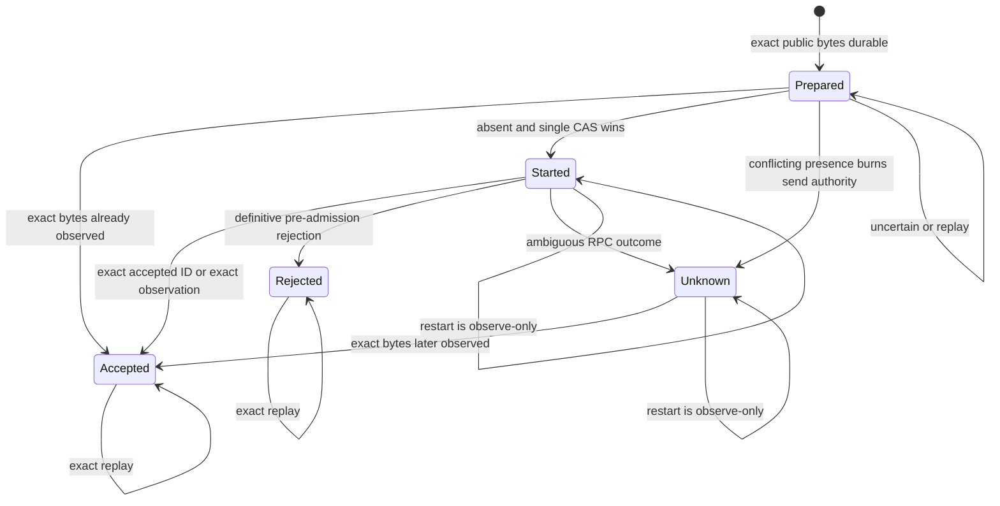
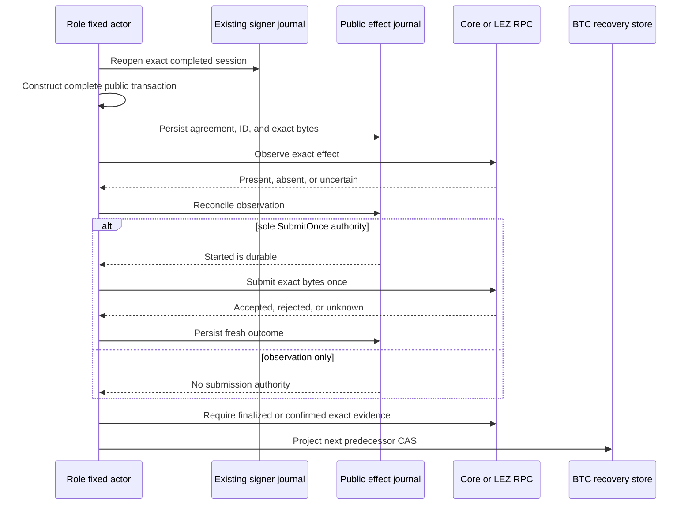

# ADR 0033: Persist exact public effects before one-attempt submission

Status: Accepted for the M3 public-effect persistence boundary. Reference-actor
Bitcoin and LEZ claim integration is GREEN in source, deterministic adapter
tests, and both actual-node happy directions in `m3actor-20260716n`. The live
replay pass added zero submissions. Forced process-kill crash evidence remains
production-hardening work.

## Context

Bitcoin Core, the LEZ sequencer, and SQLite cannot participate in one atomic
commit. A process can stop after a node accepts a transaction but before the
local lifecycle advances. Retrying blindly can duplicate a LEZ admission or
reuse a signing-side effect; treating a transport timeout as rejection can
release a second send authority. Bitcoin transaction IDs also omit witness
bytes, so a txid alone is not an exact claim replay commitment.

The adaptor scalar, nonces, shares, keys, seeds, and any unrevealed Zcash
preimage are secret material. They do not belong in this plaintext journal.
The journal receives only a transaction that is already complete and public.

## Decision

`SqlitePublicEffectJournal` is an additive owner-private SQLite boundary keyed
by swap, local role, chain, operation, and aggregate predecessor. Before any
RPC submission it records:

- the nonzero countersigned-agreement commitment;
- the chain-native expected effect identifier;
- the complete exact Bitcoin or LEZ transaction bytes; and
- a SHA-256 commitment to those bytes.

The same chain-native identifier cannot be attached to another authority key.
Bitcoin bytes include the witness serialization. A caller first observes the
chain, then reconciles that result with the durable row. Only a successful
`Prepared` to `Started` compare-and-swap returns `SubmitOnce`. `Started` and
`Unknown` are never re-armed. A definitive exact-byte observation can advance
`Prepared`, `Started`, or `Unknown` to `Accepted`; an uncertain observation is
always observe-only. A fresh accepted RPC result must return the exact expected
identifier.

The signer journal gains an existing-only opener: a miss cannot create an empty
signer database. The LEZ bridge client exposes the same pure prepared witnessed-
claim validator already used internally, so an actor can validate exact public
message bytes and their official domain-separated hash without copying a
private protocol constant.

## Atomicity and crash boundaries

There is deliberately no cross-system atomicity claim. The safety property is
that the exact public effect and the consumed single-attempt authority survive
every local crash boundary. After ambiguity, recovery observes; it does not
send again. Lifecycle projection occurs only after canonical chain evidence.
The actual-node controller also bounds read-only observation retries and gives
each LEZ bridge request a finite 30-second timeout. A timeout or moving tip may
cause a fresh observation process, never a second submission authority.

## Consequences

- Fourteen focused tests cover immutable replay, concurrent single-winner CAS,
  rollback, exact accepted identifiers, effect-ID isolation, conflicting
  presence, corruption, and ambiguous recovery. The complete swap-store suite
  is 86/86.
- Public material is restartable without persisting the adaptor scalar. Secret-
  bearing Zcash claims remain in the protected claim journal.
- “Public” means node-disclosable bytes, not a public endpoint. The component
  tests use temporary SQLite only: no RPC, Docker, faucet, peer, or network.
- Zcash is excluded by the typed chain enum, but arbitrary bytes are not secret-
  scanned; callers still must keep secret-bearing material out of this journal.
- The boundary is stricter than node-level transaction idempotence and may
  require operator investigation when a node cannot prove exact absence after
  an ambiguous call.
- Run `m3actor-20260716n` composes this boundary through claim revisions three
  and four in both actual local directions. Each direction retained exactly two
  Bitcoin and three LEZ effects before and after replay; all four role stores
  were revision 4 `Completed`.
- This evidence proves happy-path one-attempt behavior and restart replay. It
  does not prove every process-kill timing, node outage, reorg, refund,
  concurrency, or malicious database-owner case.
