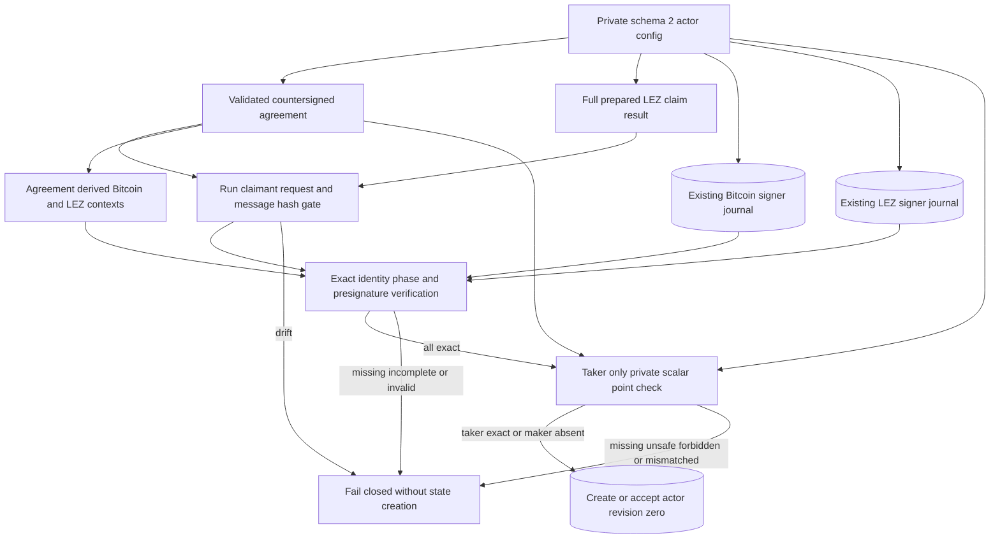

# ADR 0034: Gate actor activation on complete signing material

Status: Accepted and GREEN through claim revisions three and four in both
actual-node happy directions. Refund authority, process-kill, and production key
custody hardening remain active.

## Context

The first public actor config schema could activate an agreement and observe
both locks without naming the two completed adaptor sessions or the exact
prepared LEZ claim. Adding optional fields to that strict schema would allow the
same bypass, while adding required fields without a version change would
silently redefine a documented `deny_unknown_fields` format.

The role-runner session JSON and packet files are ceremony transport. Treating
them as actor authority would duplicate agreement parsing and permit the signed
keys, role order, messages, adaptor point, or Bitcoin Taproot tweak to drift.

## Decision

Private `ActorConfig` schema 2 requires:

- distinct nonzero Bitcoin and LEZ session IDs;
- distinct normalized role-local journal paths; and
- `prepared_witnessed_claim_result_file`, the complete persisted
  `PrepareWitnessedClaimResult` path;
- for the taker only, `adaptor_secret_file`, a mode-0600, single-link regular
  file containing the exact lowercase 32-byte hex scalar. Maker configs must
  omit it.

Output schema remains version 1. Schema-1 private configs fail explicitly.
`activate` loads and validates the countersigned agreement, then performs the
following gate before it may create or accept revision zero:

1. stable-read and strict-decode the full prepared-result envelope;
2. bind its run ID, LEZ claimant role, and echoed preparation request ID;
3. validate its nonempty exact official message bytes and domain-separated hash;
4. require that hash to equal the claim-message hash in the signed agreement;
5. derive the Bitcoin and LEZ adaptor contexts from the agreement and configured
   session IDs;
6. open both signer databases existing-only, require the exact local-role
   identity and `PresignatureVerified` phase;
7. independently verify each retained aggregate presignature under its derived
   context; and
8. for the taker only, stable-read and point-check the private scalar against
   the agreement without creating a final signature.

`status` still parses only the config and existing recovery state. It neither
opens signer journals nor constructs an RPC client. The same material gate must
run again immediately before later claim use, because activation cannot prevent
an owner from replacing files afterward.

## Consequences

- Actor tests are 24/24: 17 library tests and seven fresh-process tests.
- Valid fixtures create real completed MuSig2 journals; the activation gate does
  not trust arbitrary phase labels or fabricated presignature bytes.
- Missing material, cross-domain journals, changed run/claimant/request
  identity, an invalid internal message hash, and an internally valid prepared
  message not signed by the agreement all fail before actor state creation.
  Missing, world-readable, symlinked, or point-mismatched taker secrets also
  fail before state creation; maker configs cannot carry or explicitly null
  that authority. Fresh-process assertions find neither raw nor hex-encoded
  scalar bytes in stdout, SQLite, or surviving WAL/SHM artifacts.
- The operator must prepare the exact LEZ claim and finish both signing
  ceremonies before activation and before the first chain effect.
- This closes pre-lock authority binding only. It does not yet submit a claim,
  expose a scalar, advance revision three or four, or prove actual-node actor
  execution.
