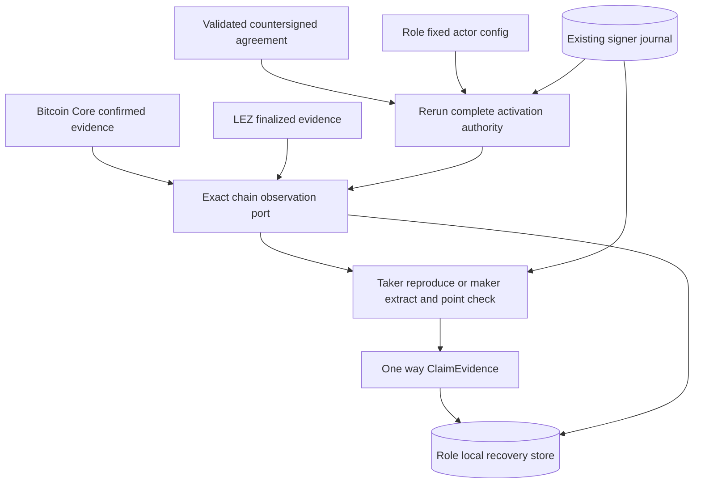

# ADR 0035: Project claims only from canonical public evidence

Status: Accepted for the M3 reference-actor claim-projection boundary. Live
claim submission, production chain adapters, and actual-node actor evidence
remain pending.

## Context

After both funding legs are durable at revision two, a revealing claim makes
the adaptor scalar public on the maker-funded chain. The opposite claim can
then spend the taker-funded chain. A node admission response, a transaction ID,
or a locally constructed signature is not canonical chain evidence. Projecting
from any of those would let local lifecycle state get ahead of consensus.

The two roles also learn the revealing scalar differently. The taker already
has the private scalar and must prove that it reproduces the exact observed
signature. The maker may learn it only by extracting it from that signature and
the retained presignature. Persisting the scalar itself would turn ordinary
recovery state into a secret store.

## Decision

The reference actor selects a claim transition only from its durable
predecessor revision:

- revision 2 to 3 observes the revealing claim on the maker-funded chain and
  advances to `ClaimEvidenceAvailable`;
- revision 3 to 4 observes the follow-up claim on the taker-funded chain and
  advances to `Completed`.

The agreement coordinator derives both chains. Bitcoin evidence must meet the
agreement's signed confirmation policy. LEZ evidence must be the exact
finalized observation. Pending evidence preserves the predecessor and grants no
projection authority.

Immediately before either claim observation, the actor reruns the complete
activation-authority gate from ADR 0034. For revision three, the observation
must include the exact public 64-byte revealing signature. The actor reopens
the agreement-derived signer session and then:

- as taker, rereads the protected scalar, adapts the retained presignature, and
  requires byte equality with the observed signature;
- as maker, extracts the scalar from the retained presignature and observed
  signature through the SDK's relation and adaptor-point checks.

Only `ClaimEvidence`, the one-way scalar commitment, enters lifecycle evidence.
Neither role persists the recovered or reread scalar in the recovery store.
The follow-up observation carries no second revealing signature and reuses the
already durable revision-three claim evidence.



Projection uses the recovery store's expected-predecessor compare-and-swap.
Only a winner at the exact target revision and phase is accepted as concurrent
convergence. Any other conflict fails closed.

```mermaid
sequenceDiagram
    participant Actor as Role fixed actor
    participant Authority as Agreement and signer authority
    participant Chain as Bitcoin Core or LEZ observer
    participant Store as Role local recovery store

    Actor->>Store: Read durable predecessor
    Store-->>Actor: Revision 2 or revision 3
    Actor->>Authority: Rerun complete activation gate
    Authority-->>Actor: Exact role and session authority
    Actor->>Chain: Observe agreement-derived claim
    alt Evidence pending or uncertain
        Chain-->>Actor: No canonical exact claim
        Actor-->>Actor: Return with predecessor unchanged
    else Revealing claim at revision 2
        Chain-->>Actor: Confirmed or finalized exact evidence and signature
        Actor->>Authority: Reproduce or extract and point check scalar
        Authority-->>Actor: One way ClaimEvidence only
        Actor->>Store: CAS revision 2 to revision 3
    else Follow-up claim at revision 3
        Chain-->>Actor: Confirmed or finalized exact evidence
        Actor->>Store: CAS revision 3 to revision 4
    end
```

## Atomicity boundary

This decision does not claim an atomic transaction across Bitcoin, LEZ, two
role-local stores, or RPC submission and lifecycle projection. Each actor
projects only its own store after independently observing canonical public
evidence. A crash before projection leaves the predecessor replayable; a crash
after projection replays the committed revision. The separate public-effect
journal in ADR 0033 owns one-attempt submission authority and exact public
bytes. This boundary neither weakens nor replaces that journal.

## Consequences

- Deterministic actor tests cover both roles and both swap directions through
  revisions three and four.
- An unrelated revealing signature, the wrong chain, insufficient Bitcoin
  confirmations, non-finalized LEZ evidence, or an unexpected signature on the
  follow-up leg fails before projection.
- Offline status can now name `ObserveRevealingClaim`,
  `ObserveFollowupClaim`, and `Complete` from durable revisions two, three, and
  four.
- The projection seam is read-only with respect to chains. Composing exact
  transaction construction, ADR 0033 submission/reconciliation, and concrete
  Bitcoin and LEZ observation adapters remains required for the reproducible
  actual-node M3 actor PoC.
