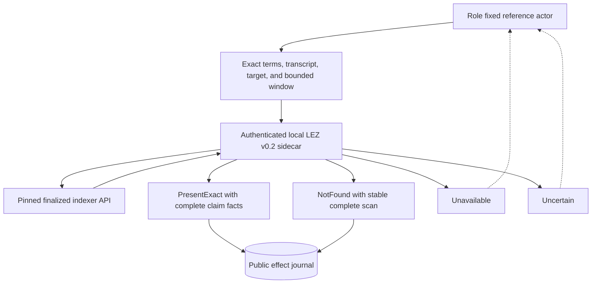

# ADR 0036: Prove bounded LEZ claim absence before the first send

Status: Accepted for the M3 finalized witnessed-claim presence boundary.
Actor public-effect composition and actual-node actor evidence remain pending.

## Context

The actor must reconcile a durable public LEZ claim with chain truth before it
may consume its one permitted send. A missing transaction in a partial indexer
history, an immature requested window, a moving finalized tip, or an ambiguous
transport outcome is not proof that the claim is absent. Treating any of those
states as absence could duplicate an effect after restart.

The existing finalized claim observer returned only affirmative found facts.
That is sufficient for lifecycle projection but cannot safely distinguish the
one initial submission case from temporary unavailability.

## Decision

The LEZ bridge exposes an additive strict
`classify_finalized_witnessed_claim` method. Its actor-facing result has four
classes:

- `PresentExact` carries the complete validated canonical claim facts;
- `NotFound` carries the exact completely scanned window and stable finalized
  tip;
- `Unavailable` identifies missing node finality/history or a moving tip; and
- `Uncertain` identifies timeout or transport ambiguity.

Only `NotFound` satisfies the chain-absence precondition for an initial send.
It does not itself authorize submission. The caller must also win the separate
`Prepared` to `Started` public-effect compare-and-swap from ADR 0033.

`NotFound` is returned only after every block in the caller-owned bounded
window is available as finalized by numeric ID and hash, the blocks form the
expected ancestry, the exact matching claim is absent from the complete scan,
and a second finalized-tip read is identical. The response echoes the exact
window. The proof is bounded, never global.



Presence maps to `PresentExact` reconciliation. Stable complete absence maps
to `Absent` reconciliation. Unavailable and uncertain states map to
`Uncertain` reconciliation and can never consume send authority. A later
poll may use a fresh request identity and a deliberately selected later
window; durable `Started` or `Unknown` state still cannot rearm.

```mermaid
sequenceDiagram
    participant Actor as Role fixed actor
    participant Journal as Public effect journal
    participant Sidecar as LEZ sidecar
    participant Indexer as Finalized indexer

    Actor->>Journal: Persist exact public bytes and expected ID
    Actor->>Sidecar: Classify exact claim in bounded window
    Sidecar->>Indexer: Read stable finalized tip and complete ID/hash ancestry
    Indexer-->>Sidecar: Blocks, transactions, and historical account facts
    Sidecar->>Indexer: Reread finalized tip
    alt Exact claim present
        Sidecar-->>Actor: PresentExact
        Actor->>Journal: Reconcile exact public bytes
    else Complete stable scan has no claim
        Sidecar-->>Actor: NotFound
        Actor->>Journal: CAS Prepared to Started
    else History, finality, or tip unavailable
        Sidecar-->>Actor: Unavailable
        Actor->>Journal: Observe only
    else Timeout or transport ambiguity
        Sidecar-->>Actor: Uncertain
        Actor->>Journal: Observe only
    end
```

## Trust and atomicity boundary

The scan trusts the capability-authenticated pinned sidecar and the pinned
official indexer's finalized, by-ID, by-hash, and historical-account
semantics. Logos v0.2 does not provide a cryptographic account proof or an
atomic multi-read snapshot token; stable finalized-tip bracketing is the local
PoC compensation and remains an upstream production-readiness exception.

This decision does not make the indexer read, SQLite CAS, RPC send, and later
lifecycle projection atomic. Exact public bytes become durable first. Only one
caller can consume send authority. A crash or ambiguous result after that
point leaves observation-only recovery.

## Consequences

- Protocol, client, adapter, and pinned-sidecar tests distinguish exact
  presence, definitive bounded absence, immature/partial history, moving tips,
  timeouts, and transport failures.
- The legacy affirmative finalized observer remains externally compatible; a
  definitive absence maps back to its legacy unavailable result.
- The actor can safely compose LEZ submission without treating upstream
  flakiness as absence or retry authority.
- Public-effect actor wiring, final claim projection, and actual-node restart
  evidence remain required before M3 local-PoC certification.
