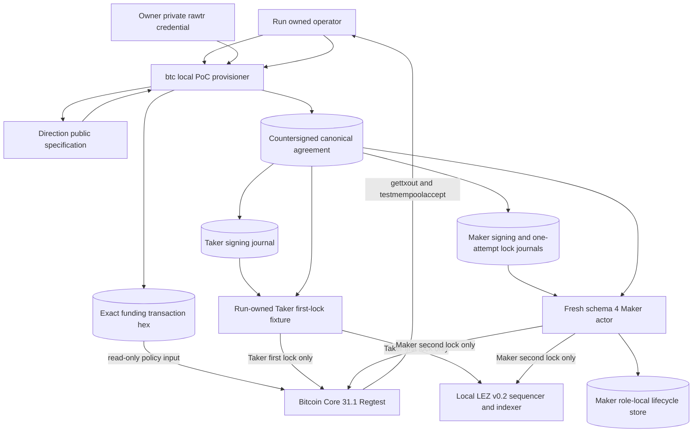
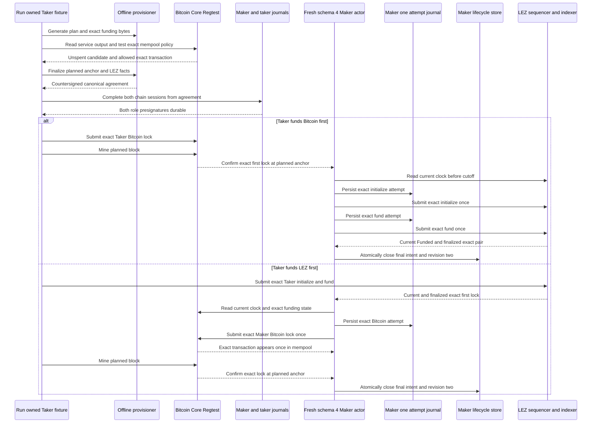

# ADR 0037: Finalize exact Bitcoin funding before the first effect

Status: Accepted and GREEN in the run-owned schema-4 actor harness and retained
two-direction actual-node evidence. Run `m3schema4-20260717d` at clean
pushed commit `0e7635fc7e50cc6e0612745dcdaf6df8bbcf6f9a` proves that
the external fixture submits only the Taker's exact first lock and the
direction-correct Maker actor submits the exact second lock under one-attempt
authority. Production fee/replacement policy and reorg hardening remain active.

## Context

The earlier stage-two recipe learned the Bitcoin funding transaction ID,
confirmed output, and mined height before it created the countersigned
agreement. That inverted the atomic-swap ceremony: the first public effect
could exist before the agreement and before both Bitcoin and LEZ claim
presignatures were durable.

The retained Core service exposes a deterministic mature `rawtr` output and its
fixture key through an owner-private credential file. Actor RPC credentials
cannot use wallet or mining methods. The agreement SDK also signs an absolute
Bitcoin recovery anchor and requires
`bitcoin_refund_height = bitcoin_funding_anchor_height + refund_csv_blocks`.
Before broadcast, the actual mined height is unknowable; on isolated Regtest,
the operator can instead reserve the next height as a signed plan and then
mine exactly one block after sending the exact prepared transaction.

## Decision

For each direction, the local PoC ceremony is:

1. `generate` creates fresh participant agreement/signing material and the
   direction-specific P2TR contract before any funding effect.
2. `prepare-funding` consumes an actual Core service-output candidate and a
   separate mode-`0600` raw 32-byte `rawtr` key file. It constructs and signs
   one exact version-two, locktime-zero, RBF transaction offline, with the
   contract at output zero and rawtr change at output one.
3. Core `gettxout` and `testmempoolaccept` read the actual isolated node without
   submitting. The policy request contains the exact persisted transaction
   bytes.
4. `finalize` independently verifies the canonical transaction encoding,
   SHA-256, txid, exact contract output, rawtr prevout value/script, one-item
   `SIGHASH_DEFAULT` witness, and BIP-341 Schnorr authorization. It then binds
   the planned next-block anchor, LEZ facts, and recovery schedule and emits the
   canonical countersigned agreement.
5. Both roles complete and persist the Bitcoin and LEZ presignatures derived
   from that exact agreement. Actor activation revalidates them.
6. Only then may the run-owned Taker fixture submit the direction-correct exact
   first lock. It has no authority to submit the Maker second lock.
7. A fresh schema-4 Maker actor must revalidate the canonical first lock and
   current signed cutoff, durably reserve at most one exact second-lock attempt,
   submit through its role-local adapter, and reconcile canonical evidence.
   The runner may confirm or mine an actor-submitted effect but may not create
   it.
8. When a Bitcoin funding effect is due, its authorized submitter sends the
   persisted exact bytes. The separate provisioner mines exactly one block and
   requires the containing height to equal the signed planned anchor before the
   lifecycle continues.

`testmempoolaccept` is deliberately before agreement finalization. It is
read-only policy evidence, not a reservation, broadcast, confirmation, or
finality claim. Isolation prevents unrelated writers in the local PoC; a
production deployment needs stronger UTXO reservation and fee/replacement
policy.

The provisioner emits `contract_merkle_root` in the funding summary so the
operator can construct the Bitcoin Taproot signer context without introducing
a second derived value. The agreement validator reconstructs the same contract
from participant keys and CSV terms.

## Proof boundary

The offline provisioner cryptographically proves:

- the service key derives the supplied canonical rawtr script;
- the one-input funding witness authorizes the exact transaction for the
  supplied prevout amount and script;
- the raw bytes, SHA-256, txid, contract vout/value/script, fee, change, and
  Merkle root are mutually consistent;
- the stage-one private files reconstruct the public specification; and
- both participant signatures authorize one canonical agreement whose claim
  transaction and recovery plan revalidate.

It does not prove that the service outpoint exists, is unspent, is mature, or
is accepted by current Core policy. It also does not prove broadcast, mempool
presence, a mined block, confirmation depth, or the actual anchor. Its summaries
therefore report `node_state_asserted: false` or
`bitcoin_node_state: "not_asserted"`.

Core supplies those distinct proofs. `gettxout` establishes the local node's
current UTXO view. `testmempoolaccept` establishes read-only current policy for
the exact bytes. After the send, exact transaction and block reads establish
the mined anchor and later confirmation depth. None of those reads is a
cryptographic cross-chain proof or a distributed transaction.

## Atomicity argument

This ordering maximizes cross-chain atomicity because no public effect occurs
until both claims and recovery paths are fixed by one countersigned agreement
and both roles retain both presignatures. After the first lock, the successful
opposite claim needs only persisted local material plus canonical public reveal
evidence; it does not need a new peer message.

There is still no distributed atomic commit across the filesystem, two signer
journals, two actor stores, Core RPC/consensus, and LEZ submission/finality.
Each boundary uses durable exact bytes, one-attempt authority, canonical
observation, and fail-closed recovery instead. A crash or ambiguous response is
reconciled by observation, never by blind replacement.

The Maker actor's final journal close and revision-two lifecycle CAS do share
one local SQLite transaction. That prevents local state from exposing a closed
Maker intent without its matching `BothLegsLocked` projection, or the
reverse. It does not include the preceding Core or LEZ send. Run
`m3schema4-20260717d` demonstrates the intended compensation: one
conceptual Maker lock per direction, realized as one Bitcoin transaction or the
ordered LEZ initialize/fund pair, zero restart resubmissions, exact canonical
reconciliation, and unchanged effect counts after terminal replay.

If Bitcoin mines at any height other than the planned anchor, the run cannot
claim this agreement's recovery schedule. Do not re-sign or patch terms after
the effect. Preserve all evidence, stop the swap lifecycle, and recover the
actual P2TR output through its relative CSV path when valid. The mismatch
invalidates PoC certification even though the on-chain refund script remains
consensus-valid.

## Output recovery

The stage-one private set, funding transaction plus summary, and agreement plus
summary are create-new owner-private outputs, but each multi-file operation is
not one filesystem transaction. Before any broadcast, an interruption or
partial output means retiring the entire direction root and restarting from
fresh stage one. Do not delete selected survivors and retry in place.

After any possible broadcast, never discard or regenerate that root. Preserve
the exact bytes, agreement, journals, and node evidence and enter observation
and refund recovery. Creating a new agreement for already-locked funds would
break the pre-lock authority invariant.

## Consequences

- Eleven provisioner tests cover both directions, genuine rawtr signing,
  generate-to-prepare-to-finalize integration, malformed or trailing bytes,
  hash/txid/vout/value/script/prevout drift, invalid or missing signatures,
  unsafe/cross-wired keys, no-clobber behavior, and secret-free stdout.
- Strict JSON rejects broadcast, observed-confirmation, observed-anchor, and
  separately asserted funding-script fields at this pre-lock boundary.
- The run-owned harness must retain the exact `testmempoolaccept` response,
  prove both role journals complete before the first effect, and prove the
  actual Bitcoin containing height equals the signed planned anchor in both
  directions.
- The retained schema-4 packet proves that the fixture owns only each Taker
  first lock, the Maker actor owns each second lock, the Bitcoin second lock
  appears exactly once in the mempool, and the ordered LEZ second-lock effects
  progress exactly from zero to one to two without restart rearm.
- Public networks, concurrent writers, replacements, reorgs, production key
  custody, and production refund operation remain later hardening. Private-local
  actual-node refund flows are retained under later M3 ADRs.
