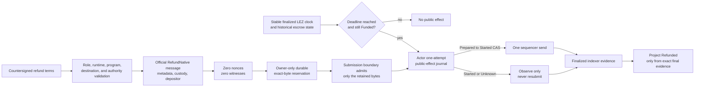

# ADR 0038: Durably prepare the permissionless LEZ refund before actor eligibility

Status: Accepted at the planner boundary; finalized observation, server registration, actor recovery, and actual-node evidence remain active -- 2026-07-16

## Context

The pinned LEZ v0.2 guest already implements `RefundNative` as a permissionless
instruction. It accepts exactly metadata, custody, and the immutable depositor
account; it consumes no signer nonce or witness. Once the guest clock reaches
`refund_at`, it transfers the complete custody balance only to that depositor,
zeros custody, and makes metadata terminal `Refunded`. Permissionless execution
therefore removes a liveness dependency without allowing the caller to choose a
beneficiary.

The generated upstream client constructs and submits immediately. That API does
not provide the repository's required prepare-before-effect durability,
request-id replay, exact-byte ownership, one-attempt ambiguity recovery, or
finalized evidence. Reusing the signed-transaction decoder would also be wrong:
it deliberately rejects empty witnesses, while an official refund must be
unsigned.

## Decision

The v0.2 sidecar planner constructs one canonical official public transaction
from the complete bridge request. The message contains the configured escrow
program, derived metadata and custody PDAs, the immutable depositor, no nonces,
and `RefundNative { swap_id }`. The planner supports both the legacy strict
hashlock terms and the strict M3 aggregate-witness terms. Witnessed requests
recompute the aggregate account from the supplied public key even though the
permissionless instruction does not consume that authority.

Before returning any bytes, a durable planner atomically creates one owner-only
`native-refund-reservation.v1.json`. Identical requests replay the exact bytes
after restart without consulting an account-nonce RPC. A distinct request, a
changed transaction ID, noncanonical encoding, account or instruction change,
injected nonce or witness, signer substitution, program substitution, or
aggregate-authority substitution fails closed. The generic submission boundary
accepts only the exact active reservation and uses a dedicated unsigned decoder.

Preparation is not deadline evidence and grants no send authority. The actor
must first obtain stable finalized chain facts proving the escrow remains
`Funded` and the containing-chain clock is at or beyond the signed deadline.
Only then may its public-effect journal consume one `Prepared` to `Started` CAS.
After any possible call, `Started` and `Unknown` are permanently observation-only.
Projection to the lifecycle store requires later exact finalized `Refunded`
evidence with zero custody and the immutable depositor effect.

## Atomicity and failure analysis

There is no distributed transaction spanning Bitcoin, LEZ, and SQLite. Atomicity
is instead preserved to the extent available by the signed cross-chain deadline
order, immutable refund destinations, durable exact bytes before any send,
one-attempt public-effect authority, and observe-before-project recovery.

- A crash before durable reservation exposes no transaction.
- A crash after reservation but before send replays only the same exact bytes.
- A crash or timeout after `Started` cannot rearm submission authority.
- An early preparation cannot be submitted by the actor until finalized deadline
  eligibility is proven.
- A public transaction response cannot project state without matching finalized
  chain evidence.

This decision does not yet claim server reachability, finalized refund
observation, deadline enforcement, actor integration, or actual-node refund
execution. Those are the next M3 gates.

## Evidence

`compat/lez-v0_2-sidecar/tests/native_refund_prepare.rs` covers the exact
official ABI, zero nonce/witness behavior, strict hashlock compatibility,
witnessed authority binding, transaction and identity mutations, byte-identical
restart recovery, distinct-request exclusion, owned-submission admission, and
zero nonce-source calls. The focused tests and the complete v0.2 sidecar suite
run without an RPC, faucet, chain node, or network dependency.
