# ADR 0038: Durably prepare the permissionless LEZ refund before actor eligibility

Status: Accepted through authenticated prepare/restart replay, finalized witnessed observation, and the durable actor lifecycle refund branch; one-attempt execution and actual-node evidence remain active -- 2026-07-16

```mermaid
flowchart LR
    Terms["Countersigned refund terms"] --> Validate["Role, runtime, program,<br/>destination, and authority validation"]
    Validate --> Build["Official RefundNative message<br/>metadata, custody, depositor"]
    Build --> Unsigned["Zero nonces<br/>zero witnesses"]
    Unsigned --> Reserve["Owner-only durable<br/>exact-byte reservation"]
    Reserve --> BridgeCache["Authenticated role/run bridge<br/>durable request/result replay"]
    BridgeCache --> Admit["Submission boundary admits<br/>only the retained bytes"]
    FinalizedClock["Stable finalized LEZ clock<br/>and historical escrow state"] --> Eligible{"Deadline reached<br/>and still Funded?"}
    Eligible -->|"no"| NoEffect["No public effect"]
    Eligible -->|"yes"| Journal["Actor one-attempt<br/>public-effect journal"]
    Admit --> Journal
    Journal -->|"Prepared to Started CAS"| Sequencer["One sequencer send"]
    Journal -->|"Started or Unknown"| ObserveOnly["Observe only<br/>never resubmit"]
    Sequencer --> Indexer["Finalized indexer evidence"]
    ObserveOnly --> Indexer
    Indexer --> ObserveRpc["Authenticated repeatable observe<br/>no submit and no cached chain truth"]
    ObserveRpc --> Project["Project one finalized refund<br/>only from exact final evidence"]
    Project --> Lifecycle["Actor-local evidence replay<br/>maker refund revision 3"]
    Lifecycle --> Later["Only after durable projection<br/>drive the later taker refund"]
    Later --> Terminal["Taker refund revision 4<br/>terminal Refunded"]
```

## Context

The pinned LEZ v0.2 guest already implements `RefundNative` as a permissionless
instruction. It accepts exactly metadata, custody, and the immutable depositor
account; it consumes no signer nonce or witness. Once the guest clock reaches
`refund_at`, it transfers the complete custody balance only to that depositor,
zeros custody, and makes metadata terminal `Refunded`. Permissionless execution
therefore removes a liveness dependency without allowing the caller to choose a
beneficiary.

The generated upstream client constructs and submits immediately. That API does
not provide the repository's required prepare-before-effect durability,
request-id replay, exact-byte ownership, one-attempt ambiguity recovery, or
finalized evidence. Reusing the signed-transaction decoder would also be wrong:
it deliberately rejects empty witnesses, while an official refund must be
unsigned.

## Decision

The v0.2 sidecar planner constructs one canonical official public transaction
from the complete bridge request. The message contains the configured escrow
program, derived metadata and custody PDAs, the immutable depositor, no nonces,
and `RefundNative { swap_id }`. The planner supports both the legacy strict
hashlock terms and the strict M3 aggregate-witness terms. Witnessed requests
recompute the aggregate account from the supplied public key even though the
permissionless instruction does not consume that authority.

Before returning any bytes, a durable planner atomically creates one owner-only
`native-refund-reservation.v1.json`. Identical requests replay the exact bytes
after restart without consulting an account-nonce RPC. A distinct request, a
changed transaction ID, noncanonical encoding, account or instruction change,
injected nonce or witness, signer substitution, program substitution, or
aggregate-authority substitution fails closed. The generic submission boundary
accepts only the exact active reservation and uses a dedicated unsigned decoder.

The capability-authenticated, run/role/runtime-bound loopback bridge now exposes
that preparation. It durably records the canonical request and successful
result, restores the planner and compares the reconstructed result before
binding a restarted server, and replays an identical request ID without calling
the nonce source. Observations remain repeatable and are not cached as chain
truth. The finalized
witnessed observer now implements the state-only, exact-owned, and
discover-by-terms modes behind that same authenticated boundary.

Preparation is not deadline evidence and grants no send authority. State-only
observation now brackets canonical Funded or Refunded accounts with equal stable
finalized clocks before and after all reads. The actor must require Funded state
and a finalized clock at or beyond the signed deadline before asking its journal
for send authority.
Only then may its public-effect journal consume one `Prepared` to `Started` CAS.
After any possible call, `Started` and `Unknown` are permanently observation-only.
Projection to the lifecycle store requires later exact finalized `Refunded`
evidence with zero custody and the immutable depositor effect. Exact observation
is bound to the actor-owned durable bytes; claimant discovery is bound to the
signed witnessed terms. Both scan a fully covered bounded window through the
stable finalized tip, require equal block results by ID and hash plus intact
ancestry, accept only the canonical unsigned RefundNative account/instruction
shape, enforce the containing-block timestamp at or after `refund_at`, and check
historical and tip terminal accounts. Complete discovery misses may be Absent;
exact misses remain UnknownOrPending. Missing or partial account state fails
unavailable rather than becoming absence.

The existing compatible response wire exposes the stable finalized tip clock and
the refund transaction position, but it has no separate containing-block
finality/timestamp object. The observer enforces that fact internally. A future
additive finalized-refund result would be required if downstream consumers must
independently reverify the containing timestamp from the response alone.

The actor-local Bitcoin recovery store now admits an alternative exact four-record branch after the two locks: maker-funded refund evidence occupies revision three and taker-funded refund evidence occupies revision four. Each record carries a typed chain position, canonical transaction proof, and bounded adapter evidence. Replay calls the shared coordinator deadline checks and reaches `MakerLegRefunded` before terminal `Refunded`. Existing happy-path JSON omits the optional refund position, and the SQLite constraint migration copies those exact payload strings unchanged in one immediate transaction.

## Atomicity and failure analysis

There is no distributed transaction spanning Bitcoin, LEZ, and SQLite. Atomicity
is instead preserved to the extent available by the signed cross-chain deadline
order, immutable refund destinations, durable exact bytes before any send,
one-attempt public-effect authority, and observe-before-project recovery.

- A crash before durable reservation exposes no transaction.
- A crash after reservation but before send replays only the same exact bytes.
- A crash or timeout after `Started` cannot rearm submission authority.
- An early preparation cannot be submitted by the actor until finalized deadline
  eligibility is proven.
- A public transaction response cannot project state without matching finalized
  chain evidence.
- The later taker-funded refund cannot enter durable revision four until the
  earlier maker-funded refund is already exact durable revision three.

This decision now claims authenticated prepare reachability, exact restart replay, finalized witnessed state/exact/discovery observation with internal deadline enforcement, and ordered durable lifecycle replay to `Refunded`. It does not yet claim actor one-attempt integration or actual-node
refund execution. Those are the next M3 gates.

## Evidence

`compat/lez-v0_2-sidecar/tests/native_refund_prepare.rs` covers the exact
official ABI, zero nonce/witness behavior, strict hashlock compatibility,
witnessed authority binding, transaction and identity mutations, byte-identical
restart recovery, distinct-request exclusion, owned-submission admission, and
zero nonce-source calls. `bridge_native_refund.rs` additionally proves one
authenticated loopback preparation and byte-identical replay after both the
server and planner restart. Its sequencer is an ephemeral loopback health stub;
no faucet, chain node, Docker service, or public network dependency is used.
`finalized_native_refund_observation.rs` adds nine cases for stable state-only
clocks at deadline minus one and deadline, exact owned presence, claimant
discovery, complete/incomplete absence, containing-block deadline enforcement,
historical and tip terminal state, zero custody, canonical unsigned bytes, block
identity and ancestry, moving tips, mutation, role and ID pre-read rejection,
ambiguity/conflict, and authenticated repeatable no-submit behavior. It uses an
in-memory finalized-indexer double plus an ephemeral loopback health server; it
does not use a faucet, chain node, Docker service, or public endpoint.
