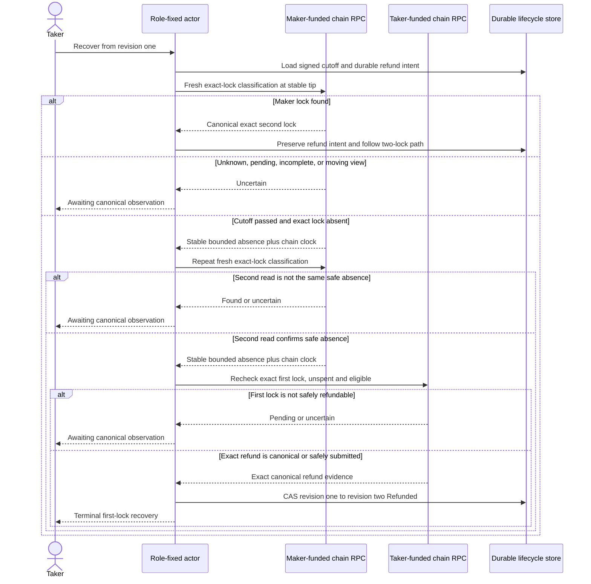
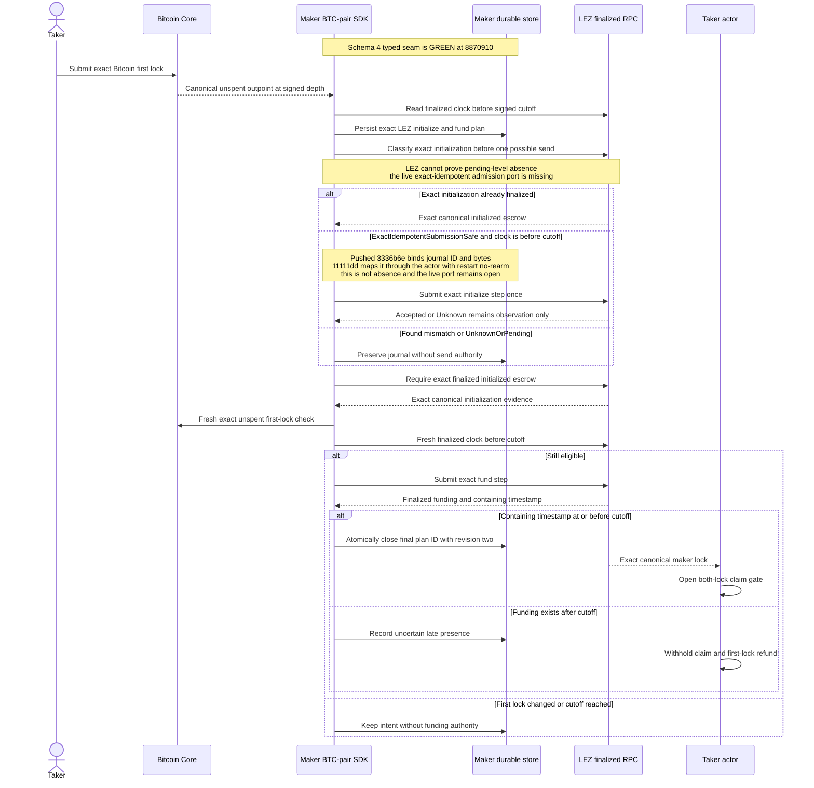
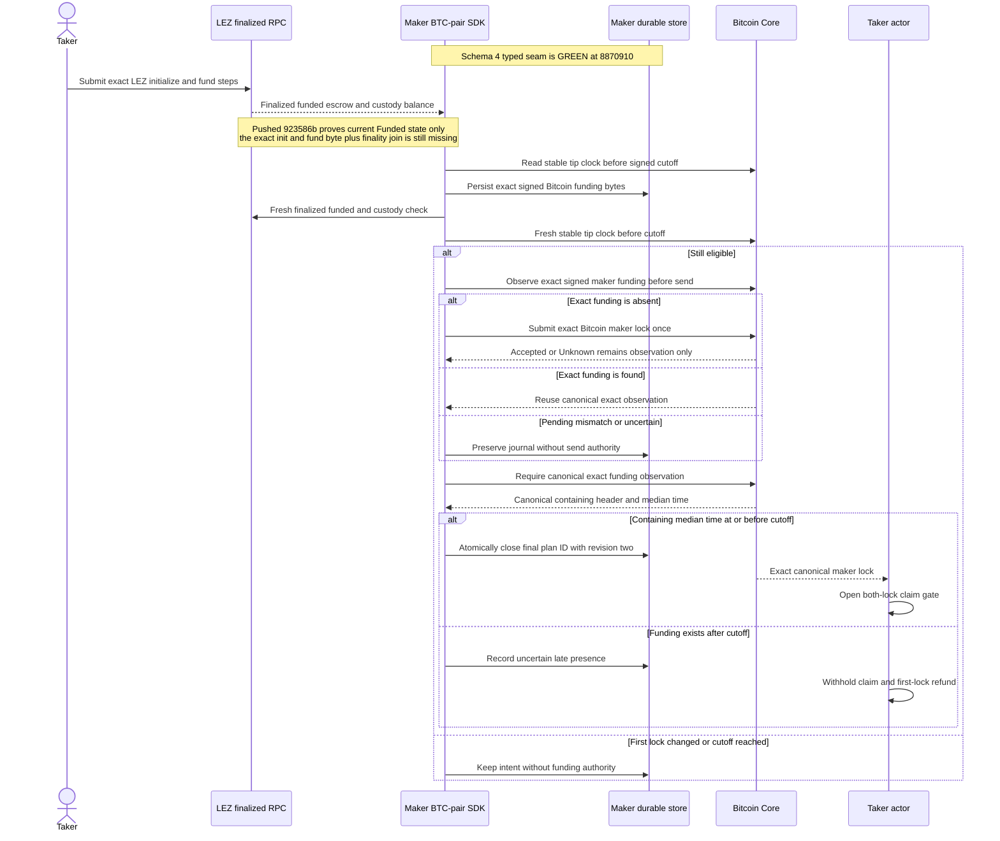

# ADR 0039: Admit first-lock recovery only after a cross-chain cutoff

Status: Accepted for the M3 BTC PoC; refund-side actual-node evidence, canonical
containing-time admission, exact unspent/submission ports, role-fixed lock
plans, durable Maker authority, the strict schema-4 typed actor seam, and
exact-idempotent actor mapping/restart no-rearm are GREEN. Live CLI composition
plus fresh actual-node admission evidence remain
pending; there is no milestone tag for this slice

## Context

The taker always funds first. If the maker disappears before its second lock,
the taker must eventually recover without the maker. A local timeout alone is
unsafe: the taker could decide to refund while a valid maker lock is becoming
canonical on the other chain. The two roles would then disagree about whether
the protocol has one lock or two.

Bitcoin supplies a stable-tip funding observation and the LEZ v0.2 sidecar can
scan a bounded finalized window. Neither observation, alone, is a cross-chain
transaction or a lock on the other actor. LEZ v0.2 also does not expose an
account proof or an atomic multi-account snapshot token. The admission rule
therefore has to be explicit, conservative, and fail closed.

This decision changes the pre-release `BtcRecoveryPlanV1` canonical body by
adding the maker-second-lock cutoff. M3 has not been certified or tagged, so no
released M3 wire is being replaced. Fixtures, manual decoding, agreement
validation, and local provisioning change together. A future post-release wire
change requires a new schema version.

## Decision

Bind `maker_second_lock_cutoff_unix_seconds` into both signatures over the
canonical agreement. Validate that the cutoff is nonzero and no later than the
first recovery boundary after reserving the signed reaction margin.

At lifecycle revision one, normal refund driving has no send authority. The
taker-specific first-lock recovery path must obtain two fresh matching safety
observations. Each observation must prove all of the following:

- the expected maker-funded chain;
- the exact signed cutoff and a canonical chain clock at or beyond it;
- affirmative absence of the exact maker lock, not an RPC error, pending
  transaction, moving tip, incomplete window, or unknown state; and
- an agreement-bound bounded evidence envelope.

After those reads, the refund observer freshly proves that the taker's exact
first lock is canonical, unspent, and eligible at its signed recovery boundary.
Only then may the actor consume the already durable one-attempt refund intent.
Any canonical maker lock wins the admission race and moves the lifecycle toward
the two-lock path. Any uncertainty withholds submission.

For `TakerSellsForeign`, the maker chain is LEZ and the taker chain is Bitcoin.
The finalized LEZ classifier returns `Found` or `Absent` only after a complete
stable bounded scan and carries the finalized block timestamp. The Bitcoin
refund observer then validates the exact taker outpoint, CSV eligibility, and
unspent state.

For `TakerSellsLez`, the maker chain is Bitcoin and the taker chain is LEZ.
Bitcoin `Ready` means the maker lock exists, `Pending` includes mempool presence
and remains uncertain, and only stable-tip `Absent` may pass the first gate. The
LEZ refund observer then revalidates the exact escrow state and signed deadline.

The maker-owned admission flow is direction-specific. Pushed `8870910`
implements the exact plan/journal/actor contract shown below at the typed seam.
The diagrams remain the target live-adapter composition: the CLI deliberately
fails closed until the missing LEZ reads are available, and no actual-node run
has exercised this schema-4 path. Schema 3 remains observation-only
compatibility and never receives send authority.

### Taker sells Bitcoin and maker funds LEZ

This direction is conditionally atomic because LEZ funding is the maker's
value-bearing step. Before that step, only the taker's Bitcoin is locked and it
has its signed CSV refund. A timely finalized LEZ funding transaction creates
the two-lock claim path. A late LEZ funding transaction cannot authorize
revision two, but its presence makes first-lock absence unprovable, so the taker
cannot simultaneously refund Bitcoin and treat the LEZ leg as nonexistent.
Initialization without funding holds no maker asset and grants no claim.

### Taker sells LEZ and maker funds Bitcoin

This direction is conditionally atomic because the maker's exact Bitcoin
transaction is persisted before its sole send and the taker's LEZ escrow is
rechecked immediately before that action. Canonical inclusion no later than the
cutoff opens the two-lock claim sequence. Mempool presence is never canonical
admission. Inclusion after cutoff is quarantined as uncertain: the late Bitcoin
leg may require its own timeout recovery, but the taker cannot use the
absent-maker branch while it exists. That sacrifices automatic liveness rather
than permitting incompatible claim and refund histories.

## Atomicity argument

This rule preserves atomicity only in combination with each direction's
construction-specific sequence in `system-architecture.md`:

- before the cutoff, the maker may still create the second lock and the taker
  cannot refund merely because it has not observed it yet;
- after the cutoff, two stable absence reads plus a fresh first-lock unspent
  check prevent ordinary observation lag or one moving view from authorizing a
  conflicting refund;
- a found maker lock suppresses the one-lock branch, so claims remain disabled
  until both exact locks are projected; and
- the refund can return only the taker's own first-locked value. It cannot
  transfer the maker's asset or create claim authority on the other chain.

There is still no distributed cross-chain commit. A sufficiently deep reorg,
Byzantine RPC/indexer, or maker implementation that ignores the signed cutoff
can violate the observations or admission assumption. Production hardening must
add independent-node/reorg evidence and a protocol-level late-lock admission
mechanism where the chain itself cannot enforce the cutoff. These residual
assumptions are disclosed rather than described as unconditional atomicity.

## Consequences and evidence

The additive LEZ classifier preserves the legacy found-only method and never
maps transport, availability, malformed history, or a moving finalized tip to
absence. The actor's ordinary revision-one refund path remains fail closed.
Deterministic RED-GREEN tests cover no-proof refusal, cutoff validation, a
maker-lock appearance between reads, ambiguous second reads, restart/no-rearm,
role ownership, exact terminal projection, and replay idempotence. Pushed
commit `3d202f7` additionally binds Bitcoin containing-block median time or LEZ
finalized containing-block timestamp into maker-lock evidence, accepts before
and exactly at the signed cutoff, rejects later inclusion from revision two,
and maps late presence to uncertain on the refund side. Typed Core
`getblockheader` validation ties hash, confirmation count, height, and median
time to one stable tip while preserving the existing evidence-v1 wire.

Pushed `4fb6950` makes the Bitcoin first-lock check a single stable-tip bracket
over exact bytes, containing header, and current spender-index state, and adds
caller-authorized one-shot Bitcoin funding with exact byte readback. Pushed
`79d7e68` adds the role-fixed exact-plan facade, the state-only current LEZ
first-lock check, and a hardened ordered Maker journal. Node acceptance and
transport ambiguity are distinct durable observe-only outcomes; neither is
canonical completion. Only exact confirmed step evidence can close the intent,
and the Maker's revision-two evidence plus intent close share one SQLite
transaction. The generic Maker projector cannot bypass that boundary.

Pushed `8870910` composes those prerequisites through the strict schema-4
typed actor seam. The Maker must supply exact direction-shaped lock material;
the Taker must not. Before each possible ordered send the actor observes, checks
the canonical chain clock strictly before the cutoff, and revalidates the exact
first lock. Node `Accepted` and `Unknown` are durable observation-only states;
only exact canonical/finalized observation advances. LEZ initialize precedes
fund, and the final observation ID must equal the final plan ID before the
journal intent and lifecycle revision close atomically. Schema 3 converts an
already observed exact maker lock into a no-send intent and closes with
`attempt_count` zero. The focused actor result is 73 of 73 GREEN with strict
Clippy, rustdoc, formatting, and diff gates.

This component result does not supply live evidence. The Core adapter already
has exact funding observation and authorized submission. LEZ v0.2 cannot prove
pending-level initialization absence. Pushed `3336b6e` therefore adds a
distinct journal `ExactIdempotentSubmissionSafe` observation: one CAS/send is available
only when the adapter and node operation are bound to the same exact ID and
bytes. It does not claim absence, never rearms after `Started` or `Unknown`, and
canonical evidence is still required for acceptance. Store-focused tests/gates
are GREEN, but the live adapter port must still prove that exact idempotence.
Pushed `11111dd` maps `ExactIdempotentSubmissionSafe` through
`MakerLockStepChainObservationV1`; a typed actor submits once on the first drive
and zero times after restart. This closes actor mapping/no-rearm only, not a live
adapter or actual-node path.
Pushed `923586b` separately proves the agreement-selected LEZ escrow is
currently `Funded` with exact metadata and complete custody under one unchanged
canonical clock for either role/direction. It performs no mutation and does not
prove finalized inclusion or exact initialize/fund transaction bytes. The live
actor still needs an adapter joining those current facts with exact bytes and
finalized fund evidence. Current schema-4 runner edits are uncommitted and are
not evidence.

Run `m3firstlock-20260716h` supplies the isolated two-direction absent-maker
evidence: no maker second-lock effect, taker-only recovery, revision-two
`Refunded` convergence, zero replay submission, and exact run-owned cleanup.
The remaining certifying run must prove the complementary timely maker path
through the live actor adapters with the fresh eligibility check and durable
plan consumed by the SDK-owned send action. Until that evidence exists, this
ADR is an implemented safety decision, not an M3 completion claim. No
`m3-complete` tag is authorized by `8870910`.
