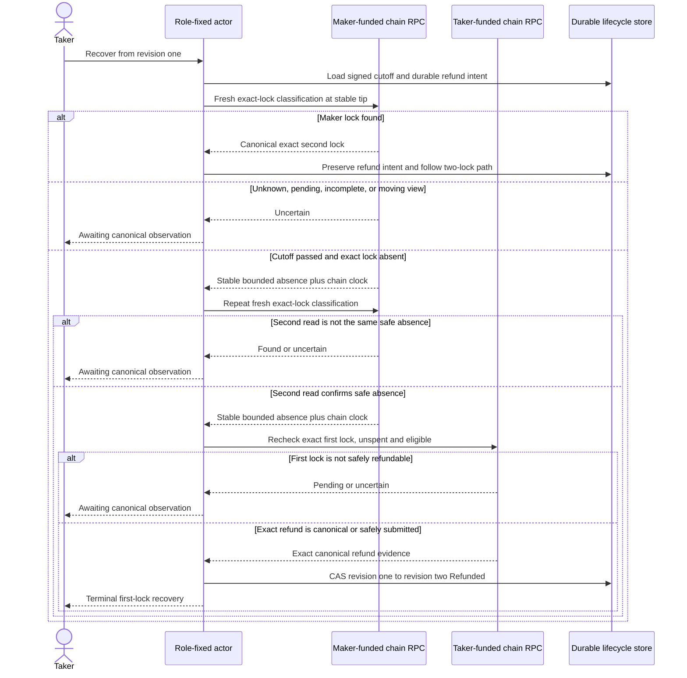
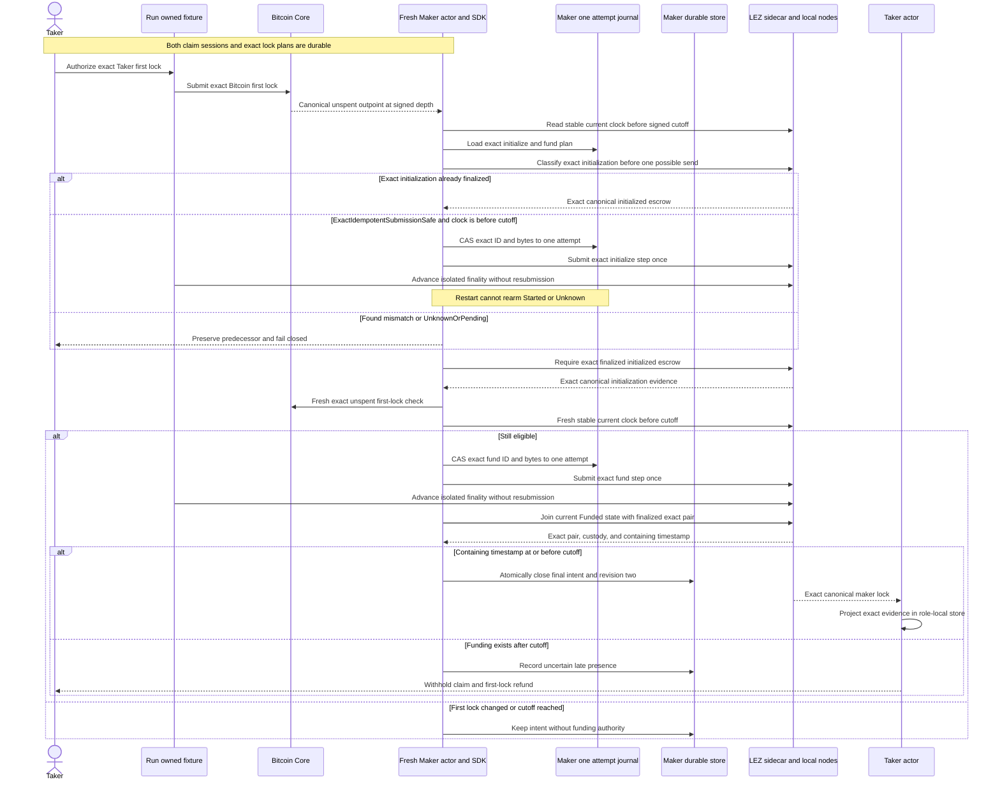
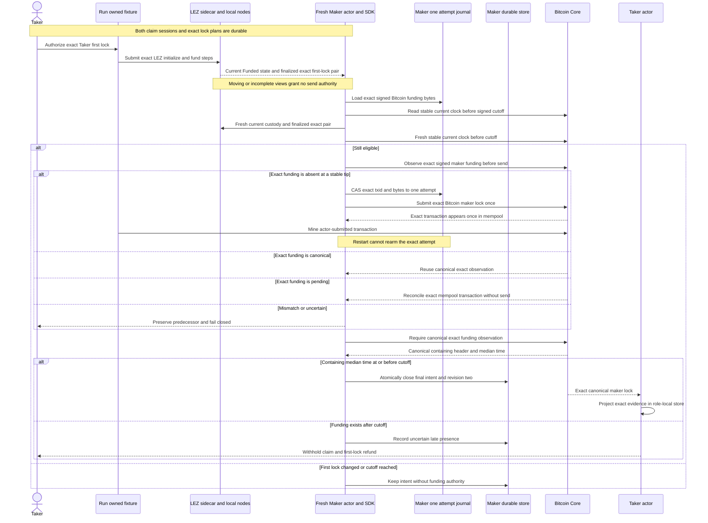

# ADR 0039: Admit first-lock recovery only after a cross-chain cutoff

Status: Accepted for the M3 BTC PoC. Both the absent-Maker recovery path and
the complementary timely-Maker path are actual-node GREEN in both directions.
Run `m3schema4-20260717d` at clean pushed commit
`0e7635fc7e50cc6e0612745dcdaf6df8bbcf6f9a` proves live schema-4
Maker admission: fresh current/finalized eligibility, exact one-attempt
submission, exact reconciliation, restart no-rearm, and atomic local final
intent/revision-two closure. There is no distributed cross-chain transaction
and no M3 completion tag for this slice.

## Context

The taker always funds first. If the maker disappears before its second lock,
the taker must eventually recover without the maker. A local timeout alone is
unsafe: the taker could decide to refund while a valid maker lock is becoming
canonical on the other chain. The two roles would then disagree about whether
the protocol has one lock or two.

Bitcoin supplies a stable-tip funding observation and the LEZ v0.2 sidecar can
scan a bounded finalized window. Neither observation, alone, is a cross-chain
transaction or a lock on the other actor. LEZ v0.2 also does not expose an
account proof or an atomic multi-account snapshot token. The admission rule
therefore has to be explicit, conservative, and fail closed.

This decision changes the pre-release `BtcRecoveryPlanV1` canonical body by
adding the maker-second-lock cutoff. M3 has not been certified or tagged, so no
released M3 wire is being replaced. Fixtures, manual decoding, agreement
validation, and local provisioning change together. A future post-release wire
change requires a new schema version.

## Decision

Bind `maker_second_lock_cutoff_unix_seconds` into both signatures over the
canonical agreement. Validate that the cutoff is nonzero and no later than the
first recovery boundary after reserving the signed reaction margin.

At lifecycle revision one, normal refund driving has no send authority. The
taker-specific first-lock recovery path must obtain two fresh matching safety
observations. Each observation must prove all of the following:

- the expected maker-funded chain;
- the exact signed cutoff and a canonical chain clock at or beyond it;
- affirmative absence of the exact maker lock, not an RPC error, pending
  transaction, moving tip, incomplete window, or unknown state; and
- an agreement-bound bounded evidence envelope.

After those reads, the refund observer freshly proves that the taker's exact
first lock is canonical, unspent, and eligible at its signed recovery boundary.
Only then may the actor consume the already durable one-attempt refund intent.
Any canonical maker lock wins the admission race and moves the lifecycle toward
the two-lock path. Any uncertainty withholds submission.

For `TakerSellsForeign`, the maker chain is LEZ and the taker chain is Bitcoin.
The finalized LEZ classifier returns `Found` or `Absent` only after a complete
stable bounded scan and carries the finalized block timestamp. The Bitcoin
refund observer then validates the exact taker outpoint, CSV eligibility, and
unspent state.

For `TakerSellsLez`, the maker chain is Bitcoin and the taker chain is LEZ.
Bitcoin `Ready` means the maker lock exists, `Pending` includes mempool presence
and remains uncertain, and only stable-tip `Absent` may pass the first gate. The
LEZ refund observer then revalidates the exact escrow state and signed deadline.

The maker-owned admission flow is direction-specific. Schema 4 is the live
path shown below and binds complete direction-shaped Maker material; schema 3
remains observation-only compatibility and never receives send authority.
The external runner submits the Taker first lock only. It may advance a local
chain to confirm or finalize an actor-submitted Maker effect, but it never
submits that second lock itself.

### Taker sells Bitcoin and maker funds LEZ

This direction preserves the atomic-swap safety boundary because LEZ funding
is the Maker's value-bearing step. Before it, only the Taker's Bitcoin is
locked and the signed CSV refund remains available. Initialization alone holds
no Maker asset and grants no claim. A timely finalized LEZ funding transaction
creates the two-lock claim path. A late LEZ funding transaction cannot
authorize revision two, but its presence makes first-lock absence unprovable,
so the Taker cannot simultaneously refund Bitcoin and treat the LEZ leg as
nonexistent. Only the final Maker journal close plus revision-two projection
is locally atomic; Bitcoin, LEZ, and the two role stores do not share a
transaction.

### Taker sells LEZ and maker funds Bitcoin

This direction preserves the atomic-swap safety boundary because the Maker's
exact Bitcoin transaction is persisted before its sole send and the Taker's
current and finalized LEZ escrow evidence is rechecked immediately before that
action. Canonical Bitcoin inclusion no later than the cutoff opens the two-lock
claim sequence. Mempool presence reconciles the exact attempt but is never
canonical admission. Inclusion after cutoff is quarantined as uncertain: the
late Bitcoin leg may require its own timeout recovery, but the Taker cannot use
the absent-Maker branch while it exists. That sacrifices automatic liveness
rather than permitting incompatible claim and refund histories. Only the final
Maker journal close plus revision-two projection is locally atomic; the chain
send and either role's separate projection remain outside it.

## Atomicity argument

This rule preserves atomicity only in combination with each direction's
construction-specific sequence in `system-architecture.md`:

- before the cutoff, the maker may still create the second lock and the taker
  cannot refund merely because it has not observed it yet;
- after the cutoff, two stable absence reads plus a fresh first-lock unspent
  check prevent ordinary observation lag or one moving view from authorizing a
  conflicting refund;
- a found maker lock suppresses the one-lock branch, so claims remain disabled
  until both exact locks are projected; and
- the refund can return only the taker's own first-locked value. It cannot
  transfer the maker's asset or create claim authority on the other chain.

There is still no distributed cross-chain commit. A sufficiently deep reorg,
Byzantine RPC/indexer, or maker implementation that ignores the signed cutoff
can violate the observations or admission assumption. Production hardening must
add independent-node/reorg evidence and a protocol-level late-lock admission
mechanism where the chain itself cannot enforce the cutoff. These residual
assumptions are disclosed rather than described as unconditional atomicity.

## Consequences and evidence

The additive LEZ classifier preserves the legacy found-only method and never
maps transport, availability, malformed history, or a moving finalized tip to
absence. The actor's ordinary revision-one refund path remains fail closed.
Deterministic RED-GREEN tests cover no-proof refusal, cutoff validation, a
maker-lock appearance between reads, ambiguous second reads, restart/no-rearm,
role ownership, exact terminal projection, and replay idempotence. Pushed
commit `3d202f7` additionally binds Bitcoin containing-block median time or LEZ
finalized containing-block timestamp into maker-lock evidence, accepts before
and exactly at the signed cutoff, rejects later inclusion from revision two,
and maps late presence to uncertain on the refund side. Typed Core
`getblockheader` validation ties hash, confirmation count, height, and median
time to one stable tip while preserving the existing evidence-v1 wire.

Pushed `4fb6950` makes the Bitcoin first-lock check a single stable-tip bracket
over exact bytes, containing header, and current spender-index state, and adds
caller-authorized one-shot Bitcoin funding with exact byte readback. Pushed
`79d7e68` adds the role-fixed exact-plan facade, the state-only current LEZ
first-lock check, and a hardened ordered Maker journal. Node acceptance and
transport ambiguity are distinct durable observe-only outcomes; neither is
canonical completion. Only exact confirmed step evidence can close the intent,
and the Maker's revision-two evidence plus intent close share one SQLite
transaction. The generic Maker projector cannot bypass that boundary.

The schema-4 component chain culminates in the live path rather than stopping
at the earlier typed seam. Commits `5102046` and `2b2781b` add a stable
current LEZ clock and the exact finalized/current first-lock proof. Commit
`13d048b` composes direction-shaped live Maker execution. Commits
`dc07518` and `cd93fb9` keep moving or otherwise transient observations
fail closed while allowing a fresh one-shot process to obtain a later stable
view; they do not rearm a consumed journal attempt.

The Maker must supply exact direction-shaped lock material; the Taker must not.
Before each possible ordered send the actor checks the current Maker-chain clock
strictly before the cutoff and freshly revalidates the exact first lock. Node
`Accepted` and `Unknown` remain durable observation-only states; only
exact canonical or finalized observation advances. LEZ initialization precedes
funding, and the final observation ID must equal the final plan ID before the
journal intent and lifecycle revision close atomically. Because LEZ v0.2 cannot
prove pending initialization absence, the narrower
`ExactIdempotentSubmissionSafe` result binds one CAS/send to the same exact
ID and bytes. It is not absence and cannot rearm `Started` or `Unknown`.
Schema 3 remains no-send observation compatibility with `attempt_count`
zero.

Run `m3firstlock-20260716h` supplies the isolated two-direction absent-maker
evidence: no maker second-lock effect, taker-only recovery, revision-two
`Refunded` convergence, zero replay submission, and exact run-owned cleanup.

Run `m3schema4-20260717d` supplies the complementary private-local
two-direction timely-Maker evidence at clean pushed commit
`0e7635fc7e50cc6e0612745dcdaf6df8bbcf6f9a`:

- In `TakerSellsForeign`, the external Taker Bitcoin lock confirmed once.
  The Maker actor submitted exact LEZ initialization and funding IDs once each;
  durable LEZ effects progressed 0 to 1 to 2, stayed unchanged after restart,
  and the complete exact pair finalized inside the actor's observation window.
- In `TakerSellsLez`, the external Taker LEZ initialization and funding
  finalized once. Nine moving-tip attempts granted no Bitcoin effect. Attempt
  ten submitted the exact Maker Bitcoin transaction, which appeared exactly
  once in the mempool, was never resubmitted after restart, and confirmed once.
- Each Maker used current chain-clock and exact first-lock eligibility before
  any possible send. Each final projection required canonical Bitcoin evidence
  or current LEZ `Funded` state and custody joined to finalized exact
  initialization/funding history.
- In each direction, the final Maker intent and Maker revision two closed in one
  local SQLite transaction. The Taker made its own independent canonical
  projection. Both roles reached revision four, and terminal replay left all
  exact effect counts unchanged.

This is evidence for the implemented private-local safety decision, not a
distributed cross-chain commit, public deployment, production-readiness claim,
or full M3 closure. Overlapping swaps, reorg/process-kill and adversarial timing
hardening, remaining accepted SDK/custom-token/recording scope, final gates,
and the `m3-complete` tag remain open.
