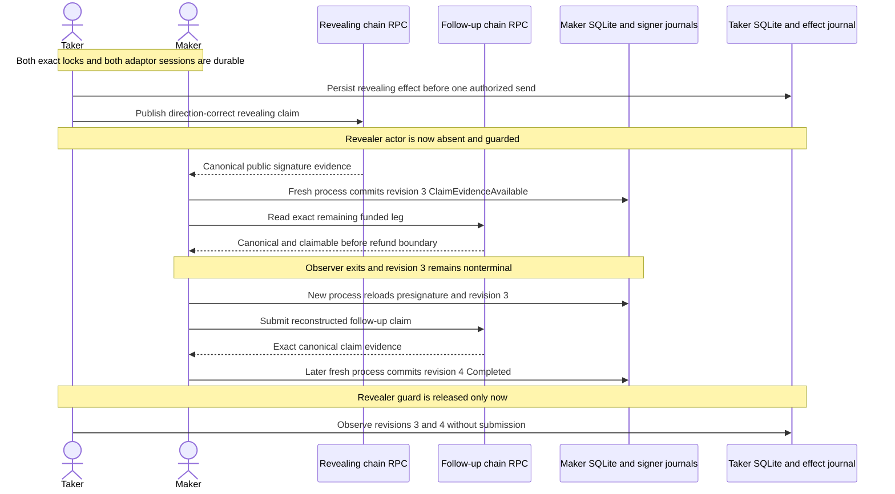

# ADR 0040: Continue post-reveal from canonical evidence without the revealer

Status: Accepted for the M3 BTC PoC; clean pushed-commit actual-node evidence
GREEN in both directions

## Context

After both agreement-bound locks exist, the taker owns the revealing claim and
the maker owns the follow-up claim. The RFP requires progress after a peer
disappears to depend only on durable local state and chain nodes. A normal happy
run, where both actors are projected after every effect, does not prove that
property: it erases the interval in which only the public reveal exists and the
opposite funded leg is still unspent or funded.

The existing public actor already reconstructs the maker's claim authority from
the canonical revealing signature, the maker's persisted presignature, and the
agreement-bound adaptor point. The missing decision was how to expose that
capability as a reproducible two-user flow without adding a peer secret,
sharing an actor store, or falsely calling a half-completed economic outcome
terminal.

## Decision

Keep `ClaimEvidenceAvailable` as the exact protocol phase at revision 3.
`recovering` is an evidence-layer lifecycle disposition only; it is not a new
core phase. Split each chain claim helper into an effect-only operation and a
compatibility wrapper that retains ordinary both-role projection. The survivor
journey uses only the effect-only operations.

After the taker publishes the direction-correct reveal, enable a fail-closed
journey guard that rejects every harnessed taker actor invocation until the
maker has reached terminal revision 4. A fresh maker process must:

1. observe the canonical reveal and commit revision 3;
2. prove the opposite leg is still canonical and claimable before its signed
   refund boundary; and
3. exit without submitting the follow-up.

A different fresh maker process reloads maker-only state, reconstructs and
point-checks the adaptor scalar, and submits the follow-up. A later fresh maker
process projects exact confirmed/finalized evidence to revision 4 `Completed`.
Only then is the taker guard released, and fresh taker processes catch up
revisions 3 and 4 through observation only. Effect counts must not change.

`TakerSellsForeign` reveals on LEZ and follows on Bitcoin. The intermediate
proof uses Core `gettxout` plus `gettxspendingprevout` for the exact Bitcoin
funding outpoint and requires the tip to remain below the signed CSV recovery
height.

`TakerSellsLez` reveals on Bitcoin and follows on LEZ. The intermediate proof
uses the authenticated finalized witnessed-funding observer and requires exact
`Funded` metadata, full custody, and a finalized tip timestamp before the signed
LEZ refund time.

## Atomicity argument

The reveal does not complete the swap by itself. It makes the committed adaptor
scalar publicly extractable by the maker, while the opposite funded leg remains
claimable. The fresh maker can therefore complete using only its own durable
presignature/state plus canonical chain disclosure; no taker process, Delivery,
Chat, caller-supplied scalar, or shared private store is required.

Revision 3 remains nonterminal because one economic leg has not yet been
claimed. If the maker permanently disappears, that is a liveness failure and
the leg stays claimable or later refundable under its existing authority; the
system must not report `Completed`. If the maker continues, it must do so before
the signed later recovery boundary. Exact one-attempt journals and
canonical-only projection prevent replay or an ambiguous send from manufacturing
a second effect, but they are operational safeguards rather than a distributed
cross-chain commit.

## Consequences and evidence

No new cryptographic or runtime dependency is introduced. Ordinary claim flows
retain byte-for-byte orchestration through the compatibility wrappers. The
survivor packet records the protected absence interval, exact intermediate
phase and terminality, direction-correct remaining-leg proof, fresh maker
process boundaries, delayed taker observation-only catch-up, per-chain zero
successful resubmissions bound to actor outputs, Core mempool reads and LEZ
durable counts, local-only resources, and exact cleanup.

Clean run `m3survivor-20260716c` at already-pushed commit `6e8b065` completed
both actual-node directions against Bitcoin Core 31.1 Regtest and private LEZ
v0.2. Run A first exposed a
duplicate JSON key that replaced the follower role with follower process
evidence; the RED-GREEN fix uses distinct `follower_role` and `follower` fields.
Post-PoC contract tests also enforce effect-only helper separation, call order,
nonterminal revision 3, the exact Core/LEZ remaining-leg reads, delayed taker
ordering, and the packet schema. The outer packet must validate and derive its
claims from both hashed direction packets and their hashed actor/RPC inputs;
it may not merely hash files and repeat constants. Executable negative fixtures
reject swapped direction evidence, a noncanonical remaining leg, and a Bitcoin
catch-up effect. The retained secret-safe packet is
[`m3-local-two-direction-survivor-claim-poc-20260716.json`](../evidence/m3-local-two-direction-survivor-claim-poc-20260716.json).
