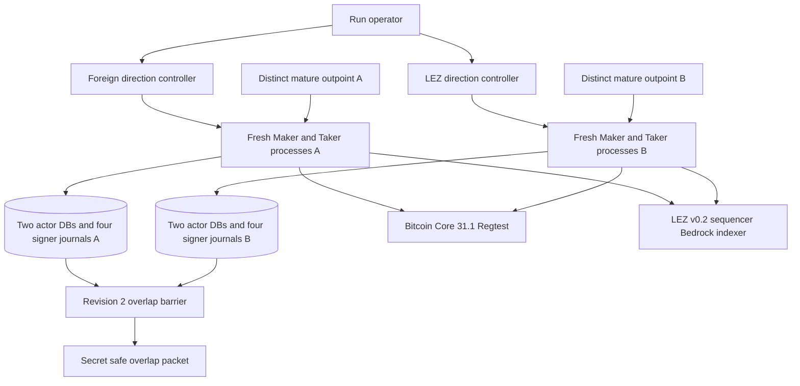
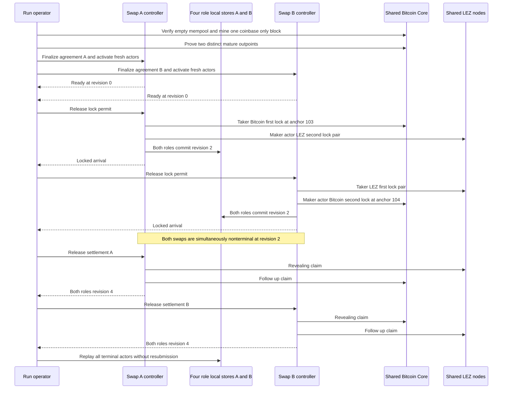

# ADR 0041: Interleave overlapping swaps with exact chain barriers

Status: Accepted and private-local actual-node GREEN. Clean run
`m3overlap-20260717a` passed from already-pushed commit
`1e6d5f1b9205aafb2df427f5285ff0920406b7d1` on 2026-07-17.
Both opposite-direction swaps were simultaneously at revision 2
`both_legs_locked` before either settlement was released. Both later reached
revision 4 `Completed`, terminal replay added no effects, and exact cleanup
targeted no foreign resource.

## Context

R5 requires swaps to have independent inputs, agreements, actor stores, effect
journals, and deadlines while remaining in flight at overlapping phases. The
older two-direction runner was deliberately sequential. It also prepared the
second Bitcoin funding transaction from the first transaction's change output,
pinned both fresh agreements to the next block, and asserted an empty or exact
singleton mempool around every Bitcoin effect. Backgrounding those whole flows
would not prove isolation. It would create an anchor collision and would force
the harness either to fail or to weaken exact observation.

The pinned local LEZ stack has one funded Maker identity and one funded Taker
identity. For this opposite-direction pair the LEZ depositors are different:
the Maker deposits in `TakerSellsForeign`, while the Taker deposits in
`TakerSellsLez`. This checkpoint does not establish a general same-depositor
nonce scheduler.

## Decision

Use one shared run-owned Bitcoin Core and LEZ topology, but allocate two
distinct mature Regtest coinbase outpoints before either agreement is
finalized. Mine exactly one verified coinbase-only maturity-extension block,
then bind block-1 and block-2 outpoints to the two directions. The deterministic
test custody key is shared and disclosed as fixture custody; the UTXOs, signed
transactions, agreements, stores, journals, sessions, escrows, and deadlines
are distinct.

Assign consecutive planned Bitcoin funding anchors. Direction
`TakerSellsForeign` owns anchor 103 and `TakerSellsLez` owns anchor 104 in the
retained run. Prepare both agreements before the first public effect. Start one
long-lived controller per swap, but keep every actual actor command a fresh
one-shot process. Controllers wait on owner-private no-clobber permits.

Serialize public chain mutations so the existing exact empty/singleton
mempool, stable-tip, and finalized-history assertions remain unchanged. This
is deterministic interleaving, not a claim that RPC submissions are
simultaneous. Withhold both settlement permits until both swaps have durable
revision-2 status in all four role-local stores.

## Components and ownership

The controllers own scheduling only. They never replace actor authorization,
submit a Maker lock, project accepted node responses, or share a role store.
The run fixture retains its existing authority to submit each Taker first lock
and to mine already actor-submitted Bitcoin transactions.

## Interleaved flow

## Atomicity and concurrency argument

Each swap preserves the existing conditional atomic-swap ordering: both
adaptor sessions and exact lock plans are durable before its first effect, the
Taker first lock precedes the Maker second lock, both canonical locks precede
scalar reveal, and claim/refund order remains agreement-bound. The overlap
barrier adds a cross-swap isolation assertion. It does not merge the swaps or
their secrets, stores, effects, or recovery deadlines.

There is no distributed transaction across Bitcoin Core, LEZ, or either
SQLite database. Chain submission is not atomic with a local journal. A crash
or ambiguous response retains the existing persist-before-send and exact
observe-before-project behavior. Serializing chain mutation protects strict
observation semantics and sacrifices throughput in this reference harness; it
does not weaken protocol safety or imply a production scheduler.

## Evidence and limits

The retained
[overlap packet](../evidence/m3-overlapping-two-swap-poc-20260717.json)
binds the clean pushed commit, two funding outpoints, agreements, four actor
databases, eight signing journals, two sessions per domain, escrow accounts,
deadlines, pairwise-disjoint effect IDs, four terminal role states, zero replay
submissions, no public runtime dependency, and exact cleanup.

This decision proves one opposite-direction pair on shared private-local nodes.
It does not prove arbitrary-N scheduling, two concurrent swaps with the same
LEZ depositor nonce stream, simultaneous chain RPC mutation, adversarial
cutoff/refund races, process-kill/reorg behavior, public routing, or production
readiness. Those nonclaims do not reopen the accepted R5 checkpoint proven by
this run.

