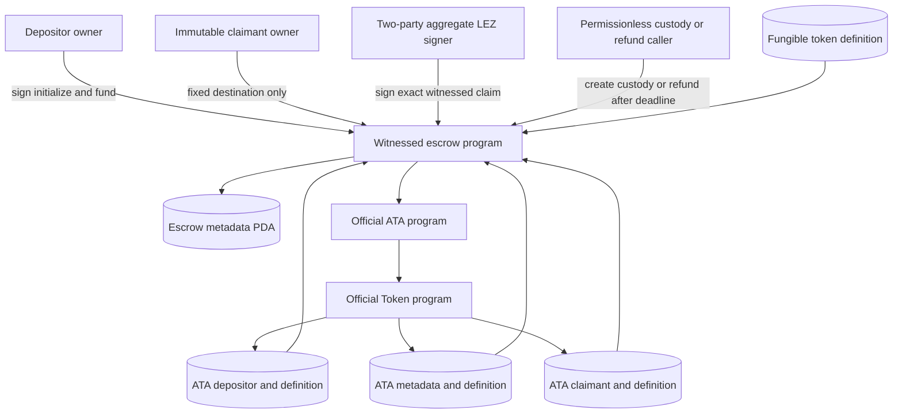
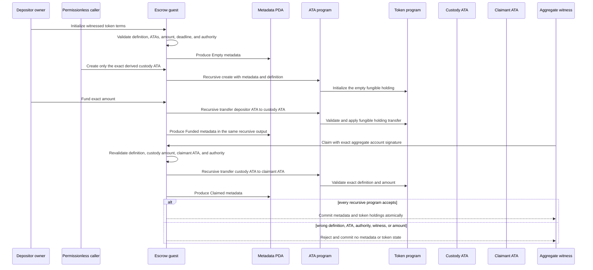

# ADR 0042: Bind witnessed token claims to exact ATAs

Status: Accepted at the checked-guest component boundary. Pushed commit
`66d5e26cd35c6282c0cd420533f70e6ea3e506c9` adds the implementation and
focused evidence. The checked manifest, public IDL, deployer assembly, verifier,
and active M3 runner pins now share the new guest identity. Sidecar/SDK
composition and actual-node custom-token evidence remain open.

## Context

RFP F7 requires the LEZ side of a BTC swap to support native value and custom
fungible tokens. The existing v0.2 token instructions used SHA-256 preimage
authority, which serves the ZEC construction but cannot consume the aggregate
BIP-340 witness used by the BTC construction. Treating an escrow metadata PDA
as a token holding would also bypass the official asset model: custom-token
custody must be the associated token account derived from the metadata account
and exact fungible definition.

The claim transition changes two kinds of state. Escrow metadata becomes
terminal, while the custody holding moves to the immutable claimant ATA through
the ATA program and its nested Token call. Those changes must succeed or fail
together. A metadata-only `Claimed` result with funded token custody would be
unsafe even if a later retry could repair it.

The public instruction discriminant is declaration-order derived. Inserting a
new instruction among existing declarations would silently change the wire
encoding already used by native and preimage-token integrations.

## Decision

Append `InitializeTokenWitnessed` and `ClaimTokenWitnessed` as wire tags 11 and
12. Keep tags 0 through 10 byte-stable. Reuse one token-term validator and one
token-claim validator for preimage and aggregate-witness authority rather than
creating a second custody interpretation.

Initialization binds all of the following into version-2 escrow metadata:

- swap ID, terms hash, nonzero amount, and exclusive claim/inclusive refund
  boundary;
- depositor and claimant owner accounts;
- one Token-program-owned fungible definition;
- exact depositor and claimant ATAs for that definition;
- exact custody `ATA(metadata, definition)` and the official ATA program;
- a nonzero aggregate x-only key and its exact LEZ v0.2 account derivation;
- an aggregate authority account distinct from the claimant.

Custody creation stays permissionless but can create only the derived custody
ATA. Funding remains depositor-owner signed and transfers the exact amount from
the immutable depositor ATA into empty custody. A witnessed claim requires the
aggregate authority signer, a `Funded` escrow, exact amount in custody, the
same fungible definition in custody and destination holdings, and the immutable
claimant ATA. The existing post-deadline refund stays permissionless and can
transfer only to the immutable depositor ATA.

## Components and authority

The claimant owner is an immutable destination, not the witnessed claim
signer. The aggregate LEZ account is the transaction authority and is derived
from the exact x-only key committed at initialization. The escrow metadata PDA
authorizes only the nested custody transfer through its exact PDA seed.

## Recursive atomic transition

One instruction returns one `SpelOutput` containing the metadata post-state and
the chained ATA transfer. LEZ recursively validates the escrow, ATA, and Token
sessions before committing the output. Therefore a failed nested transfer
cannot leave terminal metadata, and a rejected witness cannot move custody.
Initialization, custody creation, funding, and claim are still separate LEZ
transactions; the decision does not pretend that the whole escrow lifecycle is
one transaction.

## Atomicity boundary

This decision gives the LEZ claim or refund transaction atomic state change
across the escrow metadata, ATA, and nested fungible-token holding state. It
does not create an atomic transaction with Bitcoin, a role-local database, or
an RPC submission journal. Cross-chain atomicity remains conditional on the
existing protocol: both adaptor sessions and recovery material are durable
before funding, the Taker locks first, both locks are canonical before witness
release, and the opposite presignature can be completed from the revealed
scalar. Canonical observation, persist-before-send authority, and timelocks
remain outside this guest transition.

## Evidence

Commit `66d5e26` retains these exact component facts:

- witnessed-token instructions occupy tags 11 and 12 while a regression check
  proves tags 0 through 10 unchanged;
- host guest tests exercise two independent fungible definitions and reject
  wrong definition, wrong claimant ATA, and unrelated aggregate authority in
  `witnessed_token_claims_bind_two_definitions_exact_atas_and_aggregate_authority`
  and
  `witnessed_token_paths_reject_wrong_definition_ata_and_aggregate_authority`;
- the recursive checked-guest test
  `checked_guest_witnessed_token_claims_require_exact_definition_ata_authority_and_witness`
  additionally rejects one-share authority and proves rejected attempts leave
  metadata `Funded` and custody unchanged;
- exact two-party aggregate witnesses claim both definitions to their fixed
  claimant ATAs;
- the rebuilt guest ELF SHA-256 is
  `bc2ea18eaacb917727934fcf0366dd54c1f9a2b69b61ea53080c926850967fd7` and
  its ImageID is
  `f3ead24b95d316ce91980cb3531a70b83a27fd1640f47c1b857757aef26c244e`.

## Consequences and remaining integration

The checked manifest now binds the new ELF/ImageID, generated public IDL
SHA-256, 13 exact append-only instruction names, and witnessed-token tags 11
and 12. A local-only deployer command emits that artifact-bound IDL, and typed
initialize/claim assemblers rederive the metadata PDA and custody/claimant ATAs,
preserve exact IDL account order and signer flags, and serialize through the
official Risc0 codec without RPC access. The full verifier, CI pin assertions,
active M3 bootstrap/runner, and operator guide use the same identity. This is
configuration and deterministic assembly evidence, not an actual deployment or
chain effect. The deployer graph's advisory, duplicate, license, and source
policy also passes with exact SPEL source and hash-checked license
clarifications rather than a broad source or license exception.

An additive `asset_terms_version: 2` bridge-protocol envelope also preserves
all v1 native JSON and method strings while binding strict native or
custom-token terms. Distinct v2 RPC messages, ordered token effects and
observations, client/sidecar/adapter/SDK composition, and role-owned actual-node
execution still remain.

This ADR does not certify an actual-node custom-token swap in either trade
direction, exact composed balances/effects, restart/no-resubmission, public
deployment, production custody, or a cryptographic/security review. It supports
fungible definitions only. The accepted F7 integration gate remains open until
the new guest is deployed and exercised through the same actor, adapter,
finality, journal, and cleanup boundaries as the native corridor.
