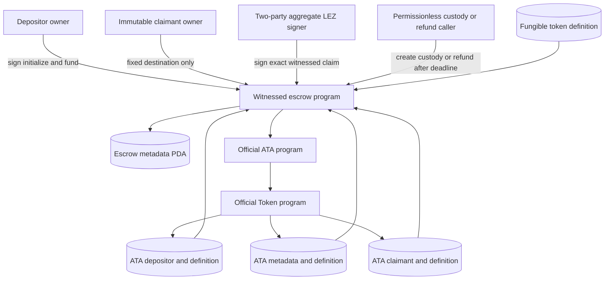
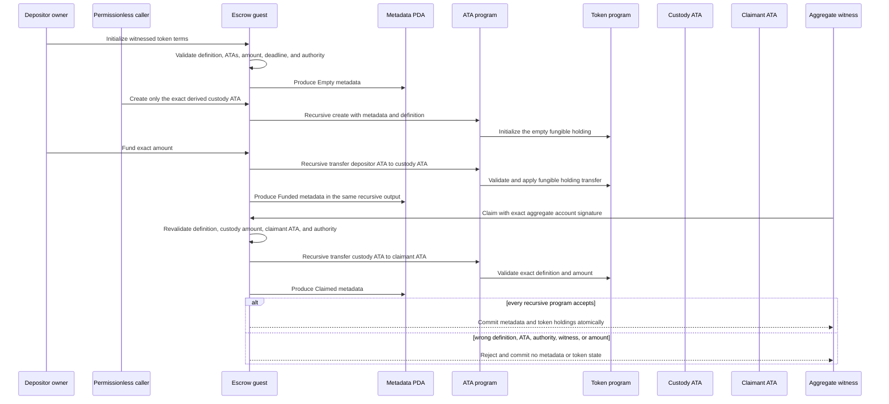
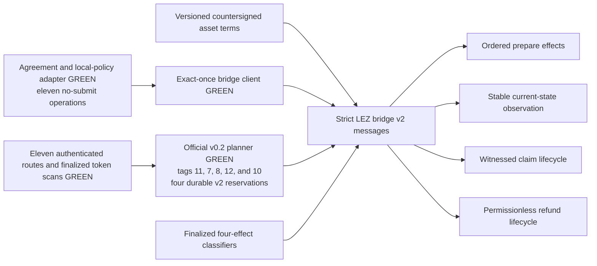
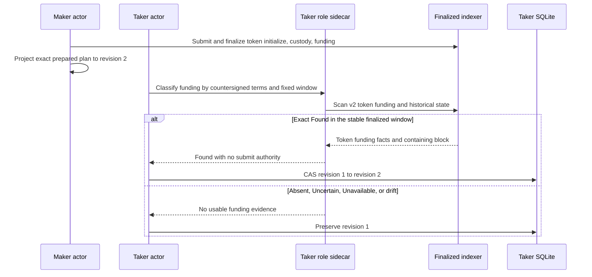
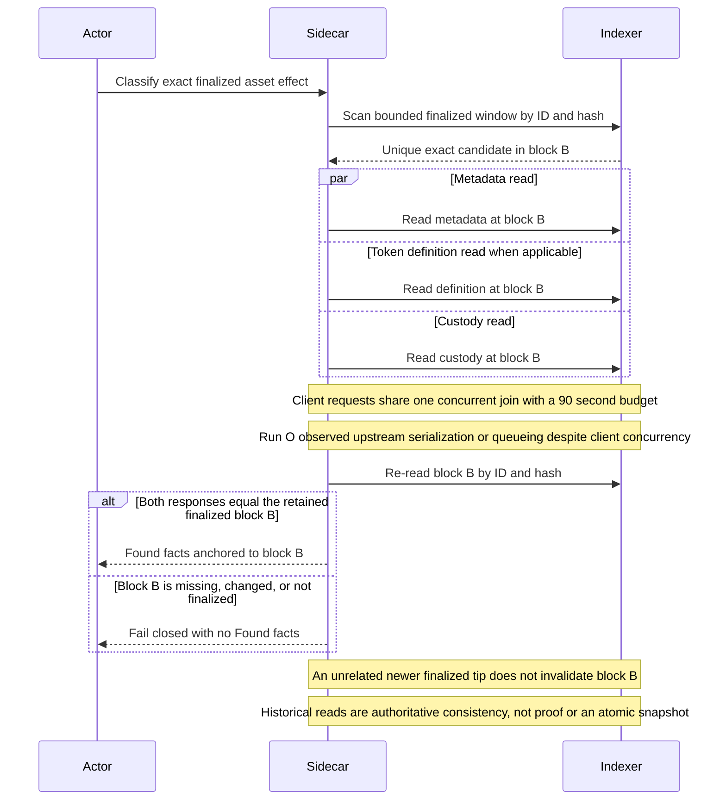
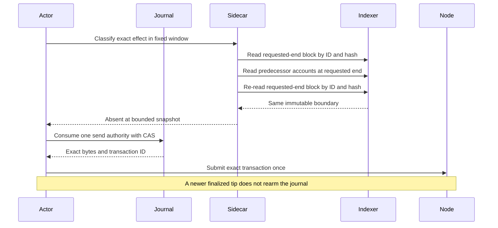
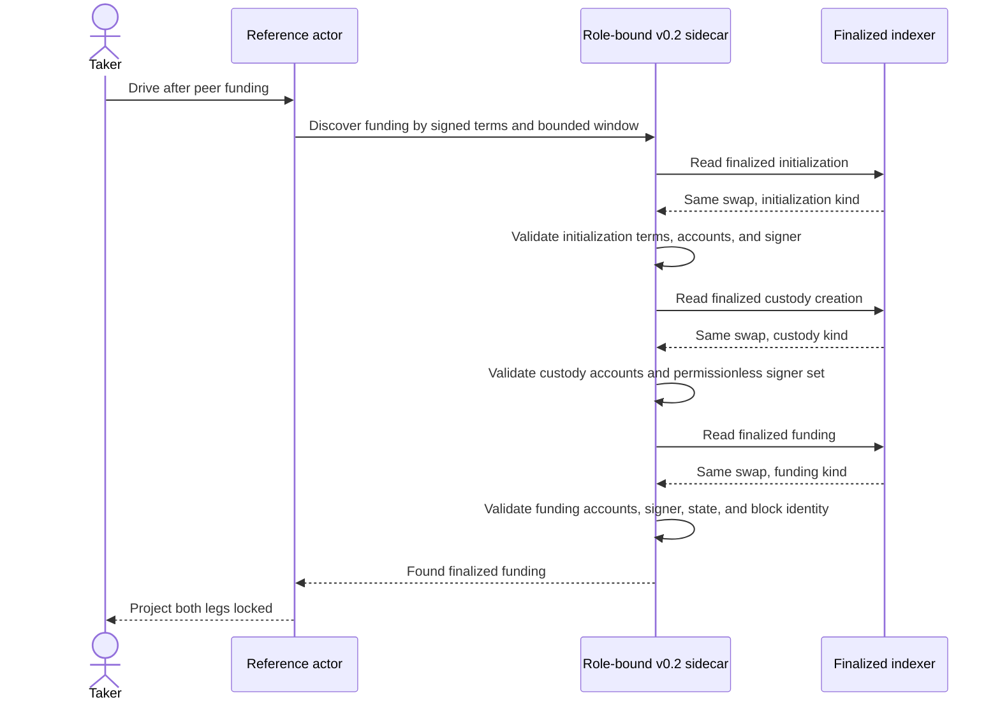

# ADR 0042: Bind witnessed token claims to exact ATAs

Status: Accepted at the checked-guest component boundary. Pushed commit
`66d5e26cd35c6282c0cd420533f70e6ea3e506c9` adds the implementation and
focused evidence. The checked manifest, public IDL, deployer assembly, verifier,
and active M3 runner pins now share the new guest identity. The additive strict
v2 transaction, finalized-classifier, exact-once client, main-process adapter,
and official sidecar planner, route, replay, and finalized-scan boundaries are
also implemented. Live journal/actor composition has crossed finalized
initialization, custody creation, and funding, and the Maker projected the
custom-token lock to revision two. Schema-5 peer observation now uses v2
terms discovery rather than the native-only v1 route. A complete two-direction
actual-node custom-token packet remains open.

## Context

RFP F7 requires the LEZ side of a BTC swap to support native value and custom
fungible tokens. The existing v0.2 token instructions used SHA-256 preimage
authority, which serves the ZEC construction but cannot consume the aggregate
BIP-340 witness used by the BTC construction. Treating an escrow metadata PDA
as a token holding would also bypass the official asset model: custom-token
custody must be the associated token account derived from the metadata account
and exact fungible definition.

The claim transition changes two kinds of state. Escrow metadata becomes
terminal, while the custody holding moves to the immutable claimant ATA through
the ATA program and its nested Token call. Those changes must succeed or fail
together. A metadata-only `Claimed` result with funded token custody would be
unsafe even if a later retry could repair it.

The public instruction discriminant is declaration-order derived. Inserting a
new instruction among existing declarations would silently change the wire
encoding already used by native and preimage-token integrations.

## Decision

Append `InitializeTokenWitnessed` and `ClaimTokenWitnessed` as wire tags 11 and
12. Keep tags 0 through 10 byte-stable. Reuse one token-term validator and one
token-claim validator for preimage and aggregate-witness authority rather than
creating a second custody interpretation.

Initialization binds all of the following into version-2 escrow metadata:

- swap ID, terms hash, nonzero amount, and exclusive claim/inclusive refund
  boundary;
- depositor and claimant owner accounts;
- one Token-program-owned fungible definition;
- exact depositor and claimant ATAs for that definition;
- exact custody `ATA(metadata, definition)` and the official ATA program;
- a nonzero aggregate x-only key and its exact LEZ v0.2 account derivation;
- an aggregate authority account distinct from the claimant.

Custody creation stays permissionless but can create only the derived custody
ATA. Funding remains depositor-owner signed and transfers the exact amount from
the immutable depositor ATA into empty custody. A witnessed claim requires the
aggregate authority signer, a `Funded` escrow, exact amount in custody, the
same fungible definition in custody and destination holdings, and the immutable
claimant ATA. The existing post-deadline refund stays permissionless and can
transfer only to the immutable depositor ATA.

## Components and authority

The claimant owner is an immutable destination, not the witnessed claim
signer. The aggregate LEZ account is the transaction authority and is derived
from the exact x-only key committed at initialization. The escrow metadata PDA
authorizes only the nested custody transfer through its exact PDA seed.

## Recursive atomic transition

One instruction returns one `SpelOutput` containing the metadata post-state and
the chained ATA transfer. LEZ recursively validates the escrow, ATA, and Token
sessions before committing the output. Therefore a failed nested transfer
cannot leave terminal metadata, and a rejected witness cannot move custody.
Initialization, custody creation, funding, and claim are still separate LEZ
transactions; the decision does not pretend that the whole escrow lifecycle is
one transaction.

## Atomicity boundary

This decision gives the LEZ claim or refund transaction atomic state change
across the escrow metadata, ATA, and nested fungible-token holding state. It
does not create an atomic transaction with Bitcoin, a role-local database, or
an RPC submission journal. Cross-chain atomicity remains conditional on the
existing protocol: both adaptor sessions and recovery material are durable
before funding, the Taker locks first, both locks are canonical before witness
release, and the opposite presignature can be completed from the revealed
scalar. Canonical observation, persist-before-send authority, and timelocks
remain outside this guest transition.

## Evidence

Commit `66d5e26` retains these exact component facts:

- witnessed-token instructions occupy tags 11 and 12 while a regression check
  proves tags 0 through 10 unchanged;
- host guest tests exercise two independent fungible definitions and reject
  wrong definition, wrong claimant ATA, and unrelated aggregate authority in
  `witnessed_token_claims_bind_two_definitions_exact_atas_and_aggregate_authority`
  and
  `witnessed_token_paths_reject_wrong_definition_ata_and_aggregate_authority`;
- the recursive checked-guest test
  `checked_guest_witnessed_token_claims_require_exact_definition_ata_authority_and_witness`
  additionally rejects one-share authority and proves rejected attempts leave
  metadata `Funded` and custody unchanged;
- exact two-party aggregate witnesses claim both definitions to their fixed
  claimant ATAs;
- the rebuilt guest ELF SHA-256 is
  `bc2ea18eaacb917727934fcf0366dd54c1f9a2b69b61ea53080c926850967fd7` and
  its ImageID is
  `f3ead24b95d316ce91980cb3531a70b83a27fd1640f47c1b857757aef26c244e`.

## Consequences and remaining integration

The checked manifest now binds the new ELF/ImageID, generated public IDL
SHA-256, 13 exact append-only instruction names, and witnessed-token tags 11
and 12. A local-only deployer command emits that artifact-bound IDL, and typed
initialize/claim assemblers rederive the metadata PDA and custody/claimant ATAs,
preserve exact IDL account order and signer flags, and serialize through the
official Risc0 codec without RPC access. The full verifier, CI pin assertions,
active M3 bootstrap/runner, and operator guide use the same identity. This is
configuration and deterministic assembly evidence, not an actual deployment or
chain effect. The deployer graph's advisory, duplicate, license, and source
policy also passes with exact SPEL source and hash-checked license
clarifications rather than a broad source or license exception.

An additive `asset_terms_version: 2` bridge-protocol envelope also preserves
all v1 native JSON and method strings while binding strict native or
custom-token terms. Seven distinct `lez_bridge.v2.*` methods now model ordered
native two-effect or custom-token three-effect preparation, current-state
observation, witnessed claim reservation/completion/finalized observation, and
permissionless refund preparation/observation. Cross-field constructors reject
definition, ATA, program, authority, amount, state, instruction-order, and
unknown-field drift. Thirty-five protocol tests plus strict Clippy, rustdoc,
formatting, and diff gates pass.

The current-state escrow observation alone cannot certify finalized funding or
an exact absent-versus-unknown submission outcome. Four additional v2 methods
therefore classify initialization, token-only permissionless custody creation,
funding, and claim. Each uses exact prepared bytes and ID or terms discovery,
stable finalized window coverage, containing-block identity, instruction
accounts, metadata, and custody. The nonoverlapping `Found`, `Absent`,
`Uncertain`, and `Unavailable` outcomes prevent a moving tip, incomplete
history, unavailable finality, conflict, or possible pending transaction from
becoming send authority. Native initialization, funding, and claim parity plus
two custom definitions pass; custody creation rejects native terms.

The bounded loopback client now exposes all seven v2 lifecycle methods and all
four finalized classifiers without internal retries. It consumes each request
ID once, validates the exact Lee v0.2 runtime and response echoes, and enforces
depositor-only preparation, claimant-only claim preparation/completion, and
either-bound-participant observation/classification and permissionless refund
preparation. Stable-tip/current-clock checks, exact/discovery windows, public
placements, ordered effects, exact IDs/bytes, and claimant/outsider negatives
pass without weakening any v1 method. Five unit, five external v2, 32 preserved
bridge-contract, and four example tests are GREEN, as are strict all-target
Clippy, rustdoc, doctests, formatting, and diff gates.

The official v0.2 sidecar planner rederives the pinned Token and ATA programs,
definition-specific depositor, claimant, and custody ATAs, exact guest account
order, tags 11/7/8/12/10, and signer sets. Signed initialization and funding use
consecutive nonces around a nonce-free permissionless custody transaction.
Escrow, claim reservation, claim completion, and refund bytes occupy separate
v2 durable files and replay after restart without nonce rereads or
regeneration. Six focused tests cover both roles, two definitions, conflicts,
program/ATA/authority/order substitution, redaction, and two-stage restart.

The main-process adapter rechecks the extension-to-base-agreement commitment and
exact local asset policy, maps native or every custom-token field into strict v2
terms, and exposes all eleven operations through a no-submit transport trait.
It performs Lee v0.2 chain/program/signer and role preflight before I/O,
preserves caller-owned IDs/windows/targets/effects/transcripts, and never turns
transport failure or the four conservative classifier states into send
authority. Six new external tests and 73 preserved tests pass with strict
all-target Clippy, rustdoc, doctests, formatting, and diff gates.

The reference actor selects its finalized LEZ funding observer by validated
configuration schema. Schema 3/4 native swaps retain the v1 native observer.
Schema 5 uses the v2 asset classifier. The Maker can reconcile its exact
prepared three-step plan, while the Taker deliberately receives no
Maker-private transaction material: it discovers the peer's finalized funding
by the countersigned asset terms. Its deterministic request binds the agreement
commitment, asset commitment, run, role, runtime, complete v2 terms, fixed
target, and complete discovery window; the live target is `DiscoverByTerms`.
Only an exact `Found` result becomes revision-two
evidence. `Absent`, `Uncertain`, or `Unavailable` remains pending; transport,
echo, window, or agreement drift fails closed. This observation-only port has
no submission or completion method.

The complete validated public transaction facts are currently embedded in
role-local recovery evidence. The v2 protocol permits a larger exact
transaction than the recovery store's 64 KiB per-chain-evidence cap. An
oversized valid `Found` therefore fails closed during projection and grants no
authority, but could deny liveness. Official local-PoC token transactions are
well below that limit. Compact commitment plus independently recoverable public
facts is production hardening, not part of the current functional-PoC claim.

All eleven v2 methods are now registered on the capability-authenticated
sidecar server. The four preparation/completion methods restore exact durable
requests and results in dependency order. The finalized scanner validates
canonical bytes, hash, stateless transaction rules, signer and account order,
instruction, programs, official ATAs, metadata, fungible definition, holdings,
and stable ID/hash block ancestry.

A `Found` effect is anchored to its immutable finalized containing block, not
to the latest finalized tip. After reading metadata, the token definition when
applicable, and custody at that same historical block, the sidecar re-fetches
the containing block through the official indexer's by-ID and by-hash methods.
Both responses must still be byte-identical to the retained finalized candidate
block. An unrelated later tip may advance without invalidating that positive
observation. A missing block, changed ID/hash response, non-finalized response,
or changed candidate fails closed and returns no usable `Found` facts.

Missing-effect authorization is separately tied to the immutable requested-end
block: the scanner proves the exact predecessor state there and then re-reads
that same boundary by ID and hash. A later finalized tip may advance without
invalidating the bounded negative snapshot; requested-end identity drift still
fails closed. A same-height refund fork found during root review now forces
`UnknownOrPending`; it cannot combine transaction evidence and terminal state
from different finalized views. Historical default-account absence remains
distinct from an unavailable RPC.

Historical metadata, token-definition, and custody reads use explicit nested
budgets and bounded concurrency whose aggregate is strictly inside the actor
bridge's 120-second outer request timeout. This prevents one slow official RPC
from silently consuming the whole actor budget and prevents an unbounded fanout
from becoming a new availability failure. The current split keeps ordinary
block and tip RPCs at 10 seconds with maximum concurrency one, while the
dedicated historical-account client uses a 90-second request budget and maximum
concurrency three. Custom-token metadata, definition, and custody reads use one
bounded `tokio::try_join!`. Run O demonstrated that the official client can
issue all three reads concurrently while the upstream service effectively
serializes or queues their execution. The 90-second nested budget accommodates
that observed local-PoC behavior inside the 120-second actor deadline; it is not
a production scalability claim. A supported upstream batch read or a cached,
block-identified historical snapshot remains the production improvement. Run O
is diagnostic timing evidence and does not certify a fresh actual-node
custom-token PoC.

The same-block reads and block revalidation are authoritative-indexer
consistency checks. `getAccountAtBlock` supplies neither a cryptographic account
proof nor an atomic multi-account snapshot token, so these checks do not prove
that metadata, definition, and custody were returned from one cryptographically
atomic snapshot. The recursive claim transaction itself remains one atomic
on-chain LEZ transition under the guest rules described above; the observation
RPCs, actor database, Bitcoin, and LEZ do not share one transaction.

The fixed boundary is safe for actor-owned exact submissions because the
prepared bytes and transaction ID are durable before the CAS, accepted or
unknown attempts never rearm, identical bytes are replay-safe, and a later
conflicting transition is rejected by LEZ nonce and monotonic escrow-state
checks. This remains an authoritative-indexer trust compensation, not a
cryptographic historical-account proof or an atomic multi-read token.

### Lifecycle-aware peerless discovery

Terms-based discovery scans a bounded finalized window containing the complete
multi-step escrow lifecycle. A valid initialization or custody transaction for
the same swap is therefore not a funding conflict. The scanner classifies every
decoded escrow instruction by lifecycle kind. When it encounters another kind
for the same swap, it validates every term field encoded by that step plus the
exact account order and expected signer set, then continues without projecting
the requested effect. A malformed other step or an incompatible instruction of
the requested kind remains `ConflictingDiscovery`; two valid requested-kind
matches remain `ConflictingMatches`.

This observation is read-only and cannot create an on-chain effect. Atomicity
is preserved at the authority boundary: a different lifecycle step never
projects funding, and the actor grants claim authority only after one valid
funding candidate plus its finalized state and block identity are accepted.
Run `m3f7compose20260718s` is the bounded RED that exposed the pre-fix behavior;
it is not a custom-token PoC pass.

Fresh role-owned execution has proved Bitcoin first lock plus finalized LEZ
initialization, custody creation, and funding after the checked deployment and
official Token/ATA fixture. Run `m3f7compose20260718t` at clean pushed
`50db397` finalized those effects at blocks 120, 148, and 170. Maker exact
observation and Taker peerless discovery both reached revision two, so the
lifecycle-aware scanner is actual-node GREEN in the forward direction. The
following evidence-only dual-lock serializer had malformed jq syntax and
stopped the run before either claim or the reverse direction. Exact cleanup
passed. The serializer is now a directly executable tracked filter with native
and custom-token contract coverage and validate-before-publish output. Claims,
reverse direction, terminal balances, and the final reproducibility packet
still require a fresh uninterrupted run on the fixed pushed commit; Run T is
not a custom-token PoC pass.

ADR 0047 refines the finalized-read implementation without weakening this
decision. Asset observation now reads only the requested finalized interval,
pins its end by independent ID/hash lookup, and revalidates that same block
after historical account reads. Monotonic newer descendants are accepted;
rewind, same-height replacement, missing history, and pinned identity drift
remain fail-closed. The local F7 runner can therefore use one-second slots
instead of a ten-second quiet-tip workaround, pending fresh actual-node proof.

This ADR does not certify an actual-node custom-token swap in either trade
direction, exact composed balances/effects, restart/no-resubmission, public
deployment, production custody, or a cryptographic/security review. It supports
fungible definitions only. The accepted F7 integration gate remains open until
the new guest is deployed and exercised through the same actor, adapter,
finality, journal, and cleanup boundaries as the native corridor.
