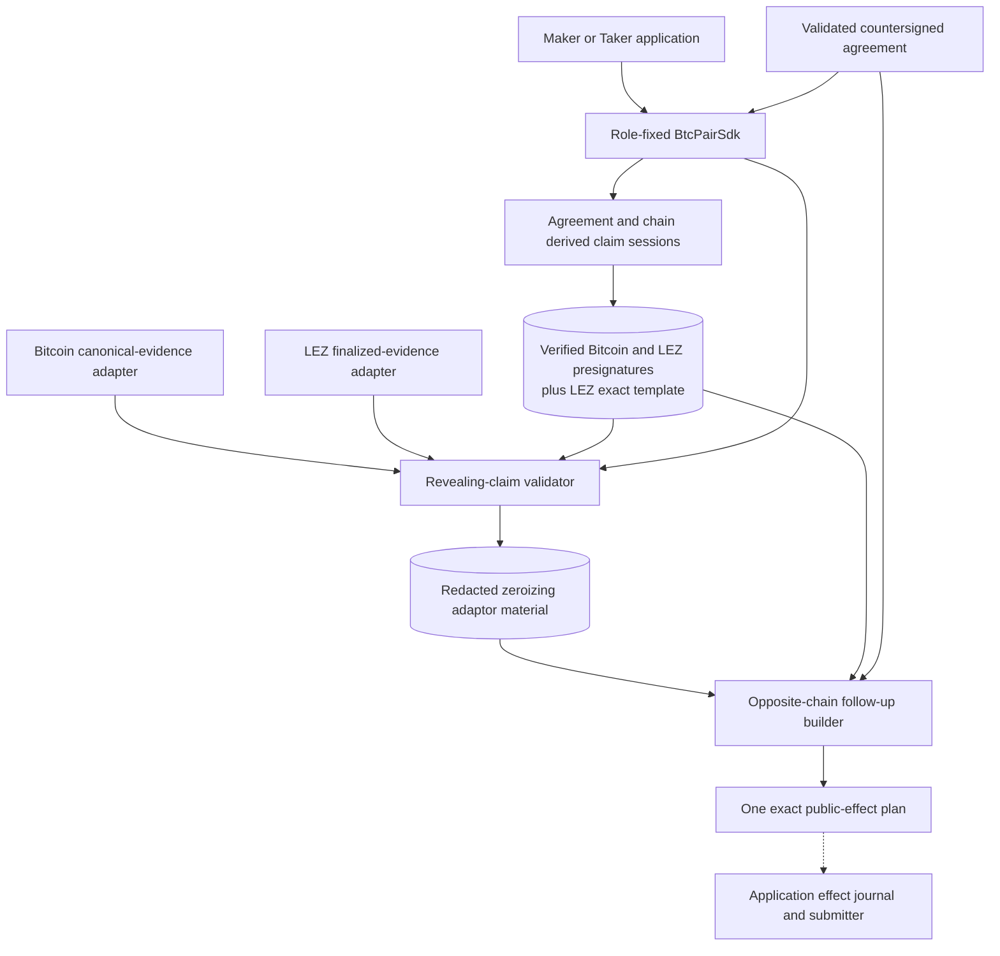
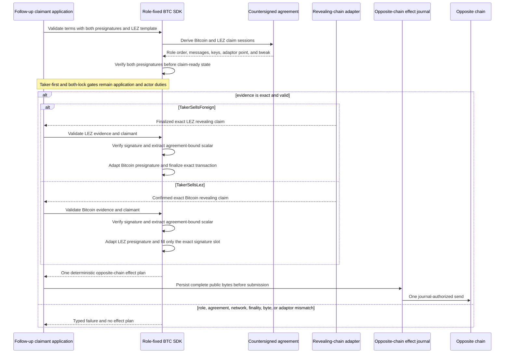

# ADR 0043: Derive BTC claims from the agreement

Status: Accepted at the deterministic public-SDK component boundary. Pushed
commit `28f38c700b0d0acbbee06b06dab8ef79d20067a8` implements and tests this
claim-only slice. Complete pre-lock recovery, post-activation persistence, and
actual-node facade composition remain open.

## Context

The BTC reference actor already proved both claim orders through lower-level
agreement, signer-journal, adapter, and effect-journal components. That did not
yet provide an external consumer with one role-fixed SDK contract for
validating a revealing claim, recovering its adaptor material, and constructing
the exact opposite claim.

Accepting a caller-supplied session description at this boundary would create
a second parser for role order, keys, adaptor point, chain message, and Bitcoin
Taproot tweak. It would permit a valid presignature or revealed scalar to be
substituted across agreements, chains, or sessions. Similarly, allowing an
adapter to hand the SDK arbitrary LEZ claim bytes after scalar recovery would
make the agreement-bound plan non-deterministic.

The shared `SwapProtocol::prepare` contract promises complete pre-lock recovery
material, including signed refund preparation. This slice has complete claim
preparation but not that refund boundary. Returning apparent success from the
common method would overstate lifecycle readiness.

## Decision

Derive each lifecycle claim session ID as SHA-256 over the domain
`logos.gateway.lez-btc.claim-session.v1\0`, the countersigned agreement
commitment, and the exact `bitcoin` or `lez` chain label. Reconstruct the
ordered Maker/Taker keys, adaptor point, chain message, and Bitcoin P2TR tweak
from the already validated agreement. No caller-supplied lifecycle session ID
is accepted.

Require claim preparation to contain:

- the same agreement commitment;
- a verified 65-byte Bitcoin adaptor presignature under the derived tweaked
  Bitcoin context;
- a verified 65-byte LEZ adaptor presignature under the derived untweaked LEZ
  context; and
- a bounded exact LEZ public envelope with one selected 64-byte zero Schnorr
  slot and an expected public effect identity.

`BtcPairSdk::prepare_claims` creates a claim-ready value only after those
checks. The generic `SwapProtocol::prepare` continues to return the typed
`PreLockRecovery` capability gap because complete signed refund preparation is
not composed.

For revealing evidence, enforce the direction-selected claim chain and
claimant. Bitcoin evidence must use the signed genesis and confirmation policy,
canonical one-input key-path transaction bytes, the exact agreement unsigned
cooperative transaction, and a valid final signature. LEZ evidence must use the
signed genesis, finalized status, exact public ID, and byte-for-byte template
materialization with only the selected signature slot replaced. In either
case, verify the final signature and extract the adaptor scalar against that
chain's verified presignature.

Keep recovered material in `Zeroizing<[u8; 32]>`, redact `Debug`, and expose no
scalar accessor. Bind it to the agreement commitment, direction, revealing
claimant, and follow-up claimant. Only the role-fixed follow-up claimant may
consume it. Adapt the opposite presignature and deterministically return one
exact public-effect plan: a fully finalized canonical Bitcoin transaction or
the exact LEZ envelope with its 64-byte signature slot filled.

## Components and ownership

The solid nodes are deterministic SDK components. Chain adapters produce
untrusted evidence; they do not choose claim order or effect bytes. The dashed
application journal/submission edge is required integration, not behavior
owned or completed by this commit.

## Claim sequence

## Conditional atomicity and non-atomic boundaries

This facade preserves the cryptographic half of cross-chain atomicity. Both
domain-separated presignatures and the exact LEZ substitution envelope are
verified before claim-ready preparation. A canonical final signature on the
revealing leg exposes only the scalar committed by the agreement's adaptor
point. That scalar completes the already verified opposite presignature, so a
surviving follow-up claimant does not need a new peer message or new signing
session.

The SDK does not prove that both locks are canonical, persist lifecycle state,
submit either claim, or make Bitcoin, LEZ, and SQLite one transaction. It
performs no node, discovery, negotiation, persistence, or submission I/O. The
application must retain the existing both-lock-before-reveal gate, persist the
exact returned bytes before one-attempt submission, reconcile ambiguous sends
from canonical evidence, and obey the signed recovery order. Reorgs and chain
availability can still affect liveness. This is conditional protocol
atomicity, not a distributed atomic commit.

## Evidence

Commit `28f38c7` expands the external-consumer facade target from seven to
eleven tests. Its claim-specific matrix proves:

- both economic directions select the correct revealing and follow-up chain;
- agreement-derived Bitcoin and LEZ sessions verify both presignatures before
  claim preparation;
- canonical LEZ and Bitcoin revealing evidence recovers redacted zeroizing
  material and produces deterministic exact opposite-chain bytes;
- replay produces the same exact effect plan;
- wrong role, agreement, exact bytes, presignature, adaptor domain, or local
  SDK role fails closed; and
- a presignature/template set prepared for another agreement is rejected
  before claim-ready state;

The exact claim-specific tests are
`common_protocol_extracts_and_builds_exact_claims_in_both_directions`,
`claim_lifecycle_rejects_role_byte_and_adaptor_substitution`,
`bitcoin_revealing_claim_rejects_role_byte_adaptor_and_sdk_substitution`, and
`protocol_terms_reject_substituted_claim_presignatures_before_prepare`.

The public implementation types are canonical Bitcoin/LEZ revealing-evidence
records, `BtcRecoveredClaimMaterialV1`, `PreparedLezClaimTemplateV1`, and an
`ExactPublicEffectPlanV1`; the earlier unsupported claim evidence/material
placeholders are removed from this slice.

## Consequences and remaining integration

This decision establishes the public deterministic claim contract but not the
accepted full-lifecycle BTC SDK. The following remain open:

- complete signed refund preparation so common `SwapProtocol::prepare` can
  succeed instead of returning `PreLockRecovery`;
- canonical recovery state and `recovery_action` rather than the typed
  `Recovery` gap;
- durable resume and state/action reconstruction for revisions 1 through 4;
- role-local store, chain-adapter, journal, and one-shot actor composition
  through the new facade;
- a compiling full lifecycle example and complete public API documentation;
- public discovery, negotiation, and activation composition; and
- integration with ADR 0042's witnessed custom-token envelope, regenerated
  IDL/client/deployer/sidecar, and actual-node custom-token evidence.

Real Delivery/Chat adapters remain M5 scope. This commit does not provide
public Testnet4/LEZ execution, process-kill/reorg evidence, production key
custody, formal cryptographic review, or an M3 completion tag.
