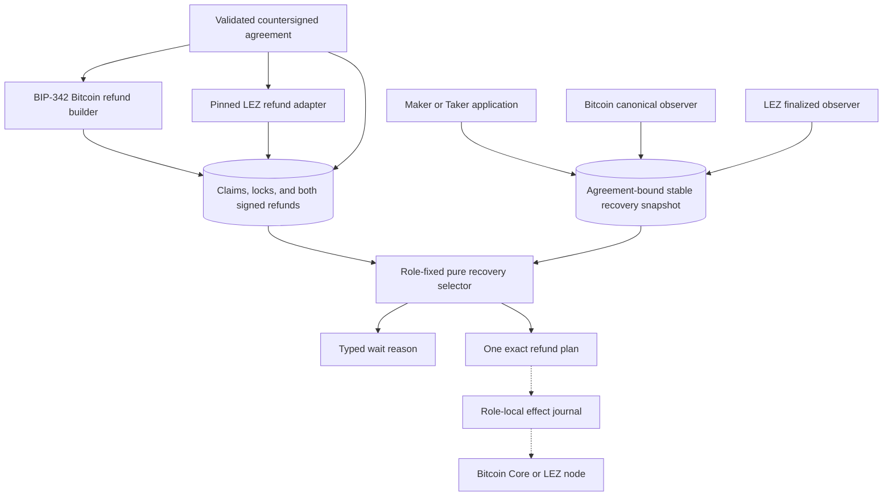
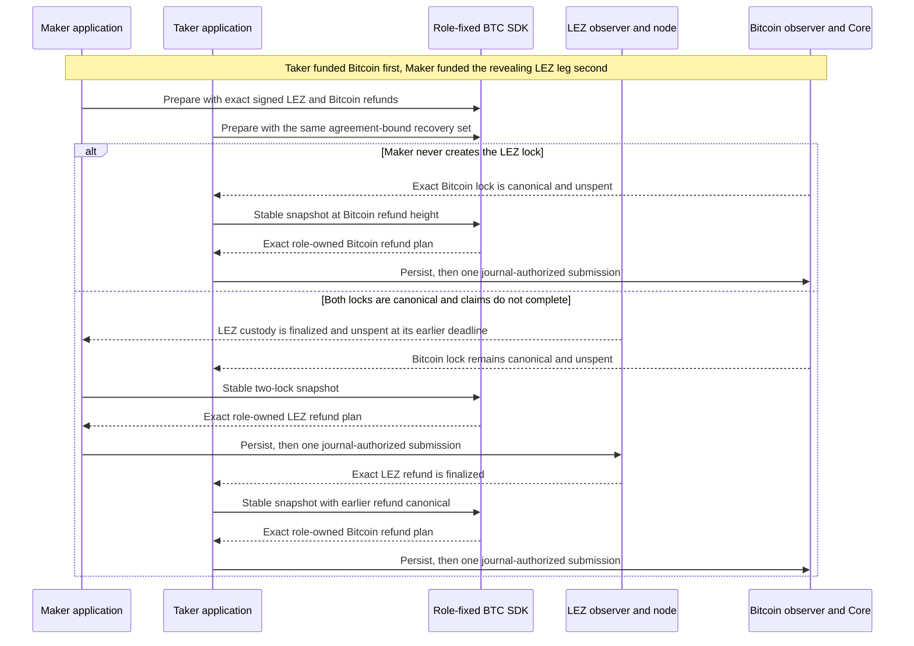
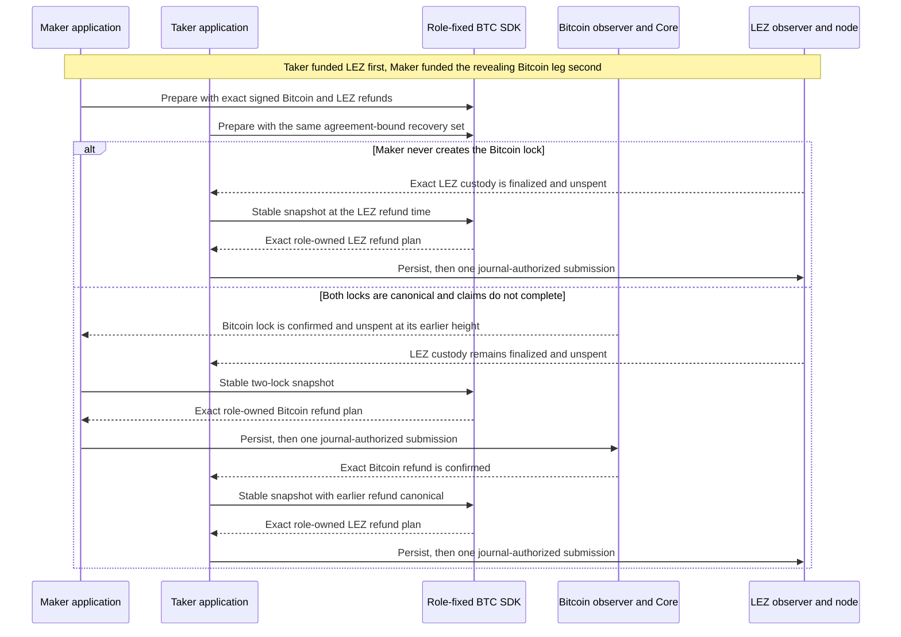

# ADR 0044: Presign BTC recovery and project the revealing-leg refund first

Status: Accepted at the deterministic public-SDK component boundary. The
implementation and 42-test crate gate are GREEN. Durable revisions 1 through
4, actor/store/node composition, and live submission remain open.

## Context

ADR 0043 made both claim paths agreement-derived, but the shared
`SwapProtocol::prepare` still failed with a typed pre-lock recovery gap. A
consumer could prepare claims without proving that both funders already held
their exact signed recovery transactions. The SDK also lacked a concrete,
role-fixed projection from stable canonical chain evidence to the next safe
refund.

Bitcoin and LEZ do not share a clock or an atomic commit primitive. The signed
agreement instead assigns each chain a native deadline and makes the
Maker-funded claim-revealing leg expire before the Taker-funded follow-up leg.
The physical chain order therefore depends on the trade direction:

- `TakerSellsForeign`: Maker funds LEZ, so LEZ refunds before Bitcoin.
- `TakerSellsLez`: Maker funds Bitcoin, so Bitcoin refunds before LEZ.

Using a fixed chain-name order would be wrong for one direction. Allowing the
later refund before canonical evidence of the earlier refund could let one
party recover its deposit while the other leg still exposes a claim path.

## Decision

Require full preparation to contain all of the following, bound to the same
countersigned agreement:

- the two exact lock plans;
- both verified claim presignatures and the exact LEZ claim envelope;
- a finalized BIP-342 Bitcoin refund carrying the correct funder's signature;
  and
- one bounded, exact signed LEZ refund envelope supplied by the LEZ adapter.

The BTC SDK reconstructs and verifies the Bitcoin refund transaction. It does
not invent or reinterpret the pinned LEZ transaction encoding; the LEZ adapter
owns semantic signature validation, while the SDK binds the returned exact
bytes and public identity to the agreement.

Recovery is a pure projection. The application supplies one stable canonical
snapshot containing both native clocks and typed Bitcoin/LEZ states. The SDK
validates the agreement, direction, network identities, prepared funding and
refund identities, Bitcoin confirmation policy, LEZ finality and custody, and
state consistency before returning either `Wait`, one role-owned exact refund
plan, or `Recovered`. Returning a plan grants no submission authority.

For a first-lock-only abandonment, the Taker may recover its own sole lock at
that chain's signed deadline because the Maker-funded leg is canonically
absent. When both locks exist, the Maker-funded revealing leg must refund
first. The Taker-funded follow-up leg becomes eligible only after that exact
earlier refund is canonical.

## Components and ownership

Solid edges are deterministic SDK inputs and outputs. Dashed edges are
application integration that this decision requires but does not implement or
certify. Chain adapters supply untrusted facts; they do not choose the refund
order or construct new effect bytes.

## `TakerSellsForeign` recovery sequence

The sequence is economically atomic only in the conditional protocol sense:
the earlier Maker-funded LEZ recovery removes that revealing claim path before
the Taker-funded Bitcoin refund becomes eligible. LEZ finalization and Bitcoin
confirmation are separate events; there is no cross-chain transaction.

## `TakerSellsLez` recovery sequence

This direction reverses the physical chain order but preserves the same
invariant: recover the Maker-funded revealing leg before the Taker-funded
follow-up leg. A fixed LEZ-before-Bitcoin rule would violate that invariant.

## Atomicity and non-atomic boundaries

The following are established at this component boundary:

- both exact signed refund effects exist before `SwapProtocol::prepare`
  succeeds;
- each effect is bound to the countersigned agreement and reconstructed plan;
- only the funder's role receives its chain's refund plan;
- the later two-lock refund is withheld until the exact earlier refund is
  canonical;
- first-lock-only recovery is allowed only when the second lock is canonically
  absent; and
- identical evidence replays to the identical action and bytes.

The SDK does not atomically read both chains, persist actor state, serialize
workers, submit an effect, or reconcile an ambiguous send. Bitcoin, LEZ, and
SQLite never become one transaction. Adapters must construct a stable snapshot,
and the application must persist the returned exact bytes before consuming its
existing one-attempt journal authority. Reorgs, unavailable nodes, and a
moving LEZ tip remain liveness and evidence-quality concerns, never permission
to guess absence or rearm a send.

## Evidence and consequences

The crate gate passes 42 tests: 15 unit, 11 agreement, and 16 external-facade
tests. The recovery matrix covers both directions, first-lock abandonment,
both exact timeout boundaries, deterministic replay, role ownership, wrong
agreement/network/effect identity, Bitcoin confirmation lag, nonfinal LEZ
state, invalid Bitcoin refund signatures, cross-agreement refund material, and
later-before-earlier rejection. Strict Clippy, rustdoc, formatting, and diff
checks pass.

The former pre-lock recovery and recovery-action placeholder types are removed.
The remaining accepted-M3 SDK work is integration-level: durable resume and
action reconstruction for revisions 1 through 4, public discovery,
negotiation, activation and status composition, role-local store/chain/journal
wiring, a compiling lifecycle example, and complete API documentation. F7
custom-token integration remains governed by ADR 0042.
