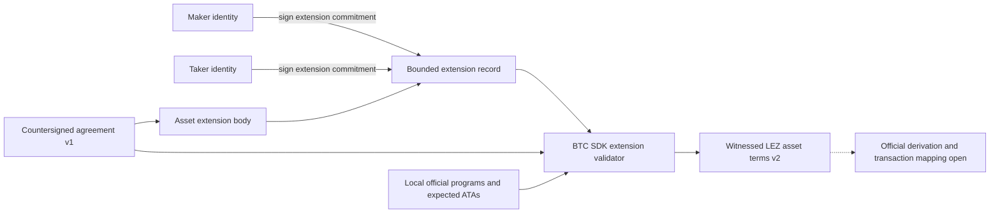
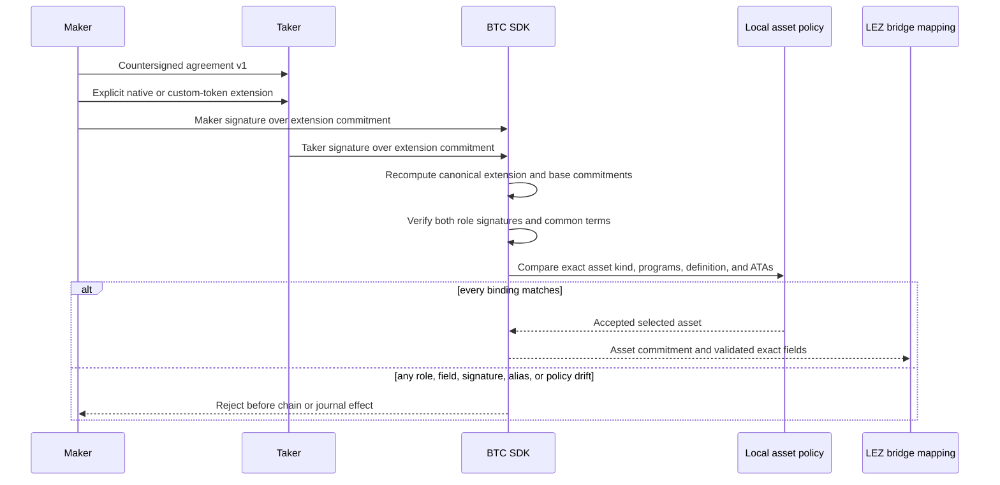

# ADR 0045: Countersign the selected LEZ asset separately from agreement v1

Status: Accepted at the deterministic BTC SDK component boundary. Actor,
sidecar, official ATA derivation, journal, and actual-node composition remain
open.

## Context

The byte-stable LEZ/BTC agreement-v1 body is native-specific. It names the
authenticated-transfer program and native custody account. Reinterpreting
those fields as a Token program or ATA would make a peer and an actor validate
different assets. Adding token fields inside the body would instead change its
canonical bytes, commitment, signatures, and all retained v1 fixtures.

F7 nevertheless requires both roles to authorize the exact selected asset
before either chain effect. A peer-supplied definition or ATA is not safe just
because it is structurally valid; the actor must also compare it with its local
official-program and ATA-derivation policy.

## Decision

Keep every agreement-v1 byte and commitment unchanged. Add a separately
domain-separated, bounded Borsh asset-extension record that contains the exact
base agreement commitment and an explicit `Native` or `CustomToken` variant.
Both the Maker and Taker sign the extension commitment with their existing
agreement identity keys.

The custom-token variant binds the Token and ATA programs, fungible definition,
depositor and claimant owners, their exact ATAs, an independent metadata-owned
custody ATA, amount, refund deadline, aggregate authority account, and aggregate
x-only key. Its custody ATA deliberately does not equal the agreement-v1 native
custody account. Common roles, amount, deadline, and aggregate authority must
still equal the base agreement so there is only one economic interpretation.

Intrinsic validation checks the schema, bounded canonical wire, extension and
base commitments, both signatures, roles, common terms, aggregate key, zero
identities, and aliases. `validate_for_asset` adds the actor-facing exact local
policy check. The official sidecar must still rederive every ATA and pin the
official program IDs before it prepares a transaction.

## Components and trust flow

## Pre-effect validation sequence

## Atomicity and consequences

The extension is an all-fields authorization boundary: no field can be changed
without changing the commitment and invalidating both signatures, and the SDK
does not return a partially validated asset. This is not a cross-chain commit
and does not derive an ATA. Guest-level metadata and token-transfer atomicity
remains ADR 0042; persist-before-send and canonical observation remain actor and
sidecar responsibilities.

The custom variant is boxed so the public enum remains reasonably sized. The
wire remains canonical and bounded. Sixteen agreement tests cover native
compatibility, independent custom custody, every custom field, exact local
policy, cross-agreement and network substitution, aliases, schemas, signatures,
and malformed or trailing wire. Full BTC SDK tests, strict Clippy, rustdoc,
formatting, and diff checks pass.
