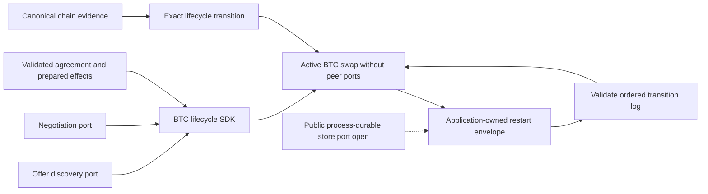
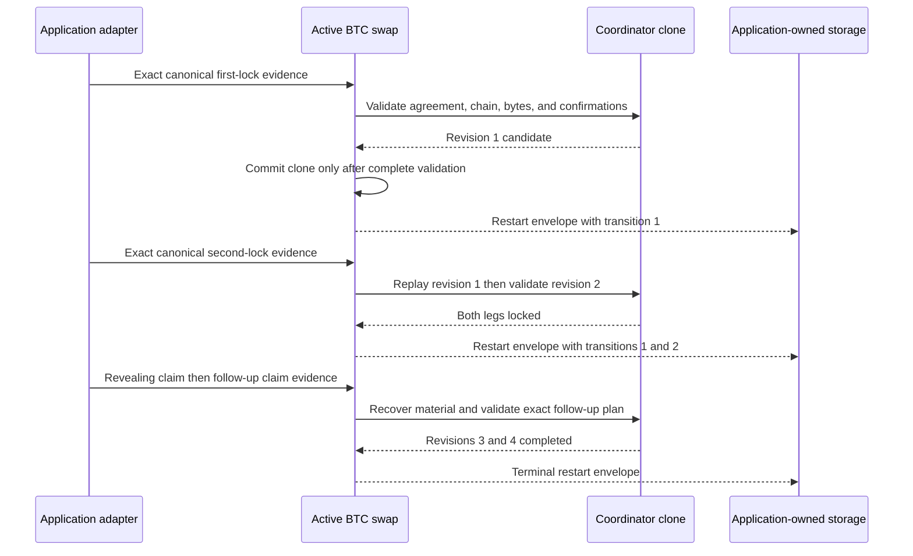
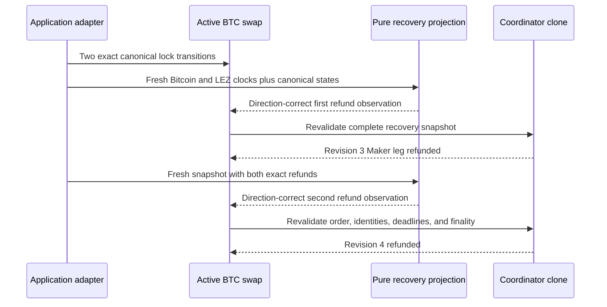

# ADR 0046: Replay the BTC SDK lifecycle from exact validated transitions

Status: Accepted at the deterministic public SDK component boundary. Pushed
`0c78f3d` subsequently closes the public durable codec, exact CAS store
port, typed chain ports/runtime, restart/replay coverage, and lifecycle example.
Production supplies concrete durable storage and persist-before-send journals;
actual-node actor evidence remains a separate composition boundary.

## Context

A stored revision number is not evidence that either chain effect occurred.
The former public BTC facade could resume only revision zero even though the
reference actor and lower components already supported both claims, ordered
refunds, and revisions one through four. Adding setters for a phase or revision
would let corrupted or substituted storage skip validation.

Discovery and negotiation are pre-lock capabilities. Keeping those adapters in
the active swap type would also allow an application to accidentally make
post-lock recovery depend on a peer transport.

## Decision

The pre-lock `BtcLifecycleSdk` composes application-supplied `OfferDiscovery`
and `NegotiationChannel` ports, validates the countersigned agreement, and
activates only complete agreement-bound lock, claim, and signed-refund material.
Activation returns `ActiveBtcSwap`, whose type contains neither pre-lock port.

The active state retains an ordered transition log. Revision one is the exact
Taker first-lock evidence, revision two the Maker second lock, revision three
either the revealing claim or first direction-correct refund, and revision four
either the follow-up claim or second refund. Resume requires the stored revision
to equal the transition count, reconstructs the coordinator from the agreement,
and revalidates every transition in order. Exact historical replay returns the
original revision without adding an effect.

Applying a new transition uses clone, validate, then commit. A validation or
coordinator failure therefore leaves the phase, revision, effect history, and
restart envelope unchanged. This is in-memory atomic mutation, not atomic disk
persistence or a distributed transaction with Bitcoin or LEZ.

## Components and capability boundary

## Claim and restart sequence

## Ordered refund sequence

## Evidence and remaining boundary

External-consumer tests cover both trade directions and both roles through
revisions one to four, claim and refund terminality, resume after every
revision, exact historical replay, atomic failed-transition rollback, role,
agreement, revision, chain, finality, and byte substitution. An in-memory
discovery/negotiation test exercises the public pre-lock ports, and a
compile-fail doctest proves that `ActiveBtcSwap` cannot renegotiate.

The restart envelope in this decision was a validation boundary supplied to
application-owned storage. Pushed `0c78f3d` adds the canonical disk codec,
exact create/CAS contract, and typed runtime without embedding an endpoint or
pretending the reference in-memory store is process-durable. The existing
reference actor retains the concrete persist-before-send and actual-node
evidence; production applications provide their durable store and effect
journals.
