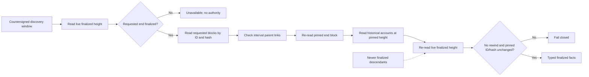
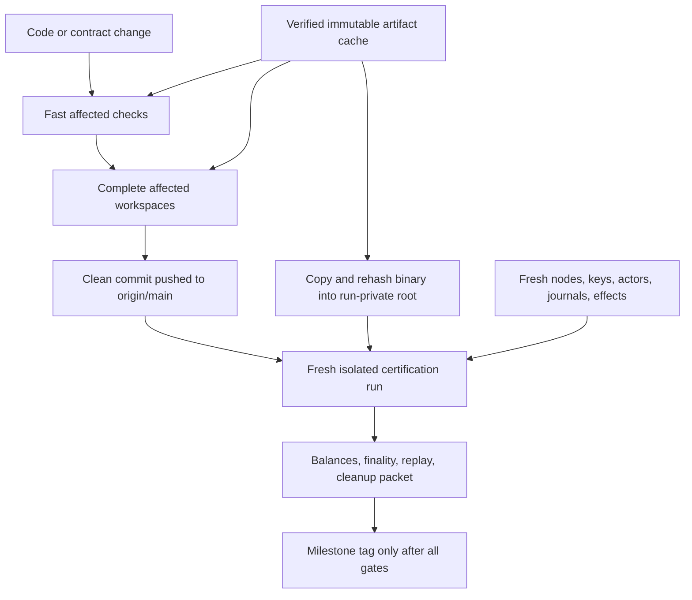

# ADR 0047: Pin finalized windows and separate development from certification lanes

Status: Accepted at the F7 observer and local-runner contract boundaries. Run V
proved one complete actual-node custom-token direction at the one-second slot;
the second direction, immutable wallet cache, and full packet remain open.

## Context

The custom-token runner selected ten-second LEZ slots even though the native
claim runner used one-second slots. This was a test-harness workaround: an F7
observer read from the requested start through the current finalized tip, then
required the tip not to advance while historical account state was read. A
monotonically advancing finalized chain therefore looked like a moving-tip
failure. Run T needed two such retries, and Run U spent thirteen minutes only
reaching the first bootstrap claims. Run U was stopped before new F7 effects and
cleaned exactly rather than spending another estimated thirty minutes on a
known artificial cadence.

The economic safety property is not that the live tip stays still. It is that
the exact requested finalized window and the account state read at its pinned
end cannot be replaced, removed, rewound, or cross-wired while authority is
derived.

The same runner also mixes focused development feedback with full
certification. An official wallet binary is rebuilt in a 2.7 GiB run-private
Cargo target even when its exact bytes are unchanged, while a focused sidecar
test can accidentally enter a network/download build path unless all native
inputs are supplied manually.

## Decision

F7 asset observation reads only the countersigned requested block interval. It
first requires the requested end to be finalized, reads every requested block
independently by ID and hash, checks parent linkage inside the interval, and
re-reads the requested end before returning the snapshot. Historical account
state is read at that pinned height. Afterward the observer re-reads the live
finalized height, rejects a rewind, and independently revalidates the pinned
block by ID and hash. A higher live tip is benign; a changed or missing pinned
block remains fail-closed.

The local custom-token claim lane uses the same one-second slot as the native
claim lane. This changes only deterministic local test cadence. It does not
change protocol deadlines, confirmation requirements, effect ordering,
transaction bytes, finality classification, or production configuration.

Development and evidence use three explicit lanes:

- the fast lane runs affected formatting, lint, unit, focused integration, jq,
  and shell-contract checks without Docker or public I/O;
- the medium lane runs complete affected workspaces and isolated component
  nodes before a push;
- the certification lane starts only from a clean already-pushed commit and
  retains fresh node state, identities, agreements, effects, replay, balances,
  exact cleanup, security gates, and evidence packets.

Immutable compilers, source inputs, native libraries, binaries, and Docker
layers may be content-addressed and shared. Every cache key must bind the exact
source revision, lockfile and source digests, toolchain/target, features,
flags, and native-library identities. A cached official wallet bundle may
contain only its executable and provenance manifest; the executable is copied
into the run-private secure root and rehashed before use. Chain databases,
wallet homes, keys, credentials, nonces, actor stores, journals, agreements,
transactions, ports, Docker resources, and evidence are never shared.

Effect-bearing checkpoint/resume is deferred until after the PoC. A checkpoint
must never grant send authority, and safe reconciliation after an ambiguous
submission is more complex than rebuilding immutable inputs.

## Finalized observation boundary

## Development and certification flow

## Evidence and consequences

The new behavioral RED proved that a one-block requested window incorrectly
became unavailable when the live finalized tip was three blocks ahead and the
irrelevant descendants were not fetched. GREEN reads only the requested
window. Existing tests prove that live advancement is accepted, while
requested-end identity drift and a fork between scan and state remain
fail-closed. The complete sidecar suite has 128 sidecar tests plus five
binary/example tests, and strict all-target/all-feature Clippy is GREEN. The M3
pre-Docker orchestration contract is GREEN at the one-second cadence.

Actual-node validation still must show the same four custom-token LEZ effects,
two Bitcoin effects, terminal balances, zero replay submission, and exact
cleanup in both directions. Run `m3f7compose20260718v` on clean pushed
`4b55dda` proved those properties for `taker_sells_foreign`: Bitcoin funding at
height 103, custom-token initialization/custody/funding, both actors at revision
two, revealing LEZ claim, Bitcoin follow-up claim at height 104, terminal
revision four, custody zero, balances `175/75`, replay with zero resubmission,
and exact cleanup. The same run exposed a schedule bug before reverse stage-two
finalization: overlap allocation had preassigned reverse funding height 104,
which the forward settlement had legitimately consumed. No reverse agreement or
effect existed. Behavioral RED-GREEN now reserves each sequential anchor from
the fresh stable Core tip, while retaining atomic consecutive reservations for
overlap. A complete two-direction run is still required for F7 certification.
