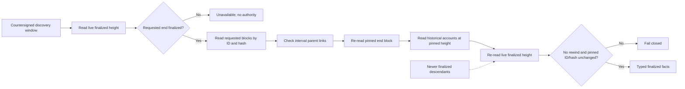
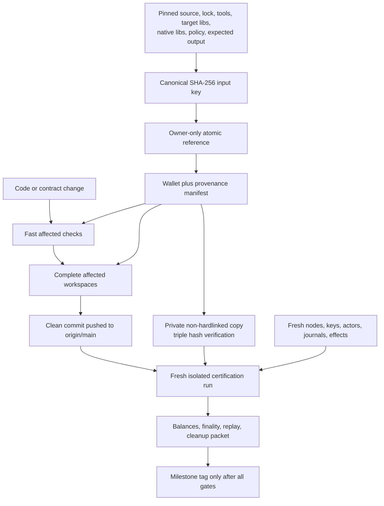

# ADR 0047: Pin finalized windows and separate development from certification lanes

Status: Accepted and actual-node GREEN in both custom-token directions at the
one-second slot. Clean pushed-commit Run X retains the first complete pair. The
immutable wallet cache is implementation- and contract-GREEN with measured
cold/warm production inputs; its clean pushed actor-run integration and the
remaining repeatability packets remain open.

## Context

The custom-token runner selected ten-second LEZ slots even though the native
claim runner used one-second slots. This was a test-harness workaround: an F7
observer read from the requested start through the current finalized tip, then
required the tip not to advance while historical account state was read. A
monotonically advancing finalized chain therefore looked like a moving-tip
failure. Run T needed two such retries, and Run U spent thirteen minutes only
reaching the first bootstrap claims. Run U was stopped before new F7 effects and
cleaned exactly rather than spending another estimated thirty minutes on a
known artificial cadence.

The economic safety property is not that the live tip stays still. It is that
the exact requested finalized window and the account state read at its pinned
end cannot be replaced, removed, rewound, or cross-wired while authority is
derived.

The same runner also mixes focused development feedback with full
certification. An official wallet binary is rebuilt in a 2.7 GiB run-private
Cargo target even when its exact bytes are unchanged, while a focused sidecar
test can accidentally enter a network/download build path unless all native
inputs are supplied manually.

## Decision

F7 asset observation reads only the countersigned requested block interval. It
first requires the requested end to be finalized, reads every requested block
independently by ID and hash, checks parent linkage inside the interval, and
re-reads the requested end before returning the snapshot. Historical account
state is read at that pinned height. Afterward the observer re-reads the live
finalized height, rejects a rewind, and independently revalidates the pinned
block by ID and hash. A higher live tip is benign; a changed or missing pinned
block remains fail-closed.

The local custom-token claim lane uses the same one-second slot as the native
claim lane. This changes only deterministic local test cadence. It does not
change protocol deadlines, confirmation requirements, effect ordering,
transaction bytes, finality classification, or production configuration.

Development and evidence use three explicit lanes:

- the fast lane runs affected formatting, lint, unit, focused integration, jq,
  and shell-contract checks without Docker or public I/O;
- the medium lane runs complete affected workspaces and isolated component
  nodes before a push;
- the certification lane starts only from a clean already-pushed commit and
  retains fresh node state, identities, agreements, effects, replay, balances,
  exact cleanup, security gates, and evidence packets.

Immutable compilers, source inputs, native libraries, binaries, and Docker
layers may be content-addressed and shared. Every cache key must bind the exact
source revision, lockfile and source digests, toolchain/target, features,
flags, effective Cargo configuration, target-library tree, build-tool and
native-library identities, expected output hash, and the validation-policy and
helper hashes. A cached official wallet object contains only its mode-`0500`
executable and mode-`0600` provenance manifest under owner-only directories.
The executable is copied or reflinked, never hardlinked, into the run-private
secure root and the source-before, source-after, and private destination are
rehashed before use. A missing reference is a cache miss; a published invalid
reference, object, mode, manifest, runtime dependency, or hash fails closed
instead of silently rebuilding. Chain databases,
wallet homes, keys, credentials, nonces, actor stores, journals, agreements,
transactions, ports, Docker resources, and evidence are never shared.

Production-mode actor runs reject every cache test override, require a clean
tracked exact HEAD before any prebuild, retain the complete secret-free input
manifest plus object/runtime identities and timing, and prove the helper bytes
did not change from start through packet publication. The cache trusts the
current UID because that UID already controls the checkout and toolchain; it is
not a boundary against another malicious process running as the same UID.

Effect-bearing checkpoint/resume is deferred until after the PoC. A checkpoint
must never grant send authority, and safe reconciliation after an ambiguous
submission is more complex than rebuilding immutable inputs.

## Finalized observation boundary

## Development and certification flow

## Evidence and consequences

The new behavioral RED proved that a one-block requested window incorrectly
became unavailable when the live finalized tip was three blocks ahead and the
irrelevant descendants were not fetched. GREEN reads only the requested
window. Existing tests prove that live advancement is accepted, while
requested-end identity drift and a fork between scan and state remain
fail-closed. The complete sidecar suite has 128 sidecar tests plus five
binary/example tests, and strict all-target/all-feature Clippy is GREEN. The M3
pre-Docker orchestration contract is GREEN at the one-second cadence.

Actual-node validation still must show the same four custom-token LEZ effects,
two Bitcoin effects, terminal balances, zero replay submission, and exact
cleanup in both directions. Run `m3f7compose20260718v` on clean pushed
`4b55dda` proved those properties for `taker_sells_foreign`: Bitcoin funding at
height 103, custom-token initialization/custody/funding, both actors at revision
two, revealing LEZ claim, Bitcoin follow-up claim at height 104, terminal
revision four, custody zero, balances `175/75`, replay with zero resubmission,
and exact cleanup. The same run exposed a schedule bug before reverse stage-two
finalization: overlap allocation had preassigned reverse funding height 104,
which the forward settlement had legitimately consumed. No reverse agreement or
effect existed. Behavioral RED-GREEN now reserves each sequential anchor from
the fresh stable Core tip, while retaining atomic consecutive reservations for
overlap. Run `m3f7compose20260718w` on clean pushed `b872b12` then proved the
fresh reverse anchor 105 after the forward settlement consumed height 104. It
repeated the complete forward result and finalized reverse custom-token
initialization, custody, and funding before both actors projected the first
lock. The next retry guard stopped before reverse Bitcoin submission because it
encoded the native path's exact LEZ effect count of two. Behavioral RED-GREEN
now selects two for native and three for custom token, preserves that count
across retry, and rejects drift in both modes.

Run W measured the remaining safe optimization envelope. Its cold official
wallet build took 2 minutes 7 seconds and produced about 2.7 GiB of run-private
target data. Serialized Core and LEZ readiness took about 36 and 58 seconds, so
starting those already-isolated services concurrently can save approximately
36 seconds, not minutes. Forward stage two through terminal took 5 minutes 32
seconds; reverse stage two through the typed RED took 2 minutes 39 seconds.
The multi-account finalized observation remains the dominant per-effect cost:
the client already issues its three scalar historical reads concurrently, while
LEZ v0.2 reconstructs or queues them independently. Slot times below one second
and JSON-RPC transport batching are therefore not accepted as safe claimed
speedups without upstream snapshot or single-reconstruction support.

Run `m3f7compose20260718x` on clean pushed `422c72e` completed both
directions in 20 minutes 52 seconds from run-root creation through exact
cleanup. Its cold official-wallet build took 2 minutes 2 seconds, corroborating
the cache target. Each direction retained four LEZ and two Bitcoin effects,
terminal revision four, zero replay resubmission, exact directional balances,
and exact non-foreign cleanup. This closes the functional two-direction gate;
the owner-requested fresh repetitions remain certification work.

The implemented official-wallet cache now removes the largest safe repeated
build cost without relaxing any acceptance check. A real production-input miss
under validation policy 2 rebuilt the pinned wallet in 202.42 seconds
(201.41 seconds measured inside the helper), used 856,824 KiB peak RSS, and
reproduced exact SHA-256 `28245d5f...f96e6` at 118,659,320 bytes. The matching
hit took 10.35 seconds (10.31 seconds internally) and 33,844 KiB peak RSS: a
192.07-second, 94.9% wall-time saving and about 804 MiB lower peak RSS. Both
runs had input key `6607d474...ded208`, object-manifest hash
`27945318...63169`, and runtime hash `697c42f8...675c`. These measurements are
honest dirty-tree development performance evidence because the helper itself
was under review; they are not milestone certification. The next clean pushed
custom-token actor run must report `cache_hit: true`, the same pinned wallet,
full input/runtime provenance, unchanged effects/balances/replay, and exact
cleanup before the integration is called certified.
