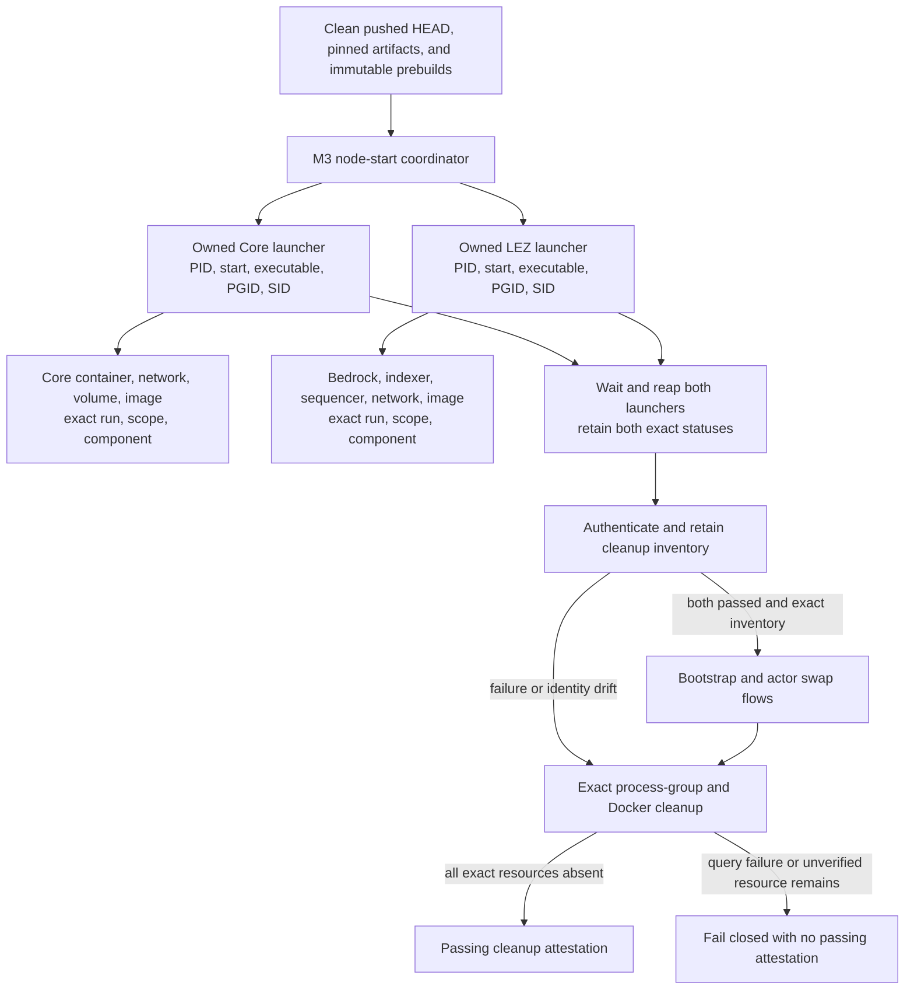

# ADR 0048: Parallelize exact node provisioning

Status: Accepted. The behavioral and repository contracts are GREEN. An exact
clean-pushed-commit actual-node benchmark is required before claiming a measured
successful-run saving.

## Context

The M3 actor runner provisioned Bitcoin Core and the LEZ v0.2 stack
sequentially even though they have disjoint run IDs, Docker resources, state
roots, endpoints, and startup dependencies. Run AA's retained service-log
timestamps measured approximately 39 seconds for Core and 58 seconds for LEZ,
or about 98 seconds including the sequential handoff. Perfect overlap therefore
has a roughly 39-second ceiling; the honest expected saving is 25 to 40 seconds
after host contention.

Starting both launchers in the background is safe only if speed does not weaken
signal handling, exact exit-status capture, process reaping, Docker ownership,
cleanup, executable provenance, or failure evidence.

## Decision

After every immutable prebuild and early artifact check passes, the runner
starts the fixed Core and LEZ service scripts concurrently. Each launcher gets
its own setsid session and process group and is registered immediately by PID,
start ticks, canonical executable, PGID, and SID. INT and TERM are deferred
across both spawn-and-register critical sections, then restored to their exact
130 and 143 exits. Both children are always waited and reaped; one failure never
cancels the other before its exact status is known.

Docker discovery authenticates the exact run, scope, and component labels.
Core owns one container, network, volume, and image. LEZ owns the exact
Bedrock, indexer, and sequencer containers, one network, no volume, and one
image. The service launchers now label their built images and the LEZ network
with fixed scope and component identities. Discovery retains every individually
authenticated resource even when duplicate, overcount, missing-component, or
query checks reject certification. Cleanup removes only those exact identities;
unknown or foreign identities are left untouched and make cleanup evidence fail
closed.

The runner SHA-binds both fixed service launchers from start through terminal
packet publication. No command override, broad Docker cleanup, shared node
state, public RPC, faucet, public peer, or public funds are introduced.

## Startup component flow



The two edges from the coordinator are concurrent. The join is a safety
barrier: no bootstrap, funding, agreement, lock, claim, or refund authority is
created until both service launchers have completed successfully and the exact
resource inventory has reconciled.

## Signal and failure flow

```mermaid
sequenceDiagram
    actor Operator
    participant Runner as M3 runner
    participant Core as Core launcher session
    participant LEZ as LEZ launcher session
    participant Docker as Docker engine

    Operator->>Runner: Start one fresh run
    Runner->>Runner: Defer INT and TERM
    Runner->>Core: Spawn with setsid
    Runner->>Runner: Register exact Core identity
    Runner->>LEZ: Spawn with setsid
    Runner->>Runner: Register exact LEZ identity
    Runner->>Runner: Restore signal exits
    par Independent provisioning
        Core->>Docker: Create exact labelled Core resources
    and Independent provisioning
        LEZ->>Docker: Create exact labelled LEZ resources
    end
    Runner->>Core: Wait and reap exact status
    Runner->>LEZ: Wait and reap exact status
    Runner->>Docker: Discover run labels and authenticate scope/components
    alt Both passed and inventory is exact
        Runner->>Runner: Continue to chain bootstrap and actor flows
    else Child failure, signal, drift, or Docker query failure
        Runner->>Core: TERM then bounded KILL to exact owned session
        Runner->>LEZ: TERM then bounded KILL to exact owned session
        Runner->>Docker: Remove retained exact identities only
        Runner-->>Operator: Fail; attest only proven absence
    end
```

The same-session cleanup checks live PGID and SID membership after TERM and
uses KILL only for a still-live authenticated group. Direct launcher children
are explicitly reaped. A TERM-ignoring descendant must no longer be live;
foreign sessions survive.

## Atomicity and performance consequences

This change does not parallelize chain effects. It ends before guest deployment,
Vault claims, agreement creation, either lock, scalar reveal, claim, or refund.
The existing presign-before-effect, Taker-first, dual-lock-before-reveal,
finality, recovery, and exact replay barriers are unchanged. Cross-chain
atomicity therefore continues to come from adaptor-secret ordering and
deadline-backed recovery, not from process concurrency or a fictional
cross-chain database transaction.

The behavioral harness executes the production coordinator for success, each
single-child failure, both-child failure, INT, TERM, overcount, wrong component,
and Docker-query failure. It proves exact statuses, no sibling cancellation,
both registrations, descendant termination, exact cleanup, foreign survival,
and fail-closed attestation. The pre-change 39/58/98-second measurements remain
the baseline. Documentation must not replace the pending actual-node benchmark
with the theoretical ceiling.

Fresh Run AB on clean pushed `74c58d1` reached the actual-node startup join
with both launchers passed, registered, waited/reaped, exact process groups
absent, and inventory reconciled. It then failed closed at 4 minutes 24.69
seconds because the actor boundary exported the complete
`ID<TAB>bitcoin-core` inventory record as a Docker operand. No direction was
certified and AB is not a successful-run benchmark. The retained failure
attestation reports every exact run-labelled Docker category and the secure
state root absent; a follow-up host audit found no registered PID or listener.

The regression contract first reproduced the missing record parser and then
the tab-whitespace ambiguity. The accepted fix requires exactly one canonical
newline-terminated owner-private non-symlink record, exactly a 12- or
64-character lowercase hexadecimal Docker ID, and the fixed `bitcoin-core`
component. It rejects leading, doubled, or trailing tabs, CRLF, extra bytes or
lines, missing
newline, malformed IDs, wrong mode, symlink, directory, and missing input. The
outer runner revalidates run, scope, and component immediately before actor
handoff; the direction process independently repeats all three live-label
checks before each Core admin call.
