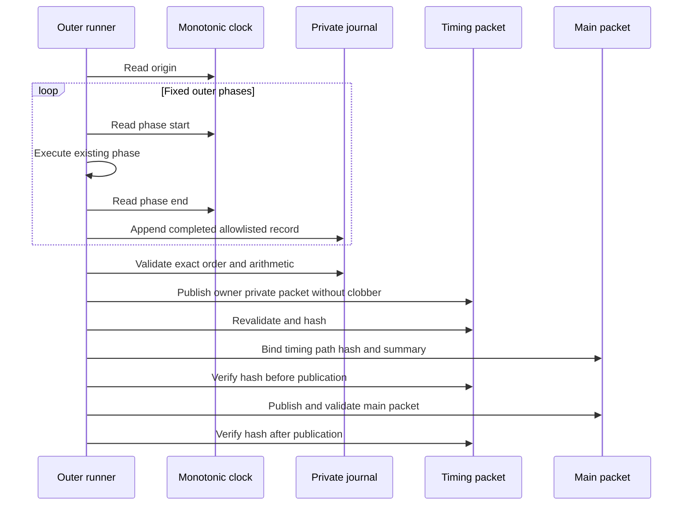

# ADR 0049: Bind monotonic phase evidence

Status: Accepted, implementation GREEN, and measured by clean pushed Run AE.
No new speedup is claimed from the measurement alone; direction-internal
decomposition is the next measurement boundary.

## Context

Run AD proves that concurrent Core and LEZ startup saves 31 seconds, but the
remaining end-to-end variance between Runs AA and AD cannot be attributed from
service log timestamps. Wall-clock timestamps can jump, have one-second
resolution in the retained logs, and do not define the boundaries of actor
preparation, funding, bootstrap, fixture provisioning, or each direction.

The next optimization must follow measured evidence without recording command
lines, endpoints, account identifiers, transaction identifiers, secrets, or
private file paths. Instrumentation must not alter actor retries, finality,
chain-effect order, swap authority, or cleanup ownership.

## Decision

The outer M3 runner is the only timing producer. It reads Linux
`/proc/uptime`, truncates to milliseconds, and accepts only canonical values
within the exact JSON integer range. The origin is captured after the fresh run
directories exist. The runner records these fixed outer phases in order:

1. contract validation;
2. prebuild and immutable assertions;
3. identity and stage-one preparation;
4. concurrent node startup;
5. Bitcoin funding;
6. LEZ bootstrap;
7. F7 fixture provisioning when selected;
8. each sequential direction, or one overlap window; and
9. final effect validation.

The owner-private journal accepts one completed allowlisted record at a time.
Publication rejects missing, duplicate, reordered, overlapping, regressing,
non-integer, extra-field, wrong-direction, wrong-mode, symlink, and existing
destination inputs. The final packet is published with no-clobber semantics.
It contains no child output and no command, endpoint, account, transaction, or
secret field.

The main run packet independently validates the full timing schema, binds its
relative path and SHA-256, and includes only clock, coverage, totals, and phase
count. The runner rehashes the timing packet immediately before and after main
packet publication. Cleanup remains a separate attestation because execution
success and resource cleanup are different certification claims.

## Component flow

```mermaid
flowchart LR
    Clock["Linux proc uptime"]
    Runner["M3 outer runner"]
    Journal["Private phase journal"]
    Validator["Strict timing validator"]
    Timing["Phase timing packet"]
    Main["Main run packet"]
    Cleanup["Cleanup attestation"]

    Clock --> Runner
    Runner --> Journal
    Journal --> Validator
    Validator --> Timing
    Timing -->|"Path and SHA 256"| Main
    Main --> Cleanup
```

## Publication sequence

## Atomicity and swap-safety argument

This decision does not make the two chains transactionally atomic and does not
change the existing atomic-swap construction. Phase begin is a read-only clock
operation. A journal record is appended only after the existing phase returns
successfully. If the process exits during a phase, the record set is incomplete
and no timing or main success packet can be certified. Timing publication is
atomic only at the evidence-file boundary: a complete owner-private partial is
validated and renamed without overwriting an existing final.

Swap atomicity remains derived from the countersigned agreement, adaptor
secret coupling, pre-signed recovery, chain finality, role-local durable
one-attempt journals, and canonical observation described by ADRs 0030 through
0046. Timing values never grant actor authority and are not inputs to a chain
deadline, transaction, signature, CAS, retry, or cleanup decision.

## Consequences

- The next clean actual-node run can identify the longest operator-visible
  phase without inference from unrelated logs.
- Unattributed time remains explicit and prevents phase sums from being
  presented as complete coverage.
- Cleanup duration is intentionally outside the timing total and remains
  independently visible in its attestation and wall-clock run measurement.
- The first timing-enabled clean run is a measurement checkpoint, not proof
  that any newly identified optimization is safe or effective.
- CI runs the focused adversarial timing contract plus the existing actor,
  coordinator, ShellCheck, workflow, Dockerfile, Compose, vulnerability, and
  license policy gates.

## First clean measurement

Run `m3f7compose20260718ae` on clean pushed `a82876d` passed both real
custom-token directions and exact cleanup. Its monotonic packet covers
1,023,100 ms with only 280 ms unattributed. `TakerSellsForeign` took
363,660 ms and `TakerSellsLez` took 405,810 ms, together 75.2 percent of
the measured interval. LEZ bootstrap took 103,820 ms, the F7 fixture 75,400 ms,
node startup 60,110 ms, prebuild 11,700 ms, Bitcoin funding 2,020 ms,
identity/stage one 180 ms, contract validation 80 ms, and effect validation
40 ms. Wall time including evidence publication and cleanup was 1,029.57
seconds.

The run retained revision four for both roles and directions, exactly two
Bitcoin and four LEZ effects per direction, one Maker second lock, zero replay,
zero custody, conserved total 250, and exact `175/75/0` and `75/175/0`
balances. Cleanup reported all exact run resources absent, no broad cleanup,
and no foreign target. The largest safe next question is therefore where each
direction spends time; this ADR does not infer that finality, observation,
actor startup, or evidence validation is responsible.
