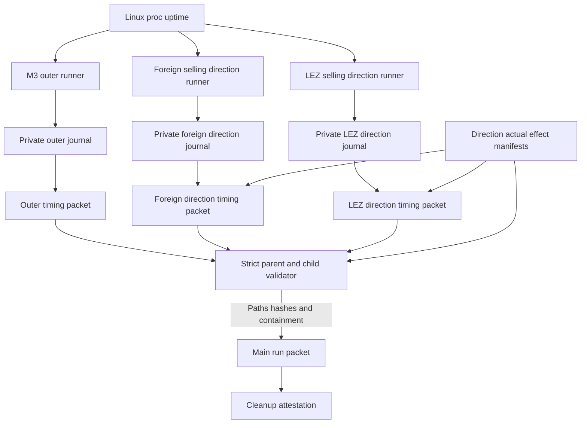
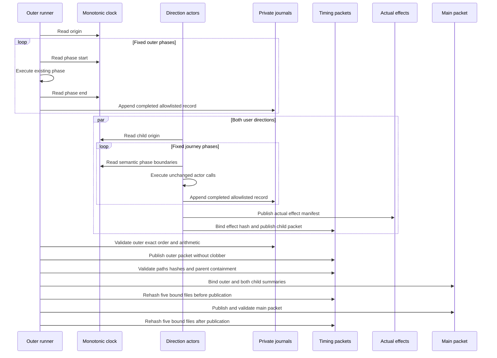

# ADR 0049: Bind monotonic phase evidence

Status: Accepted. Outer measurement is GREEN in clean pushed Run AE; child
semantic timing, strict parent binding, and the complete pinned CI quality
suite are GREEN. A new clean actual-node measurement remains pending. No
speedup is claimed from instrumentation alone.

## Context

Run AD proves that concurrent Core and LEZ startup saves 31 seconds, but the
remaining end-to-end variance between Runs AA and AD cannot be attributed from
service log timestamps. Wall-clock timestamps can jump, have one-second
resolution in the retained logs, and do not define the boundaries of actor
preparation, funding, bootstrap, fixture provisioning, or each direction.

The next optimization must follow measured evidence without recording command
lines, endpoints, account identifiers, transaction identifiers, secrets, or
private file paths. Instrumentation must not alter actor retries, finality,
chain-effect order, swap authority, or cleanup ownership.

## Decision

The outer M3 runner and the two direction runners are independent timing
producers. Each reads Linux `/proc/uptime`, truncates to milliseconds, and
accepts only canonical values within the exact JSON integer range. The outer
origin is captured after fresh run directories exist. It records these fixed
outer phases in order:

1. contract validation;
2. prebuild and immutable assertions;
3. identity and stage-one preparation;
4. concurrent node startup;
5. Bitcoin funding;
6. LEZ bootstrap;
7. F7 fixture provisioning when selected;
8. each sequential direction's funding reservation, stage two, actor flow,
   terminal replay, and custom-token balance read, or one overlap window; and
9. final effect validation.

Each direction captures an origin immediately before final transcript
preparation and records eight fixed happy-claim phases: final transcript;
presign and activation; first lock through revision one; second lock through
revision two; dual-lock gate; revealing claim through revision three;
follow-up claim through revision four; and terminal status/effect evidence.
Survivor, two-lock refund, and first-lock refund use smaller fixed
journey-specific plans. Overlap adds ready, locked, and terminal coordination
phases, for eleven records per direction. It never adds concurrent child
durations as sequential wall time.

All three owner-private journals accept one completed allowlisted record at a
time. Publication rejects missing, duplicate, reordered, overlapping,
regressing, non-integer, extra-field, wrong-direction, wrong-mode, symlink,
unsafe-permission, malformed-effect, and existing-destination inputs. Every
final packet is published with no-clobber semantics. No packet contains a
command, endpoint, account, transaction, actor output, private path, or secret.

The main run packet independently validates the full timing schema, binds its
relative path and SHA-256, and includes only clock, coverage, totals, phase
count, and parent containment. Each child packet binds the current
direction-specific actual-effect manifest SHA-256. The outer runner requires a
sequential child total to fit inside that direction's outer actor-flow phase,
or an overlap child total to fit inside the shared overlap window. It records
the nonnegative parent residual. The runner rehashes the outer packet, both
child packets, and both effect manifests immediately before and after main
packet publication. Cleanup remains a separate attestation because execution
success and resource cleanup are different certification claims.

## Component flow

## Publication sequence

## Atomicity and swap-safety argument

This decision does not make the two chains transactionally atomic and does not
change the existing atomic-swap construction. Every phase boundary is a
read-only clock operation wrapped around the same existing call sequence. A
journal record is appended only after that call sequence returns successfully.
If the process exits during a phase, or if timing publication fails after a
chain effect, the record set is incomplete and no main success packet can be
certified. Cleanup still owns the already-mutated isolated devnet. Timing
publication is atomic only at the evidence-file boundary: a complete
owner-private partial is validated and renamed without overwriting an existing
final.

Swap atomicity remains derived from the countersigned agreement, adaptor
secret coupling, pre-signed recovery, chain finality, role-local durable
one-attempt journals, and canonical observation described by ADRs 0030 through
0046. Timing values never grant actor authority and are not inputs to a chain
deadline, transaction, signature, CAS, retry, or cleanup decision.

## Consequences

- The next clean actual-node run can identify the longest operator-visible
  outer and actor-semantic phases without inference from unrelated logs.
- Unattributed time remains explicit and prevents phase sums from being
  presented as complete coverage.
- Cleanup duration is intentionally outside the timing total and remains
  independently visible in its attestation and wall-clock run measurement.
- The first timing-enabled clean run is a measurement checkpoint, not proof
  that any newly identified optimization is safe or effective.
- CI runs the focused adversarial timing contract plus the existing actor,
  coordinator, ShellCheck, workflow, Dockerfile, Compose, vulnerability, and
  license policy gates.

## First clean measurement

Run `m3f7compose20260718ae` on clean pushed `a82876d` passed both real
custom-token directions and exact cleanup. Its monotonic packet covers
1,023,100 ms with only 280 ms unattributed. `TakerSellsForeign` took
363,660 ms and `TakerSellsLez` took 405,810 ms, together 75.2 percent of
the measured interval. LEZ bootstrap took 103,820 ms, the F7 fixture 75,400 ms,
node startup 60,110 ms, prebuild 11,700 ms, Bitcoin funding 2,020 ms,
identity/stage one 180 ms, contract validation 80 ms, and effect validation
40 ms. Wall time including evidence publication and cleanup was 1,029.57
seconds.

The run retained revision four for both roles and directions, exactly two
Bitcoin and four LEZ effects per direction, one Maker second lock, zero replay,
zero custody, conserved total 250, and exact `175/75/0` and `75/175/0`
balances. Cleanup reported all exact run resources absent, no broad cleanup,
and no foreign target. The largest safe next question is therefore where each
direction spends time; this ADR does not infer that finality, observation,
actor startup, or evidence validation is responsible.

The first RED after Run AE required those five sequential outer subphases
instead of one aggregate direction record. The next RED required fixed
journey-specific child plans, exact schemas, effect-manifest binding,
parent-duration containment, and tamper detection across main publication.
GREEN preserves the exact call order and keeps native overlap as one
concurrent window. Custom-token sequential outer packets contain 18 fixed
phases, native sequential packets 15, and native overlap packets 8. Each happy
sequential child contains 8 semantic phases; each overlap child contains 11.
The next clean actual-node run must measure these packets before any further
optimization is selected.
