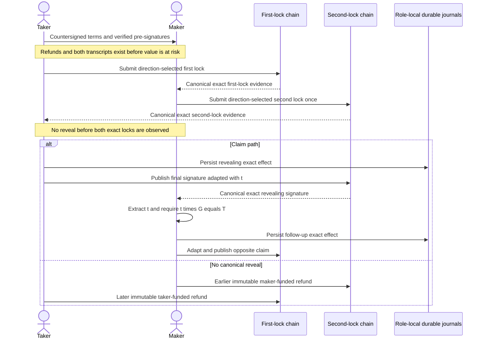

# ADR 0050: Map the BTC adaptor construction to its security properties

Status: Accepted for the M3 engineering-security argument. This is not a
formal proof of the exact two-party implementation and does not replace M7
independent cryptographic review.

## Context

M3 requires BIP-340 adaptor signatures and an explanation of why the two chain
effects remain atomic. The repository has direction-specific claim/refund
sequences, exact commitments, durable actor authority, and actual-node
evidence. It did not state how its operations correspond to the primary
adaptor-signature security vocabulary.

The primary references are:

- [Aumayr et al., *Generalized Channels from Limited Blockchain Scripts and
  Adaptor Signatures*](https://www.iacr.org/archive/asiacrypt2021/130900239/130900239.pdf),
  which defines `pSign`, `pVrfy`, `Adapt`, and `Ext` and requires
  aEUF-CMA security, pre-signature adaptability, and witness extractability;
- [Fournier, *One-Time Verifiably Encrypted
  Signatures*](https://github.com/LLFourn/one-time-VES/blob/2ddc7ca7bc48c7a91b8a596e12a759a666a14deb/main.pdf),
  which treats an adaptor signature as a one-time VES whose decryption key is
  recoverable from its pre-signature and completed signature;
- immutable [BIP-340](https://github.com/bitcoin/bips/blob/8c369ac8e60629ac6c032ffe21bb5ec5b35213d7/bip-0340.mediawiki)
  and [BIP-327](https://github.com/bitcoin/bips/blob/8c369ac8e60629ac6c032ffe21bb5ec5b35213d7/bip-0327.mediawiki).

Aumayr et al.'s standalone definition is for a signing key and hard relation
and points to later work for a two-party extension. Fournier explicitly leaves
two-party encrypted signing outside his formal treatment. Our aggregate MuSig2
transcript therefore cannot inherit either theorem merely because its
operations have the same names.

## Decision

Use the papers as a security-property checklist and construction map, not as a
proof citation. The implemented hard relation is:

    R_DL = { (T, t) | T = t * G and 0 < t < n }

The countersigned agreement commits `T`, both chain messages, role,
direction, Bitcoin genesis and P2TR output, LEZ runtime/program/accounts,
deadlines, and exact effects. Session identifiers and domain tags prevent a
valid transcript for one role, direction, chain, agreement, or message from
being accepted in another.

```mermaid
flowchart LR
    Terms["Countersigned terms<br/>messages, T, roles, chains, deadlines"]
    Shares["Maker and Taker MuSig2 shares<br/>fresh committed nonces"]
    PSign["pSign<br/>two-party adaptor pre-signatures"]
    PVrfy["pVrfy<br/>context, tweak, parity, point"]
    Locks["Canonical Taker lock<br/>then canonical Maker lock"]
    Reveal["Adapt with t<br/>first canonical claim"]
    Extract["Ext from exact pre-signature<br/>and exact final signature"]
    Point["Require extracted t times G equals T"]
    Follow["Adapt opposite-chain pre-signature<br/>follow-up canonical claim"]
    Refund["No canonical reveal<br/>ordered immutable refunds"]

    Terms --> Shares
    Shares --> PSign
    Terms --> PVrfy
    PSign --> PVrfy
    PVrfy --> Locks
    Locks --> Reveal
    Reveal --> Extract
    Extract --> Point
    Point --> Follow
    Locks --> Refund
```

### Exact implementation map

| Literature operation | Repository construction | Required evidence |
| --- | --- | --- |
| Hard statement/witness | `T = t * G`; `T` is agreement-bound and `t` remains role-private until reveal | Reject zero/out-of-range/wrong-point scalars, point substitution, agreement substitution, and cross-session reuse |
| `pSign` | Both roles create BIP-327 nonce commitments and partials for each exact chain message; Bitcoin applies the exact Taproot tweak and output-key parity | Validate both partials and combined adaptor pre-signature before funding; fresh role-local one-use nonces |
| `pVrfy` | Rederive keys, nonce commitments, message, adaptor point, Taproot root/tweak/parity, and pre-signature | Official BIP-340/BIP-327 vectors, immutable swap fixtures, independent verification, negative substitutions, and Core consensus |
| `Adapt` | The revealing claimant combines the exact valid pre-signature with `t` to produce the only accepted final signature for the agreed effect | Final BIP-340 verification under the exact tweaked output key or exact witnessed LEZ aggregate authority |
| `Ext` | The follower combines retained exact pre-signature and observed exact final signature, applies the scheme parity convention, and extracts a scalar | Require `t * G == T` before the scalar enters the opposite claim signer; unrelated/malformed signatures fail closed |
| Follow-up | The point-checked scalar completes the opposite-chain pre-signature without the revealer returning | Both actual-node directions end at revision 4; terminal replay sends zero effects |

LEZ is not treated as a Bitcoin signature domain. Each chain has its own
message, authority, encoding, and verifier. Atomic linkage comes from the same
agreement-bound witness `t`, with independent exact-domain validation before
extraction or adaptation.

### Property and assumption map

| Property | Meaning here | Evidence versus nonclaim |
| --- | --- | --- |
| aEUF-CMA / one-time-VES unforgeability | A pre-signature must not grant an unrelated signature or bypass the witness | Official vectors, independent verification, exact-message negatives, fresh sessions, and consensus are evidence; no aggregate-scheme reduction is claimed |
| Pre-signature adaptability / validity | Every admitted pre-signature can be completed by matching `t` into the exact valid final signature | Positive fixtures cover both reveal orders and Taproot parity; malformed/substituted contexts fail before funding |
| Witness extractability / recoverability | The canonical final signature and retained pre-signature expose a scalar satisfying `T = t * G` | Both domains point-check extraction before follow-up signing; canonical exact signatures and secp256k1 discrete-log hardness are assumed |
| One-time use | Nonce, session, or transcript reuse can destroy security | Role-local journals reserve fresh nonces before exposure and never re-arm consumed or ambiguous sessions |
| Ledger authorization | A valid signature matters only if its exact intended effect is accepted canonically | Core policy/consensus and finalized LEZ program/indexer gates apply; RPC acceptance alone is insufficient |

The construction also assumes secure randomness, uncompromised role keys,
correct pinned libraries, canonical encodings, collision-resistant transcript
hashes, secp256k1 discrete-log hardness, correct Taproot/LEZ execution, and
sufficient canonicality/finality. Plaintext signing material, unaudited
`musig2` internals, or a compromised database owner remain production
risks, not assumptions silently discharged by the PoC.

## Why the composed swap is atomic

Atomicity is conditional rather than instantaneous:

1. both exact pre-signatures and immutable recovery paths exist before the
   first effect;
2. Taker-first ordering prevents Maker risk before canonical first-lock
   evidence;
3. `t` is not revealed before both agreement-bound locks are canonical;
4. taking the revealing asset publishes an exact signature from which the
   follower recovers and point-checks `t`, then claims without cooperation;
5. without a canonical reveal, the maker-funded leg recovers first and the
   taker-funded leg later after the signed safety margin.

Persist-before-send CAS, exact observation, and replay protection preserve
at-most-once local behavior and recoverability; they do not create a distributed
transaction. Deep reorgs, unusable fee policy, unavailable nodes, lost keys, or
a broken cryptographic implementation can reduce liveness or invalidate an
assumption. Those remain QA, chaos, information-security,
production-readiness, and independent-review work.

## Consequences

- Future BTC adaptor changes update this map and the direction-specific system
  sequences.
- Official vectors and project fixtures are mandatory implementation gates,
  but are evidence rather than formal proof.
- The nonexistent DLC Schnorr vector remains GW-M3-001; repository evidence is
  not literal DLC conformance.
- M3 can certify a private local functional PoC only with this nonclaim. Exact
  two-party production acceptance remains an M7 independent-review gate.
