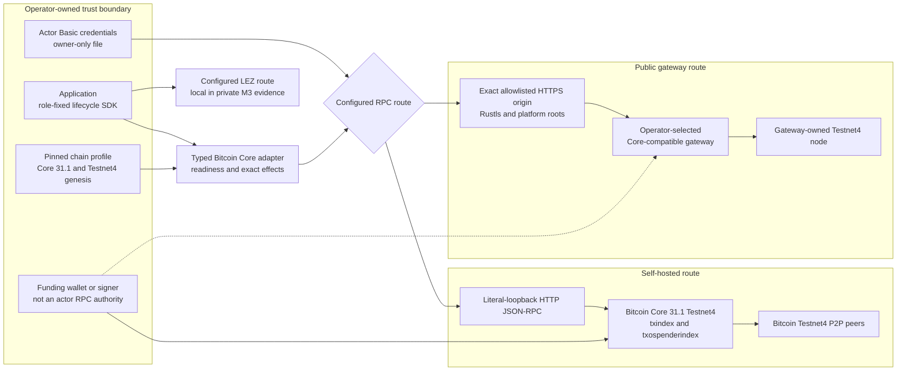
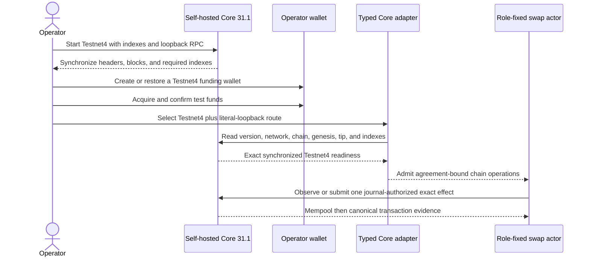
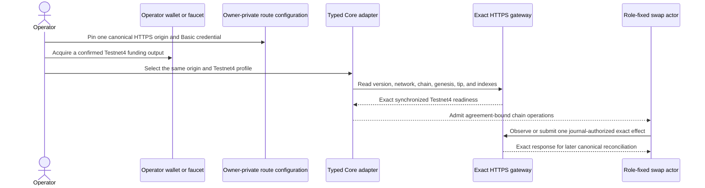

# ADR 0051: Bind Bitcoin Testnet4 routes to the exact chain profile

Status: Accepted for M3 configuration portability. The repository proves the
route and readiness contract without public I/O; live public execution remains
deferred under the private-delivery policy.

## Context

The M3 local compositions use a run-owned Bitcoin Core 31.1 Regtest node. The
accepted proposal also requires an operator to understand self-hosted and
public Bitcoin testnet routes without turning a route change into a silent
chain, authority, or retry-policy change.

A generic URL is insufficient. It can point at Testnet3, Regtest, an
unsynchronized node, an endpoint with missing indexes, or a provider that
changes credentials and request behavior. An application also must not confuse
wallet/mining authority with the restricted RPC authority held by a swap actor.

## Decision

Add an explicit `Testnet4Networked` connectivity profile and two admissible
transport shapes:

1. literal-loopback HTTP with a mode-`0600` Basic credential file for a
   self-hosted Testnet4 node; and
2. one exact, operator-allowlisted, canonical HTTPS DNS origin with a mode-
   `0600` Basic credential file for a Core-compatible gateway.

The HTTPS route is accepted only with `Testnet4Networked`. Regtest profiles
reject it before I/O. Literal loopback remains valid for isolated Regtest and
self-hosted Testnet4. There is no automatic failover between routes.

Both routes require exact Bitcoin Core 31.1 readiness, `chain=testnet4`,
network activity, no initial-block-download or pruning state, equal blocks and
headers, synchronized `txindex` and `txospenderindex` at the same
height, and this three-way genesis equality:

    agreement genesis = observed node genesis = rust-bitcoin Testnet4 genesis

Testnet3's `chain=test` is deliberately rejected.

The wallet arrow is separate because wallet creation, coin acquisition, and
funding are operator actions. Swap actors receive only the RPC methods and
signing material required by their agreement-bound role. The local M3 runner's
provisioner/miner authority remains excluded from actor configuration.

## Self-hosted operator flow

Self-hosting depends on public Testnet4 P2P availability and initial
synchronization unless the operator supplies a trusted snapshot under a
separate policy. The current automated evidence does not use those peers.

## Public-gateway operator flow

The transport rejects HTTP, credentials in the URL, IP literals, localhost,
wildcards, explicit ports, paths, queries, fragments, noncanonical origins,
allowlist mismatches, malformed or oversized routes, and group-readable,
hardlinked, symlinked, changing, malformed, or oversized credential files.
Authorization headers are sensitive and absent from diagnostics. The client has
bounded time, response size, and concurrency and installs no redirect, retry,
proxy, or failover middleware.

## External resources and flakiness

| Resource | Used by automated M3 evidence | Operator impact |
| --- | --- | --- |
| Public Testnet4 peers | No | Self-hosted synchronization can be slow, partitioned, or reorganized; wait for exact readiness and policy confirmations |
| Public Core-compatible gateway | No | Credentials, quota, supported methods, indexes, lag, TLS trust, outage, and ambiguous broadcast are provider risks; do not switch routes or retry a send blindly |
| Testnet4 faucet | No | Availability, rate limits, amount, and returned transaction are untrusted; verify the exact confirmed outpoint through the selected node |
| DNS, platform CA roots, and system clock | No live use; required by the HTTPS route | Resolution, trust-store, certificate, or clock failure must stop the route; no insecure fallback is allowed |
| Public LEZ RPC or faucet | No | Private M3 recordings keep LEZ local; a future public route is a separately pinned and validated configuration |

Automated Testnet4 tests construct clients but perform no DNS lookup, TLS
handshake, RPC, peer connection, faucet request, wallet mutation, or public
transaction. They prove fail-closed portability, not public availability.

## Atomicity and authority consequence

Changing a route does not change agreement bytes, role, genesis, deadlines,
transaction plans, adaptor point, durable CAS, or persist-before-send rules.
Readiness is a precondition, not evidence that an effect is canonical forever.
Claims still require exact canonical signatures and follow-up extraction;
refunds still use the immutable signed order. A gateway cannot grant actor
authority merely by returning success.

The repository does not provide a distributed transaction across Bitcoin and
LEZ. Atomicity remains conditional on the assumptions and sequences in ADR
0050. Reorganizations, unavailable fee inclusion, compromised operator keys,
or a malicious/incorrect endpoint can impair liveness and are later hardening
or production-review concerns.

## Consequences

- A local self-hosted Testnet4 node and a trusted HTTPS gateway share one
  agreement/readiness contract without sharing transport trust.
- Moving to public infrastructure is a configuration and funding change; it
  does not require rebuilding protocol logic or weakening validation.
- Live public deployment, provider selection, faucet use, production custody,
  fee/reorg chaos, and TLS pinning remain explicit nonclaims.
- Operator documentation must show node, wallet, funding, connectivity,
  readiness, and exact no-failover behavior for both route shapes.
