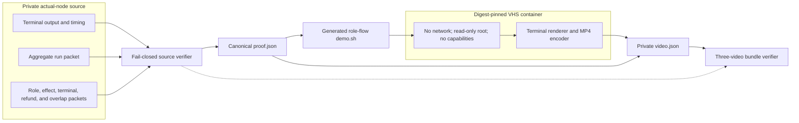
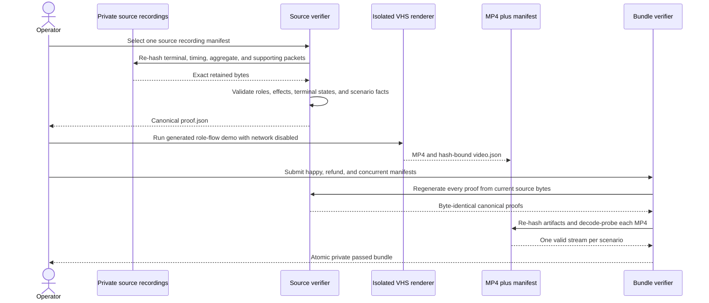

# ADR 0052: Bind private demo videos to actual-node evidence

Status: Accepted and executed for the M3 D1 evidence pipeline. The source and
contract gates, three live private MP4s, complete decode, sampled frames, and
final private bundle `7697a27c...f101ba8` are GREEN.

## Context

RFP D1 requires a recorded demo video for happy completion,
abandonment/refund recovery, and concurrent swaps. A terminal capture or JSON
packet alone is not a video. Conversely, a video rendered from unvalidated
labels can look convincing without proving that the represented Maker, Taker,
node effects, refund order, or concurrency barrier occurred.

The retained M3 runs contain actual Bitcoin Core 31.1 Regtest and LEZ v0.2
private-local evidence for both economic directions. They are authoritative,
private inputs. Rendering must neither rerun the chains nor weaken the evidence
contract, and the final bundle must fail if any source byte changes later.

## Decision

Generate each private MP4 through four explicit components:

1. the source verifier re-hashes the replayable terminal stream, timing file,
   aggregate packet, and every scenario-specific supporting packet;
2. it validates fresh one-shot Maker/Taker roles, exact effect and replay
   counts, terminal states, and either claim, ordered-refund, or overlap facts,
   then emits a canonical private `proof.json`;
3. a generated `demo.sh` animates the two role flows and their exact effect
   identities, while digest-pinned VHS renders it without network access; and
4. the bundle verifier re-runs source verification, requires byte-identical
   proof, re-hashes every output, decode-probes each production MP4, and accepts
   exactly one happy, refund, and concurrent artifact.

The video is a human-viewable projection of actual-node evidence, not a claim
that the renderer itself executed a swap. The source packets remain the
authority.

Every source and output file is a regular non-symlink owner-private file. The
manifest binds source and renderer commits, exact node versions, renderer image
digest, source/proof/demo/tape/video hashes, MP4 size and duration, and explicit
public-resource nonuse. Output paths are one-shot and publication is atomic.

## Verification flow

For refunds, the proof additionally requires no cooperative claim effect,
actor-owned refunds on both chains, exact unique submission counts, signed
Bitcoin maturity or LEZ deadline satisfaction, finalized/confirmed refund
effects, and a measured earlier Maker bound before the later Taker bound. For
concurrency it requires both directions simultaneously at revision two with
distinct agreements, outpoints, stores, journals, signer sessions, escrows,
and deadlines.

## Consequences

- A terminal capture cannot be mislabeled as the final D1 video.
- Source, supporting packet, proof, demo, tape, MP4, and manifest tampering all
  fail final verification.
- Rendering is fast and reproducible from retained evidence and performs no
  blockchain effect or public-network request.
- Pulling the exact renderer image is an external setup dependency; registry,
  DNS, TLS, or rate-limit failure stops setup but cannot change evidence.
- Visual frame sampling is required in addition to automated stream decoding;
  the retained three-video bundle completed that QA because presentation is
  not inferred from an MP4 header.
- The retained execution binds source commit `a6eb1ad` to renderer/verifier
  commit `846ba56`. Happy, refund, and concurrent streams passed complete
  decode and intro, both-direction, scenario/atomicity, and stable-tail frame
  sampling before the mode-`0600` bundle was sealed.
