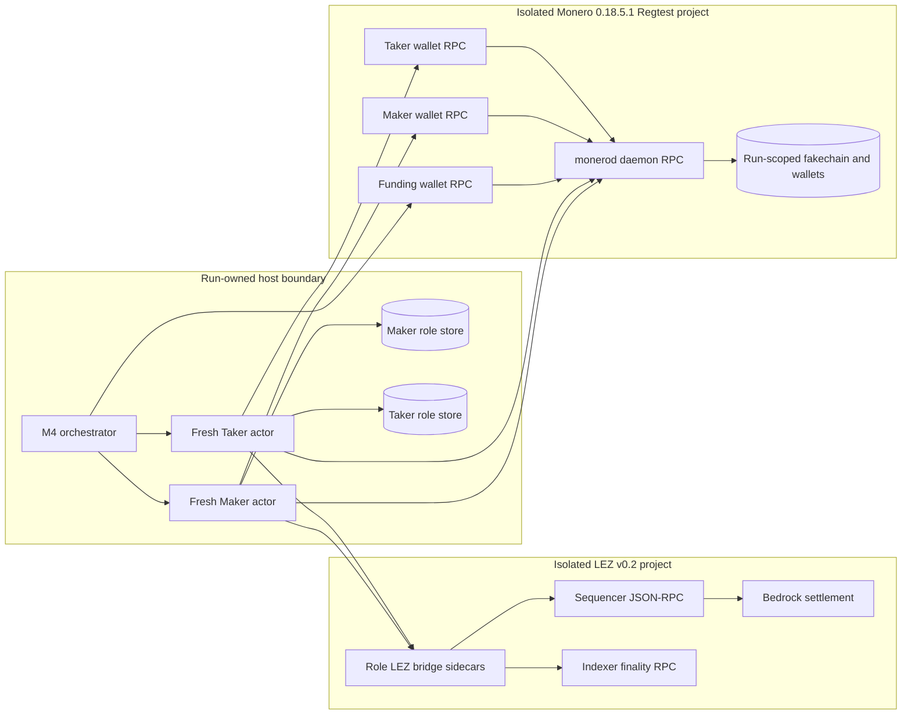
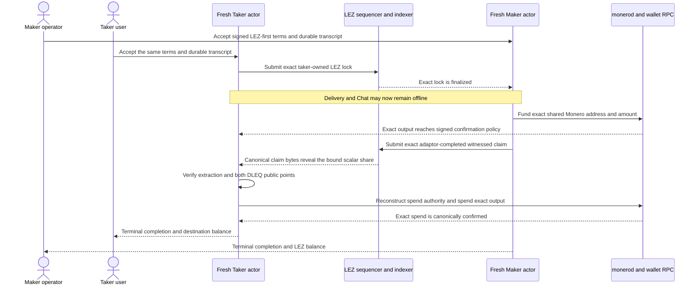

# ADR 0053: Enter M4 through isolated Monero Regtest

Status: Accepted as the M4 progressive local-PoC entry decision. No XMR
functional evidence is claimed by this ADR.

## Context

The live RFP and accepted replacement issue #112 require a LEZ/XMR swap based
on the h4sh3d/COMIT spend-key-share construction. The proposal names six M4
outputs: an XMR LEZ claim update, a full LEZ/XMR SDK including partial-loss
recovery, DLEQ conformance evidence, the U9 stagenet node guide, three D1 XMR
videos, and a self-hosted stagenet `monerod` CI lane.

At M4 entry, the repository has only pair vocabulary, a generic LEZ-refund
event gate, SQLite phase replay, and CLI direction validation. It has no XMR
SDK, DLEQ or adaptor implementation, typed Monero evidence, node adapter,
reference actor, `monerod` or wallet-RPC topology, actual Monero transaction,
M4 CI lane, operator guide, or retained evidence. Synthetic `ChainProof`
strings and arbitrary 32-byte `ClaimEvidence` markers are not M4 evidence.

The named `comit-network/cross-curve-dleq` repository is archived, calls itself
a proof of concept, carries no license declaration or license file, and points
to the maintained 0BSD `sigma_fun` implementation. COMIT's full swap repository
is GPL-3.0. Neither codebase may be linked, vendored, or copied into this
MIT/Apache-2.0 delivery. GW-M4-001 records the literal conformance discrepancy.
GW-M4-002 separately records that the accepted text says “Ed25519 adaptor”
without specifying how that maps to LEZ v0.2's actual BIP-340 aggregate witness
and the h4sh3d scriptable-chain adaptor construction.

## Decision

M4 starts with one narrow, reproducible, actual-node happy path in the only
reviewed direction, `TakerSellsLez`. The PoC must create real effects on an
isolated LEZ v0.2 local chain and an offline Monero Regtest chain. It must use
independent one-shot Maker and Taker processes, role-local stores and keys, and
must continue after Delivery and Chat are absent.

The first implementation boundary is:

1. a pair-specific `lez-xmr-swap-sdk` with typed transcript, share, address,
   amount, output, confirmation, reveal, and recovery records;
2. a narrow Monero daemon/wallet RPC adapter using a maintained permissive RPC
   client and canonical Monero types, with the official wallet used for PoC
   transaction construction rather than custom ring-signature code;
3. a public `xmr-reference-actor` executable whose commands are role-fixed and
   persist complete effect material before one submission attempt;
4. the existing bounded LEZ v0.2 bridge, extended with an XMR-specific
   transcript commitment and exact revealing witnessed claim; and
5. a run-owned orchestrator which provisions both chains, invokes fresh actor
   processes, verifies the ordered public effects, emits secret-safe evidence,
   and deletes only its captured resources.

The cryptographic spike must pin the exact scalar width, byte order, point
encoding, subgroup/identity rejection, transcript domain, adaptor equations,
and extraction equation before the first result is called an atomic swap.
`sigma_fun` 0.9.0 is the leading PoC DLEQ candidate because the archived COMIT
repository redirects to it and it is 0BSD. It is not accepted for production
until its exact graph, known-answer compatibility, negative cases, and review
status are closed. The existing `musig2` adaptor machinery may be reused only
through an explicit XMR transcript mapping; no new curve arithmetic is written.

Official Monero CLI 0.18.5.1 supplies `monerod` and `monero-wallet-rpc`. The
runner verifies the canonical signed hash list and archive SHA-256, then runs
one offline `monerod --regtest --fixed-difficulty 1` plus separate authenticated
funding, Maker, and Taker wallet RPC processes. Every port is selected
dynamically and published only on loopback. Wallet and chain directories are
run-scoped and distinct. Test funds are mined locally, so the PoC uses no peer,
public RPC, faucet, public funds, or external finality service.

The positive-path sequence is deliberately chain-real and user-shaped:

## Atomicity boundary

For the supported happy path, both public keys in the accepted DLEQ transcript
must represent the same nonzero canonical scalar: the secp256k1 adaptor witness
used by the LEZ aggregate signature and the Ed25519 Monero spend-key share. The
Maker cannot receive the taker's LEZ without publishing the exact completed
witnessed claim. Adaptation/extraction from that canonical claim gives the
Taker the share needed to reconstruct the shared Monero spend authority. The
Maker must not reveal until the exact Monero output and confirmation policy are
canonical and all recovery material is durable.

If no canonical LEZ claim appears, the Taker eventually refunds the LEZ lock.
Only that canonical refund event at the signed depth enables the Maker's Monero
recovery path; Monero has no invented script or timeout. Refund, partial-loss,
survivor, restart, reorg, and concurrency execution are required for literal M4
closure but follow the first working PoC under the progressive delivery policy.

This is not a cross-chain database transaction. The safety claim is conditional
on adaptor extractability, DLEQ soundness, exact transcript binding, durable
secret custody, canonical LEZ and Monero observations, and transaction
inclusion. The local PoC proves concrete effects and ordering, not production
cryptographic review, public stagenet availability, or deep-reorg tolerance.

## Evidence and phase gates

The local happy PoC is GREEN only when one command on a clean pushed commit
proves exact source/artifact identities, independent actors, one LEZ lock, one
Monero funding output, one revealing LEZ claim, one reconstructed Monero spend,
both terminal stores, expected balances, zero LEZ custody, zero replay
resubmissions, no public resources, and exact isolated cleanup. A local wallet
transfer without the proven adaptor/DLEQ link is not an atomic-swap PoC.

After the PoC, QA proceeds RED-GREEN-REFACTOR through vector mutations and
subgroup cases, forbidden-direction zero-wire rejection, exact agreement and
output binding, restart at every transition, post-reveal survivor completion,
refund/event-gated recovery, same-direction concurrency, secret-at-rest and
zeroization checks, node/wallet disagreement, scan lag, reorgs, process kills,
timeouts, fees, and flake/coverage measurement. The literal M4 gate then adds
the U9 self-hosted/public stagenet guide, self-hosted stagenet CI lane, three D1
videos, synchronized traceability/review evidence, all security/license/image
gates, clean push, and annotated `m4-complete` tag.
