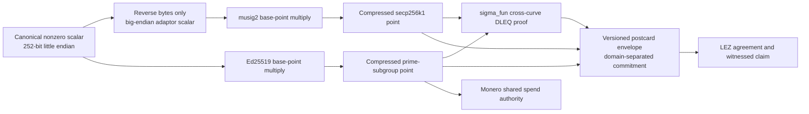
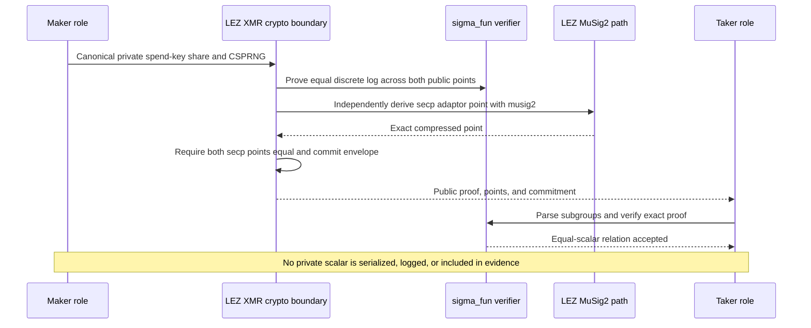

# ADR 0054: Bind the Monero share to the LEZ adaptor point

Status: Accepted for the M4 progressive local-PoC cryptographic boundary. This
does not accept the selected proof library or composed protocol for production.

## Context

The supported M4 direction needs one secret integer to serve two exact roles:
an Ed25519 spend-key share on Monero and the secp256k1 adaptor witness revealed
by the completed LEZ BIP-340 aggregate claim. Treating either public point as an
arbitrary 32-byte marker would not establish that the claimant who receives LEZ
necessarily reveals the share needed to spend the funded Monero output.

The issue names the archived, unlicensed `comit-network/cross-curve-dleq` PoC as
its vector authority. GW-M4-001 records why that source cannot be copied. Its
published parameters and h4sh3d construction point to `sigma_fun` 0.9.0, which
is 0BSD but explicitly experimental. The crate is usable as a narrow PoC
primitive only when isolated behind repository types and independent checks.

The first dependency scan also rejected `bincode` 2.0.1 as unmaintained. M4
does not suppress that advisory. The active proof encoding instead uses pinned
`postcard` 1.1.3 with the proof's Serde representation. `cargo deny check`
confirms that bincode is not reachable in the selected feature graph even
though Cargo records optional upstream packages in the lock file.

## Decision

Represent the shared integer as one nonzero canonical 252-bit little-endian
value. Reject zero, any set upper nibble, and any noncanonical Ed25519 scalar.
The same bytes are reversed into the big-endian scalar expected by the existing
`musig2` adaptor API; no modular reduction or new curve arithmetic is allowed.

Create a version-1 public envelope containing the compressed secp256k1 point,
compressed Ed25519 point, a proof no larger than 128 KiB, and a domain-separated
SHA-256 commitment over the schema, both points, proof length, and exact proof
bytes. Verification parses the secp point through both `musig2` and
`sigma_fun`, rejects identity/torsion/noncanonical Ed points, decodes the entire
bounded proof with postcard, verifies the cross-curve relation, and rederives
the commitment.

The wrapper uses the public auxiliary generators documented by the
h4sh3d/COMIT construction. These are mathematical protocol parameters, not
copied source. The deterministic scalar-one spike independently requires the
standard public basepoints:

- secp256k1: `0279be667ef9dcbbac55a06295ce870b07029bfcdb2dce28d959f2815b16f81798`;
- Ed25519: `5866666666666666666666666666666666666666666666666666666666666666`.

With RNG seed `53` repeated 32 times, the current proof is 56,611 bytes,
SHA-256 `0634e8a021bde0d9dd8461d0a8ccd1c56f85ec790b21ba78be27404d4121afe6`,
and envelope commitment
`b9169740ae7b7a91b5c2e7971896a86b64286dbda218d711587109d2941852c8`.
These values are reproducible PoC evidence, not yet the independent conformance
corpus required for M4 closure.

## Atomicity effect

This decision establishes only the public hard relation needed by the later
swap: a scalar extracted from the exact completed LEZ adaptor signature must
map to the same Ed25519 public share admitted into the Monero shared address.
It does not yet prove adaptor pre-signature validity, extraction, addition to
the Taker's retained Monero share, or a real Monero spend. Those operations must
be agreement-bound and executable before M4 may claim a happy atomic swap.

Atomicity remains conditional on both locks being exact and canonical before
reveal, the completed LEZ witness being extractable, the DLEQ proof being sound,
the reconstructed Monero authority spending the funded output, and the no-reveal
refund paths remaining live. A DLEQ proof alone moves no value and provides no
cross-chain commit.

## Consequences

- The new `lez-xmr-swap-sdk` is pair-specific and exports no upstream curve
  types or private scalar bytes.
- `sigma_fun`, `secp256kfun`, and its arithmetic macro have exact version-scoped
  0BSD exceptions; broad 0BSD acceptance is intentionally not enabled.
- GPL and unlicensed COMIT implementations remain external behavioral oracles
  only, subject to provenance approval; no source or fixture is incorporated.
- The next vertical slice binds this envelope to exact agreement fields and the
  LEZ adaptor lifecycle, then proves reconstruction through official Monero
  Regtest wallet and daemon RPCs.
- Post-PoC RED-GREEN work must add immutable positive/negative vectors,
  mutations, subgroup/endian/domain substitutions, adapt/extract failures,
  fuzzing, timing/reachability review, and independent cryptographic review.
