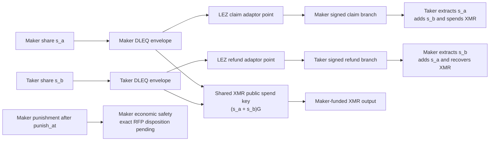
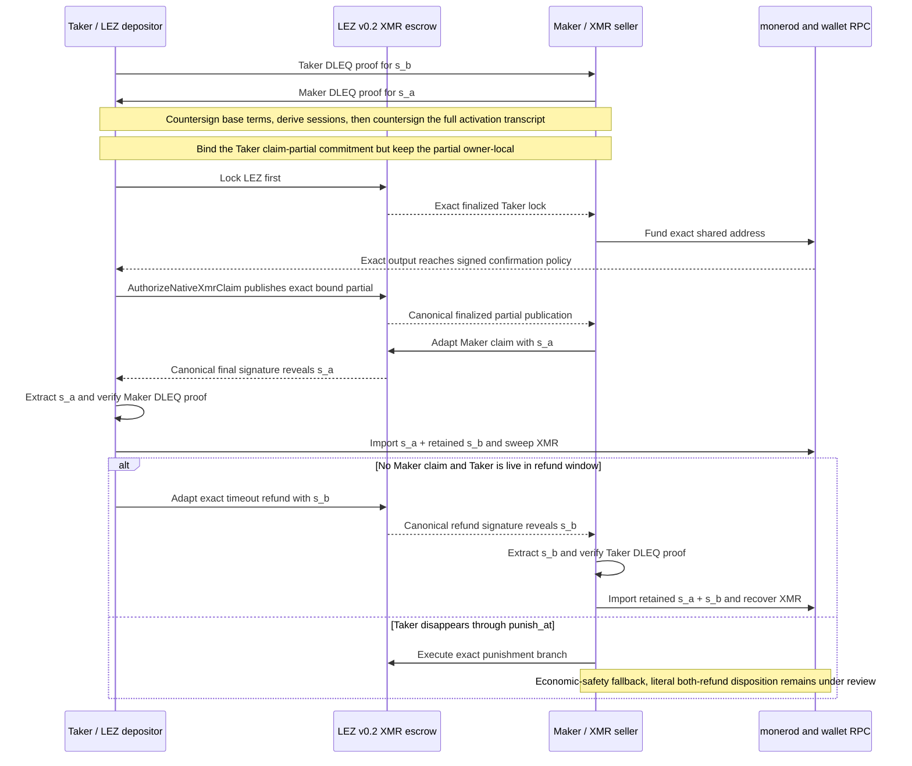

# ADR 0055: Preserve XMR atomicity with dual reveal branches

Status: Accepted for the M4 local-PoC design. The successful claim branch now
has actual local working-tree evidence through finalized LEZ claim, adaptor
extraction, and official-wallet sweep. The dual-reveal recovery branch, exact
committed replay, and milestone certification remain open.

## Context

The h4sh3d/COMIT construction uses two private Monero spend-key shares, not one.
The Maker/XMR seller retains `s_a`; the Taker/LEZ depositor retains `s_b`. Both
roles prove that their standard-basepoint Ed25519 share and secp256k1 adaptor
point have the same discrete logarithm. The funded Monero address uses
`(s_a + s_b)G` as its public spend key.

Two different LEZ signatures disclose the missing share to the surviving role:

- the Maker claim is adapted with `s_a`; the Taker extracts `s_a`, adds retained
  `s_b`, and spends the Maker-funded Monero output;
- the Taker timeout refund is adapted with `s_b`; the Maker extracts `s_b`, adds
  retained `s_a`, and recovers the Monero output.

The existing generic LEZ v0.2 refund is fixed-destination and permissionless,
but unsigned. It contains no `s_b`-bound witness and therefore cannot authorize
Maker Monero recovery. Reusing that refund while claiming event-only share
recovery would be synthetic atomicity.

A second sequencing hazard exists on the happy path. The Maker already knows
`s_a`. If it receives the complete aggregate claim presignature before its XMR
lock is canonical, it can adapt the signature and receive LEZ without funding
Monero. The Taker's claim partial must remain owner-local until the exact shared
XMR output reaches the signed confirmation policy.

## Decision

M4 uses the additive XMR-specific LEZ lifecycle in ADR 0057 so M2/M3 instruction
and metadata tags remain unchanged:

1. both DLEQ envelopes, the shared address, view-key commitment, XMR amount and
   confirmation policy, exact LEZ claim/refund messages, and refund/punish
   windows are countersigned before the Taker's first lock;
2. claim and refund use distinct participant keys, aggregate authority
   accounts, adaptor session IDs, and nonce material;
3. before the first lock, the base agreement derives both sessions, then a
   countersigned activation record binds both nonce transcripts, the exact
   Taker claim-partial commitment, and every LEZ initialization argument;
4. after the Taker independently proves the exact Maker XMR lock at the signed
   depth, it publishes the matching partial through signed LEZ instruction
   `AuthorizeNativeXmrClaim`; the Maker retrieves the canonical LEZ bytes and
   may then aggregate and adapt the claim only with `s_a`;
5. the `s_b`-bound refund presignature may be complete before funding because
   the LEZ program rejects it before `refund_at`; during
   `refund_at <= now < punish_at`, only the exact Taker refund signature is
   valid; and
6. after `punish_at`, a Maker punishment branch is required if the Taker
   disappears without revealing `s_b`. That branch preserves Maker economic
   safety in the cited construction, but its exact relationship to RFP F6's
   literal “both complete or both refund” wording is tracked as GW-M4-003 and
   remains outside the current executable claim.

## Atomicity and current evidence

On the claim branch, the Maker cannot receive LEZ before the guest records the
Taker's agreement-bound publication, and the final claim still puts `s_a` in
the canonical signature. The Taker cannot obtain the XMR spend key without
that same scalar. Delaying the publication until canonical XMR funding removes
the interval in which the Maker could claim LEZ first, while publishing it on
LEZ satisfies the RFP rule that no off-chain channel is required after the
first lock.

On the signed-refund branch, the Taker cannot reclaim LEZ without putting
`s_b` in the canonical signature, and the Maker cannot recover XMR without that
same scalar. Distinct session IDs prevent a valid nonce, partial, or final
signature from crossing between claim and refund.

The activation commitment proves that a later publication matches the hidden
Taker partial, but it does not prove before Maker funding that the hidden bytes
are a valid claim-session partial. A malicious Taker can therefore commit
garbage or withhold publication and force the later punishment branch. The
local PoC must reject an invalid publication and demonstrate that it cannot
reach claim; it must not describe this grief/penalty outcome as literal F5/F6
atomicity. Production requires reviewed verifiable-encryption or zero-knowledge
validity evidence, or explicit protocol-owner acceptance of the punishment
model. This residual is part of GW-M4-003.

The SDK currently proves both scalar/public-point relations, bounded canonical
proof exchange, both addition orders, and equality with the shared public spend
key. Development run `m4-xmr-key-wallet-20260719f` additionally funded the
deterministic shared address through official Monero 0.18.5.1, rebuilt the
Taker wallet using `generate_from_keys`, and spent transaction
`2bda3675fed4dd5d5428e889ab5794f5c9a91942bc99ad31aa600198653949e9`
after ten local confirmations. That proves the official-wallet reconstruction
behavior, not the missing LEZ branches or an atomic swap.

## Consequences

- One Maker proof plus a raw Taker Ed25519 point is insufficient for atomic
  setup; both public shares require DLEQ envelopes.
- The generic permissionless LEZ refund remains valid for other pairs but is
  not an XMR recovery proof.
- The proven M3 adaptor implementation now lives behind pair-neutral
  `lez-adaptor-signature` with BTC compatibility re-exports. M4 can depend on
  the leaf without importing the BTC SDK.
- Claim-partial release becomes a signed, canonical LEZ effect after XMR
  confirmation, not an off-chain post-lock message.
- A linked happy transfer may be documented as conditionally atomic for the
  successful branch, but not as complete recovery atomicity or milestone
  certification before refund and punishment execution.

## Working-tree actual-local evidence update

The successful reveal branch is now actual local working-tree evidence: finalized Maker tag 15 exposed the Maker adaptor share, and the Taker extracted it before reconstructing and sweeping the Stage-A Monero output. The signed tag-16 Taker-refund reveal and tag-17 punishment paths remain unexecuted, so literal both-refund conformance and full recovery atomicity are not claimed.

This is not milestone certification. The public packet is [m4-actual-claim-poc-20260721.json](../evidence/m4-actual-claim-poc-20260721.json), explicitly pending exact committed-tree replay and scoped cleanup. Signed recovery, F7, U9, D1 XMR, and post-PoC hardening remain.
