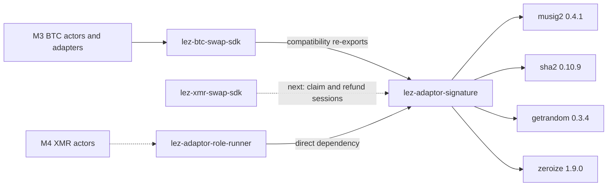

# ADR 0056: Extract pair-neutral adaptor signatures

Status: Accepted and executed for the M4 local-PoC foundation. BTC API
compatibility and the durable role-process journeys are regression-proven; the
M4 agreement has not yet bound its claim/refund sessions.

## Context

M3 proved the required two-party MuSig2 adaptor operations, but their
implementation lived inside `lez-btc-swap-sdk`. Making M4 depend on that pair
SDK would create a false Bitcoin ownership boundary and tempt parallel
cryptographic implementations. Copying the module would split fixes and test
evidence across two security-sensitive implementations.

The existing public API already exchanges canonical byte arrays. Its only
pair-specific surface is the optional Taproot constructor; untweaked LEZ
sessions and secret/nonce/adapt/extract operations are otherwise reusable.

## Decision

Move the implementation and its tests unchanged behind leaf crate
`lez-adaptor-signature`. The leaf has no workspace dependencies and depends
only on exact-pinned `getrandom`, `musig2`, `sha2`, `thiserror`, and
`zeroize`. It therefore cannot depend cyclically on a pair SDK, actor, store,
or chain adapter.

`lez-btc-swap-sdk` explicitly re-exports the same fifteen public items from
the leaf, preserving existing top-level imports. The durable
`lez-adaptor-role-runner` depends on the leaf directly. M4 may use that same
crate and runner for distinct claim and refund sessions without importing the
BTC SDK.

The move replaces `bitcoin::hashes` with standard `sha2` so the leaf has no
Bitcoin dependency. A characterization test fixes the exact durable-context
and nonce-commitment bytes across that change.

Solid edges are executable. Dashed M4 edges are the next composition slice and
must not be read as completed actor or agreement evidence.

## Consequences

- one implementation owns nonce commitments, role ordering, partial signing,
  aggregation, adaptation, extraction, point checks, and final verification;
- BTC consumers remain source-compatible and keep the Taproot constructor;
- M4 cannot silently route Monero through Bitcoin protocol types;
- the leaf still exposes `Zeroizing<[u8; 32]>`, so all consumers pin the same
  `zeroize` version; and
- semantic renaming or a generic N-party redesign is deferred because it would
  expand risk without helping the two-role M4 PoC.

The extraction gate includes ten leaf tests, two independent adaptor-vector
tests, sixteen BTC agreement tests, thirty-two BTC SDK facade tests, four
fresh-process runner tests, and direct BTC consumer compilation/tests. These
prove compatibility of the move; they do not prove M4's missing agreement,
post-confirmation claim gate, signed refund, punishment, or actual-node swap.
