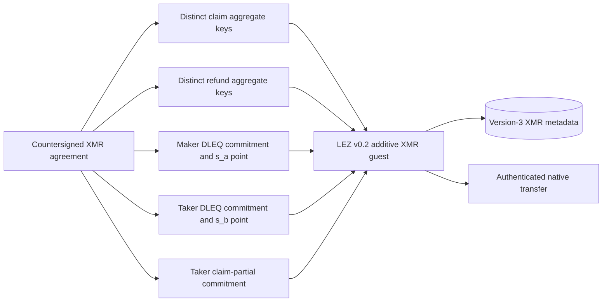
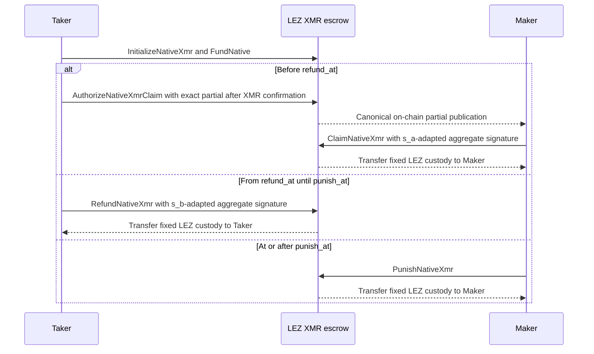

# ADR 0057: Append XMR-native escrow branches

Status: Accepted and source-executed for the M4 local PoC. Fourteen focused
guest tests pin the legacy wire and the new state transitions. The checked
guest artifact, bridge surface, and actual-node branches remain pending.

## Context

The current LEZ v0.2 guest has thirteen instruction tags, numbered 0 through
12. Its generic native refund is deliberately unsigned and permissionless. It
can safely return M2/M3 custody to the immutable depositor, but it cannot reveal
the Taker's Monero share `s_b`.

M4 needs three mutually exclusive terminal branches after native LEZ funding:

- Maker claim before `refund_at`, with a final aggregate signature adapted by
  Maker share `s_a`;
- Taker signed refund from `refund_at` until `punish_at`, adapted by Taker
  share `s_b`; and
- Maker punishment at or after `punish_at` if the Taker abandons the refund
  window.

A separate XMR guest would preserve the old code-derived program ID, but would
duplicate native custody transfers, recursive authenticated-transfer calls,
deployer assembly, sidecar decoding, observation, and security gates.

## Decision

Append five XMR-native instructions after every existing declaration:

| Tag | Instruction | Authority | Validity window | Fixed destination |
|---:|---|---|---|---|
| 13 | `InitializeNativeXmr` | Taker depositor | before `refund_at` | N/A |
| 14 | `AuthorizeNativeXmrClaim` | Taker depositor | before `refund_at` | N/A |
| 15 | `ClaimNativeXmr` | claim aggregate account | before `refund_at` | Maker |
| 16 | `RefundNativeXmr` | refund aggregate account | `refund_at..punish_at` | Taker |
| 17 | `PunishNativeXmr` | Maker claimant | `punish_at..` | Maker |

Existing tag 2 `FundNative` may fund valid version-3 XMR metadata after an
explicit authority/version check. Every other existing tag and argument/account
order remains byte-identical.

Append `ClaimAuthority::XmrDualAdaptor` as Borsh variant 2. It binds separate
claim and refund aggregate x-only keys/accounts, both DLEQ transcript
commitments, an exact claim-session transcript binding, the Taker
claim-partial commitment under that binding, and `punish_at`.
Existing authority variants 0 and 1 and all top-level `EscrowMetadata` fields
remain unchanged. XMR metadata uses version 3; existing M2/M3 metadata remains
version 2.

Claim and refund use different participant signing keys, aggregate accounts,
messages, session IDs, adaptor points, and nonce reservations. The claim
adaptor point is Maker's DLEQ-bound `s_a` point. The refund adaptor point is
Taker's DLEQ-bound `s_b` point. The generic unsigned refund must reject
`XmrDualAdaptor`, preventing a bypass that returns LEZ without revealing
`s_b`. `ClaimNativeXmr` additionally requires status `XmrClaimAuthorized`.
Only the Taker depositor can publish the exact precommitted partial through tag
14 after observing the XMR lock. The guest checks
`SHA256("logos.gateway.lez-xmr.claim-partial-commitment.v1\0" ||
claim_partial_context_binding || partial)`, where Stage B derives the binding
from Stage A, the claim context, both nonce transcripts, and the Maker claim
partial. This avoids an activation-hash cycle and rejects cross-session
transplantation. Publication is an on-chain handoff, not a post-first-lock
off-chain dependency.

The canonical tag, ordered accounts, unsigned message, aggregate signer, final
signature, containing block, metadata, and custody state must be observed.
Adaptor extraction additionally requires the exact persisted presignature; a
transaction signature alone does not reveal a scalar.

## Consequences

- golden tests pin tags 0–17 and representative pre-M4 metadata bytes;
- claim-before-publication, wrong-partial, wrong-publisher, legacy-claim, and
  unsigned-refund bypasses fail closed;
- branch-boundary tests cover `refund_at - 1`, `refund_at`,
  `punish_at - 1`, and `punish_at`;
- recursive tests prove init/fund/claim, init/fund/signed-refund, and
  init/fund/punish plus transfer-failure rollback;
- bridge methods are additive version-3 operations rather than widened
  untagged version-1/version-2 JSON;
- rebuilding changes the ELF hash, image/program ID, and deployment evidence,
  so the M4 runner requires a fresh checked local deployment; and
- M2/M3 source/wire compatibility remains a mandatory regression gate, but
  their already certified deployed program identity is not reused for M4.

GW-M4-003 tracks why the punishment branch is economic safety under the cited
COMIT construction rather than literal RFP F5/F6 refund conformance.
