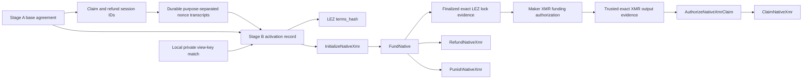
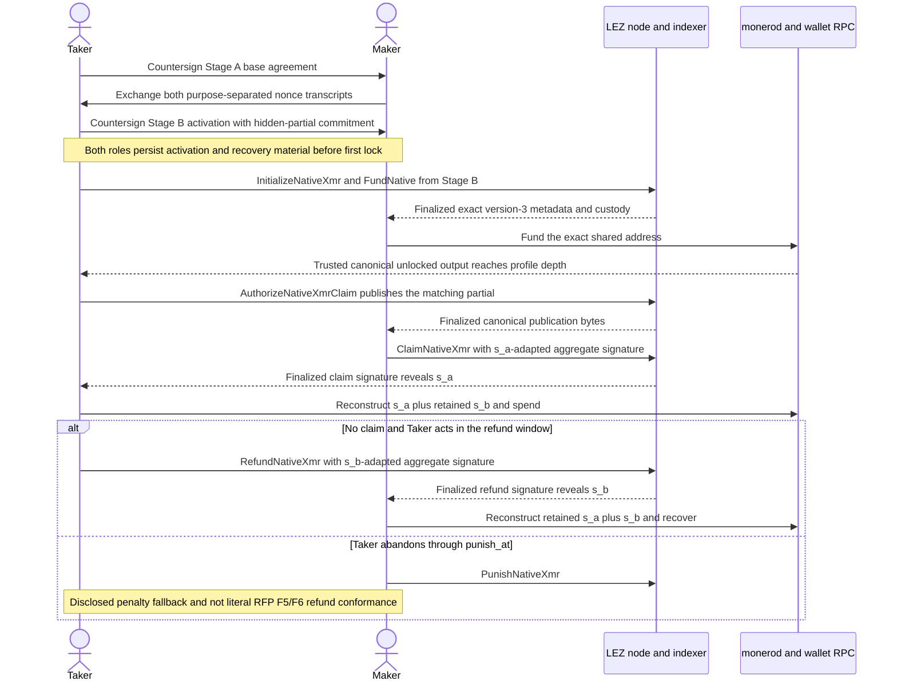

# ADR 0058: Activate XMR swaps in two countersigned stages

Status: Accepted and source-executed for M4. The canonical Stage-A agreement,
Stage-B activation, structural LEZ-lock/cutoff validation, LEZ guest publication
gate, and strict additive v3 bridge protocol pass focused source tests. Trusted
LEZ and Monero adapters, the fresh checked artifact, bridge runtime, and
independent actors remain in progress.

## Context

The claim and refund adaptor session IDs must be derived before either party
creates nonce material or partial signatures. A single agreement commitment
cannot also contain the Taker claim-partial commitment: that partial depends on
the session ID, so including it in the session's own commitment is circular.

The first LEZ lock creates a second constraint. RFP Reliability 2 and Gateway's
accepted submission require every later step to use only local durable state
and chain nodes. The Taker cannot deliver its claim partial to the Maker through
Chat or another off-chain channel after the first lock. Conversely, giving the
Maker that usable partial before funding XMR lets the Maker adapt the claim with
its already known share `s_a` and take LEZ early.

## Decision

M4 separates negotiation from activation.

Stage A is a canonical base agreement countersigned with distinct Maker and
Taker agreement keys. It binds:

- the fixed `TakerSellsLez` direction, swap ID, and exact named parameter
  profile;
- three non-aliased secp256k1 keys per role for agreement, claim, and refund;
- both canonical DLEQ envelopes and their transcript commitments;
- the Monero network/genesis, shared address and public keys, exact amount, and
  confirmation policy;
- the LEZ channel/genesis, escrow and authenticated-transfer programs, exact
  role/accounts/PDAs, amount, and finality policy; and
- the funding cutoff, refund and punishment boundaries, minimum reaction
  margin, and purpose-separated LEZ messages.

Only the Stage A commitment derives the distinct claim and refund session IDs.
BIP-340 x-only parity aliases and any DLEQ adaptor point reused as an agreement,
claim, or refund signing key are rejected.

Stage B is a separate canonical activation record countersigned by both Stage A
agreement keys. It binds the Stage A commitment, both adaptor-context bindings,
both roles' claim and refund nonce commitments and public nonces, the validated
Maker claim partial, a transcript binding plus commitment for the still-hidden
Taker claim partial, and both validated refund partials/presignature. Each role
must locally prove that its retained private Monero view key opens the Stage A
public view key before countersigning activation.

The claim-partial context binding is derived without the hidden partial:

```text
SHA256("logos.gateway.lez-xmr.claim-partial-context.v1\0"
  || base agreement commitment
  || claim context binding
  || both claim nonce commitments
  || both claim public nonces
  || Maker claim partial)
```

The guest stores that binding and
`H("logos.gateway.lez-xmr.claim-partial-commitment.v1\0" || binding || Taker
claim partial)`. The Stage B activation commitment becomes guest `terms_hash`.
A Stage A agreement alone cannot produce a first-lock plan.



After the first lock, no peer channel is required:



The target chain-evidence boundary is capability-bearing, not a caller-set
status enum. The next bridge runtime/adapter slice must mint exact finalized version-3
LEZ metadata/custody evidence before Maker XMR funding, an exact Monero
observation before the Taker's one-shot LEZ publication, and finalized matching
publication evidence before Maker claim. The current SDK's structurally
validated candidate and public raw adaptor bindings are not lifecycle
authority.

## Consequences

- Activation adds one countersigned pre-lock round but removes the commitment
  cycle and binds every first-lock input.
- Claim-partial publication is canonical LEZ data, so recovery survives loss of
  Chat and fresh-process restart.
- A hidden-partial hash proves later consistency, not pre-funding validity. A
  malicious Taker can commit invalid bytes or withhold publication and force
  punishment. GW-M4-003 retains the required production disposition and
  verifiable-encryption/ZK review.
- Named accelerated Regtest may shorten wall time without weakening the exact
  two-chain order or ten-confirmation XMR policy. Stagenet uses the reviewed
  public-testnet profile.
- M4 requires a fresh checked guest artifact and program ID. Certified M2/M3
  artifacts and hashes remain immutable.
- Native LEZ is the progressive happy-path corridor. RFP F7 custom-token XMR
  parity remains mandatory before literal M4 closure.

## Executable evidence

The Stage-A/Stage-B SDK checkpoint has six passing package tests. They cover
canonical wire round trips, exact activation-to-guest initialization fields,
structural version-3 LEZ-lock and inclusive funding-cutoff validation, private
view-key mismatch, agreement/activation field mutations, trailing wire
rejection, and hidden-partial commitment consistency. Strict Clippy and
Rustdoc pass. The lock candidate and its validated projection are explicitly
unauthenticated caller data, not Monero-funding authority; the checked bridge
runtime/adapter must supply canonical evidence in the next slice. The recursive guest
claim/refund/punishment cases compile against the methods crate, but they are
not runtime evidence until the repository builds and embeds a fresh M4 ELF;
the certified M2/M3 ELF predates tags 13 through 17 and is deliberately not
reused.
