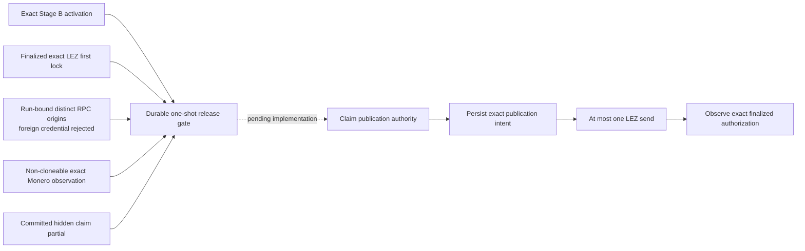
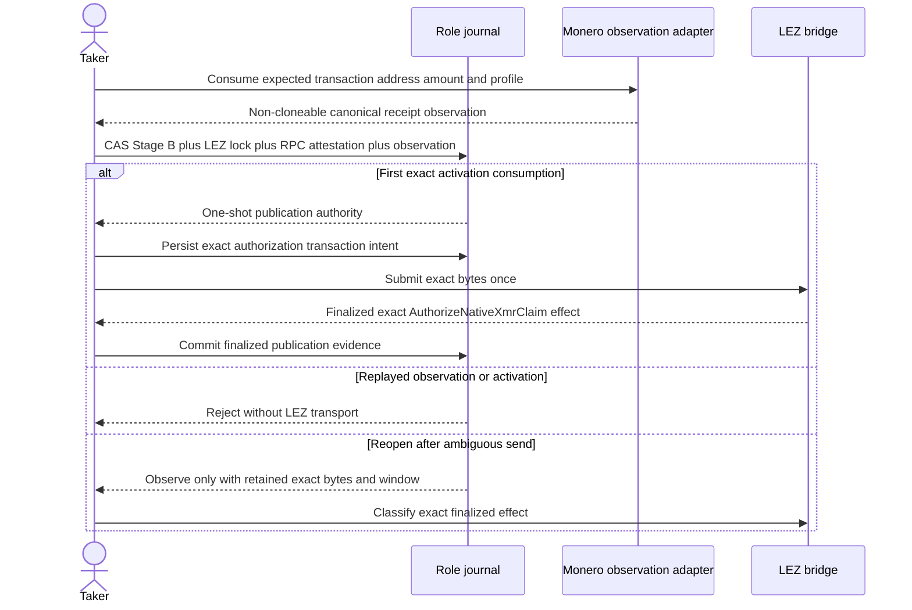

# ADR 0059: Separate Monero observation from release authority

Status: Accepted for M4; the observation component is executed and the
Stage-B-bound release component remains pending.

## Context

The Taker may publish its hidden claim partial only after the exact Maker-funded
Monero output reaches the agreement confirmation policy. A typed RPC adapter can
prove exact network/genesis, transaction, standard address, amount, canonical
decoded-block membership, depth, and a stable tip. That fact alone is not safe
publication authority.

An independent review found four distinct boundaries:

- a shared view-only wallet cannot prove that an old output remains unspent
  without composite key-image knowledge;
- an observation not bound to the activated agreement can be replayed across
  duplicate sessions;
- configuring Digest credentials does not prove that the process rejects a
  foreign credential; and
- monero-rpc 0.5.1 drops single-header trust flags, buffers before decode, and
  can panic while decoding a malformed block.

The pre-publication construction gives neither role the composite Monero spend
key. Therefore fresh canonical receipt is the required happy-path chain fact;
wallet-reported spent=false is not the safety argument. Freshness, agreement
binding, authentication evidence, and exactly-once consumption belong to the
durable actor boundary.

## Decision

The Monero adapter returns a private-field, non-cloneable
VerifiedMoneroOutputObservation. It is observation data only. It exposes no
claim-partial builder and no publication method.

The Taker actor will consume that value by ownership into a dedicated release
capability. Creation must atomically bind:

1. the exact Stage B activation commitment and swap ID;
2. named Monero network/genesis, transaction, standard address, amount,
   containing block, confirmation count, and stable tip;
3. the run-owned peerless Regtest topology identity, distinct daemon/wallet
   origins, and wrong-credential HTTP 401 attestation;
4. the exact finalized LEZ first-lock capability;
5. the committed hidden-partial digest and publication transaction intent; and
6. a durable compare-and-swap state proving the observation has never been
   consumed for this activation.

The journal records the exact publication intent before the first send. A
timeout or transport ambiguity creates no second-send authority: reopening
observes the exact finalized LEZ effect. Only definitive finalized absence
inside the retained window plus the existing unsent durable authority may
permit the initial attempt.

## Atomicity consequence

The Maker still cannot claim LEZ until the Taker publishes the activation-bound
partial. Publication cannot occur from a caller-set status or reusable chain
observation. Once publication is finalized, the Maker claim reveals Maker share
s_a for the Taker's Monero spend. If no claim occurs, the distinct signed LEZ
refund reveals Taker share s_b for Maker recovery. The one-shot gate prevents a
canonical Monero output or hidden partial from authorizing two swap sessions;
it does not replace DLEQ, adaptor verification, or the signed refund/punishment
branches.

## Consequences and remaining evidence

- The seven adapter tests are a valid component checkpoint, not a swap or
  release-authority checkpoint.
- The private Regtest PoC may use the attested peerless topology and fresh
  output. Public RPC remains rejected.
- The actor CAS, ambiguous-send reconciliation, activation-replay negative, and
  view-only already-spent regression remain RED work before claim-path PoC.
- Stagenet/production must preserve daemon trust flags and contain or replace
  the upstream malformed-block panic path. A reviewed key-image/spent-status
  mechanism or a formal fresh-output/one-shot argument is required for the
  production profile.
- MONERO-RPC-001 tracks upstream transport and decode limitations. This
  non-Logos dependency does not inherit the Logos milestone exception.
