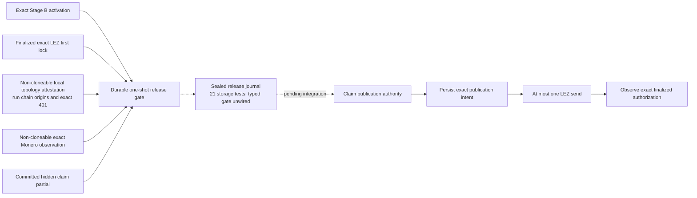
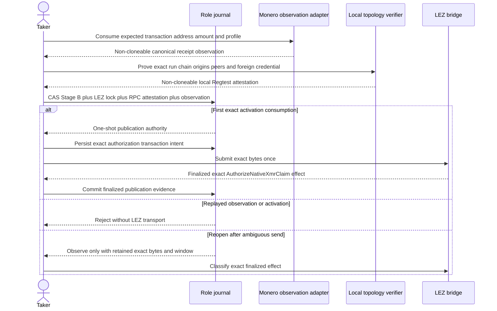

# ADR 0059: Separate Monero observation from release authority

Status: Accepted for M4; the Monero observation, local-Regtest topology
attestation, LEZ first-lock mint boundary, and sealed release-journal storage
foundation are component-executed. Positive actual-chain LEZ evidence, typed
Stage-B issuer/publisher/outcome integration, and live release authority remain
pending.

## Context

The Taker may publish its hidden claim partial only after the exact Maker-funded
Monero output reaches the agreement confirmation policy. A typed RPC adapter can
prove exact network/genesis, transaction, standard address, amount, canonical
decoded-block membership, depth, and a stable tip. That fact alone is not safe
publication authority.

An independent review found four distinct boundaries:

- a shared view-only wallet cannot prove that an old output remains unspent
  without composite key-image knowledge;
- an observation not bound to the activated agreement can be replayed across
  duplicate sessions;
- configuring Digest credentials does not prove that the process rejects a
  foreign credential; and
- monero-rpc 0.5.1 drops single-header trust flags, buffers before decode, and
  can panic while decoding a malformed block.

The pre-publication construction gives neither role the composite Monero spend
key. Therefore fresh canonical receipt is the required happy-path chain fact;
wallet-reported spent=false is not the safety argument. Freshness, agreement
binding, authentication evidence, and exactly-once consumption belong to the
durable actor boundary.

## Decision

The Monero adapter returns a private-field, non-cloneable
VerifiedMoneroOutputObservation. It is observation data only. It exposes no
claim-partial builder and no publication method. The observation retains the
exact daemon and wallet origins used to create it so a later authority boundary
can reject a valid chain fact obtained through the wrong services.

For the local Regtest PoC, `MoneroTopologyVerifier` separately mints a
private-field, non-`Clone` `VerifiedMoneroTopologyAttestation`. It is bound to
one exact run, Regtest chain identity, daemon origin, target-wallet origin, and
foreign-wallet origin. Minting requires successful Digest authentication at
the correct target and foreign origins, then replays the foreign credential
against the target and requires the exchange to finish with exact HTTP 401. It
also requires bounded 64 KiB typed `get_info` and `get_connections` responses,
`fakechain`, `offline == true`, `untrusted == false`, zero reported peer counts,
an empty connection list, and the typed height-zero genesis hash. Its binding
method rejects run, chain, daemon-origin, or wallet-origin drift against the
output observation.

Maintained `monero-rpc` 0.5.1 does not expose `get_info` or
`get_connections`. The project therefore owns this narrow bounded adapter while
continuing to use `monero-rpc` for the typed height-zero hash. That adapter is a
production and upstream-review item; this decision does not generalize the
local attestation into public or Stagenet trust.

The main-process LEZ adapter separately exposes
`FinalizedXmrLezFirstLockEvidenceV3`, also with private fields, no public
constructor, and no `Clone`. Its production binding derives exact v3 terms from
validated Stage A and Stage B. Only the Taker reaches the concrete authenticated
`BridgeClient`; a pure role gate rejects Maker observation before any wire call.
The private mint boundary then requires an exact finalized `Fund` target, exact
context/runtime/terms/effect/transaction echo, and complete protocol-valid
transaction, instruction, metadata, custody, window, and finality facts. This
capability still does not authorize claim-partial publication by itself.

The Taker actor will consume that value by ownership into a dedicated release
capability. Creation must atomically bind:

1. the exact Stage B activation commitment and swap ID;
2. named Monero network/genesis, transaction, standard address, amount,
   containing block, confirmation count, and stable tip;
3. the run-owned peerless Regtest topology identity, distinct daemon/wallet
   origins, and wrong-credential HTTP 401 attestation;
4. the exact finalized LEZ first-lock capability;
5. the committed hidden-partial digest and publication transaction intent; and
6. a durable compare-and-swap state proving the observation has never been
   consumed for this activation.

The completed authority must record the exact publication intent before the
first send. A timeout or transport ambiguity must create no second-send
authority: reopening must observe the exact finalized LEZ effect. Only
definitive finalized absence inside the retained window plus the existing
unsent durable authority may permit the initial attempt. The ADR 0060 sealed
journal provides only the local storage state machine; it has no typed
publisher, finalized observer, definitive-absence path, or live actor wiring.

## Atomicity consequence

The Maker still cannot claim LEZ until the Taker publishes the activation-bound
partial. Publication cannot occur from a caller-set status or reusable chain
observation. Once publication is finalized, the Maker claim reveals Maker share
s_a for the Taker's Monero spend. If no claim occurs, the distinct signed LEZ
refund reveals Taker share s_b for Maker recovery. The one-shot gate prevents a
canonical Monero output or hidden partial from authorizing two swap sessions;
it does not replace DLEQ, adaptor verification, or the signed refund/punishment
branches.

## Consequences and remaining evidence

- The Monero adapter passes 16 of 16 tests across output observation, topology,
  authentication, body-bound, and binding cases, plus strict Clippy, strict
  Rustdoc, formatting, and diff checks. This is a component checkpoint, not a
  swap or release-authority checkpoint.
- The earlier configured-credential topology residual is closed for the
  isolated local Regtest PoC: authority now requires the exact 401 and peerless
  daemon facts rather than configuration alone. Public and Stagenet trust,
  malicious or compromised local processes, and upstream adapter review remain
  open.
- The LEZ first-lock boundary passes 6 of 6 focused tests and all 89 adapter
  package tests, strict Clippy, strict Rustdoc, and a compile-fail non-`Clone`
  doctest. The focused fixture is canonical protocol evidence, not a full real
  Stage-B fixture or actual-chain observation.
- The current sidecar classifier returns only `HistoryUnavailable`, so the new
  boundary cannot yet mint positive actual-chain evidence and does not establish
  a claim PoC.
- The private Regtest PoC may bind the attested peerless topology to a fresh
  origin-retaining output observation. Neither capability is Stage-B release
  authority, and their existence does not establish a claim PoC. Public RPC
  remains rejected.
- The ADR 0060 sealed journal passes 21 storage tests for stable-resource
  identity, later-tip rescan, semantic restart, local CAS/ambiguity, tamper,
  schema, and private paths. Its resource encoder, release plan, and
  prepare/publication operations are internal and unwired. These tests do not
  establish live replay prevention or a claim PoC.
- Typed actor composition, publisher/outcome handling, finalized observation,
  definitive absence, same-UID WAL/SHM defense, authenticated rollback
  prevention, and the view-only already-spent regression remain work before the
  claim-path PoC.
- Stagenet/production must preserve daemon trust flags and contain or replace
  the upstream malformed-block panic path. A reviewed key-image/spent-status
  mechanism or a formal fresh-output/one-shot argument is required for the
  production profile.
- MONERO-RPC-001 tracks upstream transport and decode limitations. This
  non-Logos dependency does not inherit the Logos milestone exception.
