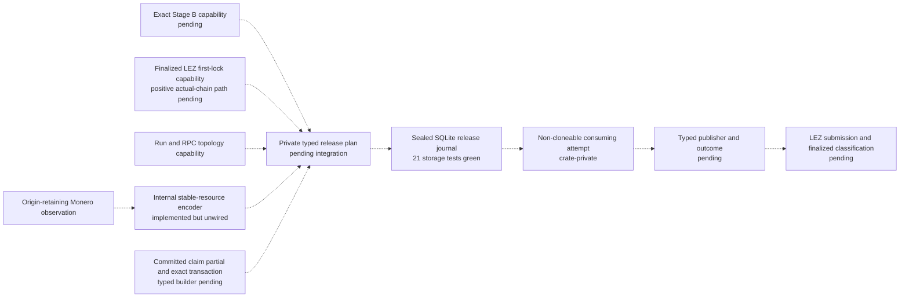
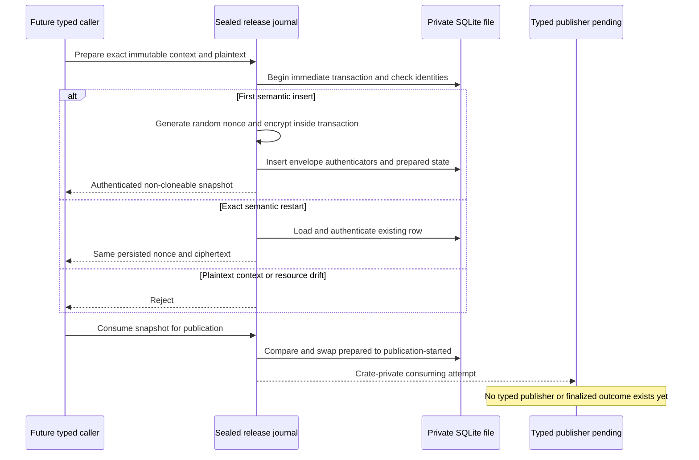

# ADR 0060: Seal the XMR release journal until typed integration

Status: Accepted as an M4 storage-foundation checkpoint. The journal is
component-GREEN and intentionally nonfunctional as an external release
authority. Typed evidence issuers, publisher/outcome handling, definitive
absence, sidecar composition, and claim-path execution remain pending.

## Context

ADR 0059 separates a canonical Monero output observation from authority to
publish the Taker's hidden claim partial. The next boundary must eventually
consume exact Stage B, finalized LEZ first-lock evidence, the attested Monero
RPC topology, the exact output observation, and the committed publication
intent exactly once.

A storage implementation is useful before those concrete capability types are
available, but exposing primitive constructors would turn an untrusted caller's
bytes into authority. The implementation therefore needs a testable durable
core without presenting a usable external prepare or send API.

The journal also cannot manufacture distributed-system guarantees that its
local filesystem does not provide. AEAD and keyed authenticators detect
substitution under the current key. They do not detect restoration of an older
database that already contains valid authenticators, and file modes do not
exclude a hostile process running as the same service UID from racing SQLite
WAL or shared-memory files.

## Decision

Add `lez-xmr-release-authority` to the main Rust workspace as a sealed storage
foundation. The crate compiles under the root package, lint, test, rustdoc, and
cargo-deny policy. Its external surface can open and authenticate the journal
and inspect protected snapshots, but the release plan, prepare operation,
publication decision, publication attempt, ambiguous-outcome transition, and
plaintext opening are crate-private. There is no public constructor that turns
raw identifiers or caller-supplied chain facts into release authority.

The temporary internal opening operation consumes its non-cloneable publication
attempt. It is not a production publisher. A typed publisher must eventually
consume that capability, retain exact submission identity, and return an
outcome capability that can be reconciled with finalized chain evidence.

Solid storage behavior is tested in isolation. Every dotted edge remains
composition work. In particular, the diagram does not show a functional claim
path and does not claim live replay prevention.

## Stable resource and observation records

The internal resource encoder computes a versioned SHA-256 identity from only
immutable output facts:

1. domain `lez-atomic-swaps/xmr-release/monero-resource/v1`;
2. explicit Monero network tag;
3. genesis hash;
4. transaction ID;
5. canonical destination string; and
6. amount in piconero.

Every field is length-delimited. Daemon and wallet origins, containing block,
confirmation count, stable tip hash, and stable tip height are excluded from
the resource identity and retained in a separately authenticated mutable
observation record. A later-tip rescan can therefore update the observation
under the same stable resource ID and persisted ciphertext. Schema version 2
makes the stable resource ID unique and stores exact 32-byte binary swap and run
IDs under a unique pair.

This algorithm is currently internal and unwired. Only a future typed adapter
composition may construct its private release plan from
`VerifiedMoneroOutputObservation`; tests do not make raw byte construction a
supported external authority surface.

The activation ID is the versioned SHA-256 of length-delimited exact binary swap
and run IDs. Validation rejects zero IDs, a zero activation, or any activation
that differs from that deterministic derivation.

## Restart idempotency and local state

The first insert starts an immediate SQLite transaction, proves that neither
the activation nor stable resource nor exact swap/run pair already exists, and
only then generates a fresh random XChaCha20-Poly1305 nonce. A separate
domain-separated keyed authenticator covers the exact plaintext publication
intent under the immutable release context.

Reconstructing the same semantic prepare after restart authenticates and
returns the already persisted nonce and ciphertext. It does not encrypt a
second envelope. Changed plaintext or changed immutable context fails closed.
A later-tip observation update changes only the authenticated mutable
observation. The state machine uses a compare-and-swap from prepared to
publication-started and a later ambiguous state; there is deliberately no
retry or definitive-absence transition.

The test-only caller in this sequence is not exposed to downstream crates.
Consequently, the CAS evidence is local storage evidence, not a live actor,
sidecar, or chain replay-prevention result.

## PoC deployment assumptions

This foundation is admitted only under all of these local-PoC assumptions:

- one trusted host and local filesystem;
- one dedicated service UID;
- one canonical journal path in one owner-only mode-`0700` directory;
- one mode-`0600`, regular, single-link SQLite database;
- no concurrent database clone, backup, restore, snapshot rollback, or journal
  reuse; and
- no hostile same-UID process.

The implementation revalidates directory and database descriptors, refuses
symlinks, hard links, inode replacement, insecure modes, foreign schemas, and
future schemas, and uses WAL, full synchronization, foreign keys, secure delete,
and integrity checks. These checks reduce accidental aliasing and substitution.
They do not make same-UID WAL/SHM races safe. AEAD and HMAC do not provide a
monotonic rollback anchor, replicated consensus, or restore detection.

A production journal needs a reviewed same-UID process boundary and an external
monotonic or replicated rollback anchor. Operators must not back up, clone, or
restore a live PoC journal after publication has started.

## Evidence and nonclaims

The component has 21 passing storage tests covering:

- stable immutable resource identity and later-tip restart rescan;
- cross-activation resource rejection inside the isolated journal;
- semantic restart replay with unchanged persisted ciphertext;
- plaintext drift, wrong key, observation, ciphertext, context, state, and
  schema tampering;
- randomized nonces for distinct first inserts;
- deterministic nonzero activation and exact binary swap/run storage;
- owner-private paths, symlink, hard-link, inode-replacement, and schema gates;
- exactly one local compare-and-swap winner across two connections; and
- consuming, non-cloneable snapshot and publication-attempt behavior.

Strict package formatting, Clippy, rustdoc, tests, and root cargo-deny pass when
the checkpoint is integrated. Root CI already selects the crate through its
`--workspace` gates; no crate-local workflow or bypass is added.

This evidence does not prove:

- that a live actor can mint a release plan;
- that the internal stable-resource encoder is wired to the observed output;
- live replay prevention across sidecars, processes, hosts, restored journals,
  or chain reorganizations;
- finalized LEZ submission, publication outcome reconciliation, or definitive
  absence;
- safe retry after an ambiguous send;
- a working claim, refund, punishment, or composed atomic swap; or
- production readiness.

## Consequences and next gate

The storage invariants can be reviewed independently without exposing a raw
placeholder authority. The next integration must replace the private plan with
concrete consumed Stage-B, finalized-LEZ, topology, observation, release-window,
and exact publication types. It must also replace the temporary plaintext
escape hatch with a typed consuming publisher and finalized outcome.

Only an actual actor/sidecar/local-chain test may establish live one-shot
behavior. Until then, ADR 0059's observation remains non-authoritative, the
stable-resource algorithm remains internal, and no M4 claim PoC exists.
