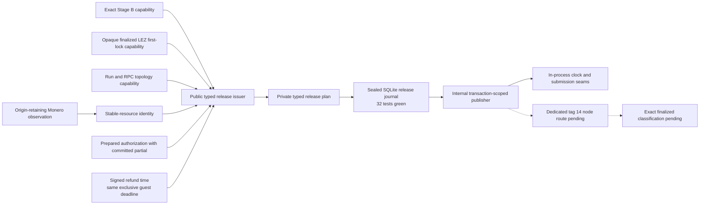
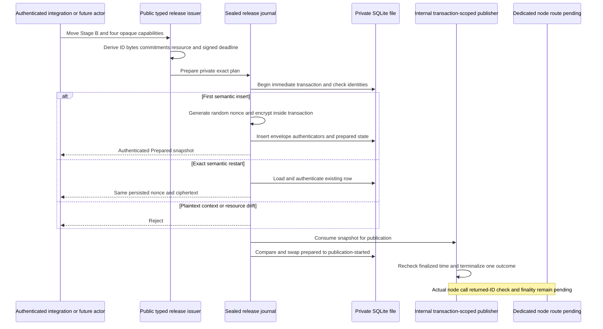

# ADR 0060: Seal the XMR release journal until typed integration

Status: Accepted as an M4 storage-foundation checkpoint and extended by ADRs
0064 and 0065. The public typed issuer and internal publisher are
component-GREEN in the 32-test authority suite. Actual node transport, finality,
definitive absence, actor/sidecar composition, and claim-path execution remain
pending.

## Context

ADR 0059 separates a canonical Monero output observation from authority to
publish the Taker's hidden claim partial. The next boundary must eventually
consume exact Stage B, finalized LEZ first-lock evidence, the attested Monero
RPC topology, the exact output observation, and the committed publication
intent exactly once.

A storage implementation is useful before those concrete capability types are
available, but exposing primitive constructors would turn an untrusted caller's
bytes into authority. The implementation therefore needs a testable durable
core without presenting a usable external prepare or send API.

The journal also cannot manufacture distributed-system guarantees that its
local filesystem does not provide. AEAD and keyed authenticators detect
substitution under the current key. They do not detect restoration of an older
database that already contains valid authenticators, and file modes do not
exclude a hostile process running as the same service UID from racing SQLite
WAL or shared-memory files.

## Decision

Add `lez-xmr-release-authority` to the main Rust workspace as a sealed storage
foundation, now extended through ADRs 0064 and 0065 under the root package,
lint, test, rustdoc, and cargo-deny policy. Its raw release plan, publication
decision, publication attempt, ambiguous-outcome transition, and plaintext
opening remain crate-private. There is no public constructor that turns raw
identifiers or caller-supplied chain facts into release authority.

The public issuer instead consumes exact opaque Fund, prepared authorization,
Monero-output, and topology evidence plus validated Stage A and Stage B. It
derives the release identity, bytes, commitments, and signed exclusive
deadline. The internal transaction-scoped publisher consumes the protected
attempt, retains exact submission identity, and records a terminal outcome;
finalized chain reconciliation remains pending.

Solid issuer, storage, and mock-publisher behavior is tested in component
isolation. Dotted edges remain actual-node composition work. The diagram does
not show a functional claim path and does not claim live replay prevention or
authorization finality.

## Stable resource and observation records

The internal resource encoder computes a versioned SHA-256 identity from only
immutable output facts:

1. domain `lez-atomic-swaps/xmr-release/monero-resource/v1`;
2. explicit Monero network tag;
3. genesis hash;
4. transaction ID;
5. canonical destination string; and
6. amount in piconero.

Every field is length-delimited. Daemon and wallet origins, containing block,
confirmation count, stable tip hash, and stable tip height are excluded from
the resource identity and retained in a separately authenticated mutable
observation record. A later-tip rescan can therefore update the observation
under the same stable resource ID and persisted ciphertext. Schema version 3
makes the stable resource ID unique and stores the exact swap ID plus the
domain-separated digest of the validated run ID under a unique pair.

The public issuer now applies this internal algorithm directly to
`VerifiedMoneroOutputObservation`. Tests still do not make raw byte
construction a supported external authority surface.

The activation ID is the versioned SHA-256 of the length-delimited exact swap ID
and derived run digest. Validation rejects zero IDs, a zero activation, or any
activation that differs from that deterministic derivation.

## Restart idempotency and local state

The first insert starts an immediate SQLite transaction, proves that neither
the activation nor stable resource nor exact swap/run pair already exists, and
only then generates a fresh random XChaCha20-Poly1305 nonce. A separate
domain-separated keyed authenticator covers the exact plaintext publication
intent under the immutable release context.

Reconstructing the same semantic prepare after restart authenticates and
returns the already persisted nonce and ciphertext. It does not encrypt a
second envelope. Changed plaintext or changed immutable context fails closed.
A later-tip observation update changes only the authenticated mutable
observation. The state machine uses a compare-and-swap from prepared to
publication-started and a later ambiguous state; there is deliberately no
retry or definitive-absence transition.

The public issuer is exposed; the raw plan and byte-bearing publisher transport
are not. ADR 0067's later integration now reaches `Admitted` through the sealed
narrow-client wrapper and proves zero-call observe-only restart against
loopback fixtures. Consequently, the CAS evidence remains local component
evidence, not a dedicated process, live actor, actual indexer/node, or chain
replay-prevention result.

## PoC deployment assumptions

This foundation is admitted only under all of these local-PoC assumptions:

- one trusted host and local filesystem;
- one dedicated service UID;
- one canonical journal path in one owner-only mode-`0700` directory;
- one mode-`0600`, regular, single-link SQLite database;
- no concurrent database clone, backup, restore, snapshot rollback, or journal
  reuse; and
- no hostile same-UID process.

The implementation revalidates directory and database descriptors, refuses
symlinks, hard links, inode replacement, insecure modes, foreign schemas, and
future schemas, and uses WAL, full synchronization, foreign keys, secure delete,
and integrity checks. These checks reduce accidental aliasing and substitution.
They do not make same-UID WAL/SHM races safe. AEAD and HMAC do not provide a
monotonic rollback anchor, replicated consensus, or restore detection.

A production journal needs a reviewed same-UID process boundary and an external
monotonic or replicated rollback anchor. Operators must not back up, clone, or
restore a live PoC journal after publication has started.

## Evidence and nonclaims

The combined issuer, journal, and publisher component has 32 passing tests covering:

- public preparation from four factory-minted opaque capabilities and validated
  Stage A and Stage B with exact publication identity, signed window, and reload;
- stable immutable resource identity and later-tip restart rescan;
- cross-activation resource rejection inside the isolated journal;
- semantic restart replay with unchanged persisted ciphertext;
- plaintext drift, wrong key, observation, ciphertext, context, state, and
  schema tampering;
- randomized nonces for distinct first inserts;
- deterministic nonzero activation and exact binary swap/run storage;
- owner-private paths, symlink, hard-link, inode-replacement, and schema gates;
- exactly one local compare-and-swap winner across two connections; and
- consuming, non-cloneable snapshot and publication-attempt behavior.

Strict package formatting, Clippy, rustdoc, tests, and root cargo-deny pass when
the checkpoint is integrated. Root CI already selects the crate through its
`--workspace` gates; no crate-local workflow or bypass is added.

This evidence does not prove:

- actual actor composition or live authenticated node publication;
- live replay prevention across sidecars, processes, hosts, restored journals,
  or chain reorganizations;
- finalized LEZ submission, authorization finality, or definitive absence;
- safe retry after an ambiguous send;
- a working claim, refund, punishment, or composed atomic swap; or
- production readiness.

## Consequences and next gate

The storage invariants remain independently reviewable without exposing a raw
placeholder authority. ADRs 0064 and 0065 now provide the concrete opaque
evidence issuer, exact signed release window, and typed consuming publisher.
ADR 0066 supplies the official genesis-bound stable finalized-clock primitive.
The next integration must connect it through the release-service boundary and
replace the remaining in-process submission seam with the dedicated official
node route, returned-ID verification, and finalized outcome classification.

Only an actual actor/sidecar/local-chain test may establish live one-shot
behavior. Until then, no M4 claim PoC exists.
