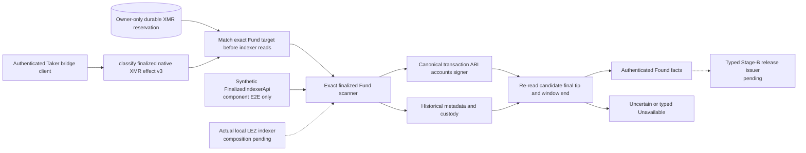
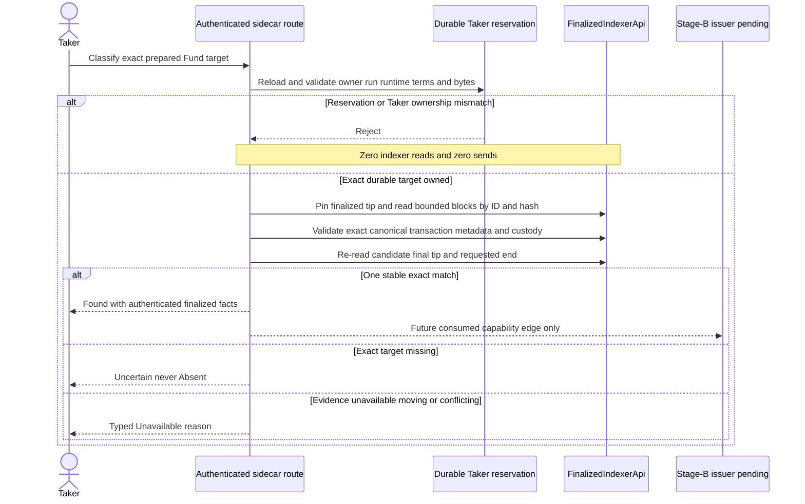

# ADR 0061: Classify only the durable XMR Fund target

Status: Accepted as an M4 finalized-evidence component checkpoint. The exact
Taker `FundNative` classifier is component-GREEN against a synthetic
`FinalizedIndexerApi`. It is not actual local-devnet evidence, a release
authority, or a claim PoC.

## Context

The XMR happy path needs finalized LEZ evidence for the Taker's first lock
before any later Stage-B release authority can publish the hidden claim
partial. An arbitrary transaction identifier, discovered same-terms effect, or
caller-supplied prepared transaction must not become that evidence. The
sidecar already durably reserves one exact checked `InitializeNativeXmr` and
`FundNative` pair for its Taker owner, so the classifier can require that exact
reservation before consulting the chain indexer.

Finalized indexer reads can still be unavailable, incomplete, inconsistent, or
move while a bounded window is examined. A transaction missing from one exact
window is not proof that it never existed or cannot appear in another relevant
window. The classifier therefore needs distinct non-affirmative outcomes and
must not turn missing history into absence authority.

## Decision

Implement the authenticated v3 classification route for only
`XmrNativeEffectV3::Fund` with an exact prepared-transaction target. It is
Taker-only. Before the first `FinalizedIndexerApi` read, the planner must reload
and validate the owner-only durable XMR escrow reservation and match its run,
role, runtime, terms, transaction ID, and exact prepared bytes. A Maker,
missing reservation, or alternate otherwise-valid Fund target fails closed
without reading chain evidence.

The bounded scanner may return `Found` only for one canonical exact match in a
stable finalized interval. It checks:

- finalized block lookup by both ID and hash, with identical returned blocks;
- contiguous parent hashes across the requested interval;
- exact indexed transaction ID, canonical decoded bytes, stateless
  transaction validity, and absence of an unexpected proof-bearing witness;
- the generated v0.2 escrow program and canonical `FundNative` ABI;
- the exact metadata, custody, and depositor account order;
- the exact depositor signer and no substituted signer set;
- the complete version-3 XMR metadata, authority, activation, amount, deadline,
  and funded state; and
- custody program ownership and the exact funded balance.

The candidate block is re-read after historical account validation. The
finalized tip must still cover the requested end, and that end block is re-read
again before returning. Replacement, regression, moving coverage, or duplicate
exact matches does not produce `Found`.

Only the synthetic trait-backed component edge is solid in current tests. The
actual local indexer and typed release-issuer edges remain composition work.

## Outcome semantics

One exact valid candidate plus stable finalized state returns authenticated
`Found` facts. A missing exact target returns `Uncertain`, even when both
historical accounts are absent or their stable state is a valid predecessor or
successor. This route never returns `Absent` and cannot authorize absence-based
recovery.

Evidence service failures remain typed:

- `FinalityUnavailable` when a finalized tip is missing, regresses below the
  requested end, or cannot be read;
- `HistoryUnavailable` when the requested block or historical account view is
  unavailable;
- `MovingTip` when a pinned block or requested end changes during revalidation;
  and
- `ConflictingMatches` when the exact transaction appears more than once.

Malformed canonical bytes, proof shape, ABI, accounts, signers, metadata,
custody, or one-sided account presence fail closed as invalid evidence instead
of being softened into an unavailable or missing result. Non-Fund effects and
non-exact discovery remain unavailable.

The route is read-only. Its component E2E asserts that the official-node send
counter remains zero across positive and negative classifications.

## Evidence and nonclaims

The focused authenticated component journey proves durable restart recovery,
positive exact `Found`, missing-to-`Uncertain`, fully absent accounts remaining
`Uncertain`, typed finality/history/moving/conflicting results, canonical-fact
rejection, Taker-only ownership, and zero sends. The full official v0.2 sidecar
suite passes 137 of 137 tests and strict Clippy passes.

The test indexer is a synthetic implementation of `FinalizedIndexerApi`. The
checkpoint therefore does not prove:

- a positive classification against the actual local LEZ v0.2 indexer;
- a real finalized Taker Fund transaction on a local devnet;
- discovery or classification for any other XMR effect;
- a typed Stage-B issuer, consuming release publisher, or live replay
  prevention;
- Monero-to-LEZ claim-partial publication, actor execution, or a completed
  swap; or
- production readiness.

## Consequences and next gate

The sidecar now has a fail-closed exact finalized-Fund evidence component, so
later release integration does not need to trust a caller's transaction bytes
or treat one missing scan as absence. The next happy-path gate must execute the
same route against the actual isolated LEZ v0.2 indexer, consume its `Found`
facts with exact Stage B and the independently verified Monero observation,
and feed the sealed release journal through a typed issuer and consuming
publisher/outcome boundary. Until that composition is actual-node tested, no
M4 claim PoC or live one-shot authority is claimed.
