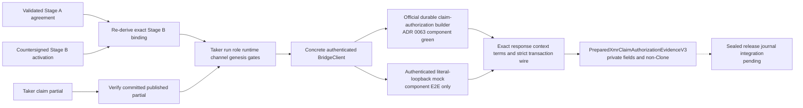
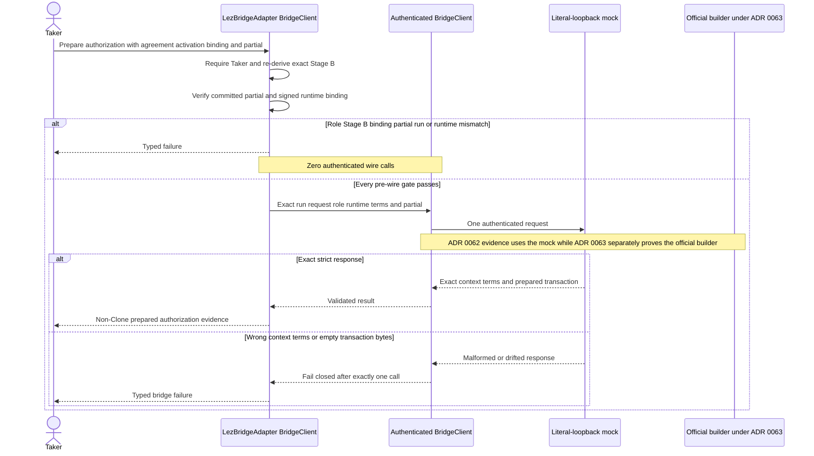

# ADR 0062: Mint Stage-B claim authorization through the authenticated client

Status: Accepted as an M4 claim-authorization component checkpoint. The typed
main-process capability is GREEN against an authenticated literal-loopback
mock. ADR 0063 now supplies the official durable sidecar builder at
`fda2bcf`; release integration, actual-node effect/finality, and the claim PoC
remain unavailable.

## Context

After the Maker XMR lock satisfies the signed confirmation policy, the Taker
must publish only the claim partial committed by the countersigned Stage-B
activation. Public protocol request types are not sufficient authority: a
caller could otherwise combine a partial, binding, runtime, or run from
different swaps and ask the bridge to prepare a publication transaction.

The main process therefore needs a typed boundary that revalidates Stage B and
the committed partial before any wire call. Its successful result must be
linear enough to discourage accidental duplicate ownership, while keeping the
authenticated sidecar responsible for constructing the exact transaction.

## Decision

Add `PreparedXmrClaimAuthorizationEvidenceV3` as a private-field, deliberately
non-`Clone` capability with no public constructor. Only the concrete
`LezBridgeAdapter<BridgeClient>` method can mint it. The method:

1. rejects every participant except the Taker;
2. re-derives the complete XMR bridge binding from the supplied Stage-A
   agreement and Stage-B activation, then compares it with the supplied
   binding;
3. calls `verify_published_taker_claim_partial` for the exact committed partial
   before constructing or sending a bridge request;
4. validates the adapter-owned request context against the signed Stage-B
   channel, genesis, role, and runtime;
5. relies on the concrete `BridgeClient` to enforce its immutable run, role,
   and exact runtime binding before transport;
6. makes one authenticated `prepare_native_xmr_claim_authorization_v3` call;
   and
7. accepts only an exact response context and terms before minting the
   capability.

The capability retains the exact context, Taker preparer, runtime, native-XMR
terms, and prepared authorization transaction. It is not submission authority
and is not wired into the sealed release journal.

## Call and failure semantics

Wrong partial, Stage B, binding, run, role, or runtime produces zero mock route
calls. A valid request produces exactly one authenticated call. Wrong response
context, wrong terms, or empty exact transaction bytes produces exactly one
call and then fails closed.

The adapter does not locally decode the prepared transaction with the LEZ ABI.
It enforces the strict protocol wire and trusts valid transaction semantics to
the authenticated sidecar. Empty transaction bytes fail strict response
decoding, but this is not a claim of independent local semantic validation.

## Evidence

The exact adapter package gates are:

- 94 of 94 all-target, all-feature package tests;
- 3 of 3 authenticated claim-authorization tests;
- 2 of 2 doctests, including the compile-fail proof that the capability is not
  `Clone`;
- strict Clippy for every target and feature;
- strict Rustdoc;
- formatting; and
- scoped diff hygiene.

The authenticated test server is an in-process literal-loopback mock. It uses
no chain node, external RPC, peer, faucet, public funds, or external finality
service.

## Nonclaims and next gate

This checkpoint does not provide:

- release authority merely because ADR 0063 later implemented the official
  sidecar builder;
- release-journal issuance, consuming publication, outcome reconciliation, or
  replay authority;
- an actual LEZ transaction, node inclusion, or finalized claim-publication
  fact;
- independent ABI-semantic validation inside this adapter checkpoint's mock;
- a Maker/Taker actor journey; or
- an M4 claim PoC or production-readiness evidence.

ADR 0063 closes the next official-builder substep. The active progressive gate
is to use this capability with actual-local exact Fund and Monero observations,
wire one consuming journal-backed publication attempt and outcome, then
continue through claim preparation, completion, submission, and finalized
evidence. Signed-refund and punishment builders remain the following recovery
slice.
