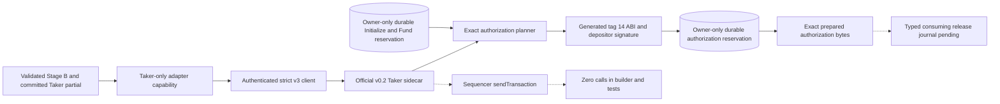
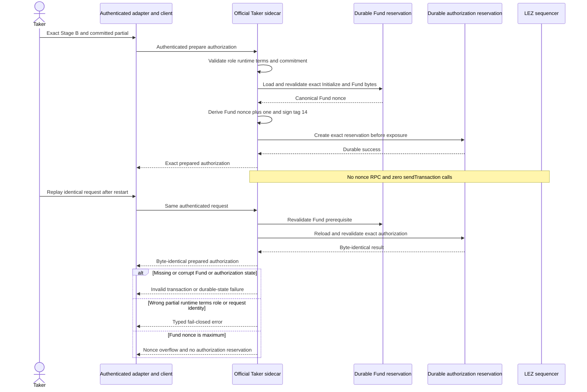

# ADR 0063: Build Stage-B authorization from the durable Fund

Status: Accepted as an M4 official-sidecar component checkpoint at pushed commit
`fda2bcf`. This decision extends ADR 0062. Release-journal authority,
actual-node publication/finality, claim completion, and actor composition remain
pending.

## Context

ADR 0062 lets only the concrete authenticated Taker adapter request publication
of the claim partial committed by Stage B. That boundary intentionally trusts
the official sidecar to validate and construct the LEZ transaction. Returning
`Unavailable` at the sidecar left the committed partial, official tag-14 ABI,
nonce continuity, exact signer, durable replay, and no-submission boundary
unproved.

The authorization is the transition that makes the Taker partial canonical and
public. Constructing it from a fresh nonce read could race the already prepared
`FundNative` transaction. Returning bytes before persistence could regenerate
a different signature after restart. Accepting a caller-supplied partial without
recomputing the guest commitment could publish the wrong secret.

## Decision

The Taker-only v0.2 sidecar implements
`prepare_native_xmr_claim_authorization_v3` as an exact durable builder:

1. validate the request role, complete runtime, signed terms, escrow deployment,
   depositor, and the SHA-256 commitment
   `SHA256("logos.gateway.lez-xmr.claim-partial-commitment.v1\0" ||
   context_binding || claim_partial)`;
2. require and fully revalidate the exact owner-only durable
   `XmrNativeEscrowV3` reservation for the same run, role, runtime, and terms;
3. decode the reserved `FundNative` bytes and derive the authorization nonce as
   exactly `fund_nonce + 1`, rejecting overflow and performing no nonce RPC;
4. construct generated instruction tag 14,
   `AuthorizeNativeXmrClaim { swap_id, claim_partial }`, with ordered accounts
   `[metadata_pda, depositor]` and only the depositor signer;
5. sign, canonical-decode, verify transaction ID, signature, program, account
   order, nonce, instruction, partial, context, and terms;
6. create the exact owner-only authorization reservation before returning;
7. return byte-identical results for identical in-process or fresh-process
   replay, while conflicting requests fail closed; and
8. revalidate the planner reservation even when the bridge idempotency store
   already contains a successful response.

The builder does not submit. Its transaction is deliberately rejected by the
generic submit route because actor/journal orchestration has not granted
publication authority.

## Components and authority

The solid path is implemented. The dashed journal edge is the next authority
boundary. The node edge is dashed because this component has no submission
authority and tests prove zero calls.

## Request, restart, and failure flow

## Atomicity argument and nonclaims

This builder preserves the atomic construction in three narrow ways:

- it cannot publish a partial other than the one committed before the first
  lock;
- it cannot consume a nonce unrelated to the exact prepared Fund; and
- it cannot expose regeneratable authorization bytes before they are durable.

Those properties are necessary but not sufficient for an atomic swap. The
builder proves local ownership and consistency of prepared Fund bytes, not
finalized Fund inclusion and not the confirmed Maker Monero output. The actor
must invoke the builder only through a consuming release journal after exact
actual-chain finalized LEZ and stable Monero evidence. Until that integration
exists, the prepared transaction is not release or submission authority.

The durable authorization contains the now-publishable partial inside signed
transaction bytes. Owner-only storage protects the local PoC boundary, but
production secret-at-rest and rollback controls remain part of later hardening.

## Evidence

At `fda2bcf`:

- the complete sidecar suite passes 138 of 138 tests;
- focused planner tests prove the independent commitment vector, exact program,
  tag, account order, sole signer, Fund-plus-one nonce, canonical bytes,
  transaction ID, mutation rejection, conflict, missing Fund, overflow, exact
  restart, durable deletion failure, one nonce read for both builders, and zero
  submission;
- authenticated route tests prove strict client/server success, byte-identical
  replay, fresh server restore in Fund-before-authorization order, generic
  submit rejection, cached-response revalidation, and zero node sends;
- all targets and features pass strict Clippy and warning-free Rustdoc;
- dependency policy passes advisories, bans, licenses, and sources; and
- formatting and diff hygiene pass.

The focused tests use ephemeral literal-loopback JSON-RPC mocks and owner-only
temporary directories. They use no public RPC, peer, faucet, public funds,
external finality service, or Docker resource.

## Next gate

Consume the component-green exact-Fund classification, Regtest topology,
origin-retaining Monero observation, and ADR-0062 authorization capability
through typed Stage-B issuers. ADR 0067 separately supplies the
release-intended, type-narrowed client and exact route, but a dedicated service
must own the bearer, wire the release journal and clock to it, reconcile its
separate sidecar journal, execute against the actual sequencer, and mint
finalized authorization evidence before claim preparation. Five builders and
independent actors remain.
