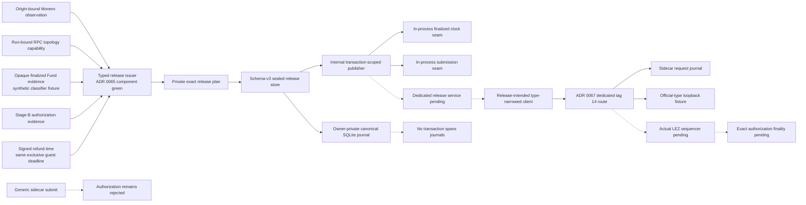
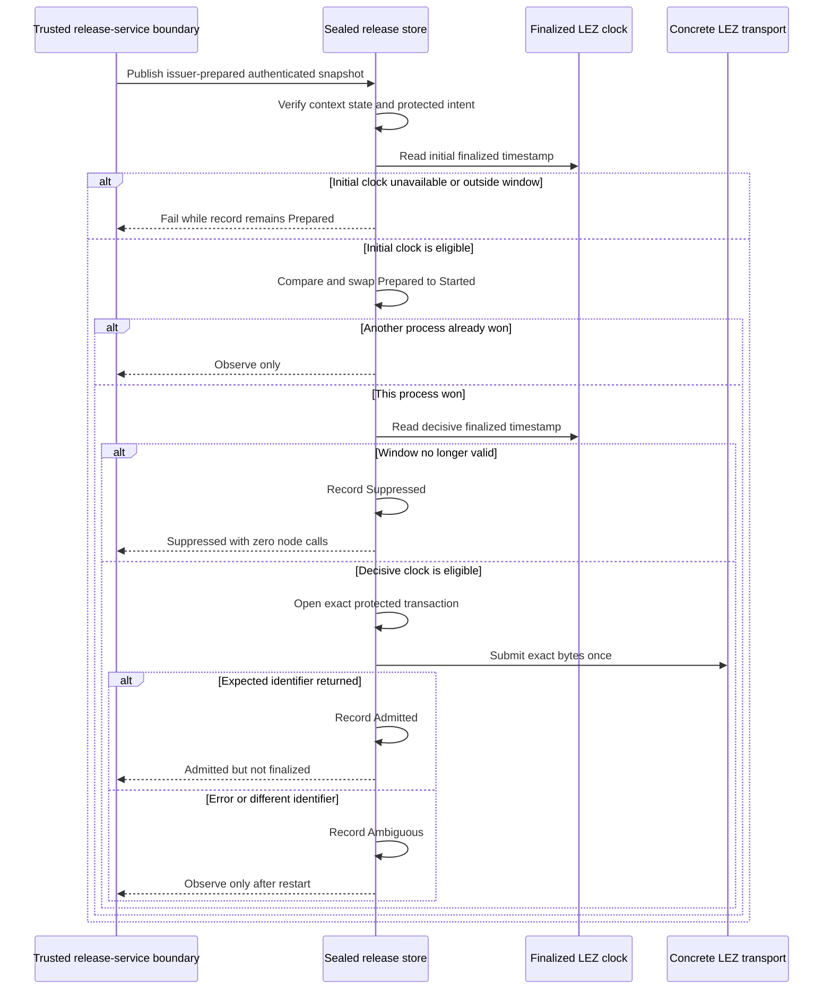

# ADR 0064: Gate XMR publication through the sealed journal

Status: Accepted as an M4 component checkpoint and extended by ADR 0065. The
public typed issuer now consumes opaque evidence into the private plan and
binds its exclusive end to the signed checked-guest deadline. Actual-local
finalized evidence, authenticated node transport, finality, and actor execution
remain unwired.

## Context

ADR 0060 sealed exact XMR release intent before any send. ADRs 0061 through
0063 then supplied component-green Fund classification, Stage-B evidence, and
exact durable tag-14 authorization bytes. Enabling the generic sidecar submit
route would bypass the Monero lock, topology, Stage-B, and release-journal
gates. Retrying after an unknown node outcome could also reveal the claim
partial twice or outside its signed window.

The journal needs a consuming transaction-scoped publisher before actors can
use it. This checkpoint proves that local state machine without treating
synthetic transport facts as chain authority.

## Decision

The private release journal uses schema version 3 and authenticates the expected
publication identifier in its immutable release context. Its internal publisher:

1. authenticates the complete snapshot before any clock or node call;
2. samples finalized LEZ consensus time and requires a non-empty half-open
   release window;
3. elects one process through a durable Prepared-to-Started compare-and-swap;
4. samples finalized LEZ time again after that compare-and-swap;
5. records `Suppressed` without opening or sending the intent if the clock is
   unavailable, regresses, or falls outside the window;
6. otherwise decrypts the exact transaction only for the winner and makes one
   transport call;
7. records `Admitted` only when the node returns the authenticated expected
   transaction identifier with `Accepted` or `AlreadyKnown`; and
8. records `Ambiguous` for an error or mismatched identifier and never rearms
   any started record.

`Admitted` means node admission, not chain inclusion or finality. The generic
sidecar submit route remains closed.

## Components and trust boundaries

Solid edges are implemented and exercised in the 35-test issuer/journal suite.
Dashed edges are required actual-node integration boundaries. The in-process
transport is a test seam, not an RPC implementation or public node authority;
the consuming extraction remains a trusted-single-process PoC boundary.

## Publication sequence

## Atomicity argument and limits

This checkpoint preserves the release side as far as one local journal can:

- the state MAC binds state, revision, and the immutable release binding;
- the observation, exact transaction, target, window, and expected transaction
  identifier are authenticated before publication;
- one SQLite compare-and-swap elects the only possible sender;
- every state after Started is observe-only across restart;
- a post-CAS finalized-time sample prevents a known stale winner from sending;
  and
- admission requires the returned identifier to match the one authenticated
  before the attempt.

These properties are necessary but insufficient for a complete atomic swap.
The post-CAS sample narrows but cannot eliminate the final scheduling interval
between clock read and node admission. ADR 0065 proves that the issuer uses the
same signed exclusive deadline enforced by the exact checked guest. The
concrete transport must obtain the official transaction identifier from the
actual authenticated node response. Finalized claim classification, definitive
absence, actor restart, and the signed-refund and punishment branches remain
outside this checkpoint.

The PoC additionally assumes one trusted host, a dedicated UID, one canonical
owner-private journal, no clone or rollback, and no hostile same-UID WAL or SHM
race. AEAD and HMAC authenticate content but cannot detect restoration of an
older valid database.

## Evidence

The combined typed-issuer and journal suite passes 35 of 35 tests. It covers:

- public authenticated-loopback preparation from all four opaque capabilities,
  exact publication identity and window, and authenticated restart reload;
- accepted and already-known admission across reopen;
- initial clock failure and exclusive-end rejection without a send;
- post-CAS expiry suppression with zero node calls;
- error and wrong-identifier ambiguity without retry;
- two independent SQLite connections electing exactly one sender;
- stable-resource, semantic-restart, tamper, schema, and owner-private path
  invariants inherited from ADR 0060; and
- strict formatting, Clippy, Rustdoc, advisory, ban, license, and source gates.

Tests use owner-private temporary SQLite files, authenticated literal-loopback
capability factories, and an in-process publication transport seam. They use no
Docker, real node, public RPC, peer, faucet, public funds, or external finality
service. They prove zero actual swaps.

## Next gate

ADR 0065 now mints the private plan only from exact Stage B, the origin-bound
Monero observation, the run-bound topology capability, prepared authorization,
and opaque finalized Fund evidence, with the exact signed exclusive deadline.
ADR 0066 supplies the genesis-bound stable finalized-clock primitive and bridge
readiness gate. ADR 0067 supplies the type-narrowed release-intended client and
returned-ID-checking route against an official-type loopback fixture. The next
gate is actual-local Fund evidence, dedicated-service bearer ownership and
clock/route wiring across two non-transactional journals, actual-sequencer
execution, exact authorization finality, and independent actors. Add
crash/cancellation after the CAS during post-PoC hardening.
